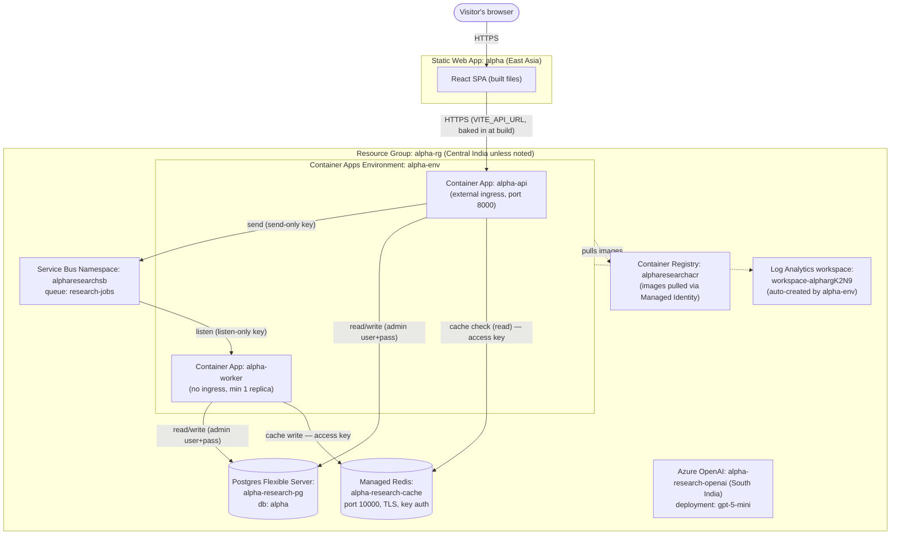

# Alpha — Agentic Stock Research System

A distributed multi-agent stock research system: enter one or more tickers in a
React SPA, and a pipeline of agents (news, fundamentals, technical, risk) researches
them and returns a report. Built incrementally, deployed to Azure layer by layer.

Being built with guidance from the `tutor/` skill — see `tutor/references/phases.md`
for the full roadmap and `tutor/references/concepts.md` for concepts explained along
the way.

## Status

**Phase 1 — Frontend shell: complete.** **Phase 2 — Backend skeleton: complete.** **Phase 3 — MCP tools + real data: complete.** Real `yfinance` stock data (US + India, explicit market selection), a rule-based risk-flag Skill, and a custom MCP server (Tavily search, proven working but deliberately not wired into the automatic flow yet — see `tutor/references/decisions.md`) — all deployed and verified live. Next: Phase 4 — first LLM agent (Azure AI Foundry + tool-calling).

## Architecture

```
Web page (React SPA, Azure Static Web Apps)        ← ✅ live
   │ (JWT/API key auth)                             ← not built yet (Phase 8)
   ▼
FastAPI (Container App, autoscale on HTTP)          ← ✅ live (alpha-api, external ingress)
   │  writes job → Azure Service Bus queue
   ▼
Worker (Container App, autoscale on queue depth)    ← ✅ live (alpha-worker, no ingress, min 1 replica)
   │
   ├─▶ LangGraph multi-agent flow                   ← not built yet (Phase 5) — currently deterministic Python, no agent/LLM yet
   │      ├─ calls Azure AI Foundry (model + tracing)    ← not built yet (Phase 4)
   │      ├─ calls MCP tools (stock data, news)           ← stock data ✅ live (direct call, yfinance); Tavily search ✅ built + proven, not auto-wired (Tavily budget — see decisions.md)
   │      ├─ loads Skills (reusable capability modules)   ← flag_risk_factors ✅ live (pure rule-based, no LLM yet — genuine LLM-discoverable Skill is a committed Phase 4 build)
   │      └─ reads/writes Redis + Postgres                ← both ✅ live (Redis currently just a per-ticker result cache, pulled forward from Phase 5; agent memory use still Phase 5)
   │
   └─▶ App Insights / OpenTelemetry                 ← not built yet (Phase 10)
```

This first diagram is the conceptual/application view (matches `phases.md`'s target). Below is a
second, literal view — actual Azure resource names and how they really connect, updated every
phase as real infrastructure gets added. This is the one to check if you want to know "what's
actually deployed right now," rather than "what's the app logically made of."

## Azure Deployment Topology (real resource names — updated every phase)



`alpha-research-openai` is provisioned but not yet called by `Worker` — that wiring (`llm/model_client.py`) is the next step, at which point this diagram gets a real edge between them, not before.

## Live URLs

- Frontend: https://nice-water-0e7781500.7.azurestaticapps.net/ (Azure Static Web Apps, `alpha-rg`, East Asia)
- Backend API: https://alpha-api.orangesky-1a62d756.centralindia.azurecontainerapps.io (Azure Container Apps, `alpha-rg`, Central India)

## What's working right now

- Ticker input (comma-separated, multi-ticker) with an explicit US/India market selector — a ticker
  is only looked up in the chosen market, with a clear error on a mismatch rather than guessing.
- Real end-to-end flow: each ticker in a request fans out independently — submit → per-ticker cache
  check (Azure Managed Redis) → cache hit returns instantly, cache miss queues via Azure Service Bus →
  real worker picks it up → status written to Azure Database for PostgreSQL → frontend polls and
  aggregates all tickers' results once every one is done.
- A same-day repeat request for a ticker already computed returns instantly from cache, skipping the
  queue entirely; a request mixing a cached ticker with a fresh one correctly returns the cached one
  immediately while only the fresh one is computed.
- Real stock data (price, P/E, 52-week range) from `yfinance`, plus a rule-based risk-flag Skill
  (near 52-week low, high/negative P/E) — both deterministic, no LLM involved yet.
- A custom MCP server exposing Tavily web search, built and proven working — not yet wired into the
  automatic research flow (deliberate, to protect a limited monthly search-API budget until Phase 4's
  LLM can actually decide when a search is worth making).
- Real narrative summarization (an actual LLM writing the report) is Phase 4 — right now the "report"
  is these deterministic pieces assembled together, not an LLM's synthesis.

## Running locally

```bash
# frontend
cd frontend
npm install
npm run dev

# backend api (needs local Postgres + a Service Bus connection string — see tutor/references/decisions.md)
cd backend/api
uv run uvicorn main:app --reload

# worker
cd backend/worker
uv run python worker.py
```
