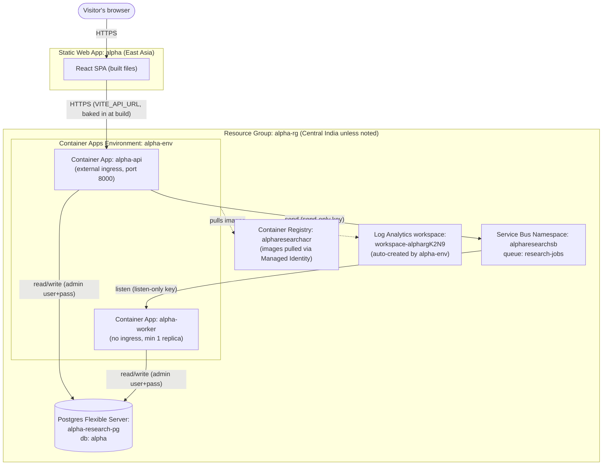

# Alpha — Agentic Stock Research System

A distributed multi-agent stock research system: enter one or more tickers in a
React SPA, and a pipeline of agents (news, fundamentals, technical, risk) researches
them and returns a report. Built incrementally, deployed to Azure layer by layer.

Being built with guidance from the `tutor/` skill — see `tutor/references/phases.md`
for the full roadmap and `tutor/references/concepts.md` for concepts explained along
the way.

## Status

**Phase 1 — Frontend shell: complete.** **Phase 2 — Backend skeleton: complete.** FastAPI + Azure Service Bus (queue) + worker + Postgres, all deployed to Azure Container Apps and confirmed working end-to-end live in the browser, not just locally. Next: Phase 3 — MCP tools + real stock data.

## Architecture

```
Web page (React SPA, Azure Static Web Apps)        ← ✅ live
   │ (JWT/API key auth)                             ← not built yet (Phase 8)
   ▼
FastAPI (Container App, autoscale on HTTP)          ← ✅ live (alpha-api, external ingress)
   │  writes job → Azure Service Bus queue
   ▼
Worker (Container App, autoscale on queue depth)    ← ✅ live (alpha-worker, no ingress, min 1 replica)
   │
   ├─▶ LangGraph multi-agent flow                   ← not built yet (Phase 5) — currently a stub (fake summary)
   │      ├─ calls Azure AI Foundry (model + tracing)    ← not built yet (Phase 4)
   │      ├─ calls MCP tools (stock data, news)           ← not built yet (Phase 3)
   │      ├─ loads Skills (reusable capability modules)   ← not built yet (Phase 5)
   │      └─ reads/writes Redis + Postgres                ← Postgres ✅ live; Redis not needed yet (Phase 5)
   │
   └─▶ App Insights / OpenTelemetry                 ← not built yet (Phase 10)
```

This first diagram is the conceptual/application view (matches `phases.md`'s target). Below is a
second, literal view — actual Azure resource names and how they really connect, updated every
phase as real infrastructure gets added. This is the one to check if you want to know "what's
actually deployed right now," rather than "what's the app logically made of."

## Azure Deployment Topology (real resource names — updated every phase)



## Live URLs

- Frontend: https://nice-water-0e7781500.7.azurestaticapps.net/ (Azure Static Web Apps, `alpha-rg`, East Asia)
- Backend API: https://alpha-api.orangesky-1a62d756.centralindia.azurecontainerapps.io (Azure Container Apps, `alpha-rg`, Central India)

## What's working right now

- Ticker input (comma-separated, multi-ticker), with format validation.
- Real end-to-end flow: submit → real job queued via Azure Service Bus → real worker picks it up →
  status written to Azure Database for PostgreSQL → frontend polls and shows the real result.
- Report content is still a stub (fixed "looks solid, no major red flags" text per ticker) — real data
  sourcing is Phase 3.

## Running locally

```bash
# frontend
cd frontend
npm install
npm run dev

# backend api (needs local Postgres + a Service Bus connection string — see tutor/references/decisions.md)
cd backend/api
uv run uvicorn main:app --reload

# worker
cd backend/worker
uv run python worker.py
```
