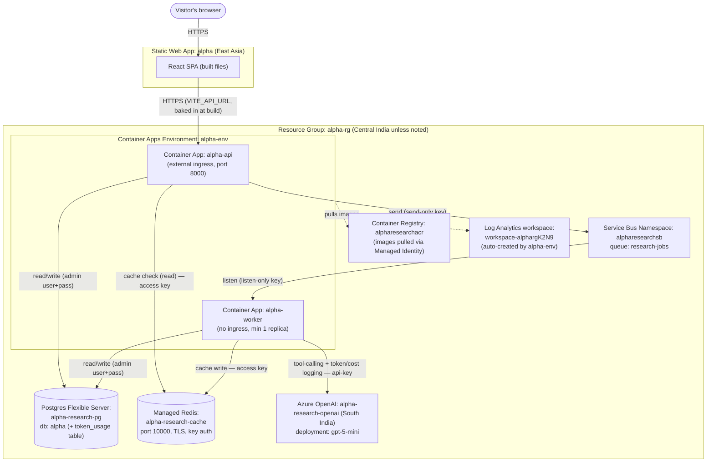

# Alpha — Agentic Stock Research System

A distributed multi-agent stock research system: enter one or more tickers in a
React SPA, and a pipeline of agents (news, fundamentals, technical, risk) researches
them and returns a report. Built incrementally, deployed to Azure layer by layer.

Being built with guidance from the `tutor/` skill — see `tutor/references/phases.md`
for the full roadmap and `book/` for a curated, chapter-per-phase account of how it
was built (concept explanations now live there, not in a separate glossary file).

## Status

**Phase 1 — Frontend shell: complete.** **Phase 2 — Backend skeleton: complete.** **Phase 3 — MCP tools + real data: complete.** **Phase 4 — First agent (Azure AI Foundry + tool-calling + token/cost logging): complete.** A real Azure OpenAI-backed agent (`gpt-5-mini`) decides which tools to call — real stock data, real MCP-backed web search, and one genuine LLM-discoverable Skill (`assess_news_sentiment`) it can choose to apply — runs alongside the existing deterministic checks (not a replacement, deliberately), with every call's token usage and estimated cost logged to Postgres. Deployed and verified live. Next: Phase 5 — multi-agent + Skills + real three-tier memory.

## Architecture

```
Web page (React SPA, Azure Static Web Apps)        ← ✅ live
   │ (JWT/API key auth)                             ← not built yet (Phase 8)
   ▼
FastAPI (Container App, autoscale on HTTP)          ← ✅ live (alpha-api, external ingress)
   │  writes job → Azure Service Bus queue
   ▼
Worker (Container App, min 1 replica)               ← ✅ live (alpha-worker, no ingress) — queue-depth autoscaling NOT actually configured (verified: `rules: null`); fixed at 1 replica regardless of queue depth, a real gap not yet built
   │
   ├─▶ Single agent (LangGraph multi-agent flow is Phase 5) ← ✅ live — real bounded async tool-calling loop, deterministic checks run alongside it, not replaced by it
   │      ├─ calls Azure AI Foundry (gpt-5-mini)         ← ✅ live (tracing still Phase 8)
   │      ├─ calls MCP tools (stock data, news)           ← both ✅ live — stock data (direct call, yfinance) and Tavily search (real MCP server), model decides when search is worth it
   │      ├─ loads Skills (reusable capability modules)   ← flag_risk_factors ✅ live (deterministic); assess_news_sentiment ✅ live — genuine LLM-discoverable Skill, model discovers + chooses to apply it
   │      └─ reads/writes Redis + Postgres                ← both ✅ live (Redis: per-ticker result cache; Postgres: job status + token/cost log; agent memory proper is still Phase 5)
   │
   └─▶ App Insights / OpenTelemetry                 ← not built yet (Phase 10)
```

This first diagram is the conceptual/application view (matches `phases.md`'s target). Below is a
second, literal view — actual Azure resource names and how they really connect, updated every
phase as real infrastructure gets added. This is the one to check if you want to know "what's
actually deployed right now," rather than "what's the app logically made of."

## Azure Deployment Topology (real resource names — updated every phase)



## Live URLs

- Frontend: https://nice-water-0e7781500.7.azurestaticapps.net/ (Azure Static Web Apps, `alpha-rg`, East Asia)
- Backend API: https://alpha-api.orangesky-1a62d756.centralindia.azurecontainerapps.io (Azure Container Apps, `alpha-rg`, Central India)

## What's working right now

- Ticker input (comma-separated, multi-ticker) with an explicit US/India market selector — a ticker
  is only looked up in the chosen market, with a clear error on a mismatch rather than guessing.
- Real end-to-end flow: each ticker in a request fans out independently — submit → per-ticker cache
  check (Azure Managed Redis) → cache hit returns instantly, cache miss queues via Azure Service Bus →
  real worker picks it up → status written to Azure Database for PostgreSQL → frontend polls and
  aggregates all tickers' results once every one is done.
- A same-day repeat request for a ticker already computed returns instantly from cache, skipping the
  queue entirely; a request mixing a cached ticker with a fresh one correctly returns the cached one
  immediately while only the fresh one is computed.
- Real stock data (price, P/E, 52-week range) from `yfinance`, plus a rule-based risk-flag Skill
  (near 52-week low, high/negative P/E) — both deterministic, run on every ticker regardless of
  what the agent below decides.
- A real single agent (Azure OpenAI `gpt-5-mini`) that decides, at runtime, which tools to call:
  the same stock-data lookup, a real MCP-backed web search (Tavily), and one genuine
  LLM-discoverable Skill (`assess_news_sentiment`) it can choose to load and apply with its own
  judgment — distinct from the deterministic risk-flag Skill, which it always runs regardless.
- Real narrative summarization: the agent's own synthesized answer is appended to the deterministic
  report as an "AI summary" line — both run side by side, deliberately, not one replacing the other.
- Every real call's token usage and an estimated cost are logged to Postgres (`token_usage` table),
  one row per ticker per job.

## Running locally

```bash
# frontend
cd frontend
npm install
npm run dev

# backend api (needs local Postgres + a Service Bus connection string — see tutor/references/decisions.md)
cd backend/api
uv run uvicorn main:app --reload

# worker
cd backend/worker
uv run python worker.py
```
