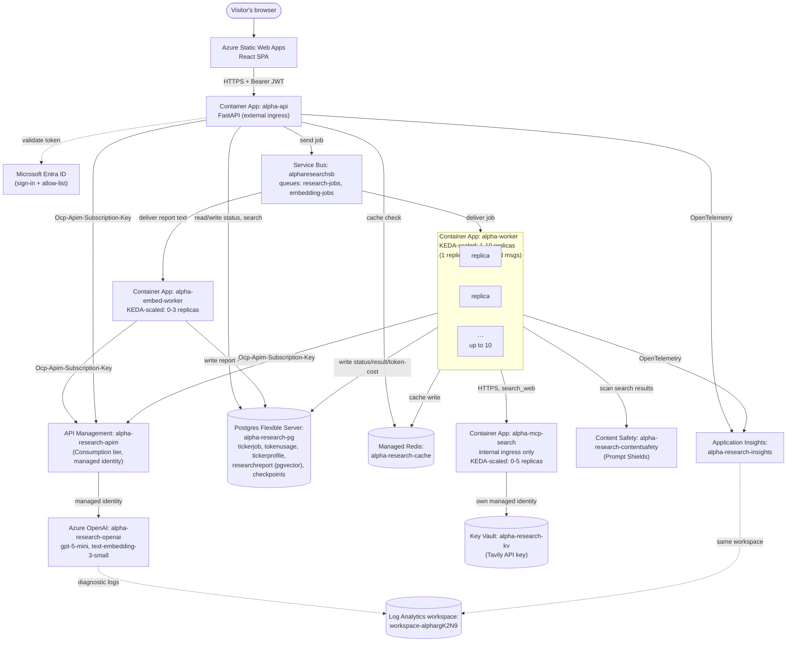

# Alpha — Agentic Stock Research System

A distributed multi-agent stock research system: enter one or more tickers in a
React SPA, and a pipeline of agents (fundamentals, technical, news, risk, a
Devil's Advocate, and a final Decision agent) researches them and returns a
real BUY/HOLD/SELL report with intrinsic-value estimates and a bear-case
counter-thesis. Built incrementally, deployed to Azure layer by layer.

Built with guidance from the `tutor/` skill — see `tutor/references/phases.md`
for the full roadmap and `book/` for a curated, chapter-per-phase account of how it
was built (concept explanations live there, not in a separate glossary file).

## Status

**Phases 1–7: complete.** Frontend shell, backend skeleton (FastAPI + Service Bus + Postgres), MCP tools + real `yfinance` data, the first Azure AI Foundry agent with token/cost logging, a real multi-agent LangGraph pipeline with genuine three-tier memory (Redis/pgvector/Postgres), LangGraph checkpointing proven against a real mid-job crash, and resilience (`RetryPolicy` + graceful degradation) proven against a real failure injection — see `book/chapter-01` through `chapter-07` for the full account of each, including every real incident found along the way.

**Phase 8 — Auth & trust boundaries: complete, all 5 stages.** Entra ID sign-in, backend token validation plus an authorization allow-list, Managed Identity for Service Bus/Postgres/Redis (access-key auth disabled entirely at the resource level), Key Vault for the one remaining third-party secret (Tavily), and an honest trust-boundary writeup (identity-based, not network-based — no VNet anywhere). Real incidents found and fixed along the way include a genuine secret-leakage incident (`.env.local` baked into two Docker images), a `MessageLockLostError` caused by a Key Vault round-trip's own latency, and a self-inflicted KEDA autoscaler regression. See `book/chapter-08-auth.md`.

**A sixth and seventh agent, built for real.** The original five-agent graph (Fundamentals/Technical/News/Risk/Synthesizer) was rebuilt: Synthesizer was replaced entirely by a real **Decision** agent (a genuine tool-calling loop computing intrinsic value and checking deterministic hard-stop rules, market-agnostic — proven on both a September-fiscal-year US stock and a March-fiscal-year Indian one) and a new **Devil's Advocate** agent (real adversarial bear-case research, read-only by design). See `book/chapter-05-multi-agent.md`'s "Built For Real" section.

**Phase 9 — Guardrails: complete.** Azure AI Content Safety's Prompt Shields wired into the one place untrusted third-party content enters the system (`tools/web_search.py`), catching indirect prompt injection in search results — verified live against a real crafted injection attempt and confirmed not to false-positive on genuine search content. Basic PII scrubbing on `/search`'s free-text input. Real incidents: a Content Safety custom-subdomain requirement for AAD auth, and two real deploy gotchas (`az acr build` packaging the git-committed tree instead of the working directory, and `:latest` not forcing a new Container Apps revision) that are now standing practice for every deploy in this project. See `book/chapter-09-guardrails.md`.

**Phase 10 — Observability: complete.** Azure OpenAI diagnostic logging (tokens/cost/timing, no content) plus real OpenTelemetry tracing through `alpha-api` and `alpha-worker`, with `job_id` as the correlation key across the resulting traces (Service Bus doesn't propagate trace context across the queue) — verified end to end on real jobs. The actual payoff, not tracing for its own sake: the tracing itself surfaced a real blocking-call bug (three `yfinance` calls made synchronously from async agent code, silently serializing the graph's "parallel" branches) — fixed with `asyncio.to_thread()`, measured **~58% reduction** in per-ticker processing time on a real before/after job. See `book/chapter-10-observability.md`.

**Phase 11 — Scaling validation: complete.** `alpha-worker`'s real queue-depth autoscaling proven with a fully-captured live cycle (1 → 8 replicas under an 8-ticker burst → back to 1 after cooldown). The MCP search server graduated from Option A (a subprocess spawned per call) to Option B: its own Container App (`alpha-mcp-search`, internal ingress only, its own Managed Identity and Key Vault access), reached over HTTPS. Three real incidents found deploying it, most notably a genuine Azure Container Apps behavior: internal ingress force-redirects HTTP to HTTPS, and `httpx`'s default redirect handling silently downgrades a POST to a GET on that redirect — a generic gotcha for any POST-based service-to-service call over Container Apps' internal ingress, not specific to MCP. See `book/chapter-11-scaling.md`.

**Phase 12 — Polish & final wiring: in progress.** A History tab (filter past reports by ticker/date, reusing the existing `TickerJob` table — no new storage), an explicit per-ticker failure state in the frontend (replacing fragile string-sniffing of raw error text), and this README brought fully current. The KEDA queue-depth threshold was reverted from a deliberately aggressive testing value (`messageCount=1`) to a more production-reasonable `5`, exactly as flagged as a plan in earlier revisions of this README — caught live along the way: `az containerapp update`'s default API version silently drops the `identity` field on a custom scale rule, requiring a direct ARM REST PATCH against a newer API version to fix, verified by re-reading the resource rather than trusting the update command's own success.

## Architecture

```
Web page (React SPA, Azure Static Web Apps)              ← ✅ live
   │ (Entra ID sign-in + Bearer token)                     ← ✅ live — MSAL sign-in, backend token validation + allow-list
   ▼
FastAPI (Container App, autoscale on HTTP)                ← ✅ live (alpha-api, external ingress)
   │  writes job → Azure Service Bus queue (Managed Identity)
   ▼
Worker (Container App, autoscale on queue depth)          ← ✅ live (alpha-worker, min 1 / max 10 replicas, ~1 replica per 5 queued msgs)
   │
   ├─▶ 6-agent LangGraph pipeline                          ← ✅ live
   │      Fundamentals/Technical/News (parallel) → Risk → Devil's Advocate → Decision
   │      ├─ calls Azure AI Foundry (gpt-5-mini) via Azure API Management
   │      ├─ calls MCP tools — stock data (direct, yfinance) and web search
   │      │    (own Container App, alpha-mcp-search, HTTPS, independently scaled)
   │      ├─ Prompt Shields scans every search result for indirect injection
   │      ├─ loads Skills (flag_risk_factors deterministic; assess_news_sentiment LLM-discoverable)
   │      └─ reads/writes Redis + Postgres (cache, job status, token/cost, checkpoints, pgvector)
   │
   └─▶ Application Insights / OpenTelemetry                ← ✅ live — per-agent duration/tokens, job_id-correlated traces
```

This first diagram is the conceptual/application view (matches `phases.md`'s target). Below is a
second, literal view — actual Azure resource names and how they really connect, updated every
phase as real infrastructure gets added (also maintained, with change history, as "The Architecture
So Far" in `book/chapter-11-scaling.md` and earlier chapters).

## Azure Deployment Topology (real resource names — updated every phase)



## Live URLs

- Frontend: https://nice-water-0e7781500.7.azurestaticapps.net/ (Azure Static Web Apps, `alpha-rg`, East Asia)
- Backend API: https://alpha-api.orangesky-1a62d756.centralindia.azurecontainerapps.io (Azure Container Apps, `alpha-rg`, Central India)

## What's working right now

- Ticker input (comma-separated, multi-ticker) with an explicit US/India market selector.
- Real end-to-end flow: each ticker fans out independently — submit → per-ticker cache check
  (Redis) → cache miss queues via Service Bus → real worker runs the full 6-agent graph →
  status/result written to Postgres → frontend polls and aggregates all tickers once done.
- A real 6-agent LangGraph pipeline: Fundamentals, Technical, and News run in parallel; Risk
  waits on all three; Devil's Advocate builds a real bear-case counter-thesis; Decision computes
  intrinsic value and checks deterministic hard-stop rules, then reaches a final BUY/HOLD/SELL
  recommendation weighing every other agent's input, including the counter-thesis.
- A real, structured report view — a recommendation banner, price/intrinsic-value cards, a
  hard-stop callout when one fires, and a distinct Devil's Advocate section — not just plain text.
- A **History tab**: browse past completed reports filtered by ticker and/or date range, reusing
  the same data every job already persists.
- Explicit per-ticker failure states in the UI — a partially-failed multi-ticker job shows exactly
  which ticker failed and why, not a generic error.
- A `job_id` shown (and copyable) on every completed report, for tracing a specific run end to end
  in Application Insights.
- Real guardrails: Prompt Shields scans every search result for injection attempts before it
  reaches a model; basic PII scrubbing on the one free-text input (`/search`).
- Real observability: per-agent duration and token usage, correlated by `job_id`, queryable in
  Application Insights.
- Every real call's token usage and estimated cost logged to Postgres, one row per ticker per job.

## Running locally

```bash
# frontend
cd frontend
npm install
npm run dev

# backend api (needs local Postgres + a Service Bus connection string — see tutor/references/decisions.md)
cd backend/api
uv run uvicorn main:app --reload

# worker
cd backend/worker
uv run python worker.py

# MCP search server (its own standalone service since Phase 11 -- worker.py
# reaches it over HTTP via MCP_SEARCH_URL, defaulting to localhost for local dev)
cd backend/worker/mcp_server
TAVILY_API_KEY=... uv run python search_server.py
```
