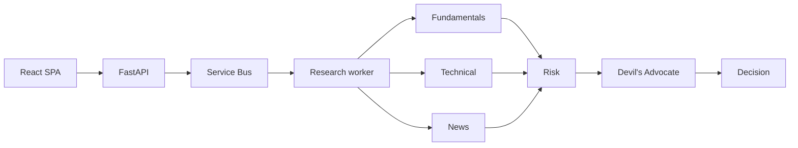

# Building Agentic AI Systems

This book guides you through understanding an agentic AI application one working layer at a time. We use Stock Research Assistant, a stock-research application, as the running example. We begin with a small React screen. Then we examine an API, a queue, workers, tools, multiple agents, memory, security, monitoring, and scaling.

You do not need to know these technologies before you start. Each chapter introduces a problem, explains the smallest useful idea, and adds one part to the application. Short incidents show mistakes that can happen during a real build. They are included only when they teach a reusable lesson.

## Who This Book Is For

This book is for developers who can read basic Python and JavaScript but have not built a distributed or agentic system before. You should be comfortable with:

- Running commands in a terminal.
- Reading small React and Python examples.
- Basic HTTP ideas such as requests, responses, and JSON.
- Git fundamentals.

You do not need prior experience with FastAPI, LangGraph, the Model Context Protocol (MCP), Azure Container Apps, Service Bus, Managed Identity, or OpenTelemetry. We explain each idea when the system first needs it.

## What You Will Build

By the end, a user can submit one or more US or Indian stock tickers from a React application. A FastAPI service creates jobs, Azure Service Bus buffers them, and an independently scaled worker runs a six-node LangGraph pipeline:

The final system also uses PostgreSQL, pgvector, Redis, MCP, Azure OpenAI through API Management, Microsoft Entra ID, Managed Identity, Key Vault, Content Safety, Application Insights, and Container Apps autoscaling.

## How to Use This Book

Read the chapters in order to follow the complete application. Each chapter contains:

- **Concepts** that explain why each new component or boundary exists.
- **Checkpoints** that tell you how to prove the behavior works.
- **Minimal excerpts** that highlight an important behavior without reproducing complete files.
- **Repository tours** that point to the full implementation at a chapter tag.
- **Incidents** that show a useful failure and the lesson it teaches.
- **Exercises** that help you test your understanding.

You can read the book without running the system. Use the companion repository when you want to inspect or run the complete code. All Azure provisioning and deployment commands live in [Azure Setup and Deployment](azure-setup.md) and may create billable resources.

> **Repository status:** The files in `../backend` and `../frontend` contain the finished system. Early chapters build smaller versions of those files. The book labels this code as a **chapter version** so you do not confuse it with the finished repository.

## Requirements

The current repository targets the following baseline:

| Tool | Repository baseline | Why it is needed |
|---|---:|---|
| Python | 3.14 or newer | API, workers, tools, and agents |
| `uv` | Current stable | Python environments and dependencies |
| Node.js | Compatible with Vite 8 | Frontend development and builds |
| npm | Bundled with Node.js | Frontend dependency management |
| Docker | Current stable | Local supporting services and container builds |
| Azure CLI | Current stable | Azure setup, inspection, and deployment |
| Git | Current stable | Source control and chapter checkpoints |

Package and cloud-service behavior can change. When a result depends on a specific version, the chapter tells you what to check.

## Cost and Safety

Some later exercises call paid Azure services or third-party APIs. Before running them:

- Set a budget and billing alerts in Azure.
- Prefer the smallest suitable development tier.
- Treat load tests as short experiments and remove resources afterward.
- Never commit `.env`, `.env.local`, access keys, tokens, or connection strings.
- Assume public financial data can be delayed, incomplete, or wrong.

Stock Research Assistant is an educational research system. It does not provide financial advice and should not place trades.

## Chapter Map

The book uses small chapters. Each chapter focuses on one main learning goal.

### Part I: Build the Distributed Spine

1. [The Frontend Shell](chapter-01-frontend-shell.md) - Model the UI as explicit states and deploy the first thin slice.
2. [The Backend Contract](chapter-02-backend-contract.md) - Replace the fake delay with an HTTP job contract.
3. [Queue, Worker, and Database](chapter-03-queue-worker-database.md) - Move long work out of the request and persist its state.
4. [Real Market Data and Fan-Out](chapter-04-real-data-fanout.md) - Introduce per-ticker jobs, caching, and deterministic tools.
5. [MCP and Capability Boundaries](chapter-05-mcp-boundaries.md) - Put remote search behind a standard tool protocol.

### Part II: Build the Agent System

6. [The First Tool-Using Agent](chapter-06-first-tool-agent.md) - Implement the model/tool conversation loop.
7. [Model Boundaries and Skills](chapter-07-model-boundaries-skills.md) - Make model access swappable and capabilities discoverable.
8. [The Multi-Agent Graph](chapter-08-multi-agent-graph.md) - Build parallel specialists and explicit fan-in.
9. [Memory and Retrieval](chapter-09-memory-retrieval.md) - Separate short-term state, profiles, and semantic report memory.
10. [Decision and Dissent](chapter-10-decision-dissent.md) - Add deterministic valuation, hard stops, and a bear-case agent.
11. [Checkpointing](chapter-11-checkpointing.md) - Resume interrupted graph execution without repeating completed work.
12. [Resilience](chapter-12-resilience.md) - Retry transient failures and degrade gracefully after persistent ones.

### Part III: Make It Trustworthy and Operable

13. [User Authentication](chapter-13-user-authentication.md) - Protect the API with Microsoft Entra ID.
14. [Workload Identity and Secrets](chapter-14-workload-identity-secrets.md) - Remove service credentials with Managed Identity and Key Vault.
15. [Agent Trust Boundaries](chapter-15-agent-trust-boundaries.md) - Reason honestly about tools, identities, processes, and networks.
16. [Guardrails](chapter-16-guardrails.md) - Defend untrusted search content and scrub accidental PII.
17. [Observability](chapter-17-observability.md) - Correlate traces, tokens, costs, and latency across services.
18. [Scaling the Real Workload](chapter-18-scaling.md) - Prove queue-depth scaling and separate the MCP service.
19. [Product Polish](chapter-19-product-polish.md) - Add structured results, history, explicit failures, and traceable job IDs.
20. [What Production-Ready Means](chapter-20-production-readiness.md) - Assess the final system, remaining risks, costs, and next steps.

### Reference

- [Azure Setup and Deployment](azure-setup.md) - Provision and deploy the Azure stages referenced by the conceptual chapters.
- [Chapter Stage Tags](chapter-stage-tags.md) - Find the exact starting and completion commits for each hands-on chapter.
- [Concept Index](concept-index.md) - Find the chapter that explains a term or mechanism.
- [Troubleshooting Index](troubleshooting-index.md) - Start from a symptom and follow the safest checks.
- [Editorial Conventions](editorial-conventions.md) - Understand snapshots, code labels, evidence, and chapter structure.

## Chapter Conventions

Each chapter uses a predictable set of markers:

- **Snapshot:** what you have built and what you add next.
- **Build:** an action the reader takes.
- **Checkpoint:** evidence that the step worked.
- **Incident:** a real failure that teaches a reusable lesson.
- **Production Lens:** what a production system would add or do differently.
- **Exercise:** a small change that tests understanding.

Code labels have precise meanings:

- **Chapter version:** code for the current step that may be smaller than the finished repository.
- **Current:** taken from or aligned with the present repository.
- **Illustrative:** shortened to explain one mechanism and not intended to run as-is.
- **Command:** intended to run in the named shell after satisfying its prerequisites.

See [Editorial Conventions](editorial-conventions.md) for the rules used throughout the revised manuscript.

## Finished Repository Versus Chapter Versions

A finished application naturally differs from its first chapter. A reference such as `frontend/src/App.jsx` means one of two things:

- In a chapter-version section, it shows the smaller file you build at that step.
- In a current-code section, it links to the file that exists in this repository now.

Until chapter tags are added, the labeled snippets are the source of truth for each build step. Checking out the current branch opens the finished application, not the Chapter 1 version.

## Companion Material Still Needed

The build path is explicit, and several companion pieces now exist: chapter start and completion tags for every chapter, offline unit tests per service, and parameterized infrastructure as code (`infra/`) covering Chapters 4 through 20. What still needs adding before every chapter is a full clone-and-run exercise:

- Sanitized environment templates for each service.
- Local PostgreSQL/pgvector and Redis orchestration for chapters that do not have a local-only path.
- Versioned database migrations.
- Opt-in live integration tests.

Chapters identify these boundaries rather than pretending the missing assets already exist.
