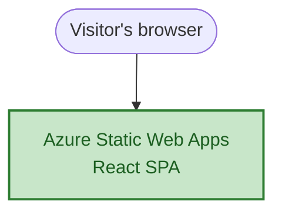

# Chapter 1 — The Frontend Shell

## Starting From Nothing

The `alpha` repository began genuinely empty. Not "empty except for boilerplate" — empty, except for a single folder: `tutor/`, containing a guided-tutor skill definition and a roadmap. No frontend, no backend, not even a Git repository yet. Node v24 and npm were installed on the machine; nothing else about the project existed.

That emptiness was deliberate. The whole point of this project was to build a real, production-shaped distributed system — a multi-agent stock research tool — one layer at a time, with each layer actually deployed and verified live on Azure before moving to the next. Not "build everything locally, then deploy once at the end." Build the frontend, deploy it, see it live. Then the backend, deployed, seen live. Then the queue, the database, the agents — each one a real, working step, not a simulated one.

Phase 0 was simply confirming this starting point: an empty repo, a clean slate, nothing to reconcile with existing code. Phase 1 is where the actual building starts.

## Choosing the Stack

The first real decision: what should the frontend be built in?

A few options were on the table — plain HTML/CSS/JS, React, Vue, Svelte, Angular, Next.js, even something like Streamlit for a fast throwaway UI. Each has a real place. Plain JavaScript is fine for a page with no real state; it gets messy fast once you need "show a spinner while waiting, then swap in a result" — exactly what this app needed from day one. Angular is a strong choice for large teams needing one enforced way of doing things, which wasn't the situation here. Next.js adds routing and server-rendering machinery this single-screen app doesn't need. Streamlit is fast to a working UI but hides the frontend/backend separation that was one of the actual learning goals of the project.

React won out for a specific reason, not just popularity: this app's whole shape is a state machine — a ticker gets typed in, a request goes out, a result comes back — and React's core specialty is exactly that: describe what the UI should look like for a given state, and let the framework figure out how to update the screen. Vite was paired with it as the build tool — fast local development, minimal configuration, and a clean path to a deployable static build.

## What "Building a React App" Actually Means

Before writing any application code, a few things needed to actually be understood, not just used.

**JSX isn't valid JavaScript.** The familiar-looking `<div>Hello</div>` syntax inside a `.jsx` file is shorthand for a real JavaScript function call, `React.createElement("div", null, "Hello")`. Browsers only ever run the second form. A build step — Vite, in this project — transpiles every JSX-looking bit into real JavaScript, bundles many source files into a handful of files (loading dozens of files one by one over the network is slow), and strips out development-only extras like React's console warnings. `npm run dev` does this on the fly, in memory, for local editing with instant reload. `npm run build` writes the final result to a `dist/` folder as plain HTML/CSS/JS — static files, servable by literally anything, with no server-side computation required per request.

**The app renders entirely in the browser.** This is called client-side rendering (CSR): the server sends back a nearly empty HTML shell — just a `<div id="root"></div>` and a `<script>` tag — the same shell to every visitor, regardless of what they're about to search for. The browser downloads and runs the JavaScript bundle, and *that* code builds the actual visible page. For dynamic data, the pattern is the same shell first, then a separate API call afterward, once the page is already up. This matters later: it's exactly why the frontend (Phase 1) could be built and deployed completely before any backend (Phase 2) existed — the shell doesn't need real data to exist and be deployable.

## Building the Ticker Input

The first real piece of UI was deliberately tiny: a static heading and a plain text input, no logic at all, just to confirm the scaffold worked and something appeared in the browser. From there, state was introduced one layer at a time.

First, a *controlled* input — meaning React, not the browser, owns the current value of the text box:

```jsx
const [tickerInput, setTickerInput] = useState('')

<input
  type="text"
  placeholder="e.g. AAPL, TSLA"
  value={tickerInput}
  onChange={(e) => setTickerInput(e.target.value)}
/>
```

Then, parsing and validating what gets typed — splitting a comma-separated list, cleaning up whitespace and casing, and rejecting anything that doesn't look like a real ticker symbol before it goes anywhere:

```jsx
function handleSubmit() {
  const parsed = tickerInput
    .split(',')
    .map((t) => t.trim().toUpperCase())
    .filter((t) => t.length > 0)

  if (parsed.length === 0) {
    setError('Please enter at least one ticker.')
    return
  }

  const invalid = parsed.filter((t) => !/^[A-Z]{1,5}$/.test(t))
  if (invalid.length > 0) {
    setError(`Invalid ticker format: ${invalid.join(', ')}`)
    return
  }
  // ...
}
```

That regex — one to five uppercase letters, nothing else — only checks *shape*, not whether a ticker is real and tradeable. That deeper check requires an actual data source, which doesn't exist yet at this point in the story. Catching obviously malformed input early is still exactly what a production app would do; it's just not the whole validation story, and it doesn't try to be yet.

## Faking the Backend, on Purpose

With no backend to talk to, the rest of the flow was built entirely as a fake — deliberately, not as a shortcut being hidden. The app needed to prove out its own shape first: idle, waiting for input; loading, while a request is "in flight"; done, with a result to show.

```jsx
const jobId = crypto.randomUUID()
setTimeout(() => {
  setReport({
    jobId,
    summary: parsed.map((t) => `${t}: looks solid, no major red flags.`),
  })
  setStatus('done')
}, 2000)
```

`crypto.randomUUID()` is a browser built-in for generating a random unique ID — standing in here for what a real backend would eventually generate and hand back. The `setTimeout` fakes network latency. The `summary` text is entirely made up. None of that mattered yet; what mattered was proving that `idle → loading → done` worked as a real state machine, driven by nothing but `useState` and a handful of conditionals in the component's JSX:

```jsx
{status === 'idle' && ( /* input + button */ )}
{status === 'loading' && <p>Analyzing {tickers.join(', ')}...</p>}
{status === 'done' && report && ( /* the report */ )}
```

There's no separate "store" or state-management library here, and none was needed — the component function itself *is* the mapping from state to UI. React re-runs it whenever state changes and figures out what actually needs to change on the real page, which turns out to be cheap: what gets returned from a component isn't the real DOM, it's a small, disposable in-memory description of what the DOM *should* look like. Only the genuinely different parts get touched on the real page.

## Making It Look Like Something

The visual design was intentionally minimal: a single centered box, styled after a search-engine landing page — heading, rounded search input, a pill-shaped button — reusing a `#center` flex-centering utility that was already sitting, unused, in the scaffold's default CSS. The button's color came from theme variables (`--accent`, `--accent-bg`) already defined for light and dark mode, rather than inventing new colors from scratch.

## Shipping It

With the fake flow working locally, the next step was the one that mattered most for the shape of this whole project: getting it live on the actual internet, even though everything behind it was still fake.

That meant, in order: initializing a Git repository (there wasn't one yet), pushing it to GitHub, and creating an Azure Static Web App through the Azure Portal's wizard, connected to that GitHub repo. Two configuration details mattered specifically because the React app lives in a `frontend/` subfolder, not the repository root:

- **App location**: `/frontend` — where the source code actually is.
- **Output location**: `dist` — where `npm run build` writes its final files, given *relative to the app location*, not the repo root.

Creating the Static Web App also auto-committed a GitHub Actions workflow file straight to the repository's `main` branch — which, a little ironically, caused the very next manual push to be rejected as a non-fast-forward update, since that commit existed on GitHub but not yet in the local clone. A quick `git fetch` plus `git rebase origin/main` resolved it cleanly; the two commits touched entirely different files, so there was nothing to actually reconcile by hand.

A few minutes later, the workflow finished, and the fake, entirely mocked flow was live at a real public URL.

## Azure Components Used This Chapter

Just one, deliberately — the whole point of building layer by layer is that each chapter introduces as little new infrastructure as it actually needs.

**Azure Static Web Apps** — a managed hosting service purpose-built for exactly this kind of app: a static frontend build (the output of `npm run build`), served from a global CDN, with zero servers to patch or scale by hand. Its most useful feature here wasn't hosting itself, though — it was the GitHub integration: connecting it to the repo during setup automatically generated a GitHub Actions workflow that rebuilds and redeploys on every push to `main`, with no separate CI/CD pipeline to hand-write. Configured on the **Free** tier (no cost at this scale), in the **East Asia** region — a detail that matters less than it sounds, since static content gets distributed globally through the CDN regardless of which region was picked at creation; that setting really only affects where deployment metadata lives.

## A Lesson From the Live Site

One detail worth keeping, because it showed up as something concrete rather than just a definition: fetching the live URL with a tool that doesn't execute JavaScript — the same way most non-Google web crawlers behave — returned almost nothing. Just the page's `<title>` tag and an empty shell. No search box, no heading, nothing that a visitor's actual browser would show.

This is the direct, visible consequence of client-side rendering: a crawler that never runs your JavaScript never sees your real content, because your real content doesn't exist until that JavaScript runs. It's not a bug in the deploy — it's exactly what CSR means, made concrete by a real tool hitting a real URL. (It's also not a problem for this particular app: a stock-research tool isn't something meant to be indexed by search engines in the first place.)

## The Architecture So Far

This diagram shows only what actually exists after this chapter — nothing previewed ahead of the story. It will grow, chapter by chapter, as each new piece actually gets built; by the final chapter it'll show the whole system. Right now, after one chapter, it's exactly one box.



## What Came Out of This Chapter

- A React + Vite frontend, chosen because the app's shape — a state machine, not a document — matched React's actual specialty, not because it was the popular default.
- A real understanding of what a "build step" does: JSX to real JavaScript, many files to few, static output that needs no server-side computation to serve.
- A fully fake, but fully real *shaped*, `idle → loading → done` flow — proving the frontend's structure before any backend existed to prove it against.
- The project's first live deployment: a real public URL, on Azure Static Web Apps, serving a build that was still lying about everything behind it — which was exactly the point of doing it this early.

Phase 2 is where the lying stops: a real backend, a real queue, a real database — and the fake `setTimeout` gets replaced with something that actually talks to them.
