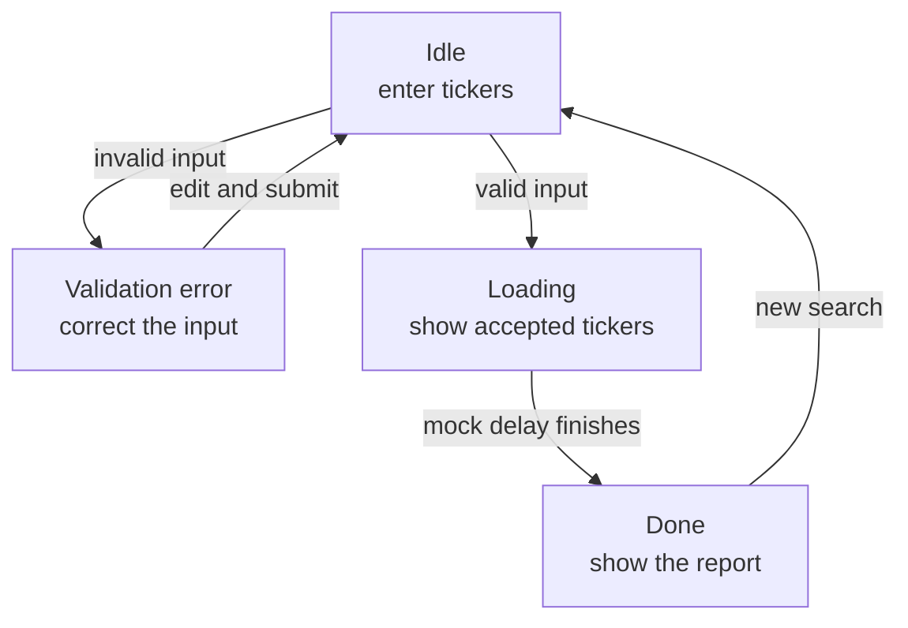
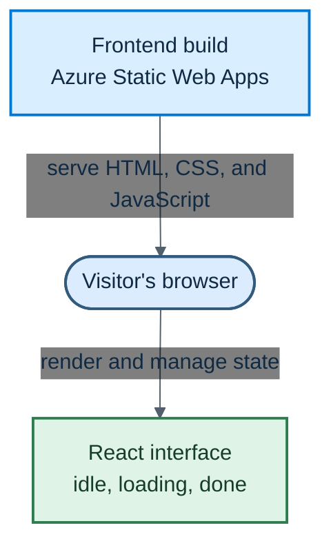

# Chapter 1: The Frontend Shell

A distributed system is easier to understand when it grows from one visible behavior. We begin Stock Research Assistant with a small user journey: enter one or more stock tickers, submit them, wait, and see a result.

There is no application programming interface (API), queue, database, or AI model yet. The browser owns the entire experience. That lets us answer the first design question without any network or cloud complexity:

> What states does the user experience, and how should the interface represent them?

The answer becomes an agreement that every backend component added later must preserve.

> **Chapter snapshot**
> - **Starting point:** `chapter-01-start`, an empty project and one user journey.
> - **Focus in this chapter:** A React interface that validates tickers and moves through explicit user-interface states.
> - **Finished repository:** `chapter-01-complete`, the complete frontend shell and its static production build configuration.
> - **Coming next:** Chapter 2 replaces the browser's fake timer and job ID with a backend contract.

## What This Chapter Explains

The first version supports a complete but mocked journey:

```text
idle -> loading -> done
  \-> validation error
```

In `idle`, the user can enter tickers. Invalid input keeps the interface in that state and adds an error. Valid input moves the interface to `loading`. After a short simulated delay, the interface shows a fabricated report in `done`. A reset action starts a new journey.

This version does not perform stock research. Its purpose is to make the visible states and transitions concrete before another process becomes responsible for the work.

## The Frontend as a State Machine

React renders the screen from a small set of values: the current input, normalized tickers, an error message, a status, and an optional report.



The status is not decorative text. It determines which part of the interface exists. That makes impossible combinations less likely: the input form is not shown as if it were ready while the current request is loading, and the report is not rendered before one exists.

## Validate Before Changing State

The interface accepts comma-separated symbols. It normalizes them before starting the mocked work:

```jsx
const parsed = tickerInput
  .split(',')
  .map((ticker) => ticker.trim().toUpperCase())
  .filter((ticker) => ticker.length > 0)

const invalid = parsed.filter(
  (ticker) => !/^[A-Z]{1,5}$/.test(ticker),
)
```

Splitting supports more than one ticker. Trimming removes accidental spaces, uppercasing produces a consistent representation, and filtering removes empty entries such as a trailing comma.

The regular expression checks only the symbol's shape. It cannot prove that a company with that symbol exists. That requires a market-data source, which arrives later. Client-side validation is immediate and useful, but it is not a security boundary. The API must validate the values again once one exists.

If the normalized list is empty or contains a malformed value, the handler records an error and returns without entering `loading`. The transition therefore means more than a visual change: reaching `loading` proves that the browser accepted the input.

## Model the Missing Backend

The frontend needs to exercise its waiting and report states before a backend exists. A generated ID and a timer temporarily stand in for that missing boundary:

```jsx
setStatus('loading')

const jobId = crypto.randomUUID()
setTimeout(() => {
  setReport({
    jobId,
    summary: parsed.map(
      (ticker) => `${ticker}: looks solid, no major red flags.`,
    ),
  })
  setStatus('done')
}, 2000)
```

The timer proves that the interface can remain coherent while work is in progress. The generated ID proves that a completed report can display a stable reference. Neither proves that work survives a refresh, that another process owns the job, or that the text is genuine research.

This is a useful mock because it isolates the frontend contract. Chapter 2 can replace the timer and browser-generated ID without redesigning the screen.

## Rendering the Current State

The component conditionally renders one primary view from `status`:

```jsx
{status === 'loading' && (
  <p>Analyzing {tickers.join(', ')}...</p>
)}

{status === 'done' && report && (
  <div>
    <h2>Report</h2>
    <ul>
      {report.summary.map((line) => <li key={line}>{line}</li>)}
    </ul>
    <small>Job: {report.jobId}</small>
  </div>
)}
```

The loading view names the normalized tickers so the user can see what was accepted. The completed view also checks that a report exists. Resetting clears the previous input, tickers, and report before returning to `idle`.

## Reading the Runtime Behavior

The implementation is easiest to assess through visible outcomes:

| Situation | Observable behavior | What it proves |
|---|---|---|
| Empty or malformed input | An error appears and the form remains available | Invalid input cannot start work |
| Lowercase symbols with spaces | The loading view shows normalized uppercase symbols | Input is normalized before use |
| Valid submission | The form gives way to a loading message | The interface has an explicit waiting state |
| Mock delay completes | A report and job ID appear | The completed state owns the result |
| New search is selected | Previous input and report disappear | A new journey starts from clean state |
| Browser refreshes | Current progress and result disappear | State belongs only to this browser session |

The build also matters. Vite transforms JSX and produces ordinary HTML, CSS, and JavaScript in `dist/`. A static host serves those files; Node.js and Vite are build tools, not runtime servers for the finished frontend.

> **Production Lens:** Explicit UI states, accessible errors, and configuration through the build system are production-shaped choices. The timer, browser-generated job ID, and fabricated report are deliberate substitutes. They let us establish the user experience before introducing network failures and server-owned state.

## Known Limitations

The report is fabricated, and the browser creates the job ID. Refreshing the page loses all state. No server validates input, no queue protects long-running work, and no database remembers results. The current ticker rule is also intentionally narrow and does not support every exchange's symbol format.

These limits identify the next boundary rather than hiding it.

## Azure Resources for This Stage

The frontend build can be hosted as static files. At this stage, only one Azure application resource is needed:

| Responsibility | Azure resource |
|---|---|
| Host the generated HTML, CSS, JavaScript, and image assets | Azure Static Web Apps |

Provisioning remains in the repository's shared Azure setup. The application itself does not contain cloud-specific runtime code; the same static build can be served locally or by Azure Static Web Apps.

## Azure Architecture

The first Azure topology is intentionally small. The host delivers the application files, and React runs in the visitor's browser:



There is no API connection yet. The entire mocked research journey still runs inside the browser.

## Read the Chapter Code

The complete frontend is available at `chapter-01-complete`. These files reveal its main responsibilities:

| File | What to look for |
|---|---|
| `frontend/src/App.jsx` | How validation and explicit UI states control the user journey |
| `frontend/src/App.css` | How the form, status, and report are presented |
| `frontend/src/index.css` | The page-level visual foundation |
| `frontend/package.json` | The development, lint, and production-build commands |
| `frontend/vite.config.js` | The frontend build configuration |

## See What Changed

The companion repository marks the empty starting point and the finished frontend with Git tags:

| What you want to see | Command |
|---|---|
| Empty starting state | `git switch --detach chapter-01-start` |
| Finished Chapter 1 frontend | `git switch --detach chapter-01-complete` |
| Every change introduced in Chapter 1 | `git diff chapter-01-start chapter-01-complete` |

After inspecting a snapshot, run `git switch -` to return to your previous branch.

## Next

The frontend now expresses the complete user journey, but it owns both the fake delay and the job ID. Nothing outside the current browser can accept or track the work.

Chapter 2 introduces a backend contract. The browser will submit tickers to an API, receive a server-generated job ID, and use that ID to check progress.