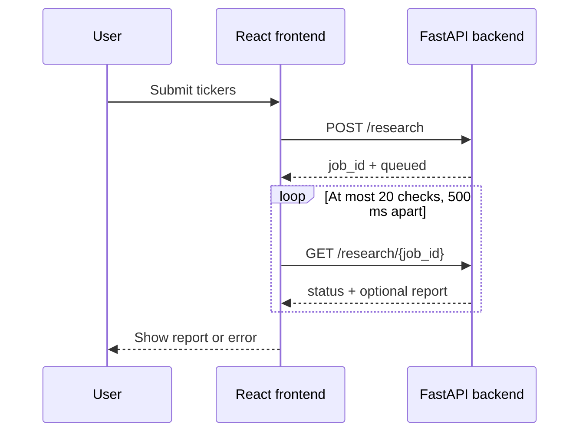
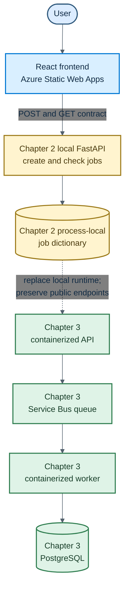

# Chapter 2: The Backend Contract

The frontend shell established what the user sees: enter tickers, wait, and receive a report. It did not establish who accepts the request, who creates its identity, or how the browser checks work that outlives one HTTP response.

This chapter moves those responsibilities across a process boundary. A FastAPI backend validates the request and creates a job. The React frontend receives that job's ID and asks for its status until the work completes.

The important idea is not FastAPI or polling by itself. It is the contract between two independently running programs.

> **Chapter snapshot**
> - **Starting point:** `chapter-02-start`, the completed frontend shell from Chapter 1.
> - **Focus in this chapter:** A create-then-check API contract with server-owned job identity and bounded frontend polling.
> - **Finished repository:** `chapter-02-complete`, a locally runnable FastAPI backend, the connected React frontend, and focused API tests.
> - **Coming next:** Chapter 3 places accepted jobs on a queue, processes them in a worker, and stores results in a database.

## What This Chapter Explains

Long-running work should not force one HTTP request to remain open until the final report is ready. Instead, the application divides the interaction into two operations:

| Operation | Request | Response |
|---|---|---|
| Create a job | `POST /research` with a ticker list | A server-generated `job_id` and current status |
| Check a job | `GET /research/{job_id}` | The current status and report when available |

This separation creates a stable boundary. The browser knows how to submit and check. The backend can later change how work is scheduled or stored without changing that public conversation.

## The Create-Then-Check Flow

At the Chapter 2 completion tag, both programs run locally:



The first response acknowledges that the request has been accepted. It does not need to contain the final report. The job ID links every later status check to the original submission.

Chapter 2 still simulates work inside the API process. A monotonic deadline keeps the job `running` for two seconds before the status route reports it as `done`. The frontend therefore exercises the same polling shape needed by a genuinely independent worker, without adding infrastructure yet.

## Validate at the API Boundary

The browser still validates for fast feedback, but the backend must make its own decision. Pydantic gives the request body an explicit shape:

```python
class ResearchRequest(BaseModel):
    tickers: list[str] = Field(min_length=1)

    @field_validator("tickers")
    @classmethod
    def normalize_tickers(cls, tickers: list[str]) -> list[str]:
        normalized = [ticker.strip().upper() for ticker in tickers]
        if any(not ticker.isalpha() or len(ticker) > 5 for ticker in normalized):
            raise ValueError("tickers must contain 1-5 letters")
        return normalized
```

The API normalizes and validates even if the current frontend already did so. Other callers may not use that frontend, and browser logic can be bypassed. Validation at the ownership boundary keeps malformed values from entering backend state.

FastAPI also turns request-model failures into a consistent `422 Unprocessable Entity` response. That error behavior is part of the contract, not an implementation accident.

## Let the Server Own Job Identity

Chapter 1 generated the ID in the browser. Once a backend owns jobs, it must create the identifier:

```python
@app.post("/research", status_code=202)
async def create_research(request: ResearchRequest) -> dict[str, str]:
    job_id = str(uuid.uuid4())
    jobs[job_id] = {
        "status": "running",
        "tickers": request.tickers,
        "ready_at": time.monotonic() + JOB_DELAY_SECONDS,
    }
    return {"job_id": job_id, "status": "accepted"}
```

This route performs three contract-level actions: accept validated tickers, create an identity, and return `202 Accepted` with a representation the client understands. The final report is not part of this acknowledgement.

The in-memory `jobs` dictionary is intentionally temporary. It lets the status route retrieve a job by ID without introducing a database before its responsibility is needed.

```python
@app.get("/research/{job_id}")
async def get_research(job_id: str) -> dict[str, Any]:
    job = jobs.get(job_id)
    if job is None:
        raise HTTPException(status_code=404, detail="job not found")

    if time.monotonic() < job["ready_at"]:
        return {"status": "running", "result": None}
```

An unknown ID returns `404 Not Found`. Before the deadline, an existing job returns `running` without a result; afterward, the route builds the sample result and returns `done`. The distinction matters: malformed submissions fail validation, while a well-formed lookup can fail because the requested resource does not exist.

## Poll With an Exit Condition

The frontend replaces its timer with network calls. After creating the job, it checks the status at a fixed interval:

```jsx
for (let attempt = 0; attempt < MAX_POLL_ATTEMPTS; attempt += 1) {
    await new Promise((resolve) => setTimeout(resolve, POLL_INTERVAL_MS))

    const response = await fetch(`${API_URL}/research/${jobId}`)
    if (!response.ok) throw new Error(`The API returned ${response.status}.`)

    const job = await response.json()
    if (job.status === 'done') {
        setReport(job.result)
    setStatus('done')
    return
  }
}

throw new Error('The research job took too long.')
```

Polling must be bounded. This loop checks at most 20 times, waiting 500 milliseconds between incomplete results. It exits when the job completes, when an HTTP request fails, or when the time budget is exhausted. The full implementation also handles a server-reported failure state.

Those exits prevent the browser from polling forever. The exact interval and attempt count are temporary policy choices; the important property is that waiting has a defined end.

## Cross-Origin Calls Are Explicit

During local development, Vite and FastAPI use different origins. Browsers block such requests unless the API grants permission through Cross-Origin Resource Sharing (CORS).

The backend allows the known local frontend origins. This is a browser-facing access rule, not authentication. CORS does not prove who the caller is, and broad wildcard settings should not quietly become the production policy.

The frontend reads its backend base URL from `VITE_API_URL`, with a local default. Keeping the address outside component logic lets deployment configuration change the destination without rewriting the request flow.

## Reading the Runtime Behavior

The contract becomes concrete through its observable outcomes:

| Situation | HTTP or UI result | Contract meaning |
|---|---|---|
| Valid ticker list is submitted | `POST /research` returns a UUID and status | The server accepted and identified the job |
| Empty or malformed ticker list is submitted | API returns `422` | Server-side validation protects backend state |
| Existing job ID is checked | API returns its current representation | Job identity connects creation to later reads |
| Unknown job ID is checked | API returns `404` | Missing resources are distinguished from invalid requests |
| Status request fails | Frontend shows an error and stops | HTTP failure terminates the polling loop |
| Job never completes within the budget | Frontend shows a timeout and stops | Waiting is bounded |
| API process restarts | Existing IDs can no longer be found | The job store is process-local and temporary |

## Tests as Contract Examples

The backend tests focus on behavior visible to a caller rather than internal helper functions:

```python
@patch.object(main, "JOB_DELAY_SECONDS", 0)
def test_create_and_read_research_job(self) -> None:
    response = self.client.post(
        "/research",
        json={"tickers": ["aapl", "MSFT"]},
    )

    self.assertEqual(response.status_code, 202)
    job_id = response.json()["job_id"]

    status_response = self.client.get(f"/research/{job_id}")
    self.assertEqual(status_response.json()["status"], "done")
```

Together, the focused tests demonstrate successful create-then-check behavior, request rejection, and missing-job behavior. They act as executable examples of the public contract and can remain stable when the dictionary is replaced by durable storage.

> **Production Lens:** Separating job creation from status retrieval is production-shaped because it avoids coupling the browser to one long request. Server-side validation, explicit error responses, environment-based API configuration, and bounded polling also survive beyond the prototype. The simulated deadline and process-local dictionary do not; they are small substitutes that expose exactly which responsibilities the next architecture must take over.

## Known Limitations

The API still fabricates reports and simulates work inside its own process. All jobs live in one Python process, disappear on restart, and cannot be shared reliably across API replicas. There is no queue, worker, database, authentication, or authorization. Polling also repeats HTTP requests even when nothing has changed.

These limitations are connected: durable asynchronous work needs a handoff mechanism, an independent processor, and shared storage.

## Azure Resources for This Stage

No new Azure service becomes active in the `chapter-02-complete` artifact. The tag contains a locally runnable Python API but no Dockerfile or other deployment packaging for it. The frontend can still be hosted by Azure Static Web Apps as described in Chapter 1, while the complete Chapter 2 system remains a local integration.

This is a deliberate manuscript boundary. Chapter 3 packages the API and worker, provisions their Azure resources through repository scripts, and explains those services when they become part of the running architecture.

## Local-to-Azure Transition

The local contract is designed to survive deployment even though this chapter does not deploy the API:



The dashed transition does not mean the local API calls a future deployment. It shows an architectural replacement: Chapter 3 keeps the browser-facing endpoints while moving job handoff, processing, and persistence into services that can run independently.

## Read the Chapter Code

The complete local integration is available at `chapter-02-complete`:

| File | What to look for |
|---|---|
| `backend/api/main.py` | Request and response models, validation, CORS, routes, and temporary storage |
| `backend/api/tests/test_main.py` | Executable examples of success, validation failure, and missing jobs |
| `backend/api/pyproject.toml` | FastAPI runtime and test dependencies |
| `frontend/src/App.jsx` | Submission, bounded polling, failure handling, and the existing UI states |

## See What Changed

Use the chapter tags to inspect the final artifacts or the complete change:

| What you want to see | Command |
|---|---|
| Chapter 1 frontend before the API | `git switch --detach chapter-02-start` |
| Finished local frontend and API | `git switch --detach chapter-02-complete` |
| Every change introduced in Chapter 2 | `git diff chapter-02-start chapter-02-complete` |

After inspecting a snapshot, run `git switch -` to return to your previous branch.

## Next

The browser and API now share a clear contract, but the API still performs the fake work and remembers jobs only in its own memory. That prevents independent processing, restart recovery, and horizontal scaling.

Chapter 3 introduces the first asynchronous architecture. The API will enqueue accepted jobs, a worker will process them, and PostgreSQL will provide shared durable state without changing the frontend's create-then-check conversation.