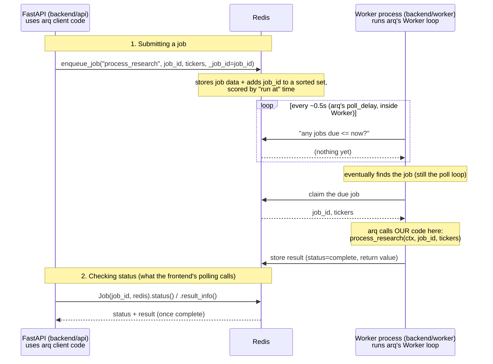
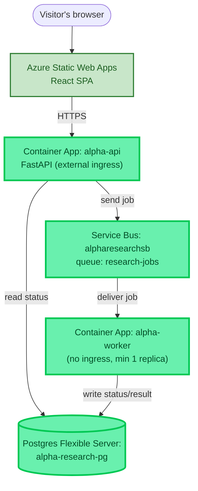

# Chapter 2 — The Backend Skeleton

## The Lying Stops

Chapter 1 ended with a real, live URL — serving a completely fake app. Typing a ticker and hitting submit did nothing but wait two seconds and print a made-up sentence. That was deliberate: it proved the frontend's shape (`idle → loading → done`) without needing anything real behind it.

Phase 2's job was to replace every part of that lie with something real, one piece at a time: a real API to receive the request, a real queue so the request doesn't get lost or block anything, a real worker to do the (still-fake) research work, and a real database to remember what happened — deployed and checked live in the browser before moving on, same discipline as Chapter 1.

## Choosing the Backend Stack

**Python, via FastAPI.** The realistic alternatives were Node/Express (same language as the frontend, one less context switch) and Django (batteries-included, but heavier than a single-purpose API needs). FastAPI won for a specific reason beyond popularity: it generates a live, interactive API doc (`/docs`) directly from Python type hints — genuinely useful for testing each endpoint by hand before the frontend or a queue even exists. Python was also the natural choice looking ahead — the agent/LLM ecosystem (LangGraph, MCP SDKs, most model SDKs) is Python-first, and this project's backend was always going to need that eventually.

**`uv`, not pip/venv.** A single tool for creating the environment, managing dependencies, and running the project (`uv run ...`) — faster than the traditional pip+venv combination, and one fewer thing to explain to a beginner than juggling `requirements.txt`, `venv activate`, and separate installs. `uv init` scaffolds a `pyproject.toml` (Python's rough equivalent of `package.json`); `uv add <package>` installs a dependency and records it, inside its own isolated `.venv` so nothing clashes with whatever else is installed on the machine; `uv run <command>` runs something inside that isolated environment without a separate manual "activate" step first.

It's worth being precise about a layer that's easy to blur together: **FastAPI and Uvicorn are not the same kind of thing.** FastAPI is a library for *defining* endpoints — routes, request/response shapes, validation — but it doesn't run a server itself. Uvicorn is the actual process that runs FastAPI's code and listens for real network connections, the same relationship React has with a browser: React describes what should happen, but something else (the browser) actually executes it. `@app.get("/")` is a decorator — plain-language, "when a GET request hits `/`, run this function and return whatever it returns."

`/docs` is one of FastAPI's more genuinely useful features, worth calling out directly: it auto-generates a live, interactive API documentation page (an OpenAPI spec) purely from the type hints already written in the code — no separate documentation effort. This was used constantly through this phase to test each endpoint by hand before a queue or frontend even existed.

> 🏭 **Production Lens:** `/docs`/OpenAPI isn't a toy convenience — real teams use it directly, often to auto-generate client SDKs or feed API gateways from the same spec. Nothing simplified here; this is exactly what a production FastAPI service would also lean on.

**Postgres for durable state.** The one piece of information that must never be lost is "what did this job actually decide/find" — that belongs in a real relational database, not disposable in-memory state.

**A queue in between the API and the worker.** This was the least obvious piece, and worth explaining properly.

## Why a Queue At All?

Without a queue, the API would have to call the (eventually slow, LLM-driven) research work directly and wait for it — meaning a visitor's browser sits there for however long real research takes, and if the API process restarts mid-request, the work is just gone.

A queue is, at its core, the same idea as a Python `list` used as a waiting line — `list.append()` to add work, something else `list.pop()`s it off later — except durable (survives a restart) and shared across separate processes/machines instead of living in one process's memory. The API's whole job on `POST /research` becomes: write "here's a job" onto the queue and immediately tell the browser "got it, check back later." A separate worker process — which can be scaled independently, added, or restarted without touching the API at all — picks jobs off the queue whenever it's free.

**First pass: `arq` + local Redis.** `arq` is a small Python library that turns a Redis instance into a job queue with almost no setup: define an async function, point `arq`'s CLI at it, and Redis handles the waiting-line mechanics underneath. Real, working, and fast to prove locally — exactly what a fake-to-real first pass needs.

```python
# backend/worker/worker.py — first version, arq
async def process_research(ctx, job_id: str, tickers: list[str]):
    print(f"Processing job {job_id} for {tickers}...")
    await asyncio.sleep(3)  # fake delay — stands in for real agent work, later phases
    ...
```

It's worth being precise about what Redis and `arq` each actually are here, since "queue" can sound like one single thing when it's really two layers. Redis on its own is just a very fast in-memory data store — it has no built-in notion of "a job" at all. `arq` is the convention layered on top that decides how "run function X with these arguments" gets stored as data, and provides the enqueue/dequeue logic so neither side has to hand-roll it.

**The actual delivery mechanism is polling, not a push notification** — easy to assume otherwise, worth being exact about. `enqueue_job` stores the job's data at a Redis key and adds its ID into a Redis *sorted set*, scored by the time it's due to run (almost always "now," for this project — that scoring is also what gives `arq` its delayed/cron-job support for free). The worker loop's job is simply asking Redis, on a short fixed interval, "give me everything due right now" — and if nothing's due, it waits roughly half a second and asks again. Redis does have genuinely push-capable primitives (`BLPOP`, Pub/Sub), but they only offer strict FIFO delivery, which can't express "only what's actually due yet" — the sorted-set-plus-poll design trades a true instant push for that scheduling flexibility. In practice, sub-second polling is indistinguishable from instant for anything but very fast tasks.



`arq` isn't a third running process here — it doesn't get its own lane in that diagram. It's a Python library, loaded inside *both* the API process (as a client: enqueue + status-check) and the worker process (as the actual poll-loop engine) — the same library playing two different roles depending on who's importing it. The API and worker also never talk to each other directly; every arrow in that diagram touches Redis, never crosses API↔worker — which is the actual decoupling benefit of a queue: neither process needs to know the other exists, when it started, or where it's running.

Two more mechanical details that mattered once real code needed them: `WorkerSettings.functions = [process_research]` acts as an *allow-list*, read externally by `arq`'s own CLI (`getattr(module, "WorkerSettings")` — a plain lookup by name, not a function call) — a job requesting any function name not on that list gets rejected. And `_job_id=job_id` on `enqueue_job` forces `arq` to use our own generated ID instead of assigning a random one, which is what lets the ID returned to the original API caller be looked up again later via `Job(job_id, redis)`.

**Second pass: real Azure Service Bus.** `arq` riding on Redis is fine locally, but Redis-as-a-queue isn't what a production Azure deployment would reach for — Azure Service Bus is a managed queue service built for exactly this job, with real delivery guarantees (a message that isn't explicitly acknowledged gets automatically redelivered, rather than just vanishing if a worker crashes mid-task). Since this project deploys as it goes, the migration happened here in Phase 2 rather than being deferred:

```python
# backend/worker/worker.py — after migrating to Service Bus
async def main():
    client = ServiceBusClient.from_connection_string(SERVICEBUS_CONNECTION_STRING)
    async with client:
        async with client.get_queue_receiver(queue_name=SERVICEBUS_QUEUE_NAME) as receiver:
            print("Worker started, waiting for messages...")
            async for msg in receiver:
                data = json.loads(str(msg))
                await process_research(data["job_id"], data["tickers"])
                await receiver.complete_message(msg)  # acknowledge — without this, Service Bus redelivers it
```

Service Bus has no equivalent of `arq`'s "call this named Python function automatically" convenience — a message is just plain JSON we invented ourselves (`{"job_id", "tickers"}`), and the loop reading it is now fully visible in our own code rather than hidden inside a library. `receiver.complete_message(msg)` is the acknowledgment — Service Bus holds a message as "in flight" for a lock duration (1 minute here) after handing it out, and redelivers it automatically if nothing confirms it got done, which is exactly the durability a bare Redis list doesn't give you for free.

Access to the queue was also split by least privilege rather than shared as one all-powerful key: two separate SAS (Shared Access Signature) policies were created on the `research-jobs` queue — `send-only` for the API, `listen-only` for the worker — instead of handing both services the full-manage root connection string. Neither service can do more than its actual job requires; the API can't drain the queue, the worker can't send new jobs onto it. Verified the same way every other new piece in this project was proven before being trusted: a throwaway script sent a message, and `az servicebus queue show`'s live message count confirmed it actually landed in the real Azure queue — not just "no exception was thrown."

> 🏭 **Production Lens:** Building the `arq`/Redis version first, then migrating to Service Bus, was a *learning* sequence, not a production one — a real team would likely pick the production queue technology up front rather than build a throwaway version first. It was worth doing here anyway: seeing the same problem solved by a 3-line library call, and then by explicit code with no library doing the acknowledging for you, made *what a queue actually guarantees* concrete rather than assumed.

## The API and the Worker

The API side stayed close to the FastAPI/Pydantic basics from `/docs` testing — a request model that Pydantic validates automatically:

```python
class ResearchRequest(BaseModel):
    tickers: list[str]

@app.post("/research")
async def create_research(request: ResearchRequest):
    job_id = str(uuid.uuid4())
    with Session(engine) as session:
        job = Job(job_id=job_id, tickers=",".join(request.tickers), status="queued")
        session.add(job)
        session.commit()

    message_body = json.dumps({"job_id": job_id, "tickers": request.tickers})
    async with app.state.servicebus_client.get_queue_sender(queue_name=SERVICEBUS_QUEUE_NAME) as sender:
        await sender.send_messages(ServiceBusMessage(message_body))

    return {"job_id": job_id}
```

Two things happen on submit, in order: a row is written to Postgres as `"queued"` (so `GET /research/{job_id}` has something to report immediately), then the same job is handed to Service Bus for the worker to actually process. The worker, on its own separate loop, does the (still-fake) work and updates that same Postgres row to `"running"` then `"done"`:

```python
class Job(SQLModel, table=True):
    id: Optional[int] = Field(default=None, primary_key=True)
    job_id: str = Field(index=True, unique=True)
    tickers: str
    status: str = "queued"
    result: Optional[str] = None
    created_at: datetime.datetime = Field(default_factory=datetime.datetime.utcnow)
```

Postgres, not Service Bus, is the actual *source of truth* here for status — the queue's only job is getting the work to the worker reliably; once picked up, the durable record of what happened lives in the database, which is what the API reads back from on every `GET /research/{job_id}` poll.

## A Silent Bug: Talking to the Wrong Redis

Before any of this reached Docker or Azure, a genuinely sneaky bug surfaced during ordinary local development. The plan was for `arq` to talk to a Redis container (`alpha-redis`) started on the standard port 6379. It never once errored — but it also wasn't actually working correctly, because an unrelated container from a *different* project on the same machine (`infra-redis-1`) already held port 6379. `alpha-redis` had silently failed to bind that port, and the backend had been talking to that other project's Redis instance the entire time, without a single error to signal it.

The only reason it surfaced at all: `docker inspect alpha-redis --format '{{json .NetworkSettings.Ports}}'` showed an empty result, despite `docker run -p 6379:6379 ...` having reported success and `HostConfig.PortBindings` looking entirely correct. `docker start` succeeding, and even `docker ps` showing the container as running, is not proof a port actually bound. Fixed by moving `alpha-redis` to port 6380 instead and passing that port explicitly rather than relying on Redis's default — the same category of lesson as always verifying real behavior rather than trusting a command's exit code, just one layer earlier than the Azure deploy incidents that came later this project.

## Docker, and a Detail That Mattered on Deploy

Both the API and worker got Dockerfiles built on `uv`, multi-layer for build caching (dependencies installed in one layer, app code copied in a separate later layer, so a code-only change doesn't force a full dependency reinstall):

```dockerfile
FROM python:3.14-slim
ENV PYTHONUNBUFFERED=1
COPY --from=ghcr.io/astral-sh/uv:latest /uv /uvx /bin/
WORKDIR /app
COPY pyproject.toml uv.lock ./
RUN uv sync --frozen --no-install-project
COPY . .
RUN uv sync --frozen
CMD ["uv", "run", "python", "worker.py"]
```

`ENV PYTHONUNBUFFERED=1` turned out to matter in a very concrete way: Python buffers `print()` output when it isn't attached to an interactive terminal — exactly the situation inside a container — so without this line, the worker's logs would arrive late and in batches once deployed, rather than immediately as each job was processed. A small line, but the kind of thing you only actually notice once you're staring at a container's live log stream wondering where the output went.

A second real gotcha surfaced pushing images to Azure: this project is built on Apple Silicon (`arm64`), but Azure Container Apps expects `linux/amd64`. The first images built locally were silently the wrong architecture — fixed with `docker build --platform linux/amd64`, a flag that's easy to forget the first time you're deploying from an ARM machine to an x86 cloud.

## Deploying: Container Apps, Service Bus, Postgres

Provisioning used the `az` CLI rather than the Portal wizard this time — with several interconnected resources (registry, queue, database, two container apps sharing an environment), scripting it was more reliable than clicking through several separate wizards. In order: an Azure Container Registry (`alpharesearchacr`) to hold the images, a Service Bus namespace (`alpharesearchsb`) with a `research-jobs` queue, and an Azure Database for PostgreSQL Flexible Server (`alpha-research-pg`) — each provisioned once via a one-time resource-provider registration per subscription (`Microsoft.DBforPostgreSQL`, `Microsoft.App`), a step that only needs doing the first time a given resource type is used on a subscription.

Both container apps landed inside one Container Apps Environment (`alpha-env`) — `alpha-api` with external ingress on port 8000 (so the internet can reach it), `alpha-worker` with **no ingress at all**, since it isn't an HTTP server being called by anything — it just polls Service Bus on its own. The worker also got an explicit `--min-replicas 1`: Container Apps can scale a service down to zero replicas when idle, which is fine for an HTTP app (a request just wakes it back up), but would mean a queue-driven worker never runs again at all if left at its default.

**A real bug, caught by actually testing, not by the deploy succeeding:** the very first end-to-end test against live Azure infrastructure failed with `relation "job" does not exist`. `SQLModel`'s `create_all()` had only ever been run against the local Docker Postgres — the Azure database was a genuinely separate, empty database that needed the same table created in it once, by hand.

> 🏭 **Production Lens:** A real production app runs schema migrations (e.g. via Alembic) as an explicit, versioned step of every deploy — never a manual one-off script run once and forgotten. We used a one-off script here because this project only has one table so far and migrations-as-a-formal-practice is its own thing to learn properly; noted honestly as a gap to revisit if the schema starts changing often enough for a manual step to become risky.

## Wiring the Frontend to the Real Thing

The frontend's fake `setTimeout` block was replaced with real `fetch` calls to the live API, and the hardcoded `localhost:8000` became `import.meta.env.VITE_API_URL` — a Vite environment variable, with `localhost:8000` as the local-dev fallback.

This produced a genuinely confusing failure the first time: setting a value on the Static Web App resource in the Portal did nothing to the already-deployed frontend. The reason is a real Vite mechanic worth understanding, not a fluke — **Vite environment variables are baked into the JavaScript bundle at build time**, not read at runtime the way a server-side app's environment variables would be. By the time the built files exist, `VITE_API_URL` is just a plain string sitting inside them; nothing about the running Static Web App resource can change it after the fact. The actual fix was setting `VITE_API_URL` as a step-level `env:` on the "Build And Deploy" step inside the GitHub Actions workflow file Azure had generated — since that's where `npm run build` genuinely runs.

## Why CORS Had to Be Configured At All

Getting the frontend and API talking to each other also required one small but easy-to-wave-past line: `CORSMiddleware` on the FastAPI app, explicitly allowing the frontend's origin. It's worth understanding *why* a browser needs that permission slip at all, because the reasoning is a real security mechanism, not arbitrary friction.

The concrete risk it defends against: a browser attaches cookies based on *which domain* is being called, not *which page* initiated the call. So if a user is logged into a real site in one tab, and a malicious page happens to be open in another tab, that malicious page's own JavaScript can still call the real site's API — and the browser will still attach the real session cookie to that request, making it look legitimate.

```
mybank.com (Genuine JS)          Browser (CORS Enforcer)              mybank.com API
     |-- 1. fetch(mybank/balance) -->|                                      |
     |                               |-- 2. Request + Cookie -------------->|
     |                               |                                      | (Cookie valid, fetches balance)
     |                               |<- 3. Data: $500, header:              |
     |                               |      Allow-Origin: mybank.com --------|
     |                               | [Initiator=mybank.com == Allow-Origin: PASS]
     |<-- 4. Response ($500) --------|
 (Balance is displayed)

evil.com (Malicious JS)          Browser (CORS Enforcer)              mybank.com API
     |-- 1. fetch(mybank/balance) -->|                                      |
     |                               |-- 2. Request + Cookie -------------->|
     |                               |                                      | (Cookie valid, fetches balance)
     |                               |<- 3. Data: $500, header:              |
     |                               |      Allow-Origin: mybank.com --------|
     |                               | [Initiator=evil.com != Allow-Origin: BLOCK]
     |<-- 4. CORS Error, data discarded --|
  (Cannot read the $500)
```

The request in both cases actually reaches the server — the server has no way to distinguish them at the network level, and the cookie is valid in both. CORS's actual job is narrower than "stops the attack": the browser blocks the malicious page's JavaScript from *reading the response*, unless the server's `Access-Control-Allow-Origin` header explicitly names that origin. (Precision worth keeping: CORS mainly protects response *confidentiality* — stopping the request's side effects from happening at all in the first place is a different, complementary defense, CSRF tokens, not CORS's job.)

This project has no login or sessions yet, so there's nothing genuinely sensitive at stake today — but the browser enforces this unconditionally for every site regardless of whether *this specific app* currently has anything worth protecting, since it has no way to know that in advance. `allow_origins=[ALLOWED_ORIGIN]` was required simply to let the frontend talk to its own backend at all; it becomes genuinely load-bearing once real auth/sessions exist, a later phase's concern.

## Deploy & Verify

With everything live — frontend on Static Web Apps, API and worker on Container Apps, Service Bus and Postgres provisioned — the full path was tested for real: submit real tickers on the live public URL, watch a real job land in Service Bus, watch the real worker process it, watch the real Postgres row update, and see the real (still-stub) result come back through polling. Confirmed by the user directly in the browser, not just via `curl`.

## Azure Components Used This Chapter

- **Azure Container Registry (`alpharesearchacr`)** — private registry holding the built API and worker images, so Container Apps has somewhere to pull from that isn't a public registry. Images pushed via the developer's own Azure AD login (`az acr login`), not a stored username/password.
- **Azure Service Bus (`alpharesearchsb`)** — the real, managed queue. Chosen over continuing with Redis/`arq` because Service Bus gives explicit delivery guarantees (message redelivery on a missed acknowledgment) that a plain Redis list doesn't provide on its own.
- **Azure Database for PostgreSQL Flexible Server (`alpha-research-pg`)** — the durable source of truth for job status and results, reachable first for direct verification via a firewall rule scoped to this machine's IP (full VNet-private access is a later, Phase 7 concern).
- **Azure Container Apps (`alpha-env`, hosting `alpha-api` and `alpha-worker`)** — a managed environment for running containers without provisioning or patching VMs directly; `alpha-api` scales on HTTP traffic, `alpha-worker` runs continuously with a floor of 1 replica since nothing else would trigger it to wake up.

## The Architecture So Far

Grown by four real nodes this chapter — the frontend from Chapter 1 is unchanged, everything else is new.



## What Came Out of This Chapter

- A real distributed round trip: browser → API → queue → worker → database → back to the browser, with each hop independently real and independently deployed.
- A queue built twice on purpose — first the fast, convenient `arq`/Redis version, then real Azure Service Bus — specifically so the difference between "a library hides the durability mechanics" and "you write the acknowledgment loop yourself" became visible rather than assumed.
- Postgres established as the actual source of truth for status, distinct from the queue's narrower job of reliable delivery.
- Three real bugs resolved by testing actual behavior, not by trusting a command's exit code: a silently-misbound local Redis port (talking to the wrong project's Redis without error), an `arm64`/`amd64` image mismatch, and a missing table only the real Azure database was missing.
- The report content itself is still a stub — real data sourcing, and the first taste of tools/MCP/Skills, is Chapter 3.
