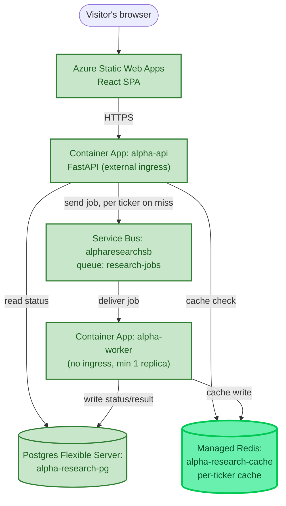

# Chapter 3 — MCP Tools and Real Data

## What Was Still Fake

By the end of Chapter 2, the whole distributed path was real — API, queue, worker, database — except the one thing the app actually exists for: the research itself. Every result was still the same canned sentence, `"{ticker}: looks solid, no major red flags."` Phase 3's job was to make the report say something *true*.

Doing that properly meant answering a question that shapes everything downstream: when should code call something directly, versus hand a model a choice? This chapter's real subject is that distinction — direct calls, tools, and Skills — built out with three concrete, working pieces rather than defined only in the abstract.

## One Redesign First: Fan-Out, Not One Big Job

Before touching real data, a design gap surfaced: the job model treated an entire multi-ticker request as one row, one status. Asked "what happens if AAPL and TSLA are requested together, and only AAPL is already cached?" — the honest answer was: nothing good. A single `status` field couldn't represent "one done, one still working," and there was no way to let the already-known ticker return instantly while the other genuinely ran.

The fix was a real fan-out/fan-in redesign: one `job_id` now spans **many** `TickerJob` rows, one per ticker, each processed and cached completely independently.

```python
class TickerJob(SQLModel, table=True):
    __table_args__ = (UniqueConstraint("job_id", "ticker"),)

    id: Optional[int] = Field(default=None, primary_key=True)
    job_id: str = Field(index=True)      # shared across all tickers in one request — no longer unique alone
    ticker: str = Field(index=True)
    market: str = "US"                    # "US" or "India" — user-selected, not auto-detected
    status: str = "queued"
    result: Optional[str] = None
    created_at: datetime.datetime = Field(default_factory=datetime.datetime.utcnow)
```

On submit, the API checks a per-ticker Redis cache (`research:{market}:{ticker}:{today}`, expiring at midnight) **before** deciding what to do with each ticker individually:

```python
for ticker in request.tickers:
    cache_key = f"research:{request.market}:{ticker}:{today}"
    cached = await app.state.redis.get(cache_key)

    with Session(engine) as session:
        if cached:
            task = TickerJob(job_id=job_id, ticker=ticker, market=request.market, status="done", result=cached)
        else:
            task = TickerJob(job_id=job_id, ticker=ticker, market=request.market, status="queued")
        session.add(task)
        session.commit()

    if not cached:
        message_body = json.dumps({"job_id": job_id, "ticker": ticker, "market": request.market})
        await app.state.servicebus_sender.send_messages(ServiceBusMessage(message_body))
```

A cache hit is marked `"done"` immediately, with zero queue trip. A miss gets its own independent Service Bus message — meaning two tickers requested together are now genuinely processed in parallel, by whatever worker capacity exists, instead of one blocking the other. `GET /research/{job_id}` aggregates all child rows back into the same response shape the frontend already expected, so nothing on the frontend had to change at all.

> 🏭 **Production Lens:** This *is* the production-shaped answer, not a simplification — cache-aside (check cache, fall through to real work on a miss, populate cache after) plus per-unit-of-work fan-out is exactly how a real system would handle "some of this request is already known, some isn't." The one real gap: **`Job`/`TickerJob` is duplicated** between `backend/api/models.py` and `backend/worker/models.py`, because the two are separate `uv` projects with no shared package between them. Logged as known, deliberate debt — a real fix would pull both into a shared workspace package, not urgent at this scale but real.

## Piece 1 — A Direct API Call: Real Stock Data

The most important design decision in this chapter came first, and it's a negative one: **fetching stock data is not a tool the model chooses to call, and not an MCP server.** It's a plain function our own code always calls, deterministically, every time a ticker needs data. There's no judgment involved in "should we fetch AAPL's price" — of course we should, every single time — so routing it through a tool-calling layer would add machinery with no actual benefit.

```python
"""
Direct API call — no MCP, no LLM decision involved. Our own code always calls
this deterministically for any ticker request, so there's no benefit to routing
it through a tool-calling layer.
"""
import yfinance as yf

def fetch_stock_data(ticker: str, market: str) -> dict:
    if market == "US":
        symbols_to_try = [ticker]
    elif market == "India":
        # NSE first, then BSE — picking the right *exchange within* the chosen
        # region is fine; mixing up US vs. India is what we're avoiding.
        symbols_to_try = [f"{ticker}.NS", f"{ticker}.BO"]
    else:
        return {"ticker": ticker, "error": f"unknown market: {market}"}

    for symbol in symbols_to_try:
        info = yf.Ticker(symbol).info
        price = info.get("currentPrice") or info.get("regularMarketPrice")
        if price:
            return {
                "ticker": ticker, "resolved_symbol": symbol, "market": market,
                "price": price, "currency": info.get("currency"),
                "pe_ratio": info.get("trailingPE"), "market_cap": info.get("marketCap"),
                "fifty_two_week_high": info.get("fiftyTwoWeekHigh"),
                "fifty_two_week_low": info.get("fiftyTwoWeekLow"),
            }

    exchanges = "US markets" if market == "US" else "NSE or BSE"
    return {"ticker": ticker, "error": f"{ticker} not found on {exchanges}"}
```

**Market is explicit, never guessed.** An earlier design considered auto-detecting the right region by trying US first, then falling back to India-style suffixes on failure — rejected deliberately in favor of a required, user-chosen `market` field. Auto-fallback would let a genuinely wrong ticker on the wrong exchange silently "succeed" against an unrelated company that happens to share a symbol; an explicit selection fails clearly instead of guessing. The frontend gained a `market` `<select>` next to the ticker input to match, and `ResearchRequest.market: Literal["US", "India"]` lets FastAPI/Pydantic reject anything else with a clean 422 automatically — the same validation pattern already used for ticker format.

`yfinance` itself is worth naming honestly: it's free, but unofficial — it scrapes Yahoo Finance's own site rather than calling a documented, supported API, so there's no SLA and a real risk of breaking or being rate-limited, especially at scale from a shared cloud IP. Acceptable for this project's current stage; flagged for a real second look in a later resilience pass if it becomes a practical problem.

## Piece 2 — A Skill: Rule-Based Risk Flags

A **Skill**, in this project's vocabulary, is a reusable capability module — distinct from a direct call (our code always invokes it) and distinct from a tool (a model decides at runtime whether to invoke it). This first Skill is deliberately, honestly the simplest possible version: pure Python, no LLM anywhere inside it.

```python
def flag_risk_factors(stock_data: dict) -> list[str]:
    """Given tools.stock_data.fetch_stock_data()'s output, return simple rule-based risk flags."""
    flags = []
    price = stock_data.get("price")
    low = stock_data.get("fifty_two_week_low")
    high = stock_data.get("fifty_two_week_high")
    pe = stock_data.get("pe_ratio")

    if price and low and high and high > low:
        position_in_range = (price - low) / (high - low)
        if position_in_range < 0.1:
            flags.append("Price is near its 52-week low")

    if pe is not None:
        if pe < 0:
            flags.append("Negative P/E ratio — company is currently unprofitable")
        elif pe > 40:
            flags.append(f"P/E ratio ({pe:.1f}) is high — richly valued relative to typical norms")

    return flags
```

Two fixed rules: flag a price sitting in the bottom 10% of its 52-week range, and flag an unusually high or negative P/E ratio. Nothing here requires interpretive judgment — it's a lookup and a threshold check — which is exactly the point of building it this way *first*: it proves a Skill doesn't need an LLM to be a legitimate Skill, before Phase 4 builds one that genuinely does need one. Wired directly into the worker's report, with zero external cost per call, unlike the next piece.

## Piece 3 — One MCP Server, One Tool: Web Search

This piece is where "the model decides" actually enters the picture, and it needed its own protocol: **MCP (Model Context Protocol)**. A tool the model might call has to be *described* to it in a structured, discoverable way — MCP standardizes that description and the request/response shape, so a tool server built once can be plugged into any MCP-aware client rather than being wired by hand into one specific app.

```python
"""
A minimal MCP server exposing one tool: web search via Tavily.
"""
import os, pathlib
from dotenv import load_dotenv
from mcp.server.mcpserver import MCPServer
from tavily import TavilyClient

# File-relative, not cwd-relative — the client spawns this as a subprocess and its
# working directory isn't guaranteed to be backend/worker/ where .env.local lives.
load_dotenv(pathlib.Path(__file__).parent.parent / ".env.local")

mcp = MCPServer("search-server")

@mcp.tool()
def search(query: str, max_results: int = 5) -> list[dict]:
    """Search the web and return a list of {title, content, url} results."""
    api_key = os.environ.get("TAVILY_API_KEY", "")
    if not api_key:
        raise EnvironmentError("TAVILY_API_KEY not set")
    response = TavilyClient(api_key=api_key).search(query=query, max_results=max_results, include_answer=False)
    return [{"title": r.get("title", ""), "content": r.get("content", ""), "url": r.get("url", "")}
            for r in response.get("results", [])]

if __name__ == "__main__":
    mcp.run()
```

The server runs over **stdio transport** — spawned as a subprocess by whatever needs it, communicating over its own stdin/stdout rather than an HTTP port. That fits this stage of the project exactly: nothing else needs to reach this server independently yet, so a subprocess is simpler than standing up and securing a whole separate HTTP service. (Graduating to its own always-running Container App over HTTP is a deliberate later step, once more than one caller genuinely needs it.)

Proving it worked used the same "isolate it, prove it standalone, then integrate" discipline used for `arq` and Service Bus earlier — and, deliberately, spent as little of a real, limited resource as possible doing so:

```python
tools = await session.list_tools()            # no Tavily call — protocol-level only
print("Tools discovered:", [t.name for t in tools.tools])

result = await session.call_tool(              # the one real Tavily call
    "search", {"query": "Apple Inc Q4 2026 earnings", "max_results": 3}
)
```

`list_tools()` is a protocol handshake — the client asks the server "what can you do," the server responds with its tool schemas, no external API touched. Only `call_tool("search", ...)` actually spends a real Tavily search. With a hard budget of 1,000 searches a month across every remaining phase of this project, that distinction mattered enough to test deliberately in that order.

A second, reusable wrapper was then written into the worker's own codebase — proving the same pattern works from `backend/worker/`'s real project root, not just an isolated test script:

```python
async def search_via_mcp(query: str, max_results: int = 5) -> list[dict]:
    async with stdio_client(_SERVER_PARAMS) as (read, write):
        async with ClientSession(read, write) as session:
            await session.initialize()
            result = await session.call_tool("search", {"query": query, "max_results": max_results})
            return [block.text for block in result.content if hasattr(block, "text")]
```

**Deliberately not called anywhere in the automatic flow yet.** Wiring this into `process_ticker` would fire a real Tavily search on every single ticker in every request — burning the limited budget for no real benefit until there's an actual model in the loop capable of deciding *when* a search is genuinely worth making. That decision is exactly what Phase 4 exists to add.

## Putting Real Data Into the Worker

With all three pieces built, `process_ticker` composes the direct call and the Skill into a real report line:

```python
data = fetch_stock_data(ticker, market)

if "error" in data:
    summary_line = data["error"]
else:
    summary_line = (
        f"{ticker}: {data['currency']} {data['price']}, "
        f"P/E {data['pe_ratio']}, 52w range {data['fifty_two_week_low']}-{data['fifty_two_week_high']}"
    )
    flags = flag_risk_factors(data)
    if flags:
        summary_line += " | Risk flags: " + "; ".join(flags)
```

Verified locally with real numbers on both markets — real AAPL pricing, real RELIANCE pricing via the `.NS` suffix, and the deliberately-wrong-region case (RELIANCE requested as `"US"`) cleanly returning `"RELIANCE not found on US markets"` instead of silently guessing or crashing.

## An Incident on Deploy: The Stale `:latest` Tag

Rebuilding and redeploying both images, the normal command was run:

```bash
az containerapp update --image alpharesearchacr.azurecr.io/alpha-worker:latest ...
```

It reported success. But for **three days**, both container apps kept silently running their old Phase-2-era code — caught only because a live test returned the old canned stub text instead of real data, not because any command signaled a problem. The root cause: Azure Container Apps doesn't reliably detect that a mutable `:latest` tag's underlying *image content* changed when the *reference string* itself never changes — from the platform's point of view, `"...:latest"` today looks identical to `"...:latest"` three days ago, even though what it points to is completely different.

The fix, now a standing practice for every future deploy: pass `--revision-suffix <unique value>` to force a genuinely new revision, then explicitly confirm via `az containerapp revision list` that a new revision with a recent timestamp exists and the old one's replica count has dropped to zero — and, most importantly, confirm the *actual behavior* changed, not just that the deploy command returned success.

> 🏭 **Production Lens:** A real production pipeline tags images with something content-derived — a git SHA or build number — specifically so this class of bug can't happen: the tag itself changes whenever the content does, so there's nothing for the platform to guess about. `:latest` is a convenience shortcut that trades that safety away; worth knowing exactly what you're giving up when you reach for it.

Re-verified live after the fix: real NVDA data with no false risk flag (correctly, since its P/E doesn't cross the threshold) and real TSLA data with the flag correctly present.

## Azure Components Used This Chapter

No brand-new Azure resource type this chapter — the real infrastructure work was **Azure Managed Redis** (`alpha-research-cache`), provisioned for the per-ticker caching layer. Worth noting as a live gotcha: classic Azure Cache for Redis is being retired, so this used the newer `az redisenterprise` command set instead — a different port (10000, not the traditional 6379) and TLS + access-key authentication that must be explicitly enabled, since newer defaults ship more locked-down than the classic service did.

## The Architecture So Far

One new node — Redis, sitting as a cache in front of the worker's real work — plus the fan-out redesign, which changes what flows through the existing boxes without adding new ones.



## What Came Out of This Chapter

- Real stock data, for real tickers, in two real markets — via one deliberately simple direct API call, with market chosen explicitly rather than guessed.
- A working three-way distinction, each with a real working example: **direct call** (`fetch_stock_data`, our code always calls it), **Skill** (`flag_risk_factors`, reusable, no LLM required), and **MCP tool** (`search`, discoverable, meant for a model to decide when to use it).
- A genuine fan-out/fan-in redesign — one request can now contain a cache hit and a cache miss side by side, each handled correctly and independently.
- A real production incident (the stale `:latest` deploy) caught by verifying actual behavior, not a green checkmark — and a new standing deploy discipline as a direct result.
- The MCP search tool exists, works, and is proven from the worker's real codebase — but is deliberately not yet part of the automatic flow. Making that call *for real*, based on a model's own judgment, is where Chapter 4 picks up.
