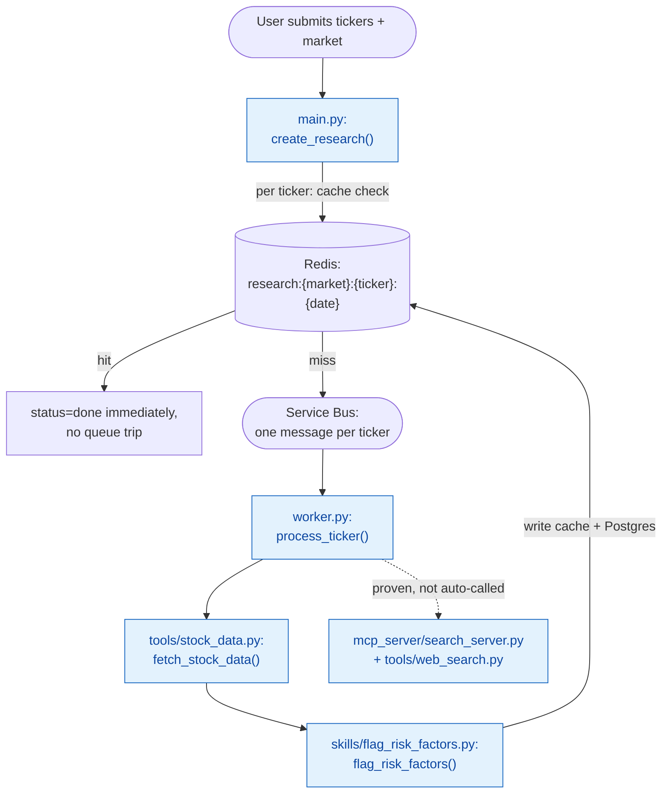

# Chapter 3 — MCP Tools and Real Data

## What Was Still Fake

By the end of Chapter 2, the whole distributed path was real — API, queue, worker, database — except the one thing the app actually exists for: the research itself. Every result was still the same canned sentence, `"{ticker}: looks solid, no major red flags."` Phase 3's job was to make the report say something *true*.

Doing that properly meant answering a question that shapes everything downstream: when should code call something directly, versus hand a model a choice? This chapter's real subject is that distinction — direct calls, tools, and Skills — built out with three concrete, working pieces rather than defined only in the abstract.

## Learning From a Prior Project, Before Building

Before writing new code, a prior related project at a different local path — an earlier agentic stock-analysis tool — was deliberately assessed for reuse. It already used LangGraph for real multi-agent orchestration, `yfinance` for stock data, Tavily plus DuckDuckGo/Playwright fallbacks for search, and BeautifulSoup scraping for India-specific sources — genuinely relevant prior art, not a cold start. It used no MCP at all, confirmed by a full read of its codebase.

The honest assessment: reuse the *patterns and the genuinely working pieces*, not the surrounding scaffolding. Its Tavily→DuckDuckGo→Playwright search fallback chain and its LLM-JSON-cleanup helpers were portable ideas worth carrying forward conceptually. Its India-specific scrapers (Trendlyne, NSE, AmbitionBox) were not reused as-is — useful reference only if `yfinance`'s Indian market data ever proves too thin on its own. Its synchronous Flask app with local file-based caching and run-storage was superseded entirely by this project's own Postgres/Redis/Service Bus architecture, already a generation ahead of what that pattern offered. And its real multi-agent LangGraph orchestration was deliberately *not* pulled forward into this phase — building multiple real agents needs multiple real agents to exist first, which is Phase 4's job, not Phase 3's; force-fitting it now would have been the actual shortcut, not skipping it.

## One Redesign First: Fan-Out, Not One Big Job

Before touching real data, a design gap surfaced: the job model treated an entire multi-ticker request as one row, one status. Asked "what happens if AAPL and TSLA are requested together, and only AAPL is already cached?" — the honest answer was: nothing good. A single `status` field couldn't represent "one done, one still working," and there was no way to let the already-known ticker return instantly while the other genuinely ran.

The fix was a real fan-out/fan-in redesign: one `job_id` now spans **many** `TickerJob` rows, one per ticker, each processed and cached completely independently.

```python
class TickerJob(SQLModel, table=True):
    __table_args__ = (UniqueConstraint("job_id", "ticker"),)

    id: Optional[int] = Field(default=None, primary_key=True)
    job_id: str = Field(index=True)      # shared across all tickers in one request — no longer unique alone
    ticker: str = Field(index=True)
    market: str = "US"                    # "US" or "India" — user-selected, not auto-detected
    status: str = "queued"
    result: Optional[str] = None
    created_at: datetime.datetime = Field(default_factory=datetime.datetime.utcnow)
```

On submit, the API checks a per-ticker Redis cache (`research:{market}:{ticker}:{today}`, expiring at midnight) **before** deciding what to do with each ticker individually:

```python
for ticker in request.tickers:
    cache_key = f"research:{request.market}:{ticker}:{today}"
    cached = await app.state.redis.get(cache_key)

    with Session(engine) as session:
        if cached:
            task = TickerJob(job_id=job_id, ticker=ticker, market=request.market, status="done", result=cached)
        else:
            task = TickerJob(job_id=job_id, ticker=ticker, market=request.market, status="queued")
        session.add(task)
        session.commit()

    if not cached:
        message_body = json.dumps({"job_id": job_id, "ticker": ticker, "market": request.market})
        await app.state.servicebus_sender.send_messages(ServiceBusMessage(message_body))
```

A cache hit is marked `"done"` immediately, with zero queue trip. A miss gets its own independent Service Bus message — meaning two tickers requested together are now genuinely processed in parallel, by whatever worker capacity exists, instead of one blocking the other. `GET /research/{job_id}` aggregates all child rows back into the same response shape the frontend already expected, so nothing on the frontend had to change at all.

> 🏭 **Production Lens:** This *is* the production-shaped answer, not a simplification — cache-aside (check cache, fall through to real work on a miss, populate cache after) plus per-unit-of-work fan-out is exactly how a real system would handle "some of this request is already known, some isn't." The one real gap: **`Job`/`TickerJob` is duplicated** between `backend/api/models.py` and `backend/worker/models.py`, because the two are separate `uv` projects with no shared package between them. Logged as known, deliberate debt — a real fix would pull both into a shared workspace package, not urgent at this scale but real.

**A real finding surfaced testing this, still open.** Two independently-sent, freshly-cache-missed tickers, sent moments apart to an actively-listening worker, showed inconsistent delivery latency — one typically processed within a few seconds, the other sometimes took 30–45+ seconds. The obvious first fix (reusing one persistent Service Bus sender instead of opening a new connection per message, in case AMQP link setup was the overhead) didn't resolve it, and the root cause remains genuinely unexplained. Nothing was ever lost — every message eventually arrived and processed correctly — and it wasn't blocking, since the frontend's polling design already tolerates arbitrary delay gracefully (a case of being "resilient by accident," from a design decision made for unrelated reasons). Worth a proper look during a later resilience pass if it recurs or starts mattering more once real agent work — slower than a stub — replaces the current placeholder-fast processing.

## Piece 1 — A Direct API Call: Real Stock Data

The most important design decision in this chapter came first, and it's a negative one: **fetching stock data is not a tool the model chooses to call, and not an MCP server.** It's a plain function our own code always calls, deterministically, every time a ticker needs data. There's no judgment involved in "should we fetch AAPL's price" — of course we should, every single time — so routing it through a tool-calling layer would add machinery with no actual benefit.

```python
"""
Direct API call — no MCP, no LLM decision involved. Our own code always calls
this deterministically for any ticker request, so there's no benefit to routing
it through a tool-calling layer.
"""
import yfinance as yf

def fetch_stock_data(ticker: str, market: str) -> dict:
    if market == "US":
        symbols_to_try = [ticker]
    elif market == "India":
        # NSE first, then BSE — picking the right *exchange within* the chosen
        # region is fine; mixing up US vs. India is what we're avoiding.
        symbols_to_try = [f"{ticker}.NS", f"{ticker}.BO"]
    else:
        return {"ticker": ticker, "error": f"unknown market: {market}"}

    for symbol in symbols_to_try:
        info = yf.Ticker(symbol).info
        price = info.get("currentPrice") or info.get("regularMarketPrice")
        if price:
            return {
                "ticker": ticker, "resolved_symbol": symbol, "market": market,
                "price": price, "currency": info.get("currency"),
                "pe_ratio": info.get("trailingPE"), "market_cap": info.get("marketCap"),
                "fifty_two_week_high": info.get("fiftyTwoWeekHigh"),
                "fifty_two_week_low": info.get("fiftyTwoWeekLow"),
            }

    exchanges = "US markets" if market == "US" else "NSE or BSE"
    return {"ticker": ticker, "error": f"{ticker} not found on {exchanges}"}
```

**Market is explicit, never guessed.** An earlier design considered auto-detecting the right region by trying US first, then falling back to India-style suffixes on failure — rejected deliberately in favor of a required, user-chosen `market` field. Auto-fallback would let a genuinely wrong ticker on the wrong exchange silently "succeed" against an unrelated company that happens to share a symbol; an explicit selection fails clearly instead of guessing. The frontend gained a `market` `<select>` next to the ticker input to match, and `ResearchRequest.market: Literal["US", "India"]` lets FastAPI/Pydantic reject anything else with a clean 422 automatically — the same validation pattern already used for ticker format.

`yfinance` itself is worth naming honestly: it's free, but unofficial — it scrapes Yahoo Finance's own site rather than calling a documented, supported API, so there's no SLA and a real risk of breaking or being rate-limited, especially at scale from a shared cloud IP. Acceptable for this project's current stage; flagged for a real second look in a later resilience pass if it becomes a practical problem.

## Piece 2 — A Skill: Rule-Based Risk Flags

A **Skill**, in this project's vocabulary, is a reusable capability module — distinct from a direct call (our code always invokes it) and distinct from a tool (a model decides at runtime whether to invoke it). This first Skill is deliberately, honestly the simplest possible version: pure Python, no LLM anywhere inside it.

```python
def flag_risk_factors(stock_data: dict) -> list[str]:
    """Given tools.stock_data.fetch_stock_data()'s output, return simple rule-based risk flags."""
    flags = []
    price = stock_data.get("price")
    low = stock_data.get("fifty_two_week_low")
    high = stock_data.get("fifty_two_week_high")
    pe = stock_data.get("pe_ratio")

    if price and low and high and high > low:
        position_in_range = (price - low) / (high - low)
        if position_in_range < 0.1:
            flags.append("Price is near its 52-week low")

    if pe is not None:
        if pe < 0:
            flags.append("Negative P/E ratio — company is currently unprofitable")
        elif pe > 40:
            flags.append(f"P/E ratio ({pe:.1f}) is high — richly valued relative to typical norms")

    return flags
```

Two fixed rules, worth reading closely since the details are what make it defensible rather than arbitrary. `flags = []` is a plain accumulator — build up a result by appending as issues are found, the same shape as building a summary list with `.map()` on the frontend, just written imperatively here instead of functionally. `.get("price")` rather than `["price"]` is a deliberate defensive choice: it returns `None` on a missing key instead of raising, which matters because `fetch_stock_data`'s output isn't guaranteed to have every field for every ticker — some stocks genuinely lack P/E data on Yahoo Finance. The 52-week-low check, `(price - low) / (high - low)`, computes *where in the yearly range the current price actually sits*, as a fraction from 0 (exactly at the low) to 1 (exactly at the high) — below `0.1` is flagged as "near its low"; the `high > low` guard exists purely to avoid a divide-by-zero on bad data. The P/E check treats negative and very-high P/E as two distinct concerns: negative means the company is currently losing money outright, while a very high positive P/E (the threshold here, `40`, is reasonable but genuinely somewhat arbitrary) means the stock is priced on the expectation of a lot of future growth — riskier specifically if that growth doesn't show up.

Flag a price sitting in the bottom 10% of its 52-week range, flag an unusually high or negative P/E — nothing here requires interpretive judgment, only a lookup and a threshold check, which is exactly the point of building it this way *first*. It proves a Skill doesn't need an LLM to be a legitimate Skill, before Phase 4 builds one that genuinely does. Wired directly into the worker's report, with zero external cost per call, unlike the next piece.

**One caveat worth stating precisely, since it sets up what Phase 4 actually still owes.** This *is* a Skill in this project's own vocabulary — a named, reusable, self-contained unit of capability logic that a different agent could load later, independent of how it happens to be invoked here. What it is *not* is the fuller "Claude Skills" meaning that made the concept notable in the first place: an LLM *discovering* a packaged capability and *choosing*, using real judgment, whether and how to apply it. This one has no genuine ambiguity for an LLM to add value on — fixed numeric thresholds, always run, never optional. A true LLM-discoverable Skill, with real interpretive judgment involved, is a deliberate, explicit commitment for Phase 4 — not something this one gets to retroactively count as.

## Piece 3 — One MCP Server, One Tool: Web Search

This piece is where "the model decides" actually enters the picture, and it needed its own protocol: **MCP (Model Context Protocol)**. A tool the model might call has to be *described* to it in a structured, discoverable way — MCP standardizes that description and the request/response shape, so a tool server built once can be plugged into any MCP-aware client rather than being wired by hand into one specific app.

```python
"""
A minimal MCP server exposing one tool: web search via Tavily.
"""
import os, pathlib
from dotenv import load_dotenv
from mcp.server.mcpserver import MCPServer
from tavily import TavilyClient

# File-relative, not cwd-relative — the client spawns this as a subprocess and its
# working directory isn't guaranteed to be backend/worker/ where .env.local lives.
load_dotenv(pathlib.Path(__file__).parent.parent / ".env.local")

mcp = MCPServer("search-server")

@mcp.tool()
def search(query: str, max_results: int = 5) -> list[dict]:
    """Search the web and return a list of {title, content, url} results."""
    api_key = os.environ.get("TAVILY_API_KEY", "")
    if not api_key:
        raise EnvironmentError("TAVILY_API_KEY not set")
    response = TavilyClient(api_key=api_key).search(query=query, max_results=max_results, include_answer=False)
    return [{"title": r.get("title", ""), "content": r.get("content", ""), "url": r.get("url", "")}
            for r in response.get("results", [])]

if __name__ == "__main__":
    mcp.run()
```

Building even this small a server hit two real gotchas worth naming, since both are the kind of thing that costs real debugging time the first time and is invisible afterward. First: the installed `mcp` SDK has no `mcp.server.fastmcp.FastMCP` at all — that's the class name used in older docs and tutorials. The current path is `mcp.server.mcpserver.MCPServer`, same decorator-based API otherwise (`.tool()`, `.run()`), with no backward-compatible alias to fall back on. Second: the `load_dotenv(...)` call needed a **file-relative** path, not a bare relative one — `pathlib.Path(__file__).parent.parent / ".env.local"` rather than just `".env.local"`. The reason is specific to how this server actually runs: it gets spawned as a subprocess by whatever client needs it, and that subprocess's working directory isn't guaranteed to match wherever the client happens to be run from. A bare relative path would resolve against *that* directory, not against `backend/worker/` where the real `.env.local` lives — silently finding nothing rather than erroring clearly.

The server runs over **stdio transport** — spawned as a subprocess by whatever needs it, communicating over its own stdin/stdout rather than an HTTP port. That fits this stage of the project exactly: nothing else needs to reach this server independently yet, so a subprocess is simpler than standing up and securing a whole separate HTTP service. (Graduating to its own always-running Container App over HTTP is a deliberate later step, once more than one caller genuinely needs it.)

Proving it worked used the same "isolate it, prove it standalone, then integrate" discipline used for `arq` and Service Bus earlier — and, deliberately, spent as little of a real, limited resource as possible doing so:

```python
tools = await session.list_tools()            # no Tavily call — protocol-level only
print("Tools discovered:", [t.name for t in tools.tools])

result = await session.call_tool(              # the one real Tavily call
    "search", {"query": "Apple Inc Q4 2026 earnings", "max_results": 3}
)
```

`list_tools()` is a protocol handshake — the client asks the server "what can you do," the server responds with its tool schemas, no external API touched. Only `call_tool("search", ...)` actually spends a real Tavily search. With a hard budget of 1,000 searches a month across every remaining phase of this project, that distinction mattered enough to test deliberately in that order.

A second, reusable wrapper was then written into the worker's own codebase — proving the same pattern works from `backend/worker/`'s real project root, not just an isolated test script:

```python
async def search_via_mcp(query: str, max_results: int = 5) -> list[dict]:
    async with stdio_client(_SERVER_PARAMS) as (read, write):
        async with ClientSession(read, write) as session:
            await session.initialize()
            result = await session.call_tool("search", {"query": query, "max_results": max_results})
            return [block.text for block in result.content if hasattr(block, "text")]
```

**Deliberately not called anywhere in the automatic flow yet.** Wiring this into `process_ticker` would fire a real Tavily search on every single ticker in every request — burning the limited budget for no real benefit until there's an actual model in the loop capable of deciding *when* a search is genuinely worth making. That decision is exactly what Phase 4 exists to add.

### Understanding MCP: Registration, Discovery, and Where the Model Actually Fits

A few mechanics here are easy to get subtly wrong, and worth being precise about since Phase 4 builds directly on top of them.

**"Registration" is actually two different things, easy to conflate.** Inside the server, `@mcp.tool()` just appends the function into that `MCPServer` instance's own in-memory list — nothing external is contacted, nothing is published anywhere. The *client* finding out what a given server can do is a completely separate step — `list_tools()`, over an actual live connection. There's no global MCP directory that servers auto-publish into; a client has to be explicitly told how to reach a specific server. `StdioServerParameters(command="uv", args=["run", "python", "search_server.py"], cwd=_SERVER_DIR)` *is* that explicit wiring — without it, the client has no idea this server exists at all.

**The handshake (`initialize()`) negotiates compatibility before anything else can happen** — the client sends its protocol version, capabilities, and identity; the server responds with its own; the client sends back `initialized` to confirm. It's the same negotiate-capabilities-first shape as a TLS handshake, just one layer up the stack, for a different purpose.

**The LLM never speaks MCP directly — this is the part most commonly misunderstood.** MCP is a protocol between *application code* and a tool-providing server; the model itself is never a party to it. The real flow: the app calls `list_tools()` and gets back MCP-shaped schemas, then the app *translates* those into whatever tool-calling format the specific LLM provider expects (Anthropic's and OpenAI's shapes differ) and includes that translated list alongside the prompt. The model's response can include a structured "call tool X" request; the app intercepts that and only *then* calls the real `call_tool()`; the app feeds the real result back to the model as a new message. MCP standardizes discovery and execution — it does not change how the model itself is invoked, and that translation step is always the application's own job, never something MCP does automatically. This whole loop, once a real model is actually deciding, is Phase 4's subject; this chapter only proved the plumbing underneath it, with no model in the loop yet.

Worth naming for completeness, even though it's not exercised by this project's one simple tool: MCP servers can also make requests back *to the client* — asking a human to approve something (`elicitation/create`), for instance. Unlike tool names, these client-side capabilities aren't dynamically discovered; they're a small, fixed, spec-defined vocabulary every implementation already knows in advance, negotiated during the handshake as a yes/no checklist rather than a custom listing. Handling one of these on the client side uses a **dispatcher/callback** pattern: a dispatcher routes an incoming fixed-name request to whichever callback function the application registered in advance for that category — conceptually the same shape Chapter 4's tool-name registry ends up using, one layer further out.

## Putting Real Data Into the Worker

With all three pieces built, `process_ticker` composes the direct call and the Skill into a real report line:

```python
data = fetch_stock_data(ticker, market)

if "error" in data:
    summary_line = data["error"]
else:
    summary_line = (
        f"{ticker}: {data['currency']} {data['price']}, "
        f"P/E {data['pe_ratio']}, 52w range {data['fifty_two_week_low']}-{data['fifty_two_week_high']}"
    )
    flags = flag_risk_factors(data)
    if flags:
        summary_line += " | Risk flags: " + "; ".join(flags)
```

Verified locally with real numbers on both markets — real AAPL pricing, real RELIANCE pricing via the `.NS` suffix, and the deliberately-wrong-region case (RELIANCE requested as `"US"`) cleanly returning `"RELIANCE not found on US markets"` instead of silently guessing or crashing.

## A Debugging Detour: "Stuck on Analyzing..."

Testing this in the browser with real tickers produced a genuinely alarming moment: submitting a request and watching the page sit on "Analyzing..." indefinitely, no error, no result, nothing. The eventual cause was mundane — a fresh terminal session simply didn't have the API and worker running on port 8000, so every request the frontend made was silently going nowhere.

Not a code bug, but it exposed a real, worth-fixing gap that *was* a bug: the frontend's `fetch` calls had no error handling at all. An unreachable backend, or a job that got stuck for a genuine reason, just hung forever with zero feedback to the person waiting. Fixed properly rather than dismissed as a one-off fluke: `handleSubmit` and the polling function were both wrapped in try/catch, any non-2xx response is now treated as a real error, an `{"error": ...}` body coming back from `GET /research/{job_id}` now actually surfaces to the user instead of being silently ignored, and polling gives up after 2 minutes. That timeout is deliberately generous — real Service Bus delivery can genuinely take up to roughly a minute under the latency quirk noted above — so it exists to catch a truly dead backend, not to interrupt ordinary slowness.

> 🏭 **Production Lens:** "It looked broken, but it was actually just a missing process" is a completely ordinary local-dev experience — the real lesson isn't the missing process, it's that the *symptom* (infinite silent hang) was worse than it needed to be. A production frontend should never be able to hang indefinitely with zero feedback, regardless of what's actually wrong on the backend; this fix is exactly what a real app would want here, not a simplification to revisit later.

## A Basic Intuition for TLS

Redis and Postgres connections in this project both run over TLS once deployed to Azure, which raised a natural question worth answering at a basic level here, even with the full handshake/PKI mechanics deliberately deferred to a dedicated later session.

TLS protects data *in transit*, not at rest — it encrypts data while it's traveling over the network, not once it's sitting in a database or cache. It's also not accurate to say "the SDK encrypts your data": the Redis client, `psycopg`, and the browser's `fetch` all just *request* a TLS connection — the actual encryption work happens transparently, one layer lower, inside the operating system's or language runtime's own TLS library (commonly OpenSSL), invisible to the application code on both ends. A handshake happens first: client and server briefly use public-key cryptography to agree on a temporary shared secret, without ever transmitting that secret anywhere an eavesdropper could intercept it. After that, every byte is encrypted right before it leaves the sender's network stack, and decrypted right after it arrives at the receiver's — application code only ever sees plain data on either side.

One precision worth keeping straight: standard TLS is **one-way** — it verifies the *server's* identity, via its certificate, a certificate authority's signature, a hostname match, and proof it holds the matching private key. It does **not** verify the *client's* identity; that's a separate step layered on top, which in this project is the Redis access key sent only after the TLS tunnel is already established. Mutual TLS, where both sides present certificates, exists as a real pattern but isn't what's used here.

*(The deeper mechanics — certificate chains, exactly how trust is established between services, and the full handshake sequence — are a deliberately deferred deep-dive, not covered here.)*

## An Incident on Deploy: The Stale `:latest` Tag

Rebuilding and redeploying both images, the normal command was run:

```bash
az containerapp update --image alpharesearchacr.azurecr.io/alpha-worker:latest ...
```

It reported success. But for **three days**, both container apps kept silently running their old Phase-2-era code — caught only because a live test returned the old canned stub text instead of real data, not because any command signaled a problem. The root cause: Azure Container Apps doesn't reliably detect that a mutable `:latest` tag's underlying *image content* changed when the *reference string* itself never changes — from the platform's point of view, `"...:latest"` today looks identical to `"...:latest"` three days ago, even though what it points to is completely different.

The fix, now a standing practice for every future deploy: pass `--revision-suffix <unique value>` to force a genuinely new revision, then explicitly confirm via `az containerapp revision list` that a new revision with a recent timestamp exists and the old one's replica count has dropped to zero — and, most importantly, confirm the *actual behavior* changed, not just that the deploy command returned success.

> 🏭 **Production Lens:** A real production pipeline tags images with something content-derived — a git SHA or build number — specifically so this class of bug can't happen: the tag itself changes whenever the content does, so there's nothing for the platform to guess about. `:latest` is a convenience shortcut that trades that safety away; worth knowing exactly what you're giving up when you reach for it.

Re-verified live after the fix: real NVDA data with no false risk flag (correctly, since its P/E doesn't cross the threshold) and real TSLA data with the flag correctly present.

## Azure Components Used This Chapter

No brand-new Azure resource type this chapter — the real infrastructure work was **Azure Managed Redis** (`alpha-research-cache`), provisioned for the per-ticker caching layer. Worth noting as a live gotcha: classic Azure Cache for Redis is being retired, so this used the newer `az redisenterprise` command set instead — a different port (10000, not the traditional 6379) and TLS + access-key authentication that must be explicitly enabled, since newer defaults ship more locked-down than the classic service did.

## The Architecture So Far

One new node — Redis, sitting as a cache in front of the worker's real work — plus the fan-out redesign, which changes what flows through the existing boxes without adding new ones.


## Key Files From This Chapter

| File | What it does |
|---|---|
| `backend/worker/tools/stock_data.py` | `fetch_stock_data(ticker, market)` — the direct-call yfinance lookup, US/India symbol resolution. |
| `backend/worker/skills/flag_risk_factors/flag_risk_factors.py` | The deterministic Skill — 52-week-low and P/E threshold checks, no LLM. |
| `backend/worker/mcp_server/search_server.py` | The custom MCP server exposing one tool, `search`, wrapping Tavily. |
| `backend/worker/mcp_server/test_client.py` | Isolation test — `list_tools()` (free) + one real `call_tool` (spends real budget, deliberately minimal). |
| `backend/worker/tools/web_search.py` | `search_via_mcp()` — a reusable wrapper proven from the worker's own codebase, deliberately not called by the automatic flow yet. |
| `backend/api/models.py`, `backend/worker/models.py` | `TickerJob` — the fan-out redesign: one row per `(job_id, ticker)`, not one row per whole request. |
| `backend/api/main.py` | Per-ticker Redis cache check before enqueueing; a cache hit skips the queue entirely, a miss gets its own Service Bus message. |
| `backend/worker/worker.py` | `process_ticker()` — one ticker per message now, composes `fetch_stock_data` + `flag_risk_factors` into the report line, writes the Redis cache. |
| `frontend/src/App.jsx` | Market `<select>` added; `fetch`/polling wrapped in try/catch after the "stuck on Analyzing..." incident. |

## The Flow So Far



## What Came Out of This Chapter

- Real stock data, for real tickers, in two real markets — via one deliberately simple direct API call, with market chosen explicitly rather than guessed.
- A working three-way distinction, each with a real working example: **direct call** (`fetch_stock_data`, our code always calls it), **Skill** (`flag_risk_factors`, reusable, no LLM required), and **MCP tool** (`search`, discoverable, meant for a model to decide when to use it).
- A genuine fan-out/fan-in redesign — one request can now contain a cache hit and a cache miss side by side, each handled correctly and independently.
- A real production incident (the stale `:latest` deploy) caught by verifying actual behavior, not a green checkmark — and a new standing deploy discipline as a direct result.
- Two smaller but real gotchas building the MCP server (an SDK rename with no back-compat alias, a subprocess working-directory assumption that silently breaks a relative path), and one genuine frontend gap exposed by a scary-looking but harmless "stuck on Analyzing..." moment — none of them fatal, all of them worth remembering the next time something looks broken but isn't the code that first gets blamed.
- The MCP search tool exists, works, and is proven from the worker's real codebase — but is deliberately not yet part of the automatic flow. Making that call *for real*, based on a model's own judgment, is where Chapter 4 picks up.
