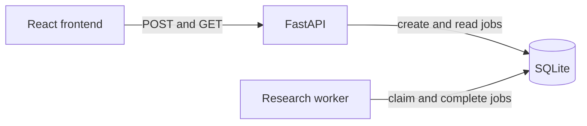
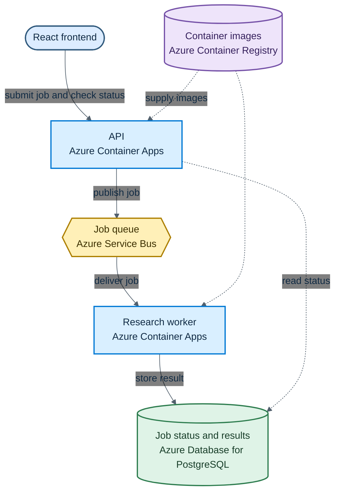

# Chapter 3: Queue, Worker, and Database

In Chapter 2, you moved the Stock Research Assistant's fake delay out of the browser and into a FastAPI service. The browser now submits tickers, receives a server-generated job ID, and checks that ID until the API returns a result. You also added validation, bounded polling, and visible errors.

The API contract is useful, but the implementation still has two important weaknesses. The API keeps every job in a Python dictionary, so restarting the process erases all status and results. It also performs the simulated work itself. Real research will take longer and may fail independently of an HTTP request.

This chapter separates those responsibilities. The API accepts work and records it as `queued`. A worker process claims queued jobs and produces results. We first study the boundary with SQLite, then examine how the finished chapter implementation uses PostgreSQL and Azure Service Bus.

```text
browser -> API -> durable queue -> worker
               \-> job status <-/
```

The result remains sample text. Keeping the work simple lets you see the new process boundary before market-data and model calls add more ways to fail.

> **Chapter snapshot**
> - **Starting point:** `chapter-03-start`, the completed Chapter 2 API with process-local jobs.
> - **Focus in this chapter:** A durable job store, a message queue, and a separate worker process.
> - **Local reference:** `chapter-03-local-complete`, the SQLite implementation used to isolate the process boundary.
> - **Finished repository:** `chapter-03-complete`, which uses PostgreSQL, Azure Service Bus, separate API and worker containers, and Azure Container Registry.
> - **Coming next:** Chapter 4 makes each ticker independent and replaces sample output with real market data.

## What This Chapter Explains

Research no longer happens inside the request that starts it. When a user submits a list of tickers, the API records the request and quickly returns a job ID. The job waits until a worker is available, the worker claims it, and the result is stored for the browser to collect.

That lifecycle introduces three states:

```text
queued -> running -> done
```

`queued` means the request is safely recorded. `running` means a worker owns it. `done` means the result is available. These states let the API answer a simple question at any time: what is happening with this job?

The browser still submits research and checks the returned job ID for progress, so the frontend contract does not change. What changes is ownership behind that contract: the API records and reports work, while the worker performs it.

## Architecture

The queue is not another Python list. It is the set of database rows whose status is `queued`. The API adds rows, and the worker changes one row at a time to `running`.



The database decouples the processes in time. The API can create a job before the worker starts. The worker can finish a job while the API is stopped. Each process only needs the database; neither needs the other's network address.

## Why Move Work Out of the API?

An HTTP request should not have to stay open for the full lifetime of a research job. If research takes a minute, the connection may time out. If the API restarts halfway through, work running inside that process disappears. Slow research also competes with new HTTP requests for the API's resources.

A queue changes the conversation. The API records what needs to happen and returns the job ID. A worker takes the job when it is ready. The two processes do not call each other directly, so they can start, stop, and eventually scale independently.

The database has two roles in this chapter:

| Role | Question it answers |
|---|---|
| Work queue | Which job should a worker claim next? |
| Status store | What should the API tell the browser about this job? |

Using one SQLite table for both roles keeps the new boundary visible and locally reproducible. It is a teaching step, not the final production topology. A later production deployment uses PostgreSQL for durable state and Azure Service Bus for delivery, retries, and dead-lettering.

## The Durable Job Store

The API and worker need one shared way to create, read, claim, and complete jobs. Those database operations sit behind a small `JobStore` class. This keeps SQL out of the HTTP routes and makes the worker easy to test without starting a server.

Each job stores its tickers as JSON text. The result uses the same approach. SQLite stores the text durably, while `JobStore` converts it back to Python lists and dictionaries for the rest of the application.

Here is a sample implementation of how a worker claims the next queued job:

```python
def claim_next_job(self) -> dict[str, Any] | None:
    with self.connect() as connection:
        connection.execute("BEGIN IMMEDIATE")
        row = connection.execute(
            """
            SELECT job_id, tickers
            FROM jobs
            WHERE status = 'queued'
            ORDER BY created_at, rowid
            LIMIT 1
            """
        ).fetchone()

        if row is None:
            return None

        connection.execute(
            "UPDATE jobs SET status = 'running' WHERE job_id = ?",
            (row["job_id"],),
        )

    return {
        "job_id": row["job_id"],
        "tickers": json.loads(row["tickers"]),
    }
```

Selecting a row and changing it to `running` must act as one unit. `BEGIN IMMEDIATE` takes SQLite's write lock before the selection. A second worker must wait, and when it gets the lock, the first job is no longer `queued`. This prevents both workers from claiming the same row.

The connection helper also owns commit, rollback, and close. Closing matters on every operating system and is especially visible on Windows, where an open connection can keep a database file locked.

> **Production Lens:** Parameter placeholders such as `?` keep values separate from SQL and prevent ticker input from becoming executable SQL. The queue itself is deliberately local: SQLite allows only one writer at a time and a shared file is not a suitable coordination mechanism across multiple machines.

## The API Enqueues Work

The API becomes the entry point and status reporter for research work. When a request arrives, it records a new job and returns quickly instead of waiting for the research to finish. Later requests read the stored state so the browser can show whether the job is waiting, running, or complete.

To support that responsibility, the process-local dictionary from Chapter 2 is replaced by a configurable store:

```python
from job_store import JobStore

DATABASE_PATH = os.getenv("DATABASE_PATH", "jobs.db")
ALLOWED_ORIGIN = os.getenv("ALLOWED_ORIGIN", "http://localhost:5173")

app = FastAPI(title="Stock Research API")
store = JobStore(DATABASE_PATH)
```

`DATABASE_PATH` defaults to `jobs.db` in the current directory. Keeping it configurable lets tests use a temporary database and lets both processes point to the same file.

The route changes are small: submission persists a queued job, and status reads that durable record. The excerpt omits decorators and response annotations so the state transition remains visible:

```python
job_id = str(uuid.uuid4())
store.create_job(job_id, request.tickers)
return {"job_id": job_id, "status": "accepted"}

job = store.get_job(job_id)
if job is None:
    raise HTTPException(status_code=404, detail="job not found")
return {"status": job["status"], "result": job["result"]}
```

The public contract barely changes. A new job now reports `queued` instead of pretending to be `running` immediately. The browser continues polling because neither state is final.

When the worker is stopped, a submitted job remains visible through the status endpoint:

```json
{
  "status": "queued",
  "result": null
}
```

Restarting the API does not change this response because the job lives in SQLite rather than in the API process.

## The Worker Owns Processing

The API never completes a queued job. That responsibility belongs to the worker.

The worker repeatedly asks the store for one job. If no work is available, it waits briefly before checking again. When it claims a job, it waits two seconds to represent future research, builds the sample result, and marks the job `done`.

Here is a sample implementation of one unit of worker processing:

```python
async def process_next_job(
    store: JobStore,
    delay_seconds: float = JOB_DELAY_SECONDS,
) -> bool:
    job = store.claim_next_job()
    if job is None:
        return False

    await asyncio.sleep(delay_seconds)
    result = {
        "jobId": job["job_id"],
        "summary": [
            f"{ticker}: sample result from the Chapter 3 worker."
            for ticker in job["tickers"]
        ],
    }
    store.complete_job(job["job_id"], result)
    return True
```

`process_next_job` handles one unit of work and returns. Keeping that behavior separate from the endless loop makes it possible to test one job without starting a process that never exits.

When the worker is running, the same job moves from `queued` to `running`, then returns a result like this:

```json
{
  "status": "done",
  "result": {
    "jobId": "the server-generated ID",
    "summary": [
      "AAPL: sample result from the Chapter 3 worker."
    ]
  }
}
```

The API and worker must use the same database path. They do not need to run at the same time: the database preserves queued work between their lifetimes.

## Test the Process Boundary

The most useful tests do not reproduce the worker's two-second wait. They prove the boundary: data survives a new connection, a queued row can be claimed only once, and the worker writes the completed result.

The store tests use a temporary database and prove three outcomes:

1. A job remains `queued` after opening a new `JobStore` for the same file.
2. A second claim cannot return a job that the first claim changed to `running`.
3. One worker operation changes a queued job to `done` and stores its result.

Pass `delay_seconds=0` in the worker test because elapsed time is not the behavior being checked. The test still exercises the same claim and completion code used by the real worker.

The API tests replace the module's store with a temporary `JobStore` for each test, then restore the original store during cleanup. This preserves the HTTP checks without writing test data to `jobs.db`.

## Reading the Runtime Behavior

The implementation is easiest to reason about through process boundaries:

| Situation | Observable behavior | What it proves |
|---|---|---|
| Worker is stopped | New jobs remain `queued` | Submission does not depend on an available worker |
| Worker starts later | Existing jobs move to `running`, then `done` | Queued work survives between process lifetimes |
| API restarts | Existing status and results remain available | The API process does not own durable state |
| API is stopped | A previously queued job can still finish | The worker does not call the API to process work |
| Two workers poll | Only one claims a given queued row | The database transaction protects ownership |

This design also exposes an important failure. The worker marks a job `running` before it performs the placeholder operation. If the worker crashes after that update, the row remains `running` forever. A production broker solves part of this problem with a time-limited delivery lock: work that is not acknowledged becomes available again. The application must then make processing safe to repeat because the same message may be delivered more than once.

> **Production Lens:** The API-worker separation and durable status record are production-shaped. SQLite polling is not. The final system uses PostgreSQL as the status authority and Azure Service Bus as the broker, which adds delivery locks, retries, dead-lettering, and coordination across machines.

## Known Limitations

Research still returns sample text. One job contains the entire ticker list, so one slow or failed ticker affects the whole result. SQLite limits write concurrency and assumes both processes can access the same file. Polling the table adds repeated database reads. A worker crash can leave a job in `running`, and there is no retry, delivery lock, dead-letter queue, cancellation, or schema migration system.

These limits are visible by design. They give the next chapters concrete problems to solve instead of hiding them behind infrastructure.

## Azure Resources for This Stage

The book's initial setup provisions the shared Azure foundation. Chapter 3 is the point where the application starts using these resources for the distributed job path:

| Local responsibility | Azure resource |
|---|---|
| Host the HTTP API | Azure Container Apps |
| Host the background worker | Azure Container Apps |
| Store durable job status and results | Azure Database for PostgreSQL Flexible Server |
| Deliver work between API and worker | Azure Service Bus queue |
| Store API and worker container images | Azure Container Registry |

The finished code is at `chapter-03-complete`. The API writes job state to PostgreSQL and sends a message to Service Bus. The separate worker receives that message, performs the job, and updates PostgreSQL. The API and worker Dockerfiles define the images stored in Azure Container Registry and hosted by Azure Container Apps.

## Azure Architecture

The local design established three responsibilities: the API accepts work, the worker performs it, and durable storage keeps the job visible between them. The Azure deployment keeps that flow but splits SQLite's two roles between purpose-built services. Service Bus delivers queued work, while PostgreSQL stores job status and results.



The solid arrows show the job's runtime path from submission to stored result. The dotted lines show supporting reads and deployment dependencies. The API and worker remain independent processes, just as they were in the local design.

## Read the Chapter Code

The snippets in this chapter isolate individual ideas. The complete implementation deployed to Azure is available at `chapter-03-complete`. The table below shows where each responsibility lives:

| File | What to look for |
|---|---|
| `backend/api/main.py` | How the API stores job status in PostgreSQL and sends work to Service Bus |
| `backend/worker/worker.py` | How the worker receives a message, performs the job, and stores the result |
| `backend/api/tests/test_main.py` | How the API's submission and status behavior is verified |
| `backend/worker/tests/test_worker.py` | How message processing and result updates are verified |
| `backend/api/Dockerfile` and `backend/worker/Dockerfile` | How the API and worker are packaged for Azure Container Apps |

## See What Changed

The companion repository marks the code before and after this chapter with Git tags. You can move between those snapshots or compare them directly:

| What you want to see | Command |
|---|---|
| Starting state inherited from Chapter 2 | `git switch --detach chapter-03-start` |
| Finished Chapter 3 implementation deployed to Azure | `git switch --detach chapter-03-complete` |
| Every change introduced in Chapter 3 | `git diff chapter-03-start chapter-03-complete` |

After inspecting a snapshot, run `git switch -` to return to your previous branch.

## Next

The API and worker now have separate responsibilities, and job state survives process restarts. The worker still treats `AAPL, MSFT` as one indivisible job and returns fabricated text.

Chapter 4 changes the unit of work to one ticker. It adds real market data and lets each ticker succeed, fail, or use cached data independently.
