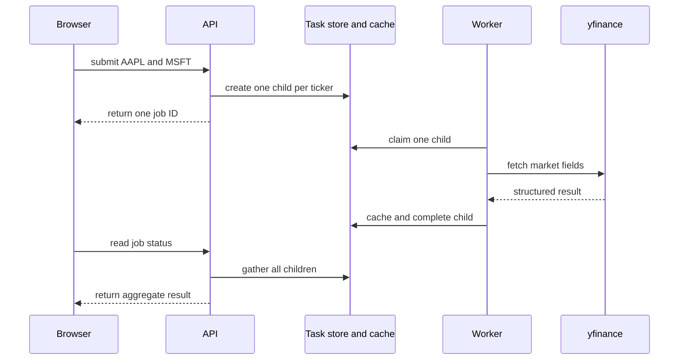
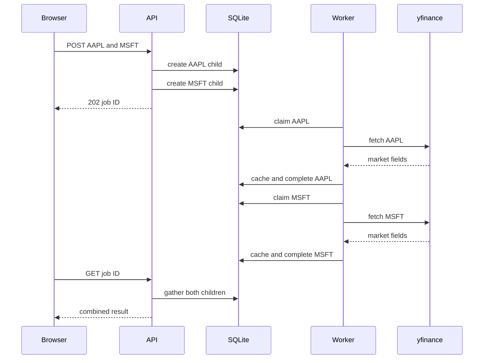
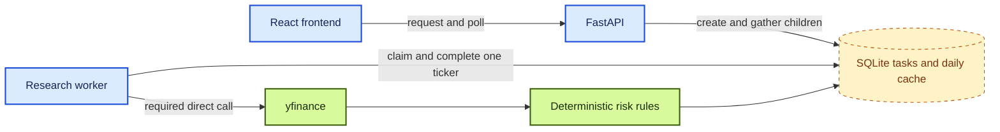

# Chapter 4: Real Market Data and Fan-Out

Chapter 3 separates request handling from background work. The API records a research job, a worker performs it, and durable state lets the browser observe progress. That boundary solves process ownership, but it leaves the unit of work too large: one request containing several tickers still behaves as one indivisible task.

That shape cannot describe partial success honestly. If market data for AAPL is available while MSFT fails, one request-level status must either hide the useful result or hide the failure. Retry and caching have the same problem. Repeating the entire request wastes completed work.

This chapter changes the operational unit from a request to a ticker. One parent request fans out into independent child tasks, and the status read later fans those results back in. Real market data and deterministic risk rules make the independence observable without introducing model judgment yet.

> **Chapter snapshot**
> - **Starting point:** The API and worker have separate responsibilities and durable job state, but one task still represents the entire ticker list.
> - **Focus in this chapter:** Per-ticker child state, market-scoped symbol resolution, direct market-data retrieval, deterministic risk rules, daily caching, and aggregate status.
> - **Finished repository:** The current repository preserves per-ticker processing, market selection, caching, and partial-result display in an evolved PostgreSQL, Service Bus, Redis, and agent architecture. It does not preserve every validation and parent-status rule in the illustrative local design below.
> - **Coming next:** Chapter 5 places optional web search behind a Model Context Protocol boundary while required market data remains a direct call.

## What This Chapter Explains

Fan-out aligns stored state with the thing that can actually succeed or fail. The browser still submits one request and receives one job ID, but the API creates one child task for each normalized ticker.

Each child has its own lifecycle:

```text
queued -> running -> done
                  \-> failed
```

Before queueing work, the API checks a daily cache at the same granularity:

```text
cache hit  -> create a done child
cache miss -> create a queued child
```

The worker claims one child, fetches structured market data, applies fixed risk rules, and records that ticker's outcome. The parent status is derived from all of its children rather than stored as a second mutable account of the same work.

## Lifecycle and Responsibilities

The important design choice is independent ownership, not concurrency. The worker may still process children one at a time; fan-out makes later parallel processing possible without changing the state model.



| Component | Responsibility |
|---|---|
| API | Normalize input, preserve the selected market, create child tasks, and aggregate their states. |
| Task store | Preserve request history and enforce one child per ticker within a job. |
| Cache | Reuse fresh results for the same market, ticker, and date. |
| Worker | Own provider calls, deterministic analysis, and child completion. |
| Market-data adapter | Resolve symbols only within the requested market and return application-owned fields. |

`yfinance` is an unofficial source with no service-level agreement. Fields may change, requests may be throttled, and values may be incomplete. It is appropriate for demonstrating this boundary, not for trading or regulated decisions.

## The Child Task Is the Consistency Boundary

The old `jobs` row answers a request-level question: “Is this collection of tickers finished?” The worker now needs a ticker-level question: “What remains to be done for AAPL?”

A child task needs these fields:

| Field | Purpose |
|---|---|
| `job_id` | Groups children created by one browser request. |
| `ticker` | Identifies the independent unit of work. |
| `market` | Prevents ambiguous cross-market symbol guessing. |
| `status` | Tracks this ticker through `queued`, `running`, `done`, or `failed`. |
| `result` | Stores one ticker's serialized result or error. |
| `created_at` | Provides stable queue ordering. |

The pair `(job_id, ticker)` must be unique. The same ticker may appear in different requests, but it must not appear twice inside one request after normalization.

A separate cache table stores results by market, ticker, and date:

| Field | Purpose |
|---|---|
| `market` | Distinguishes symbols across markets. |
| `ticker` | Uses the normalized ticker. |
| `as_of` | Defines the daily freshness boundary. |
| `result` | Stores the completed ticker result as JSON. |

The database therefore has two different kinds of records. Child tasks preserve request history. Cache records answer whether equivalent work is already fresh enough to reuse.

> **Production Lens:** Per-ticker work is production-shaped because tickers are independently reportable and retryable. SQLite remains deliberately local. A production topology later moves status to PostgreSQL, delivery to a managed broker, and hot cache entries to a dedicated cache service.

## The Per-Ticker Data Model

The following SQLite schema is an illustrative local analogue of the per-ticker model, not a continuation of the `chapter-03-complete` Azure deployment and not an inspectable Chapter 4 tag. Its essential constraint is small enough to show directly.

```python
connection.execute(
    """
    CREATE TABLE IF NOT EXISTS ticker_jobs (
        id INTEGER PRIMARY KEY AUTOINCREMENT,
        job_id TEXT NOT NULL,
        ticker TEXT NOT NULL,
        market TEXT NOT NULL,
        status TEXT NOT NULL,
        result TEXT,
        created_at TEXT NOT NULL DEFAULT CURRENT_TIMESTAMP,
        UNIQUE(job_id, ticker)
    )
    """
)
```

Keep the claim operation inside `BEGIN IMMEDIATE`, just as in Chapter 3. The selected row is now the oldest `ticker_jobs` row whose status is `queued`.

The schema change cannot be treated as an in-place production migration. Recreating a generated local database is acceptable for this teaching stage, but a production database requires a checked-in migration that preserves existing data.

## Market Selection Is Part of Identity

A short symbol is not globally unique. An application that tries US exchanges and then silently falls back to India can turn a typo into research about the wrong company.

Add a market field to the request contract and restrict it to the markets the application understands.

```python
from typing import Literal


class ResearchRequest(BaseModel):
    tickers: list[str]
    market: Literal["US", "India"]
```

The intended API boundary uppercases symbols, removes duplicates, and rejects an empty request before writing children. The frontend sends one selected market with the request; the server does not infer a different market when resolution fails. The current API does not reapply those ticker-normalization rules, so lowercase, duplicate, and empty lists remain a server-side validation gap.

The contract makes these outcomes observable:

| Request | Expected result |
|---|---|
| `{"tickers":["AAPL"],"market":"US"}` | `202 Accepted` |
| `{"tickers":["RELIANCE"],"market":"India"}` | `202 Accepted` |
| `{"tickers":["AAPL"],"market":"Europe"}` | `422 Unprocessable Entity` |
| `{"tickers":[],"market":"US"}` | Should be rejected; the current API does not enforce this yet |

## Fan Out at Submission

`POST /research` still generates one browser-visible job ID. It creates one child row for each ticker supplied by the frontend. Server-side normalization should occur before this loop but is not present in the current API.

For each ticker, the API checks today's cache entry. A hit creates a child that is already `done`. A miss creates a `queued` child for the worker.

```python
job_id = str(uuid.uuid4())

for ticker in request.tickers:
    cached = store.get_cached_result(request.market, ticker)
    store.create_ticker_job(
        job_id=job_id,
        ticker=ticker,
        market=request.market,
        status="done" if cached else "queued",
        result=cached,
    )
```

The API does not fetch market data on a miss. That work belongs to the worker. A cache hit still creates a child row because the new request needs complete durable history. All children for a request belong in one transaction; otherwise, a failed insert can leave a parent with only part of its intended work.

## Fetch Market Data With a Direct Call

Every ticker needs market data. There is no useful judgment in asking a language model whether the worker should fetch it. Application code calls the provider directly.

The adapter makes two decisions: it resolves symbols only inside the selected market, and it returns structured application data rather than provider objects.

```python
def resolve_symbol_candidates(ticker: str, market: str) -> list[str]:
    if market == "US":
        return [ticker]
    if market == "India":
        return [f"{ticker}.NS", f"{ticker}.BO"]
    return []
```

For a US request, the provider receives the ticker unchanged. For an India request, the function tries the National Stock Exchange suffix first and the Bombay Stock Exchange suffix second. It never crosses the market boundary chosen by the user.

The fetch function should return only fields the application understands:

```text
ticker
resolved_symbol
market
price
currency
pe_ratio
fifty_two_week_high
fifty_two_week_low
```

Use `.get()` for optional provider fields. Treat “ticker not found” and “provider unavailable” as different failures so logs and user-facing results do not confuse bad input with an external outage. Tests assert invariants such as a positive price, present currency, and market-appropriate suffix; exact live prices are too volatile to be useful assertions.

## Apply Deterministic Risk Rules

A reusable capability does not require a language model. The first risk function uses fixed, inspectable rules and always runs after a successful market-data fetch.

The core calculation places the current price within the 52-week range:

$$
\text{position} = \frac{\text{price} - \text{low}}{\text{high} - \text{low}}
$$

A position below $0.1$ means the price is within the bottom 10% of that range. The function also flags a negative price-to-earnings ratio and a high positive ratio.

These thresholds are teaching rules, not financial truths. Their value here is that they are transparent, deterministic, and easy to test with constructed data:

| Input | Expected behavior |
|---|---|
| Price 105, low 100, high 200 | Near-low flag |
| P/E -5 | Unprofitable flag |
| P/E 50 | High-P/E flag |
| Missing P/E | No exception |
| Equal high and low | No division by zero |

A pure function produces the same flags every time for the same dictionary.

## Complete One Ticker at a Time

The worker now claims a child instead of a whole request. It fetches data, applies rules, creates one result, writes the cache, and completes that child.

```python
task = store.claim_next_ticker_job()
data = fetch_stock_data(task["ticker"], task["market"])
flags = flag_risk_factors(data) if "error" not in data else []
result = format_ticker_result(data, flags)
store.cache_and_complete(task["id"], result)
```

The excerpt omits error handling to expose the state change. `cache_and_complete` writes the cache row and marks the child `done` in one transaction. A database failure must not leave a fresh cache entry that claims success while request history still says `running`.

Provider failures are caught at the worker boundary. The current child becomes `failed`, receives a concise error result, and the worker continues processing queued tickers. One bad symbol does not terminate the worker loop.

## Aggregate Child Status

The browser knows only the parent job ID, so `GET /research/{job_id}` must gather all matching children.

The current public contract uses this request-level policy:

| Child states | Parent status |
|---|---|
| Any child is `queued` or `running` | `running` |
| All children are terminal | `done`, with each outcome exposed in `ticker_status` |

When the parent is terminal, include one summary entry per requested ticker. A failed child contributes an error summary instead of disappearing. This preserves partial results while keeping the Chapter 2 response shape.

```python
statuses = {child["status"] for child in children}

if statuses & {"queued", "running"}:
    parent_status = "running"
else:
    parent_status = "done"
```

The frontend continues polling until it receives `done`. These combinations make the aggregation policy falsifiable:

| AAPL | MSFT | Parent |
|---|---|---|
| `done` | `queued` | `running` |
| `done` | `failed` | `done` with both summaries |
| `failed` | `failed` | `done` with both ticker statuses marked `failed` |
| `done` | `done` | `done` |

The intended contract returns `404` for an unknown job ID. The current evolved endpoint instead returns an error body with HTTP `200`, so restoring the correct status code remains an API-contract gap.

## Behavior Evidence

The most valuable tests avoid live network calls. Inject or patch the data-fetch function so the worker receives controlled provider responses.

The valuable checks use fake provider responses and observe state rather than elapsed time:

| Situation | Observable result | Guarantee demonstrated |
|---|---|---|
| One request contains two unique tickers | Two children share one `job_id` | Submission fans out by ticker. |
| One ticker has a fresh cache entry | Its child starts `done` and cannot be claimed | Cache reuse preserves request history without repeating work. |
| One provider response is an error | Only that child becomes `failed` | Provider failure is isolated. |
| One child is `done` and one is `failed` | Parent is `done` and includes both summaries | Partial success remains visible. |
| All children fail | Parent is `done` with every `ticker_status` value set to `failed` | Polling completion remains separate from per-ticker success. |
| A worker claims the same child twice | The second claim returns no task | Ownership transition is atomic. |

A completed result also remains available after API and worker restarts. One optional live-provider smoke test can check integration invariants, but network availability does not decide whether the normal suite passes.

## How Fan-Out Works

Fan-out changes more than the number of rows. It aligns every operational decision with the thing being processed.



A ticker is now the unit of queueing, execution, failure, and caching. That consistency is the central design result of the chapter.

The local worker still processes one child at a time. Fan-out makes parallel execution possible, but it does not require concurrency yet. Adding parallelism before independent state exists would only make failures harder to explain.

## Read the Chapter Code

The current workspace has evolved beyond this chapter, but these verified paths preserve its decisive responsibilities:

| File | What to inspect |
|---|---|
| `frontend/src/App.jsx` | Market selection and the request payload. |
| `backend/api/models.py` | Durable job and ticker-level data shapes in the evolved store. |
| `backend/worker/tools/stock_data.py` | Direct market-data calls and market-scoped symbol resolution. |
| `backend/worker/skills/flag_risk_factors/flag_risk_factors.py` | Deterministic rules that remain independent of model behavior. |
| `backend/worker/worker.py` | The evolved ticker-processing boundary and result persistence. |

## Illustrative Local Architecture



This untagged teaching model keeps SQLite visible only to isolate the child-task decision. The important boundaries survive in the current infrastructure: the API fans out work, Service Bus delivers one ticker at a time, the worker owns execution, and PostgreSQL stores each ticker's independent state.

## Known Limitations

The market-data provider is unofficial and synchronous. The daily cache uses a simple calendar boundary rather than exchange sessions. In the illustrative local model, SQLite allows only one writer at a time, the worker processes children sequentially, and a crash can leave a child in `running`. The current cloud implementation adds managed delivery but still lacks cancellation, checked-in schema migrations, and provider fallback. Its API also does not independently normalize, deduplicate, or reject an empty ticker list.

The risk thresholds are intentionally simple. They identify visible conditions; they do not predict returns or provide investment advice.

No new Azure resource becomes active in this chapter. The diagram describes the chapter's responsibility model, including its deliberately local SQLite store. The evolved cloud services change where those responsibilities run, not the per-ticker contract.

## Next

Market data and risk rules are deterministic: every ticker needs them, and application code always calls them. Web search is different. It is remote, budgeted, and useful only for some research questions.

Chapter 5 places search behind a Model Context Protocol server. It proves capability discovery and execution before a language model is allowed to choose whether to call the tool.
