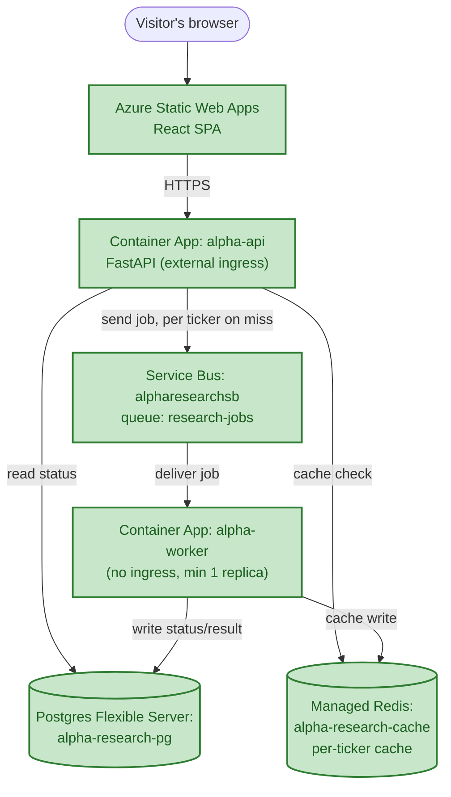

# Chapter 4 — The First Agent

*Phase 4 is still in progress. This chapter covers what's been proven so far — the actual mechanism a model uses to decide "call this function" and get a real answer back — not yet the finished agent wired into the worker.*

## The Question Chapter 3 Left Open

Chapter 3 built a real MCP tool (`search`) and was explicit about *not* wiring it into the automatic flow — because nothing in the system yet had the ability to genuinely decide *when* a search was worth making. That's the actual subject of Phase 4: not new infrastructure, but the mechanism by which a model looks at a request, decides it needs more information, asks for a specific function to be run with specific arguments, and then uses whatever comes back to produce a real answer.

Before wiring that into anything real, the discipline used everywhere else in this project applied here too: prove the mechanism in isolation first.

## Choosing Where to Prove It: Ollama, Not Azure Yet

Two realistic options existed for the model doing this reasoning: Azure AI Foundry (the eventual production target) or a local model via Ollama. Foundry was deliberately deferred for this proving step — pulling in cloud credentials, deployment configuration, and network calls would add friction to a step that's purely about understanding a mechanism, not about the specific model or where it runs. Ollama, running `qwen3:8b` locally, gave a real model with real tool-calling support and zero setup cost or per-call charge while the mechanism itself was being learned — the same "prove it small and local, then productionize" pattern already used for `arq` before Service Bus, and for the MCP server tested standalone before being wired into the worker's own codebase.

## What a Tool-Calling Loop Actually Is

The core idea: a language model is stateless and can't run code — it can only read text and produce text. Tool calling is a convention layered on top of that: alongside a normal prompt, you also hand the model a list of function *descriptions* (name, purpose, and the shape of the arguments it takes) called a schema. The model doesn't call anything itself — it can only reply with structured text saying, in effect, "please call this one, with these arguments." Something outside the model — our own code — is what actually runs the function and hands the real result back in a follow-up message.

That makes it a genuine back-and-forth, not one request:

1. **Turn 1**: send the conversation plus the available tool schemas. The model replies either with a normal answer, or a request to call a specific tool with specific arguments.
2. **We execute the real function ourselves** — the model never runs code.
3. **Turn 2**: the real result gets appended to the conversation as a new message, and the whole thing is sent back to the model again. Only now, with real data in hand, does it produce the actual final answer.

The tool schema used for this first proof describes exactly the `fetch_stock_data` function from Chapter 3 — same shape, but here it's just a *description* handed to the model, not yet connected to the real function:

```python
TOOL_SCHEMA = {
    "type": "function",
    "function": {
        "name": "fetch_stock_data",
        "description": "Fetch the current price and basic fundamentals for a stock ticker in a specific market.",
        "parameters": {
            "type": "object",
            "properties": {
                "ticker": {"type": "string", "description": "Stock ticker symbol, e.g. AAPL"},
                "market": {"type": "string", "enum": ["US", "India"], "description": "Which market to look up the ticker in"},
            },
            "required": ["ticker", "market"],
        },
    },
}
```

## First Proof: Does the Model Decide Correctly?

Before wiring in real execution, the first isolated test asked a narrower question: given only this schema and the prompt *"What's the current price of Apple stock?"*, does the model reliably decide to call the right function with sensible arguments — including inferring `market`, which the schema requires but the prompt never mentions? Sending exactly that to Ollama's `/api/chat` endpoint, with `tools=[TOOL_SCHEMA]`, confirmed it does: the model correctly returned a `tool_calls` request naming `fetch_stock_data` with `{"ticker": "AAPL", "market": "US"}` — genuine inference, since nothing in the schema or the prompt stated Apple's ticker symbol or which exchange it trades on. That came from the model's own training, not our code.

## Second Proof: The Full Loop, Executed for Real

With the decision step confirmed, the next script closed the loop completely — actually running `fetch_stock_data`, feeding the real result back, and getting a genuine final answer built from real numbers. This is the full, real terminal output from running it:

```
======================================================================
TURN 1 REQUEST -- sent to the model
======================================================================
{
  "model": "qwen3:8b",
  "messages": [
    {
      "role": "user",
      "content": "What's the current price of Apple stock?"
    }
  ],
  "tools": [ ... fetch_stock_data schema ... ]
}

======================================================================
TURN 1 RESPONSE -- raw message from the model
======================================================================
{
  "role": "assistant",
  "content": "",
  "thinking": "Okay, the user is asking for the current price of Apple stock. Let me see. The tools provided include a function called fetch_stock_data, which requires a ticker and a market. The user didn't specify the market, but Apple's ticker is AAPL, which is primarily listed in the US. The function's market parameter has an enum with US and India. Since the user didn't mention India, I should default to US. So I need to call fetch_stock_data with ticker \"AAPL\" and market \"US\". That should get the current price and fundamentals. I'll make sure to structure the tool call correctly in JSON within the XML tags.\n",
  "tool_calls": [
    {
      "id": "call_3s0xz42i",
      "function": {
        "index": 0,
        "name": "fetch_stock_data",
        "arguments": { "ticker": "AAPL", "market": "US" }
      }
    }
  ]
}

Model wants to call: fetch_stock_data({'ticker': 'AAPL', 'market': 'US'})
Real result from fetch_stock_data: {'ticker': 'AAPL', 'resolved_symbol': 'AAPL', 'market': 'US',
  'price': 305.93, 'currency': 'USD', 'pe_ratio': 34.96343, 'market_cap': 4464797286400,
  'fifty_two_week_high': 344.57, 'fifty_two_week_low': 223.78}

======================================================================
TURN 2 REQUEST -- messages array now includes the real tool result
======================================================================
[
  { "role": "user", "content": "What's the current price of Apple stock?" },
  { "role": "assistant", "content": "", "thinking": "...", "tool_calls": [ ... same call as above ... ] },
  {
    "role": "tool",
    "tool_call_id": "call_3s0xz42i",
    "content": "{\"ticker\": \"AAPL\", \"resolved_symbol\": \"AAPL\", \"market\": \"US\", \"price\": 305.93, ...}"
  }
]

======================================================================
TURN 2 RESPONSE -- raw final message from the model
======================================================================
{
  "role": "assistant",
  "content": "The current price of Apple (AAPL) stock is **$305.93** USD.  \n\nAdditional details:  \n- **PE Ratio**: 34.96  \n- **Market Cap**: $4.46 trillion  \n- **52-Week Range**: $223.78 - $344.57  \n\nLet me know if you need further analysis! 🍎",
  "thinking": "Okay, let me process the user's query and the tool response. The user asked for the current price of Apple stock. The tool response has the price as 305.93 USD. I should present this clearly. ..."
}

======================================================================
FINAL ANSWER
======================================================================
The current price of Apple (AAPL) stock is **$305.93** USD.

Additional details:
- **PE Ratio**: 34.96
- **Market Cap**: $4.46 trillion
- **52-Week Range**: $223.78 - $344.57

Let me know if you need further analysis! 🍎
```

A few things in that transcript are worth pointing at directly, because they're each a real mechanic, not an implementation detail to skim past:

- **The `thinking` field is the model's own scratchpad**, kept separate from `content` and `tool_calls`. Whether that scratchpad gets carried forward into the *next* request is a decision our own code makes — nothing in the protocol does it automatically. Common practice drops old scratchpad content from re-sent history once it's done its job for that turn, mainly to avoid re-spending tokens on reasoning that already happened; this project's later Context Assembler is exactly the piece responsible for that call.
- **`tool_call_id` is what lets a result answer the right request.** With one tool call in flight it looks almost decorative — but the moment a model requests more than one tool in a single turn, each result sent back has to reference the matching ID, or the model has no reliable way to know which answer belongs to which request.
- **Turn 2's request is the entire conversation so far, resent whole** — the model has no memory between calls; it only "remembers" what's actually sitting in the `messages` array handed to it that time. The `role: "tool"` entry is what turns a blind guess into a grounded answer: without it, Turn 2 would just be the model guessing again, not reporting a real, fetched number.

## The Dispatch Mechanism: Matching by Name, Not Hardcoding

The first working version of this script had a real, honest simplification worth naming directly: it executed the tool by writing `fetch_stock_data(...)` straight into the code — the *name* the model returned in `tool_call["function"]["name"]` was printed for visibility but never actually used to decide what ran. With exactly one possible tool, that happened to produce the right result, but it wasn't really *using* the model's decision — it was ignoring it and getting lucky.

The fix generalizes correctly to any number of tools: a small registry mapping tool names to real functions, with the lookup driven entirely by the string the model returned.

```python
# Name -> real function. The model only ever gives us a STRING name back;
# this table is what turns that string into an actual callable. Nothing else
# is allowed to name a specific function directly -- only this dict decides.
TOOL_REGISTRY = {
    "fetch_stock_data": fetch_stock_data,
}

function_name = tool_call["function"]["name"]
function_args = tool_call["function"]["arguments"]

if function_name not in TOOL_REGISTRY:
    raise ValueError(f"Model requested a tool we don't have: {function_name}")

tool_function = TOOL_REGISTRY[function_name]
real_result = tool_function(**function_args)
```

This is the same shape as MCP's own dispatcher, one level up: MCP routes an incoming request to the right *tool implementation* by name; this registry routes a *model's decision* to the right *Python function* by name. It also clarifies where the real safety boundary sits: a tool's `name` is its entire identity — two tools can never safely share one, since neither the registry nor the model itself could tell them apart — while its *arguments* aren't matched against anything at dispatch time at all. If the model sent a malformed or missing argument, this code would fail loudly with a Python `TypeError` at the call site, not silently. A production version would validate arguments against the schema before calling, and feed a correctable error back to the model rather than crashing — noted honestly as a real gap, not yet built.

## Where Phase 4 Actually Stands

What's proven, concretely: a real model, given a real tool schema, makes a genuine decision; that decision is dispatched correctly by name, not assumption; a real function runs; a real result is fed back; a real, grounded final answer comes out the other side. None of this is wired into the worker yet, and several real pieces are still ahead — a proper Context Assembler (deciding what conversation history, memory, and tool results actually get sent each turn, and what gets trimmed), the genuine LLM-discoverable Skill this phase is committed to building (one requiring real interpretive judgment, unlike Chapter 3's fixed-rule `flag_risk_factors`), and the eventual swap from local Ollama to Azure AI Foundry — followed by, as always in this project, an actual deploy and a live check before the phase is called done.

## Azure Components Used This Chapter

None yet. This chapter's work was deliberately local-only — proving a mechanism doesn't need cloud infrastructure, and standing up Azure AI Foundry before the mechanism itself was understood would have made a straightforward learning step needlessly complicated. That's next, not yet done.

## The Architecture So Far

Unchanged from Chapter 3 — nothing new has been deployed to Azure this phase, since the work so far has been proving the tool-calling mechanism locally against Ollama, not standing up new infrastructure.



## What Came Out of This Chapter (So Far)

- A real, working proof of the full tool-calling loop against a real model: decide → execute for real → feed the real result back → genuine grounded answer.
- A concrete, working understanding of what a "reasoning model's scratchpad" is, and that carrying it forward between turns is a design decision, not something the protocol hands you for free.
- A dispatch mechanism that scales to more than one tool — matching by the name the model actually returned, not by which function happened to be hardcoded — with an honest account of what it does and doesn't protect against.
- Phase 4 still open: the Context Assembler, the genuine LLM-discoverable Skill, the Azure AI Foundry swap, and the first live deploy of any of it are what's left before this chapter's story is actually finished.
