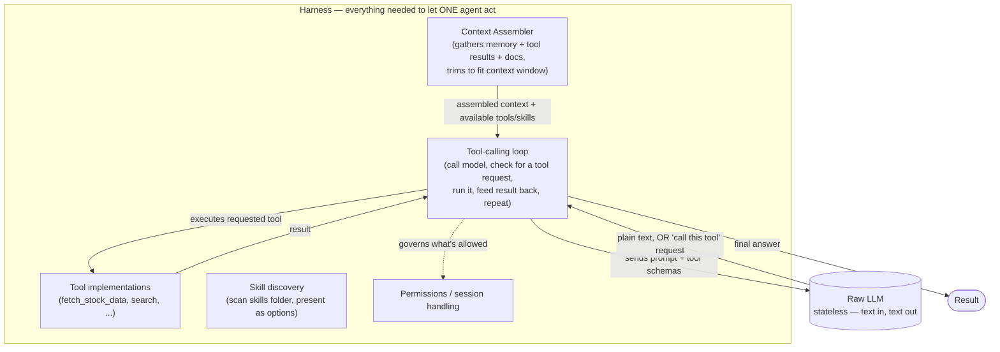
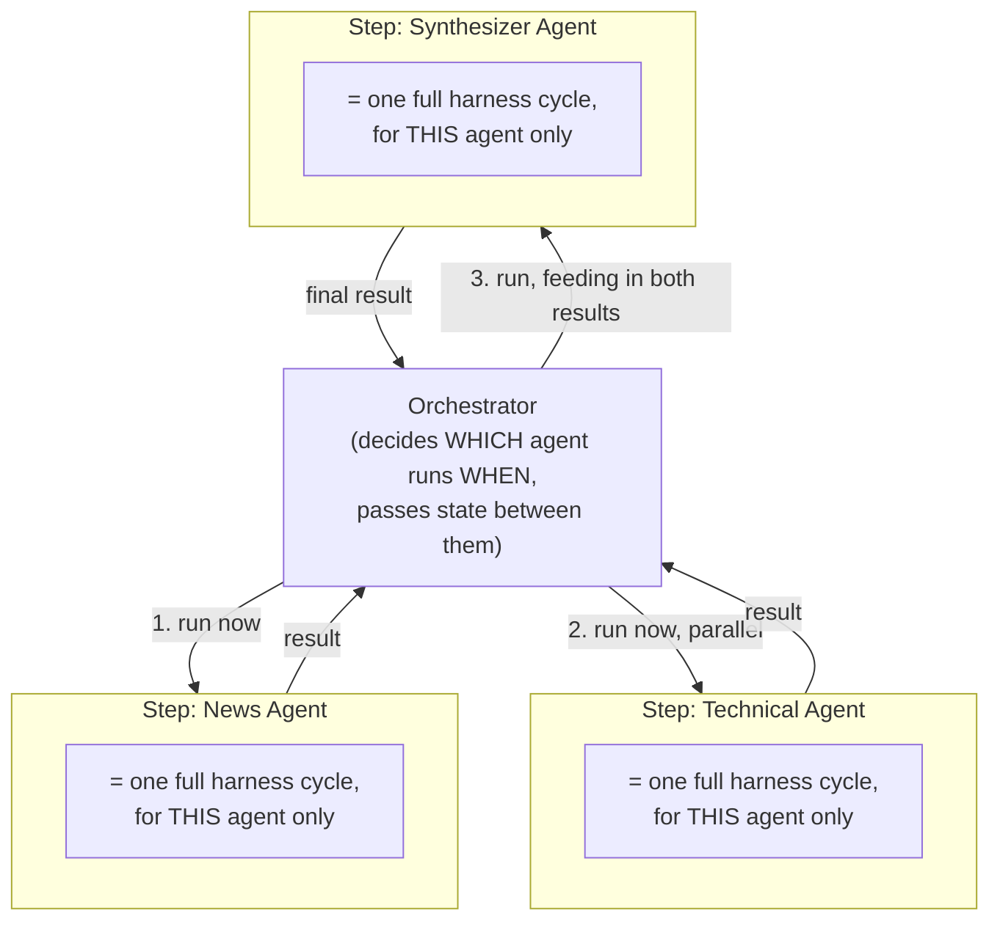
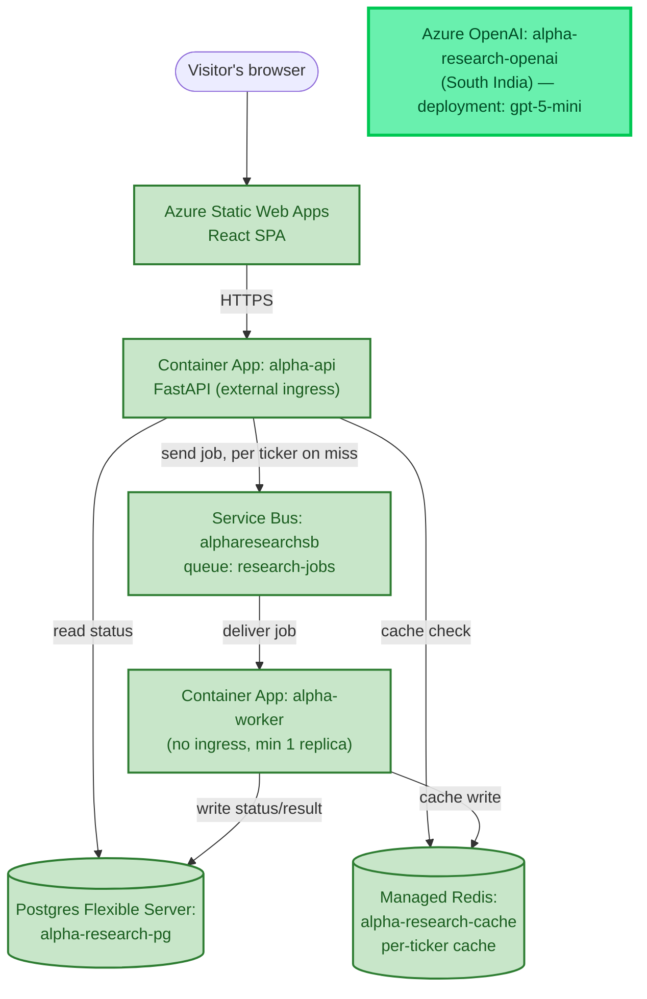

# Chapter 4 — The First Agent

*Phase 4 is still in progress. This chapter covers what's been proven so far — the actual mechanism a model uses to decide "call this function" and get a real answer back — not yet the finished agent wired into the worker.*

## The Question Chapter 3 Left Open

Chapter 3 built a real MCP tool (`search`) and was explicit about *not* wiring it into the automatic flow — because nothing in the system yet had the ability to genuinely decide *when* a search was worth making. That's the actual subject of Phase 4: not new infrastructure, but the mechanism by which a model looks at a request, decides it needs more information, asks for a specific function to be run with specific arguments, and then uses whatever comes back to produce a real answer.

Before wiring that into anything real, the discipline used everywhere else in this project applied here too: prove the mechanism in isolation first.

## Choosing Where to Prove It: Ollama, Not Azure Yet

Two realistic options existed for the model doing this reasoning: Azure AI Foundry (the eventual production target) or a local model via Ollama. Foundry was deliberately deferred for this proving step — pulling in cloud credentials, deployment configuration, and network calls would add friction to a step that's purely about understanding a mechanism, not about the specific model or where it runs. Ollama, running `qwen3:8b` locally, gave a real model with real tool-calling support and zero setup cost or per-call charge while the mechanism itself was being learned — the same "prove it small and local, then productionize" pattern already used for `arq` before Service Bus, and for the MCP server tested standalone before being wired into the worker's own codebase.

## What a Tool-Calling Loop Actually Is

The core idea: a language model is stateless and can't run code — it can only read text and produce text. Tool calling is a convention layered on top of that: alongside a normal prompt, you also hand the model a list of function *descriptions* (name, purpose, and the shape of the arguments it takes) called a schema. The model doesn't call anything itself — it can only reply with structured text saying, in effect, "please call this one, with these arguments." Something outside the model — our own code — is what actually runs the function and hands the real result back in a follow-up message.

That makes it a genuine back-and-forth, not one request:

1. **Turn 1**: send the conversation plus the available tool schemas. The model replies either with a normal answer, or a request to call a specific tool with specific arguments.
2. **We execute the real function ourselves** — the model never runs code.
3. **Turn 2**: the real result gets appended to the conversation as a new message, and the whole thing is sent back to the model again. Only now, with real data in hand, does it produce the actual final answer.

The tool schema used for this first proof describes exactly the `fetch_stock_data` function from Chapter 3 — same shape, but here it's just a *description* handed to the model, not yet connected to the real function:

```python
TOOL_SCHEMA = {
    "type": "function",
    "function": {
        "name": "fetch_stock_data",
        "description": "Fetch the current price and basic fundamentals for a stock ticker in a specific market.",
        "parameters": {
            "type": "object",
            "properties": {
                "ticker": {"type": "string", "description": "Stock ticker symbol, e.g. AAPL"},
                "market": {"type": "string", "enum": ["US", "India"], "description": "Which market to look up the ticker in"},
            },
            "required": ["ticker", "market"],
        },
    },
}
```

## First Proof: Does the Model Decide Correctly?

Before wiring in real execution, the first isolated test asked a narrower question: given only this schema and the prompt *"What's the current price of Apple stock?"*, does the model reliably decide to call the right function with sensible arguments — including inferring `market`, which the schema requires but the prompt never mentions? Sending exactly that to Ollama's `/api/chat` endpoint, with `tools=[TOOL_SCHEMA]`, confirmed it does: the model correctly returned a `tool_calls` request naming `fetch_stock_data` with `{"ticker": "AAPL", "market": "US"}` — genuine inference, since nothing in the schema or the prompt stated Apple's ticker symbol or which exchange it trades on. That came from the model's own training, not our code.

## Second Proof: The Full Loop, Executed for Real

With the decision step confirmed, the next script closed the loop completely — actually running `fetch_stock_data`, feeding the real result back, and getting a genuine final answer built from real numbers.

Running it hit one small, familiar-shaped gotcha first. From inside its own folder, `python test_tool_loop.py` fails with `ModuleNotFoundError: No module named 'tools'` — Python adds the *script's own directory* to its import path, not the current working directory, so the sibling `tools/` package one level up becomes invisible. The fix is running it as a module instead, from the parent directory where `tools/` actually lives as a sibling:

```bash
cd backend/worker
uv run python -m llm_experiments.test_tool_loop
```

The `-m` flag tells Python to resolve imports relative to the current directory rather than the script's own location — the same root cause, one more time, as the earlier `.env.local` path issue: a script's assumed "current location" and its actual import root aren't automatically the same thing.

This is the full, real terminal output from running it that way:

```
======================================================================
TURN 1 REQUEST -- sent to the model
======================================================================
{
  "model": "qwen3:8b",
  "messages": [
    {
      "role": "user",
      "content": "What's the current price of Apple stock?"
    }
  ],
  "tools": [ ... fetch_stock_data schema ... ]
}

======================================================================
TURN 1 RESPONSE -- raw message from the model
======================================================================
{
  "role": "assistant",
  "content": "",
  "thinking": "Okay, the user is asking for the current price of Apple stock. Let me see. The tools provided include a function called fetch_stock_data, which requires a ticker and a market. The user didn't specify the market, but Apple's ticker is AAPL, which is primarily listed in the US. The function's market parameter has an enum with US and India. Since the user didn't mention India, I should default to US. So I need to call fetch_stock_data with ticker \"AAPL\" and market \"US\". That should get the current price and fundamentals. I'll make sure to structure the tool call correctly in JSON within the XML tags.\n",
  "tool_calls": [
    {
      "id": "call_3s0xz42i",
      "function": {
        "index": 0,
        "name": "fetch_stock_data",
        "arguments": { "ticker": "AAPL", "market": "US" }
      }
    }
  ]
}

Model wants to call: fetch_stock_data({'ticker': 'AAPL', 'market': 'US'})
Real result from fetch_stock_data: {'ticker': 'AAPL', 'resolved_symbol': 'AAPL', 'market': 'US',
  'price': 305.93, 'currency': 'USD', 'pe_ratio': 34.96343, 'market_cap': 4464797286400,
  'fifty_two_week_high': 344.57, 'fifty_two_week_low': 223.78}

======================================================================
TURN 2 REQUEST -- messages array now includes the real tool result
======================================================================
[
  { "role": "user", "content": "What's the current price of Apple stock?" },
  { "role": "assistant", "content": "", "thinking": "...", "tool_calls": [ ... same call as above ... ] },
  {
    "role": "tool",
    "tool_call_id": "call_3s0xz42i",
    "content": "{\"ticker\": \"AAPL\", \"resolved_symbol\": \"AAPL\", \"market\": \"US\", \"price\": 305.93, ...}"
  }
]

======================================================================
TURN 2 RESPONSE -- raw final message from the model
======================================================================
{
  "role": "assistant",
  "content": "The current price of Apple (AAPL) stock is **$305.93** USD.  \n\nAdditional details:  \n- **PE Ratio**: 34.96  \n- **Market Cap**: $4.46 trillion  \n- **52-Week Range**: $223.78 - $344.57  \n\nLet me know if you need further analysis! 🍎",
  "thinking": "Okay, let me process the user's query and the tool response. The user asked for the current price of Apple stock. The tool response has the price as 305.93 USD. I should present this clearly. ..."
}

======================================================================
FINAL ANSWER
======================================================================
The current price of Apple (AAPL) stock is **$305.93** USD.

Additional details:
- **PE Ratio**: 34.96
- **Market Cap**: $4.46 trillion
- **52-Week Range**: $223.78 - $344.57

Let me know if you need further analysis! 🍎
```

A few things in that transcript are worth pointing at directly, because they're each a real mechanic, not an implementation detail to skim past:

- **The `thinking` field is the model's own scratchpad**, kept separate from `content` and `tool_calls`. Whether that scratchpad gets carried forward into the *next* request is a decision our own code makes — nothing in the protocol does it automatically. Common practice drops old scratchpad content from re-sent history once it's done its job for that turn, mainly to avoid re-spending tokens on reasoning that already happened; this project's later Context Assembler is exactly the piece responsible for that call.
- **`tool_call_id` is what lets a result answer the right request.** With one tool call in flight it looks almost decorative — but the moment a model requests more than one tool in a single turn, each result sent back has to reference the matching ID, or the model has no reliable way to know which answer belongs to which request.
- **Turn 2's request is the entire conversation so far, resent whole** — the model has no memory between calls; it only "remembers" what's actually sitting in the `messages` array handed to it that time. The `role: "tool"` entry is what turns a blind guess into a grounded answer: without it, Turn 2 would just be the model guessing again, not reporting a real, fetched number.

## The Dispatch Mechanism: Matching by Name, Not Hardcoding

The first working version of this script had a real, honest simplification worth naming directly: it executed the tool by writing `fetch_stock_data(...)` straight into the code — the *name* the model returned in `tool_call["function"]["name"]` was printed for visibility but never actually used to decide what ran. With exactly one possible tool, that happened to produce the right result, but it wasn't really *using* the model's decision — it was ignoring it and getting lucky.

The fix generalizes correctly to any number of tools: a small registry mapping tool names to real functions, with the lookup driven entirely by the string the model returned.

```python
# Name -> real function. The model only ever gives us a STRING name back;
# this table is what turns that string into an actual callable. Nothing else
# is allowed to name a specific function directly -- only this dict decides.
TOOL_REGISTRY = {
    "fetch_stock_data": fetch_stock_data,
}

function_name = tool_call["function"]["name"]
function_args = tool_call["function"]["arguments"]

if function_name not in TOOL_REGISTRY:
    raise ValueError(f"Model requested a tool we don't have: {function_name}")

tool_function = TOOL_REGISTRY[function_name]
real_result = tool_function(**function_args)
```

This is the same shape as MCP's own dispatcher, one level up: MCP routes an incoming request to the right *tool implementation* by name; this registry routes a *model's decision* to the right *Python function* by name. It also clarifies where the real safety boundary sits: a tool's `name` is its entire identity — two tools can never safely share one, since neither the registry nor the model itself could tell them apart — while its *arguments* aren't matched against anything at dispatch time at all. If the model sent a malformed or missing argument, this code would fail loudly with a Python `TypeError` at the call site, not silently. A production version would validate arguments against the schema before calling, and feed a correctable error back to the model rather than crashing — noted honestly as a real gap, not yet built.

## Harness vs. Orchestrator — Two Words That Sound Like They Mean the Same Thing

Before going further, two terms that come up constantly discussing agent architecture are worth pinning down precisely, since they're easy to blur together and this project's own roadmap depends on the distinction.

**A harness is the whole surrounding application that lets a raw model actually act.** A raw LLM is stateless — text in, text out, remembers nothing on its own between calls. Everything proven in this chapter — the tool-calling loop, the tool implementations, deciding what context to send, discovering what capabilities are available, handling permissions — is harness work. Claude Code itself, the tool writing this book, is a harness wrapped around a raw Claude model, in exactly this sense.

**An orchestrator is a narrower role: deciding which of several agents runs when.** It only matters once there's more than one agent to sequence — one agent needs zero orchestration, since there's nothing to coordinate. `buynobuy`'s LangGraph `StateGraph` is a real, working example of this role.

The relationship that isn't obvious until you look closely: **an orchestrator does not reimplement context assembly, tool-calling, or capability discovery itself.** For each agent it decides to run, it calls into the *same* harness machinery a single-agent setup would use — its only actual job is deciding *which* agent runs *when*, and what state passes between them. A kitchen analogy holds up well: the harness is the kitchen itself — oven, prep counters, recipe cards, everything needed to actually cook; the orchestrator is the head chef deciding which dish gets made in what order. The chef doesn't personally chop the vegetables — the kitchen's own equipment does that, every time, for whichever dish is currently being made.





Each "harness cycle" box in the second diagram is literally the whole first diagram, run once per agent — the orchestrator never bypasses it or reimplements it separately for each agent it manages. Mapped onto this project's own roadmap: this chapter's work is entirely single-agent harness — the loop, the tools, and (still ahead) the Context Assembler and Skill discovery, with no orchestrator needed yet, since there's only ever one agent so far. An orchestrator gets added *on top* of this same harness once multiple real agents exist to coordinate, later in the project.

**One more distinction worth being precise about: Skills-loading is a harness-level feature, not something a raw model provides.** Auto-discovering a folder of instructions and presenting it to the model as an available option — what Claude Code itself does with its own Skills — lives in Anthropic's own harness products (Claude Code, Claude Desktop, the Agent SDK), not in the raw model or its plain API. Calling a model's Messages API directly gives no such mechanism for free; it would have to be built by hand. The direct consequence for this project: whichever model eventually gets deployed via Azure AI Foundry won't come with Skills-loading built in, regardless of which specific model it is — this project *is* its own worker's harness, so a smaller version of the same idea has to be built here too: a markdown file with instructions, and our own code that reads it and presents it as an available option in whatever tool-calling format that specific model's API expects. Most providers, OpenAI included, share the same underlying mechanism (function/tool calling) but not necessarily a feature specifically branded "Skills" with the same auto-discovery convention — worth verifying current state directly rather than assuming, since product features in this space are still moving.

## The Context Assembler, Built for Real

The test scripts above built `messages` by hand, inline — fine for a single throwaway proof, not fine as the actual shape of a reusable agent. The Context Assembler's job is to become the one *named* place that decision lives, rather than unexamined glue code sitting between "the tool ran" and "call the model again."

```python
# backend/worker/context_assembler.py
SYSTEM_PROMPT = (
    "You are a stock research assistant. You have access to tools for fetching "
    "real stock data and, when genuinely useful, searching the web. Use them to "
    "answer the user's question about a specific ticker. Be concise and factual."
)

def assemble_context(history: list[dict]) -> list[dict]:
    messages = [{"role": "system", "content": SYSTEM_PROMPT}]
    for message in history:
        if message["role"] == "assistant" and "thinking" in message:
            # Drop old scratchpad reasoning before resending -- it already did its
            # job producing that turn's decision; resending it only burns tokens.
            message = {k: v for k, v in message.items() if k != "thinking"}
        messages.append(message)
    return messages
```

Three responsibilities, deliberately scoped to what this project actually needs right now rather than a hypothetical general-purpose version: add a system prompt (the test scripts never had one — the model only ever saw a bare user message); strip stale `thinking` content from prior assistant messages before resending them, which is the exact nuance named earlier as "a Context Assembler decision, not automatic"; and name a placeholder for trimming-to-fit-context-window, even though there's nothing to actually trim yet at this project's current scale of one ticker and a couple of tool calls.

Proven the same way as everything else in this project — standalone, before being wired into anything real: a fake history including one assistant message with a `thinking` field goes in, and the output is checked for exactly three things — a system message now sits first, `thinking` is gone from the assistant message while `tool_calls` survived untouched, and the plain user/tool messages passed through with no changes at all.

```
$ uv run python -m llm_experiments.test_context_assembler
[
  { "role": "system", "content": "You are a stock research assistant..." },
  { "role": "user", "content": "What's the current price of Apple stock?" },
  { "role": "assistant", "content": "", "tool_calls": [ { "id": "call_1", "function": { "name": "fetch_stock_data", "arguments": { "ticker": "AAPL", "market": "US" } } } ] },
  { "role": "tool", "tool_call_id": "call_1", "content": "{\"price\": 305.93}" }
]

All checks passed.
```

## A Swappable Model Client, and the Real Agent Loop

Two more pieces closed the gap between "proven mechanism" and "a real agent." First, the raw `requests.post` calls scattered across the test scripts were pulled into one small function, `chat(messages, tools)` in `backend/worker/llm/model_client.py` — everything else talks to that function and only that function, so swapping Ollama for Azure AI Foundry later means changing what's *inside* this one function, not touching the loop, the Context Assembler, or the tools at all.

Second, and more substantial: `test_tool_loop.py` was a fixed *two-turn script* — ask once, get one tool call, answer once. A real agent needs an actual **loop**, because the model might see a tool's result and decide it needs to call something else before it can answer, and a single response can request more than one tool call at once, not just one:

```python
def run_agent(ticker: str, market: str) -> dict:
    history = [{"role": "user", "content": f"What's the current price and outlook for {ticker} in the {market} market?"}]

    for _ in range(MAX_TURNS):
        messages = assemble_context(history)
        response = chat(messages, TOOL_SCHEMAS)
        history.append(response)

        tool_calls = response.get("tool_calls")
        if not tool_calls:
            return {"status": "success", "answer": response["content"]}

        for tool_call in tool_calls:
            function_name = tool_call["function"]["name"]
            function_args = tool_call["function"]["arguments"]
            result = TOOL_REGISTRY.get(function_name, lambda **_: {"error": f"unknown tool: {function_name}"})(**function_args)
            history.append({"role": "tool", "tool_call_id": tool_call["id"], "content": json.dumps(result)})

    return {
        "status": "max_turns_exceeded",
        "partial_results": [json.loads(m["content"]) for m in history if m["role"] == "tool"],
    }
```

`MAX_TURNS = 5` is a real, deliberate safety cap, not an arbitrary number — without one, a confused or looping model could keep calling tools indefinitely, burning real time and, once a paid model sits behind this instead of a free local one, real money, with no result ever produced. This is a small, early taste of the guardrail thinking a later phase covers properly.

Run end to end against a real ticker, the whole chain held up — real price fetched, real synthesis produced. But the output surfaced something worth stating plainly rather than glossing past: the model's closing line claimed AAPL was "near its 52-week low," when the actual numbers it had just fetched ($305.93 against a $223.78–$344.57 range) put it roughly 68% of the way *up* that range — close to the high, not the low. Nothing was hallucinated — every number in the answer was real and correctly fetched — the model simply reasoned incorrectly about what those real numbers meant. This is concrete, first-hand evidence for something this project already had a design answer for before ever seeing the problem: Chapter 3's `flag_risk_factors` is a *fixed, deterministic* calculation of exactly this same "where in the range does the price sit" question, precisely because a plain arithmetic rule can't misjudge which end of a range a number falls on the way a model's free-form reasoning just did. The two aren't redundant — they're complementary, and this is the first real evidence of *why*. (A repeat run, for what it's worth, correctly said "near its 52-week high" — the first attempt was a one-off reasoning slip, not a consistent failure mode, itself worth knowing about a small local model's reliability.)

**The first version's give-up path had a real honesty problem, worth naming directly.** `return "Agent did not produce a final answer within the turn limit."` was a bare string — returned identically to a genuine successful answer, meaning a caller (the worker, eventually the frontend) had no way to tell "here's a real report" apart from "the agent gave up," and would have written the give-up message straight into a report as if it were one. The fix: never disguise failure as success. `run_agent` now always returns a typed result — `{"status": "success", "answer": ...}` or `{"status": "max_turns_exceeded", "partial_results": [...]}`, carrying back whatever real tool results were actually gathered before giving up rather than nothing at all.

This naturally raises a bigger question: what about *retrying* a failed call, not just reporting the failure honestly? That's deliberately **not** built here — it's its own dedicated later phase. This project's roadmap keeps three related-sounding concerns genuinely separate: today's fix is about *honest failure reporting* (the loop already stopped cleanly; the problem was disguising that as success). **Phase 6 (Checkpointing)** is about resuming a *crashed process* from where it left off, not restarting a whole ticker from scratch. **Phase 7 (Resilience)** is the one actually about retries — backoff around individual tool/agent calls, simulating a real failure and confirming graceful partial results instead of a crash, plus dead-letter handling for jobs that keep failing. Building real retry logic now, before there's an actual failure scenario to test it against, would be building Phase 7 early and out of context — the honest fix today is scoped to exactly what today's problem was.

## The Genuine Skill: Instructions, Not a Computed Value

This project owed one real, explicit thing since Phase 3: `flag_risk_factors` was honestly labeled a *plain reusable module*, not the fuller meaning that made "Skill" a notable concept in the first place — an LLM *discovering* a capability and *choosing*, with real judgment, whether to apply it. Building that properly required answering a mechanical question first: without Claude's own native Skills-loading (a harness-level feature, established two sections back), what does "discoverable" even mean in code *we* have to write ourselves?

The answer: reuse the tool-calling loop already proven, but make this particular "tool" behave differently from `fetch_stock_data`. A tool computes a value. A Skill, called the same mechanical way, returns **instructions** the model then has to apply itself, using judgment, on the next turn:

```python
# skills/assess_news_sentiment/skill.py
def load_instructions() -> str:
    content = _SKILL_FILE.read_text()
    _, _, body = content.split("---", 2)  # drop the YAML frontmatter, keep the instructions
    return body.strip()
```

`SKILL.md` itself is modeled directly on `tutor/SKILL.md` — the very file steering this project — same shape: a frontmatter description used for discovery, then a body of instructions to follow with judgment, not execute as code. Its actual content is a rubric for *"assess whether recent news about a company suggests real cause for investor concern"* — explicitly listing genuine red flags (fraud allegations, an executive departing under a cloud, a material regulatory investigation) alongside routine coverage that should specifically **not** be flagged (analyst opinion pieces, ordinary competitive pressure, unconfirmed rumors) — the part doing the real work, since without it the model would default to pattern-matching on negative tone rather than genuinely weighing materiality.

Registered in `agent.py` exactly like any other tool, description doing the entire discovery job:

```python
{
    "type": "function",
    "function": {
        "name": "assess_news_sentiment",
        "description": "Load guidance for judging whether recent news about a company is a genuine cause for investor concern, distinguishing real red flags from routine negative coverage. Call this before forming a final judgment about news-driven risk, ideally after searching for recent news.",
        "parameters": {"type": "object", "properties": {}},
    },
},
```

```python
TOOL_REGISTRY = {
    "fetch_stock_data": fetch_stock_data,
    "search_web": search_via_mcp,
    # The string key ("assess_news_sentiment", matching the schema's "name" --
    # this is the tool's identity to the model) is deliberately NOT the same as
    # the Python function name (load_news_sentiment_skill, describing what it
    # actually does) -- collapsing those two would make it look like this
    # function performs the assessment itself, when really it only loads
    # instructions for one; the model does the actual assessing afterward.
    "assess_news_sentiment": load_news_sentiment_skill,
}
```

This went through two real revisions worth being honest about, not just presenting the final version as if it arrived this way. First pass: `"assess_news_sentiment": lambda: load_news_sentiment_skill()` — a needless lambda, since `load_instructions()` already takes zero arguments and `_call_tool` always calls with `**{}` for a schema with no parameters; simplified to register the function directly. Second pass, after that simplification renamed the import alias to `assess_news_sentiment` purely to match the dict key visually: that turned out to be a real naming mistake, not a style choice — it made a Python identifier that only *loads instructions* read like one that *performs the assessment*, colliding the tool's model-facing identity with a function name that should describe its own behavior instead. Restored to `load_news_sentiment_skill` for exactly that reason.

**A question worth asking explicitly, since the answer is the actual point of this whole design**: if calling this "tool" doesn't compute anything, why route it through a tool call at all, instead of just always including the rubric in the system prompt? Because that would remove the one thing that actually matters here — **the model's own choice**. Pasting the rubric into every prompt unconditionally means the model reads it whether it's relevant or not; that's not "the LLM discovers and chooses to apply it," it's just... more prompt. Routing it through a tool call, with a description the model reads among its other options, is what preserves genuine discretion — the same discretion visible in the non-determinism below, where the model chose differently on identical prompts.

**A related question: could this skill need to invoke tools itself?** Not this one — `load_instructions()` is purely passive, a file read with no way to call anything else. The sequencing that makes it useful (search first, *then* apply the rubric to what was found) is handled entirely by the model's own loop across separate turns, not by the skill orchestrating anything. That's a deliberate choice, not the only possible one: a skill's own `skill.py` is just a Python module, and `project-structure.md` already anticipated skills bundling "prompt/instructions + any code it needs" — a more complex skill later could directly call other tool functions from inside its own code rather than trusting the model to sequence things correctly. This one didn't need that, so it doesn't have it.

Wiring this in had a real consequence: to apply the skill at all, the model needs actual news text in front of it, which meant Chapter 3's dormant `search_web` (`search_via_mcp`) finally got activated — exactly the trigger Chapter 3 said it was waiting for. That also meant `run_agent` had to become genuinely `async`, since `search_web` is a real coroutine; `_call_tool` now branches on `inspect.iscoroutinefunction` to await async tools and call sync ones directly, so `fetch_stock_data` and `search_web` share one dispatch path without either being special-cased.

**What actually happened running it — genuinely instructive, not just successful.** With the prompt asking for "current price *and outlook*," one run called only `fetch_stock_data` and explicitly asked the user before searching further. An identical second run called `fetch_stock_data` **and** `search_web` (query: `"AAPL stock outlook"`), used the real analyst price targets and earnings data it found, and correctly did **not** call `assess_news_sentiment` — because what it found (analyst targets, earnings commentary) wasn't the shape of content the skill is built to judge. Same prompt, two different reasonable choices about whether to search — genuine non-determinism, not a bug — and two tools with genuinely distinct jobs (`search_web` answers "do I need more information"; `assess_news_sentiment` answers a narrower "does what I found rise to a genuine red flag") behaving correctly as separate decisions even while the first decision varied.

A third model-reasoning slip also surfaced testing this, worth adding to the running list from earlier in this chapter: a real market cap of `4464797286400` (**$4.46 trillion**) got reported back as **"$446.5 trillion"** — a 100x unit-scaling error during synthesis, not a data-fetch error. Three separate first-hand examples now, across two different sessions, of the same small local model handling real, correctly-fetched numbers incorrectly once it has to reason about or reformat them.

**One deliberate scoping decision, worth recording as such.** After seeing search get triggered by "outlook," the user prompt was narrowed back to price-only (`"What's the current price of {ticker}..."`) for now — not because search or the skill are broken, but because tuning exactly how eagerly the agent should reach for them is a decision worth making once against Azure AI Foundry's actual behavior, not blind against a small local model's particular quirks. `search_web` and `assess_news_sentiment` stay fully registered and genuinely available either way — only the task framing changed, not the toolset.

> 🏭 **Production Lens:** Seeing the *same* prompt produce two different, both-defensible tool-use decisions across runs is a real, first-hand look at something abstract until you've watched it happen: a genuinely agentic system's behavior is not fully deterministic, even with identical input. A production system has to be designed with that in mind — logging what was actually called and why (Phase 10, Observability), rather than assuming one test run's behavior predicts every future run's.

## The Foundry Swap: Two Provisioning Gotchas Before Any Code Changed

Deploying a real model started with a region constraint the rest of this project hadn't hit yet: Azure OpenAI/AI Foundry isn't available in Central India, where every other `alpha-rg` resource lives — confirmed directly via `az cognitiveservices model list` rather than assumed. **South India** was the closest real option, a genuine cross-region tradeoff, same category as Static Web Apps landing in East Asia back in Chapter 1.

Then two real gotchas hit *before* any application code changed at all. First: the originally planned `gpt-4o-mini` turned out to be in a `Deprecating` lifecycle state — Azure outright refuses new deployments on it, invisible without querying the model catalog directly. Its natural current replacement, `gpt-5.4-mini`, was `GenerallyAvailable` but this subscription had **zero quota** allocated for it in South India (`InsufficientQuota`, limit 0) — newer, premium-tier models don't inherit the default quota older ones get. Resolved by checking `az cognitiveservices usage list` for a model with real, already-granted quota: **`gpt-5-mini`**, 500K tokens/minute available, deployed successfully. Neither gotcha was guessable in advance; both only surfaced by querying the subscription's actual real state, the same discipline this project has leaned on since the Redis-port and stale-`:latest` incidents.

## The Swap Itself — and the One Real Incompatibility It Exposed

This is the moment `llm/model_client.py`'s whole design was built for: swapping backends meant changing what's *inside* `chat()` and nothing else. `agent.py`, `context_assembler.py`, every tool — completely untouched.

But the swap wasn't friction-free, and the friction it did hit is genuinely instructive. Azure's API expects `tool_calls[i]['function']['arguments']` as a **JSON-encoded string** on the wire — Ollama had always handed it over as a real dict. The first version of the swap parsed the *incoming* response into a dict (needed, since `agent.py`'s `**function_args` requires one) but then let that same dict-shaped message get resent as conversation history on the next turn — Azure rejected it outright with `400 Bad Request`. The fix, `_stringify_tool_call_args()`, builds a fresh copy of the outgoing messages with arguments re-stringified only for the request over the wire, never touching `history` itself — so the dict form stays canonical everywhere in the codebase that isn't this one function talking to the network. A concrete, first-hand example of something easy to state abstractly and easy to miss in practice: two providers' "OpenAI-compatible" tool-calling formats can still disagree on a real detail, and the fix belongs entirely inside the one file whose whole job is hiding exactly that kind of thing.

One more real difference, no bug involved: `gpt-5-mini`'s answers came back noticeably terser than `qwen3:8b`'s ever did — asked only for a price, it reported only the price, where the local model had reliably padded every answer with P/E and market cap whether asked for or not. Just a real behavioral difference between models, worth noticing rather than a defect in either.

## Token/Cost Logging — A Deliberate Interface Change, Not a Bolt-On

`phases.md` explicitly required tracking real token usage and estimated cost per call. Azure's response includes a genuine `usage` block already; `chat()` was simply discarding it. Fixing that meant changing `chat()`'s return contract from "just the message" to `{"message": ..., "usage": {...}}` — a deliberate change touching every call site, not a side-channel bolted on:

```python
raw_usage = body.get("usage", {})
prompt_tokens = raw_usage.get("prompt_tokens", 0)
completion_tokens = raw_usage.get("completion_tokens", 0)
estimated_cost_usd = (
    prompt_tokens / 1000 * PRICE_PER_1K_PROMPT_TOKENS
    + completion_tokens / 1000 * PRICE_PER_1K_COMPLETION_TOKENS
)
```

Cost estimation lives in `model_client.py`, not `agent.py` — this is the one file that actually knows which model answered, so it's the right place to know what that model costs. The per-1K-token rates are explicitly labeled placeholders, not sourced from a live pricing page — good enough to prove the *mechanism* works end to end, honest about not being verified for real budgeting.

`run_agent` accumulates usage across **every** turn of its loop, not just the final one — a run that calls the model three times before answering genuinely costs three calls' worth. A new `TokenUsage` table holds it, deliberately **not** duplicated into `backend/api/models.py` the way `TickerJob` was: `TickerJob` needed duplication because both the API and worker genuinely read and write it; `TokenUsage` is worker-only; end to end.

## Wiring It Into the Worker — Deterministic and LLM Synthesis, Side by Side

One real design fork came up before touching `worker.py`: `process_ticker` already calls `fetch_stock_data` and `flag_risk_factors` directly, deterministically, no LLM involved — and `run_agent` calls `fetch_stock_data` too, as one of its own tools. Full replacement (drop the deterministic path, let the agent's own narrative *be* the report) was one option. The one actually chosen: **keep both**, side by side — the deterministic risk flags stay exactly as Chapter 3 built them, and the agent's answer gets appended as an `"AI summary: ..."` addition to the same report line.

This wasn't an arbitrary call — it followed directly from what this exact session had already demonstrated three separate times: the same small model class mangling correctly-fetched numbers during synthesis (the range-position mixups, the 100x market-cap scaling error). A deterministic threshold check can't misjudge which end of a range a number sits in; an LLM's free-form reasoning demonstrably can. Keeping both isn't hedging — it's the concrete, lived reason this project drew that distinction back in Chapter 3, now actually acted on. The one accepted cost: `fetch_stock_data` runs twice per ticker, once directly and once inside the agent's own loop — real, but cheap and local, not worth restructuring the agent's prompt to avoid right now.

Verified locally end to end: a real `TickerJob` row for AAPL/US came back with the deterministic summary *and* the AI summary concatenated together, and a real `TokenUsage` row landed alongside it — `gpt-5-mini`, 789 prompt tokens, 201 completion tokens, an estimated `$0.000398`.

## Where Phase 4 Actually Stands

Everything is now proven, together, locally: a real Foundry-hosted model makes genuine tool-use decisions; a Context Assembler, a swappable model client, and a bounded async loop carry them out; the one genuine LLM-discoverable Skill this phase committed to works correctly alongside a real search tool; deterministic and LLM-driven synthesis run side by side rather than one replacing the other; and every real call's cost lands in Postgres. Local build is functionally complete — the only thing left is what closes every phase in this project: an actual deploy, and a live check that it's genuinely working on real infrastructure, not just on this machine.

## Azure Components Used This Chapter

**Azure AI Foundry (Azure OpenAI)** — `alpha-research-openai`, South India (the nearest region actually offering it; Central India, where the rest of `alpha-rg` lives, doesn't). One model deployed: `gpt-5-mini`, `GlobalStandard` SKU, capacity 10 (10K tokens/minute) — chosen not because it was the original plan (`gpt-4o-mini` turned out to be deprecating, its replacement had zero available quota) but because it's what this subscription actually had real, usable quota for. Provisioned and proven callable from this machine; not yet called by the *deployed* worker, since that container hasn't been rebuilt and redeployed yet.

## The Architecture So Far

One new node this chapter — `alpha-research-openai` — but deliberately no edge to `Worker` yet. The resource is real and live in Azure; the deployed worker container simply doesn't have this code in it yet. That edge appears once the actual deploy happens, not before.



## What Came Out of This Chapter (So Far)

- A real, working proof of the full tool-calling loop against a real model: decide → execute for real → feed the real result back → genuine grounded answer.
- A concrete, working understanding of what a "reasoning model's scratchpad" is, and that carrying it forward between turns is a design decision, not something the protocol hands you for free.
- A dispatch mechanism that scales to more than one tool — matching by the name the model actually returned, not by which function happened to be hardcoded — with an honest account of what it does and doesn't protect against.
- A precise, working distinction between a harness (everything needed to let one agent act) and an orchestrator (deciding which of several agents runs when, itself calling into the same harness machinery rather than reimplementing it) — and a name for what's still missing from this chapter's own harness so far: a Context Assembler and Skill discovery.
- A real Context Assembler, a swappable model-client function, and a genuine bounded agent loop (not a fixed script) — all proven standalone first, then together, against a real ticker.
- First-hand, not theoretical, evidence for why a deterministic Skill and an LLM's own synthesis are complements, not duplicates: the same real data, correctly fetched, that the model misjudged ("near its low" when it wasn't, "$446.5 trillion" when it wasn't) is exactly what a fixed-rule calculation can't get wrong.
- The genuine LLM-discoverable Skill this phase explicitly committed to, built and proven: a "tool" that returns instructions instead of a computed value, correctly discovered and correctly scoped by the model across real, observably non-deterministic runs — concrete, not theoretical, understanding of what makes a Skill different from a tool.
- A real Azure AI Foundry deployment, provisioned through two genuine, unpredictable gotchas (a deprecating model, a zero-quota replacement) resolved by querying the subscription's actual state rather than assuming — and a real backend swap proving `model_client.py`'s whole design worked, with one real cross-provider incompatibility (stringified vs. dict-shaped tool arguments) caught and fixed in exactly the one file meant to absorb that kind of thing.
- Real token/cost tracking, end to end — a deliberate interface change surfacing genuine per-call usage and an (explicitly unverified) estimated cost, landing in its own Postgres table on every real call, success or not.
- A deliberate, evidence-backed decision to run deterministic checks and LLM synthesis side by side in the deployed report rather than letting one replace the other — not a hedge, a direct, lived consequence of watching this exact model class get real numbers wrong three separate times this session.
- Phase 4's local build is functionally complete. The first live deploy — and the actual verification that any of this works on real infrastructure, not just this machine — is what's left before this chapter's story is finished.
