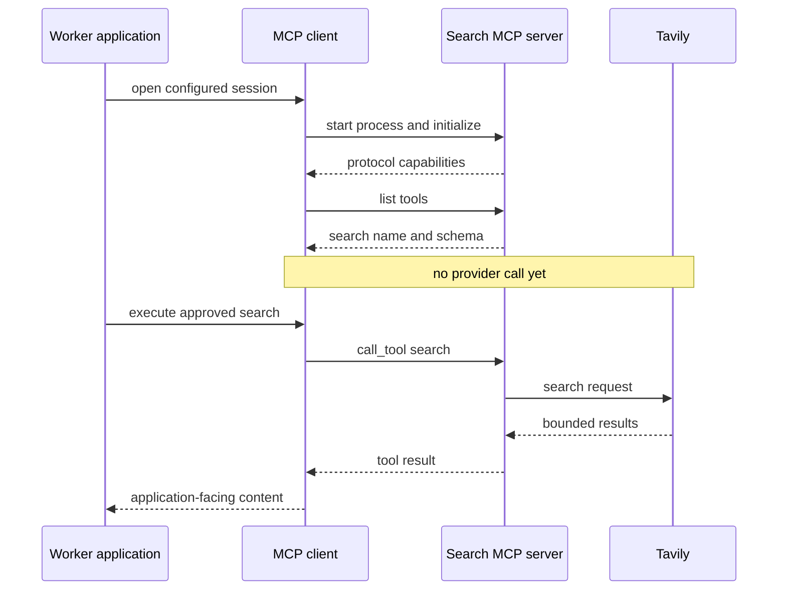
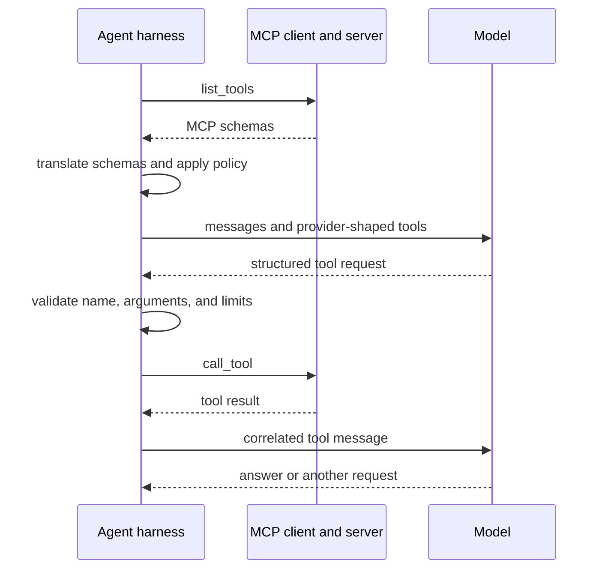
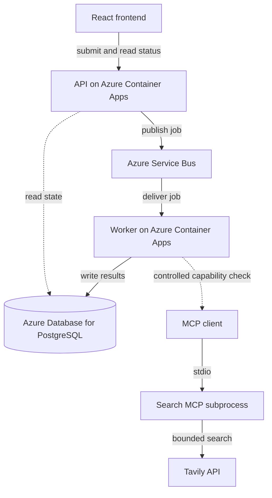

# Chapter 5: MCP and Capability Boundaries

Chapter 4 keeps market data outside the tool system because every ticker needs it. Web search has a different contract. It reaches an external provider, consumes a limited budget, returns untrusted text, and is useful only when a research question needs current public information.

That makes search a candidate tool, but the word *tool* does not explain how application code discovers or invokes it. The Model Context Protocol (MCP) supplies that boundary. This chapter studies the protocol before a model is allowed to choose anything.

The distinction is essential: MCP connects application code to capability servers. A language model is neither the MCP client nor the MCP server. The application still translates schemas, applies policy, validates requests, executes approved calls, and returns results.

> **Chapter snapshot**
> - **Starting point:** Required market data and risk rules run through deterministic application calls; optional web search is not part of automatic processing.
> - **Focus in this chapter:** Tool registration, explicit client wiring, protocol initialization, schema discovery, controlled execution, and the boundary around untrusted search results.
> - **Finished repository:** The current search service uses stateless streamable HTTP in its own process; the compact stdio lifecycle in this chapter isolates the same protocol responsibilities.
> - **Coming next:** Chapter 6 adds the first model-facing harness that may accept a structured tool request and execute only an approved capability.

## What This Chapter Explains

An MCP tool becomes usable through several separate events. A function is registered in one server. A configured client reaches that server. The peers initialize a protocol session. The client discovers a schema. Only then may it execute the function.

Those events have different failure modes and different costs:

| Event | What happens | Tavily search cost |
|---|---|---:|
| Registration | A function is added to one server instance. | None |
| Connection | A client starts or reaches that configured server. | None |
| Initialization | The peers negotiate protocol compatibility. | None |
| Discovery | The client retrieves registered tool schemas. | None |
| Execution | The client invokes `search`, which calls Tavily. | Yes |

A server can register correctly and still be unreachable. A client can initialize and discover the wrong schema. Discovery can pass while execution fails because a provider key is missing. Treating the lifecycle as one vague “tool call” makes those failures much harder to locate.

## Protocol Lifecycle

The chapter mechanism uses standard input and output, or **stdio**, because it makes process ownership visible. The MCP client starts the server as a child process and exchanges protocol messages over the child's input and output streams.



The current repository later replaces the child process with a long-running HTTP service. Transport and lifecycle change, but registration, initialization, discovery, and execution remain distinct.

## The Server Owns a Narrow Capability

An MCP server exposes a reviewed function with a name, description, input schema, and implementation. The SDK derives the schema from type hints and the docstring:

```python
mcp = MCPServer("search-server")


@mcp.tool()
def search(query: str, max_results: int = 5) -> list[dict]:
    """Search the web and return title, content, and URL results."""
    if not TAVILY_API_KEY:
        raise EnvironmentError("TAVILY_API_KEY not set")

    response = TavilyClient(api_key=TAVILY_API_KEY).search(
        query=query,
        max_results=max_results,
        include_answer=False,
    )
    return [
        {
            "title": result.get("title", ""),
            "content": result.get("content", ""),
            "url": result.get("url", ""),
        }
        for result in response.get("results", [])
    ]
```

Registration is local to this server instance. It does not publish to a global directory, contact Tavily, or notify a model. The provider key is required when `search` executes, not when the schema is discovered.

Returning a small application-owned shape matters. Provider response objects stay behind the server, result count is bounded, and source URLs remain attached to content. A later model needs provenance because web text can be stale, false, or deliberately manipulative.

> **Production Lens:** A small typed tool surface is production-shaped because it narrows authority and makes validation possible. A production search boundary also needs provider timeouts, output limits, rate limits, audit records, egress controls, secret rotation, and explicit treatment of returned text as untrusted data.

## The Client Owns Explicit Wiring

There is no ambient MCP directory that automatically locates local servers. A stdio client must know which command to start and which working directory the child receives.

```python
server_params = StdioServerParameters(
    command="uv",
    args=["run", "python", "search_server.py"],
    cwd="backend/worker/mcp_server",
)
```

This configuration is part of the application boundary. Process startup happens for each short-lived client lifecycle unless the session is reused. Environment variables must be inherited or supplied deliberately. Relative paths resolve from the child's working directory, not from the caller's source file. Server logs belong on standard error because arbitrary output on standard output can corrupt framed protocol messages.

File-relative resource lookup avoids an accidental dependency on the launching shell. The compact stdio implementation resolves its local environment file from `__file__`; the evolved Azure service removes that file dependency and resolves its own secret through its own identity.

## Discovery Is Evidence, Not Execution

After initialization, `list_tools()` retrieves the schemas registered by the connected server:

```python
async with stdio_client(server_params) as (read, write):
    async with ClientSession(read, write) as session:
        await session.initialize()
        tools = await session.list_tools()
```

Useful discovery evidence includes the tool name and its full input schema. Finding a tool named `search` is insufficient if its required arguments are wrong. The expected schema contains a required string query and an optional integer result limit.

Discovery works without a Tavily key because the decorated function has not run. That negative observation proves more than a successful live call: transport and schema can be tested without provider availability, external quota, or changing web results.

## Execution Crosses the External Boundary

Only `call_tool()` spends provider budget:

```python
result = await session.call_tool(
    "search",
    {
        "query": "Apple latest quarterly earnings",
        "max_results": 3,
    },
)
```

A stable execution check validates structure rather than headlines. The result count does not exceed the requested limit, and each usable result retains title, content, and URL. An invalid argument type should fail schema validation before becoming a provider request.

This separation localizes failures. If discovery succeeds but execution fails, the MCP handshake is healthy. The likely boundary is provider authentication, quota, timeout, or the function itself.

## The Worker Wrapper Does Not Imply Automatic Use

Application code benefits from one wrapper that hides transport details. In the chapter lifecycle, that wrapper opens a stdio session, initializes it, calls the known tool, and returns text content.

```python
async def search_via_mcp(query: str, max_results: int = 5) -> list[str]:
    async with stdio_client(server_params) as (read, write):
        async with ClientSession(read, write) as session:
            await session.initialize()
            result = await session.call_tool(
                "search",
                {"query": query, "max_results": max_results},
            )
            return [
                block.text
                for block in result.content
                if hasattr(block, "text")
            ]
```

The wrapper is proven plumbing, not orchestration. Calling it automatically once per ticker would turn a future judgment into unconditional cost. At this point, ordinary ticker processing does not consume search quota.

The current wrapper uses streamable HTTP instead. The current server is stateless, listens as a separate service, and returns single-JSON responses because streamed responses hung across Azure Container Apps internal ingress. The wrapper also scans returned documents before they can enter a later model context. Those are later hardening and deployment changes built on the same capability contract.

## Where the Model Fits

MCP does not make a model tool-aware by itself. A future harness must translate MCP schemas into the model provider's format, choose which tools to expose, validate model-produced names and arguments, execute approved requests, and append correlated results.



The model requests. The harness decides whether the request is permitted. MCP standardizes capability communication; it does not replace application policy.

## Behavior Evidence

| Observation | Boundary demonstrated |
|---|---|
| The server remains available before any call | Registration does not execute the provider function. |
| `list_tools()` works without a provider key | Discovery is independent of provider authentication. |
| The returned schema includes `query` and `max_results` | The client sees the intended contract, not only a matching name. |
| One bounded call retains source URLs | Execution crosses the provider boundary without discarding provenance. |
| A normal ticker job produces no Tavily usage | Available capability is not the same as automatic invocation. |
| Discovery succeeds while a live call reports missing credentials | Protocol health and provider health are separable. |

## Incident: Documentation Did Not Match the Installed SDK

The first implementation followed examples importing `FastMCP` from a path absent in the installed package. The failure happened before any server connection or provider call. Inspecting the installed SDK showed `mcp.server.mcpserver.MCPServer` with the decorator and run methods the application needed.

The protocol design did not change; the import did. The operating rule is to distinguish stable protocol concepts from one SDK's current convenience API and to pin the dependency version tested by the repository.

## Incident: The Working Directory Was Not the File Directory

The stdio server worked when launched manually from one folder and failed when spawned by the client. A relative environment-file path resolved against the child process working directory, which the implementation had assumed incorrectly. Discovery still passed; the missing key surfaced only during execution.

Resolving local resources from `__file__` fixed the teaching implementation. The later service gives secret retrieval to the server's own managed identity. Both designs make ownership and path resolution explicit.

## Azure Resources for This Stage

Chapter 5 does not add an Azure resource for the stdio MCP mechanism. It reuses the distributed path already active from Chapter 3: the API and worker run in Azure Container Apps, Service Bus delivers jobs, PostgreSQL stores status, and Azure Container Registry supplies their images. Tavily is an external provider, and the chapter MCP server runs as a worker-owned subprocess.

The separate MCP Container App and its managed identity describe the evolved repository, not this chapter stage.

## Architecture After This Chapter



The dotted edge marks a proven optional path outside automatic job processing. Search does not yet run for every ticker, and no model chooses it.

## Read the Chapter Code

| File | What to inspect |
|---|---|
| `backend/worker/mcp_server/search_server.py` | Current tool registration, HTTP transport, service-owned secret resolution, and single-JSON response choice. |
| `backend/worker/tools/web_search.py` | Current MCP client lifecycle and the untrusted-document scanning boundary. |
| `backend/worker/mcp_server/README.md` | The service boundary; this file remains minimal and is not a setup guide. |

## Known Limitations

No model chooses tools at this stage. The compact stdio lifecycle pays process-startup cost for each new session, has no offline MCP fixture, and depends on an external paid search provider for live execution. It has no formal rate limiter, approval workflow, result-size policy beyond the requested count, or prompt-injection defense.

The current HTTP service solves process lifetime and secret ownership differently, but those improvements do not make web content trustworthy or eliminate provider cost.

## Next

The capability is discoverable and callable, but nothing can decide when it is useful. Chapter 6 builds the first model/tool conversation loop: it translates tool descriptions, accepts structured requests, executes only allowlisted functions, returns correlated results, and stops within explicit limits.
