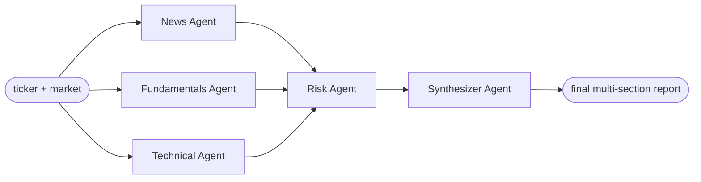
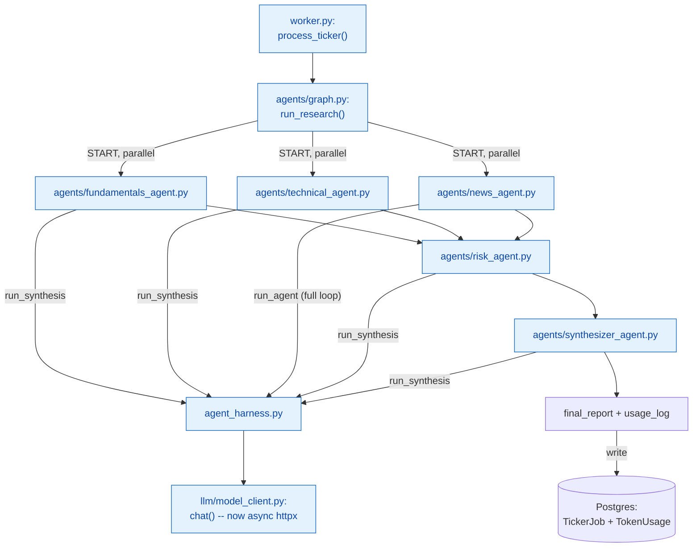
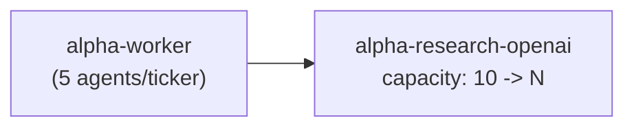
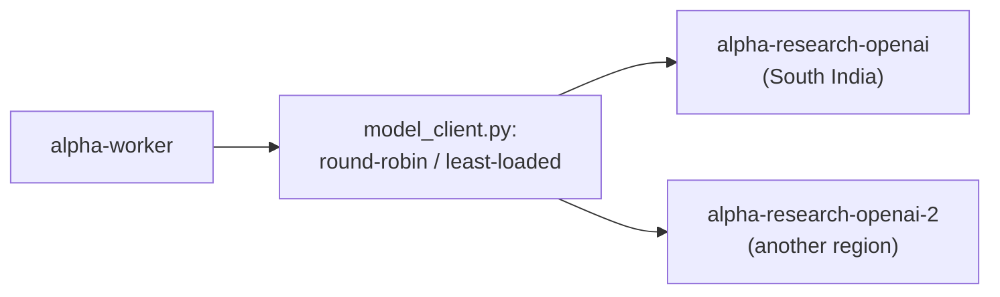
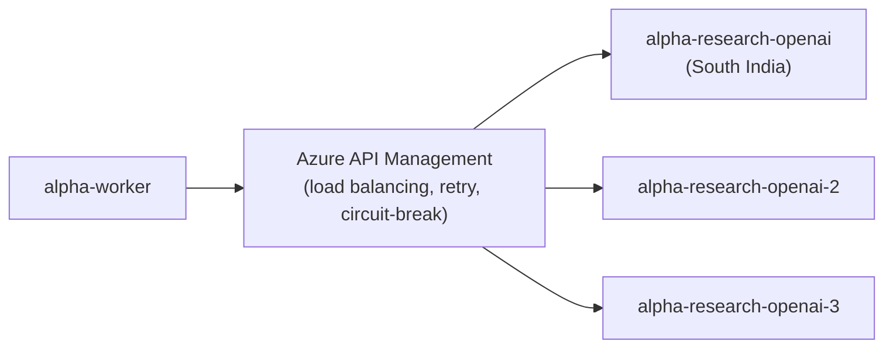

# Chapter 5 — Multi-Agent

*Phase 5 is in progress. This chapter covers the multi-agent graph — built, wired into the worker, and proven end to end locally. Skills restructuring, real three-tier memory, and the deploy are still ahead.*

## From One Agent to Five

Phase 4 ended with a single flat agent — one loop, one system prompt, a handful of tools it could reach for. Phase 5's whole premise is that a real research report benefits from several *narrower* agents working in parallel rather than one generalist trying to reason about everything at once — the same shape the prior related project assessed back in Chapter 3 already used for real, and the shape this project's own roadmap named from the start: News, Fundamentals, Technical, Risk, Synthesizer.

## Learning From the Prior Project Again, More Precisely This Time

Before building anything, that prior project's actual orchestration config was read directly rather than worked from memory — worth doing properly, since the real shape turned out richer than a rough recollection suggested. It runs **15 domain agents plus a synthesizer**, not a flat dozen: fundamentals, technical analysis, news sentiment, macro trends, employee feedback, institutional flows, insider/promoter activity, competitive landscape, ESG/governance, quarterly reports, leadership, regulatory/legal, dividend/capital, a dedicated Devil's Advocate agent, and valuation — organized into real dependency phases, including a **hard-stop gate**: if Fundamentals triggers a genuine disqualifier (debt rising three years straight, ROE and ROCE both under 12%), the whole pipeline short-circuits straight to a `DO NOT BUY` synthesis instead of spending the other 14 agents' worth of calls on a stock that already failed.

Only three of those 15 map directly onto this project's plan — Fundamentals, Technical, News — because only those three have data sources this project actually has (`yfinance`, Tavily). The other 11 are missing not because the ideas are wrong, but because their real value comes from data sources this project deliberately didn't reuse: a proprietary financial-data site's scraping, NSE insider filings, employee-review-site scraping — all India-only, with no US equivalent, a decision already logged when that project was first assessed back in Phase 3 ("reuse the patterns, not the scaffolding"). A real, explicit scoping call was made here: build the 5-agent core market-agnostic, as already planned, and treat any *additional* India-sourced agents as their own later, explicitly India-only addition — not a "phase 1 of a US rollout," since finding a genuine US equivalent for something like NSE insider-trading disclosures is a real, separate integration, not a lightweight follow-up.

One pattern worth remembering even though it wasn't built this pass: the **Devil's Advocate agent** — a dedicated node whose entire job is arguing against the bullish case. Genuinely interesting, deliberately deferred.

## The Missing Piece: A Real Technical Data Source

Before any agent could be split out, a real gap surfaced: `fetch_stock_data` covers Fundamentals, `search_web`/`assess_news_sentiment` covers News, but **Technical analysis had no data source at all**. Rather than fake it, a real one got built first.

**Simple Moving Average (SMA)** — the average closing price over the last N days, recalculated fresh each day as the window slides forward. Smooths out daily noise to reveal whether a price is meaningfully above or below where it's recently been settling.

**RSI (Relative Strength Index)** — a 0–100 measure of whether a stock has been bought or sold more aggressively than usual over a lookback window (14 days is standard). The actual math:

```python
rs = avg_gain / avg_loss
rsi = 100 - (100 / (1 + rs))
```

`RS` on its own isn't bounded — average gain divided by average loss can range from 0 (no gains at all) to infinity (no losses at all). The `100 - 100/(1+RS)` transform is what squeezes that unbounded ratio onto a fixed 0–100 scale: if there were no losses at all, `100/(1+RS)` → 0 so RSI → 100; if there were no gains at all, RS = 0 so RSI = `100 - 100 = 0`; if gains and losses were exactly equal, RS = 1 so RSI = `100 - 50 = 50`, the neutral midpoint. A worked example: average gain $2, average loss $1 → RS = 2 → `100/(1+2) = 33.3` → RSI = `100 - 33.3 = 66.7` — gains outweighing losses 2-to-1 lands around 67, leaning toward the commonly-cited ">70 = overbought" territory without quite reaching it.

```python
# tools/technical_indicators.py
def fetch_technical_indicators(ticker: str, market: str) -> dict:
    symbols_to_try = resolve_symbol_candidates(ticker, market)
    for symbol in symbols_to_try:
        history = yf.Ticker(symbol).history(period="6mo")
        if not history.empty:
            closes = history["Close"]
            return {
                "ticker": ticker, "resolved_symbol": symbol, "market": market,
                "current_price": round(closes.iloc[-1], 2),
                "sma_20": _simple_moving_average(closes, 20),
                "sma_50": _simple_moving_average(closes, 50),
                "rsi_14": _rsi(closes, 14),
            }
    ...
```

Verified with real data on both markets: AAPL came back with RSI 26.09 — below 30, "possibly oversold" — with its price sitting below its own 20-day average, an internally consistent read. RELIANCE.NS came back with RSI 57.8, roughly neutral, price close to both moving averages.

One small, genuine refactor came out of this: both `fetch_stock_data` and the new tool need the identical "which real exchange symbol does this ticker map to" logic. With two real callers now, `resolve_symbol_candidates(ticker, market)` was extracted out of `stock_data.py` rather than duplicated — worth doing now that duplication was real, not before.

## Generalizing the Harness

Phase 4's `agent.py` and `context_assembler.py` were hardcoded to one fixed system prompt and one fixed toolset — fine for one agent, wrong the moment there are five. The fix split the reusable *mechanism* from the agent-specific *parameters*: `context_assembler.py`'s `system_prompt` became an argument instead of a module constant, and the loop itself moved into a new `agent_harness.py`.

A second, more interesting refinement came out of thinking honestly about which agents have genuine tool-choice at all. Fundamentals and Technical should *always* fetch their data — there's no scenario where they wouldn't, which is exactly the "direct call, not a tool" distinction from Chapter 3, one level up. Giving them the full tool-calling loop would mean paying real overhead (tool schemas sent every turn, an LLM "deciding" something that was never actually in question) for zero benefit. So `agent_harness.py` now exports two functions:

```python
async def run_agent(system_prompt, user_message, tool_schemas, tool_registry, max_turns=5) -> dict:
    """The full loop -- for genuine tool-choice cases."""
    ...

async def run_synthesis(system_prompt, user_message) -> dict:
    """One LLM call, no tools, no loop -- for direct-fetch-then-synthesize cases."""
    messages = assemble_context([{"role": "user", "content": user_message}], system_prompt)
    result = chat(messages, tools=[])
    return {"status": "success", "answer": result["message"]["content"], "usage": result["usage"]}
```

Not a guess — checking the prior project's own Fundamentals agent found it does exactly this, with a real number attached in its own code comments: *"Direct (non-ReAct) approach: Python functions do the data fetching, then a single llm_generate() call analyses the data and returns structured JSON. This avoids LangGraph tool-schema overhead (~8K tokens saved per call)."*

## The Five Agents

**Fundamentals and Technical** are near-identical in shape: fetch directly, synthesize once.

```python
# agents/fundamentals_agent.py
async def run(ticker: str, market: str) -> dict:
    data = fetch_stock_data(ticker, market)
    if "error" in data:
        return {"status": "error", "error": data["error"], "data": data}
    user_message = f"Ticker: {data['ticker']} ({data['resolved_symbol']})\nPrice: ...\n..."
    result = await run_synthesis(SYSTEM_PROMPT, user_message)
    result["data"] = data
    return result
```

Run standalone against real AAPL data, the result was noticeably better-reasoned than anything Phase 4 produced: *"trading above the midpoint of its 52-week range... roughly 11% below its 52-week high"* — correct, where Chapter 4's single flat agent twice got this exact kind of range-position judgment wrong. Worth naming honestly rather than claiming a clean explanation: this could be `gpt-5-mini` simply being a stronger model than the `qwen3:8b` runs in Chapter 4, or it could be that handing an agent clean, already-fetched numbers to reason over produces more reliable arithmetic than making it juggle a tool-calling decision and the math in the same turn. Both are plausible; nothing here isolates which one actually mattered more — an honest open question, not a solved one.

**News** kept the full `run_agent` loop unchanged from Phase 4 — real judgment is genuinely involved here (what to search for, whether the sentiment skill applies to what's found), so the overhead `run_synthesis` avoids is exactly what this agent needs. Run standalone, it correctly searched, correctly loaded the `assess_news_sentiment` skill, and produced a real, well-reasoned judgment: a trade-secrets lawsuit and an earnings guidance miss both correctly flagged as genuine near-term risk, while explicitly noting *"No evidence was found of sudden executive departures under a cloud, accounting irregularities, major recalls, or data breaches"* — the rubric's own distinctions, genuinely applied, not just a wall of everything found.

**Risk** is the first agent in this project where an LLM's synthesis is actually load-bearing, not a nice-to-have narrative layer on top of numbers that already spoke for themselves:

```python
# agents/risk_agent.py
async def run(fundamentals_data, fundamentals_summary, technical_summary, news_summary) -> dict:
    flags = flag_risk_factors(fundamentals_data) if "error" not in fundamentals_data else []
    user_message = f"Deterministic risk flags: {flags}\n\nFundamentals: ...\n\nTechnical: ...\n\nNews: ..."
    result = await run_synthesis(SYSTEM_PROMPT, user_message)
    result["flags"] = flags
    return result
```

Tested with real outputs from the other three agents, it correctly noticed *"both fundamentals (valuation/guidance) and news point the same (negative) direction"* — genuine cross-signal reasoning, not three summaries pasted together — and added a nuance none of the inputs stated explicitly: a low RSI *"signals a possible short-lived oversold bounce,"* distinguishing "falling" from "oversold-and-likely-to-bounce," a real, valid technical-analysis distinction.

**Synthesizer** closes the loop — no new data, no tool choice, purely combining the other four into one report a person could actually read. Its system prompt explicitly says *"Do not repeat numbers verbatim across sections — synthesize, don't paste,"* and the real output honored that: exact P/E and price figures from Fundamentals became *"priced with growth expectations baked in"* in the final report — real instruction-following, not just tolerance for it.

## The Graph, and a Real Concurrency Bug Caught Before It Shipped



LangGraph's `StateGraph` is the **orchestrator** in the exact sense Chapter 4 defined it: it decides which agent runs when and what state passes between them, and never reimplements the harness cycle itself — every node below just calls one of `agents/*.py`, each of which goes through the same shared `agent_harness.py`.

One real, non-obvious bug surfaced during design, not discovered by accident in testing: LangGraph's default state merge is **last-write-wins per key, not a sum**. Fundamentals, Technical, and News all run in parallel and each wanted to contribute its own token usage to a running total — but if all three read the *same* starting state (all zero) and each independently computed "zero plus my own usage," the final result would just be whichever node finished *last*, silently discarding the other two's contributions. A real concurrency trap, not a hypothetical one.

```python
class ResearchState(TypedDict):
    ...
    # A list with an `operator.add` reducer sidesteps the read-modify-write race
    # entirely: each node just appends its own usage, concatenation is safe
    # under concurrent writes, and the real total gets summed once, after the
    # graph finishes.
    usage_log: Annotated[list[dict], operator.add]
```

Every other field in the state (`fundamentals_summary`, `technical_summary`, `news_summary`) is safe under plain last-write-wins, because each one has exactly **one** writer — the concurrency problem only exists where multiple parallel nodes genuinely want to contribute to the *same* key.

Run end to end, the fix proved itself: a correctly-summed total across all five real LLM calls (`$0.00557` for the full AAPL run), not just one agent's worth silently standing in for the whole.

## Wiring It Into the Worker — the Phase 4 Hybrid Retired

Phase 4's `process_ticker` called `fetch_stock_data` and `flag_risk_factors` directly, *and separately* ran a single flat agent — a deliberate hybrid, accepted at the time because the duplication was cheap. That reasoning no longer applies: the graph's own Fundamentals agent already calls `fetch_stock_data`, and the graph's own Risk agent already calls `flag_risk_factors`. Keeping worker.py's separate direct calls would now be genuinely redundant work, not cheap insurance.

```python
# worker.py
graph_result = await run_research(ticker, market)
data = graph_result.get("fundamentals_data", {})
...
flags = graph_result.get("risk_flags", [])
summary_line += " | Report: " + graph_result.get("final_report", "")
```

Verified fully end to end locally against a real `TickerJob` row (MSFT/US): a real multi-section report — fundamentals, technical, news, risk, and a synthesized headline — landed in Postgres, alongside a correctly-summed `TokenUsage` row for the full five-agent run.

## A Correction: The Graph Wasn't Actually Running in Parallel

This needs to be said plainly rather than quietly fixed and left unmentioned: the graph above was described as running Fundamentals, Technical, and News "in parallel" — and the *wiring* was correct — but the actual execution wasn't genuinely concurrent until this got checked directly. Asked what scaling further would take, the honest first step was measuring, not assuming: instrumenting the real graph run with timestamps around each node.

```
fundamentals START  t=430913.67
fundamentals END    t=430923.63  (took 9.97s)
news START           t=430923.63    <- starts the INSTANT fundamentals ends
technical START       t=430926.77
news END             t=430942.46  (took 18.83s)
TOTAL wall-clock: 45.26s
```

`news` didn't start until `fundamentals` had *completely* finished. Total wall-clock (45s) was close to the *sum* of each agent's own time, not the *max* — the opposite of what real concurrency should look like.

**The cause**: `llm/model_client.py`'s `chat()` used `requests.post()` — a synchronous, blocking call — and wasn't even declared `async def`. Every agent's harness function is `async def` and calls `chat()` without `await`, because it was never a coroutine to begin with. The mechanics matter here: `asyncio` only lets other tasks run when a coroutine hits a genuine `await` on something async. A blocking synchronous call inside an `async def` function doesn't yield control at all — it freezes the *entire* event loop until it returns. Wiring parallel edges in a graph says nothing about whether the work inside those edges can actually overlap; that depends entirely on whether the I/O underneath is genuinely async.

The fix: switch to `httpx.AsyncClient`, make `chat()` itself `async def`, and add `await` at every call site:

```python
# llm/model_client.py
async def chat(messages: list[dict], tools: list[dict]) -> dict:
    async with httpx.AsyncClient(timeout=90.0) as client:
        response = await client.post(CHAT_URL, headers=..., json=...)
    ...
```

Re-measured with the same instrumentation, the fix proved itself:

```
fundamentals START  t=431250.92
news START           t=431252.02    <- now within 1 second of fundamentals
technical START       t=431252.03
TOTAL wall-clock: 33.49s   (bound by the SLOWEST branch, not the sum)
```

**A second real gotcha, surfaced by the fix itself, not separately discovered**: the very first re-test failed outright with `httpx.ReadTimeout`. `httpx` defaults to a 5-second timeout; `requests` (used before) has no default timeout at all, so this was never a problem until switching libraries. Three agents now genuinely competing for the same rate-limited Azure OpenAI capacity concurrently made responses legitimately slower than 5 seconds under real load. Fixed with an explicit `timeout=90.0`.

> 🏭 **Production Lens:** "The graph diagram shows parallel edges" and "the work actually overlaps in wall-clock time" are two different claims, and only measuring proves the second one. This is exactly the kind of thing easy to assume is true because the code *looks* concurrent (every function is `async def`, the graph draws parallel arrows) — and exactly why this project has leaned on "verify actual behavior, don't trust what a command or a diagram implies" as a standing discipline since the Container Apps stale-deploy incident back in Chapter 3.

**Scaling further has two more real dimensions beyond this fix, worth naming rather than assuming this fix alone means "solved":**
1. **Azure OpenAI's rate limit becomes the real ceiling as concurrency increases.** The current deployment's `GlobalStandard` capacity (10K tokens/minute) is a genuine, non-code limit — more parallel agents or more concurrent tickers will eventually hit real `429` responses, fixable only by raising capacity or adding client-side backoff, not more `asyncio`.
2. **Multiple *tickers* running concurrently is a different axis than one ticker's graph running concurrently.** `worker.py`'s `async for msg in receiver` loop still processes Service Bus messages one at a time — two different tickers in the same request still run their graphs sequentially, even after this fix. The real production answer for that is more `alpha-worker` Container App replicas, autoscaled on queue depth — horizontal scaling, not parallelizing further inside one process.

## Key Files From This Chapter

| File | What it does |
|---|---|
| `backend/worker/tools/technical_indicators.py` | `fetch_technical_indicators()` — real SMA-20, SMA-50, RSI-14 from `yfinance` price history. |
| `backend/worker/tools/stock_data.py` | `resolve_symbol_candidates()` extracted out — now shared by this tool and the technical indicators tool. |
| `backend/worker/agent_harness.py` | The generalized engine: `run_agent()` (full tool-calling loop) and `run_synthesis()` (single call, no tools) — every agent below is built on one of these two. |
| `backend/worker/context_assembler.py` | `system_prompt` changed from a fixed constant to a parameter — the precondition for five agents each having their own. |
| `backend/worker/agents/fundamentals_agent.py` | Direct fetch + `run_synthesis` — fundamentals narrative. |
| `backend/worker/agents/technical_agent.py` | Direct fetch + `run_synthesis` — momentum narrative. |
| `backend/worker/agents/news_agent.py` | `run_agent`'s full loop — search + the `assess_news_sentiment` Skill, genuine judgment preserved from Chapter 4. |
| `backend/worker/agents/risk_agent.py` | Deterministic `flag_risk_factors` + cross-signal synthesis over the other three agents' outputs. |
| `backend/worker/agents/synthesizer_agent.py` | Combines all four into the final report. |
| `backend/worker/agents/graph.py` | The real LangGraph `StateGraph` — parallel fan-out, fan-in to Risk, then Synthesizer; the `usage_log` reducer fix lives here. |
| `backend/worker/worker.py` | `process_ticker` now calls the graph directly, retiring the Phase 4 hybrid. |
| `backend/worker/llm/model_client.py` | `chat()` switched from blocking `requests` to genuinely async `httpx.AsyncClient` — the fix that made the graph's parallel wiring actually run in parallel. |

## The Flow So Far



## Azure Architecture — Nothing New Deployed Yet

Consistent with every prior chapter's discipline: this section only shows what's actually live. Phase 5's whole build so far — the graph, the five agents, the async fix — has been proven locally, exactly like Phase 4's agent was before its own deploy step. The live Azure architecture is **unchanged from Chapter 4** — same Static Web App, API, Service Bus, worker, Postgres, Redis, and Azure OpenAI deployment. No new Azure resource has been created this chapter; the same `alpha-research-openai` deployment now just gets called by five agents per ticker instead of one.

## Scaling Options — Exploratory, Not Yet Built

This section is different in kind from every diagram elsewhere in this book: it does **not** show what's deployed. It shows real architectural options for the question raised earlier in this chapter — Azure OpenAI's rate limit becomes the actual ceiling as agent concurrency increases — worked through visually rather than left as a paragraph. None of these are built; this is what "scaling the Foundry layer" could look like if it became necessary.

**Option A — Raise capacity on the existing deployment.** No architecture change at all, just a bigger number on the same resource (`GlobalStandard` capacity 10 → higher, or switch to Provisioned Throughput Units for dedicated, predictable capacity). The simplest lever, with a real ceiling of its own.



**Option B — Multiple deployments, load-balanced in our own code.** Provision the same model in more than one Azure OpenAI resource (possibly different regions), store multiple endpoint+key pairs, and have `model_client.py` pick one per request.



**Option C — Azure API Management fronting a backend pool.** Microsoft's own documented pattern for this exact problem: APIM handles load balancing, retries, and circuit-breaking across multiple Azure OpenAI backends natively, instead of `model_client.py` owning that logic by hand.



Option A is the immediate lever if this ever becomes a real constraint; Option C is the genuine production answer once load is high and predictable enough to justify the extra piece of infrastructure. Neither is built — noted here as real options, not a commitment.

## Worker Autoscaling — Fixed for Real, Unlike the Options Above

Unlike the exploratory Foundry-scaling options, this one is real and deployed: a genuine KEDA `azure-servicebus` scale rule on `alpha-worker`, added and verified the same way as everything else in this project — checked, not assumed.

```bash
az containerapp update --name alpha-worker --resource-group alpha-rg \
  --scale-rule-name servicebus-queue-scale \
  --scale-rule-type azure-servicebus \
  --scale-rule-metadata "queueName=research-jobs" "messageCount=5" \
  --scale-rule-auth "connection=servicebus-conn"
```

Reused the existing `servicebus-conn` secret rather than creating a new one — it was already scoped to `research-jobs` via its own `EntityPath`. Verified independently via `az containerapp show`, not the update command's own success message:

```
rules: [{"name": "servicebus-queue-scale", "custom": {"type": "azure-servicebus",
  "metadata": {"queueName": "research-jobs", "messageCount": "5"},
  "auth": [{"triggerParameter": "connection", "secretRef": "servicebus-conn"}]}}]
```

Targets roughly one replica per five queued messages, up to the existing `maxReplicas: 10`. **One honest limit on this claim**: the configuration is verified real; watching it actually trigger a live scale-up under real concurrent load hasn't been done yet, since that means submitting enough concurrent tickers to push the queue past five messages — real additional Azure OpenAI spend across multiple replicas, left as a deliberate choice rather than spent unprompted.

## Where Phase 5 Actually Stands

The multi-agent graph is real, proven, and wired into the worker — genuinely concurrent execution now (measured, not assumed), a genuine cross-signal Risk judgment, and two real concurrency bugs caught before either shipped silently wrong: the `usage_log` last-write-wins trap, and the blocking-`chat()` bug that made "parallel" wiring not actually mean parallel execution. Worker autoscaling, flagged earlier as a real gap, is now genuinely fixed and verified, not just claimed. Still ahead: restructuring Skills to be genuinely shared and discoverable across agents rather than each agent hardcoding its own tool list (today's News agent still imports `assess_news_sentiment` directly — nothing scans a `skills/` folder and offers it dynamically), the real three-tier memory model (short-term Redis, semantic `pgvector`, profile Postgres tables), and — as always in this project — an actual deploy and a live check before this chapter is called finished.

## What Came Out of This Chapter (So Far)

- A precise, source-checked understanding of the prior project's real 15-agent structure — and an honest, explicit decision to build a smaller 5-agent core now, deferring the India-sourced agents as their own later, explicitly-scoped addition rather than pretending they're a lightweight follow-up.
- A real technical-indicators tool, with SMA and RSI genuinely understood — not just called, but the actual math worked through by hand, including why the RS-ratio-to-0–100 transform behaves the way it does at its extremes.
- A generalized harness (`run_agent` vs. `run_synthesis`) drawing a real, principled line between "genuine tool-choice" and "always-fetch-then-synthesize" — validated against the prior project's own equivalent design choice, not invented in isolation.
- Five real agents, each proven standalone before being wired together — including the first agent in this project (Risk) where an LLM's synthesis is genuinely load-bearing, not a narrative layer on top of numbers that already spoke for themselves.
- A real LangGraph `StateGraph`, and two real concurrency bugs caught rather than shipped silently wrong: a last-write-wins state-merge trap (fixed with a proper reducer) and a blocking synchronous HTTP call that made "parallel" graph wiring not actually mean parallel execution (fixed by switching to a genuinely async HTTP client) — plus the follow-on timeout gotcha that fix itself surfaced. A concrete lesson that "the code looks concurrent" and "the code IS concurrent" are different claims, and only measuring proves the second one.
- The Phase 4 hybrid design retired for a principled reason, not just because more code existed: once the graph's own agents did the same deterministic work internally, keeping a separate copy in `worker.py` stopped being cheap insurance and became genuine waste.
- A real, verified KEDA autoscaling rule on `alpha-worker`, closing a gap this same chapter had only flagged a day earlier — checked with `az containerapp show`, not trusted from a diagram label, the same discipline the concurrency bug itself was caught with.
- Real scaling options for the Foundry layer worked through as diagrams, explicitly kept separate from what's actually deployed — a distinction this book has held since Chapter 1's "only show what's built," extended here to mean "and never let a speculative diagram be mistaken for one."
- Phase 5 still open: Skills restructuring, real three-tier memory, and the first live deploy of any of it.
