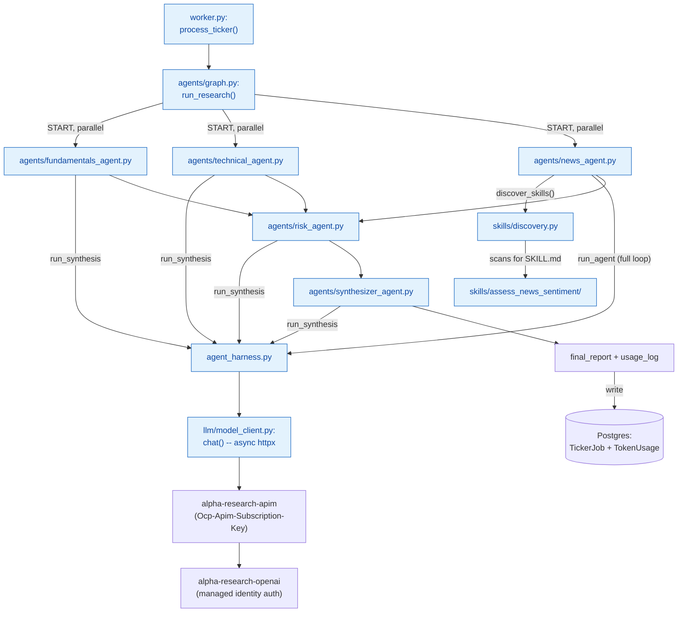
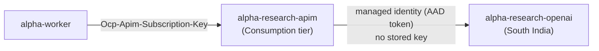
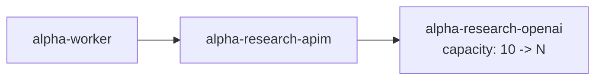
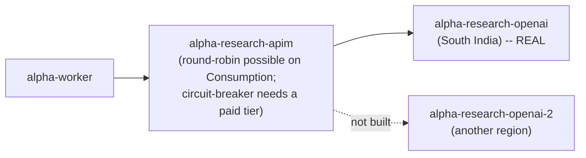
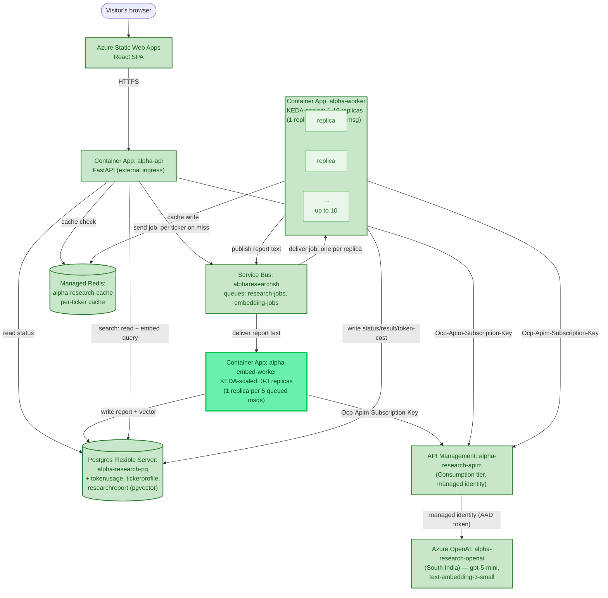

# Chapter 5 — Multi-Agent

*Phase 5 is in progress. This chapter covers the multi-agent graph — built, wired into the worker, and proven end to end locally. Skills restructuring, real three-tier memory, and the deploy are still ahead.*

## From One Agent to Five

Phase 4 ended with a single flat agent — one loop, one system prompt, a handful of tools it could reach for. Phase 5's whole premise is that a real research report benefits from several *narrower* agents working in parallel rather than one generalist trying to reason about everything at once — the same shape the prior related project assessed back in Chapter 3 already used for real, and the shape this project's own roadmap named from the start: News, Fundamentals, Technical, Risk, Synthesizer.

## Learning From the Prior Project Again, More Precisely This Time

Before building anything, that prior project's actual orchestration config was read directly rather than worked from memory — worth doing properly, since the real shape turned out richer than a rough recollection suggested. It runs **15 domain agents plus a synthesizer**, not a flat dozen: fundamentals, technical analysis, news sentiment, macro trends, employee feedback, institutional flows, insider/promoter activity, competitive landscape, ESG/governance, quarterly reports, leadership, regulatory/legal, dividend/capital, a dedicated Devil's Advocate agent, and valuation — organized into real dependency phases, including a **hard-stop gate**: if Fundamentals triggers a genuine disqualifier (debt rising three years straight, ROE and ROCE both under 12%), the whole pipeline short-circuits straight to a `DO NOT BUY` synthesis instead of spending the other 14 agents' worth of calls on a stock that already failed.

Only three of those 15 map directly onto this project's plan — Fundamentals, Technical, News — because only those three have data sources this project actually has (`yfinance`, Tavily). The other 11 are missing not because the ideas are wrong, but because their real value comes from data sources this project deliberately didn't reuse: a proprietary financial-data site's scraping, NSE insider filings, employee-review-site scraping — all India-only, with no US equivalent, a decision already logged when that project was first assessed back in Phase 3 ("reuse the patterns, not the scaffolding"). A real, explicit scoping call was made here: build the 5-agent core market-agnostic, as already planned, and treat any *additional* India-sourced agents as their own later, explicitly India-only addition — not a "phase 1 of a US rollout," since finding a genuine US equivalent for something like NSE insider-trading disclosures is a real, separate integration, not a lightweight follow-up.

One pattern worth remembering even though it wasn't built this pass: the **Devil's Advocate agent** — a dedicated node whose entire job is arguing against the bullish case. Genuinely interesting, deliberately deferred.

## The Missing Piece: A Real Technical Data Source

Before any agent could be split out, a real gap surfaced: `fetch_stock_data` covers Fundamentals, `search_web`/`assess_news_sentiment` covers News, but **Technical analysis had no data source at all**. Rather than fake it, a real one got built first.

**Simple Moving Average (SMA)** — the average closing price over the last N days, recalculated fresh each day as the window slides forward. Smooths out daily noise to reveal whether a price is meaningfully above or below where it's recently been settling.

**RSI (Relative Strength Index)** — a 0–100 measure of whether a stock has been bought or sold more aggressively than usual over a lookback window (14 days is standard). The actual math:

```python
rs = avg_gain / avg_loss
rsi = 100 - (100 / (1 + rs))
```

`RS` on its own isn't bounded — average gain divided by average loss can range from 0 (no gains at all) to infinity (no losses at all). The `100 - 100/(1+RS)` transform is what squeezes that unbounded ratio onto a fixed 0–100 scale: if there were no losses at all, `100/(1+RS)` → 0 so RSI → 100; if there were no gains at all, RS = 0 so RSI = `100 - 100 = 0`; if gains and losses were exactly equal, RS = 1 so RSI = `100 - 50 = 50`, the neutral midpoint. A worked example: average gain $2, average loss $1 → RS = 2 → `100/(1+2) = 33.3` → RSI = `100 - 33.3 = 66.7` — gains outweighing losses 2-to-1 lands around 67, leaning toward the commonly-cited ">70 = overbought" territory without quite reaching it.

```python
# tools/technical_indicators.py
def fetch_technical_indicators(ticker: str, market: str) -> dict:
    symbols_to_try = resolve_symbol_candidates(ticker, market)
    for symbol in symbols_to_try:
        history = yf.Ticker(symbol).history(period="6mo")
        if not history.empty:
            closes = history["Close"]
            return {
                "ticker": ticker, "resolved_symbol": symbol, "market": market,
                "current_price": round(closes.iloc[-1], 2),
                "sma_20": _simple_moving_average(closes, 20),
                "sma_50": _simple_moving_average(closes, 50),
                "rsi_14": _rsi(closes, 14),
            }
    ...
```

Verified with real data on both markets: AAPL came back with RSI 26.09 — below 30, "possibly oversold" — with its price sitting below its own 20-day average, an internally consistent read. RELIANCE.NS came back with RSI 57.8, roughly neutral, price close to both moving averages.

One small, genuine refactor came out of this: both `fetch_stock_data` and the new tool need the identical "which real exchange symbol does this ticker map to" logic. With two real callers now, `resolve_symbol_candidates(ticker, market)` was extracted out of `stock_data.py` rather than duplicated — worth doing now that duplication was real, not before.

## Generalizing the Harness

Phase 4's `agent.py` and `context_assembler.py` were hardcoded to one fixed system prompt and one fixed toolset — fine for one agent, wrong the moment there are five. The fix split the reusable *mechanism* from the agent-specific *parameters*: `context_assembler.py`'s `system_prompt` became an argument instead of a module constant, and the loop itself moved into a new `agent_harness.py`.

A second, more interesting refinement came out of thinking honestly about which agents have genuine tool-choice at all. Fundamentals and Technical should *always* fetch their data — there's no scenario where they wouldn't, which is exactly the "direct call, not a tool" distinction from Chapter 3, one level up. Giving them the full tool-calling loop would mean paying real overhead (tool schemas sent every turn, an LLM "deciding" something that was never actually in question) for zero benefit. So `agent_harness.py` now exports two functions:

```python
async def run_agent(system_prompt, user_message, tool_schemas, tool_registry, max_turns=5) -> dict:
    """The full loop -- for genuine tool-choice cases."""
    ...

async def run_synthesis(system_prompt, user_message) -> dict:
    """One LLM call, no tools, no loop -- for direct-fetch-then-synthesize cases."""
    messages = assemble_context([{"role": "user", "content": user_message}], system_prompt)
    result = chat(messages, tools=[])
    return {"status": "success", "answer": result["message"]["content"], "usage": result["usage"]}
```

Not a guess — checking the prior project's own Fundamentals agent found it does exactly this, with a real number attached in its own code comments: *"Direct (non-ReAct) approach: Python functions do the data fetching, then a single llm_generate() call analyses the data and returns structured JSON. This avoids LangGraph tool-schema overhead (~8K tokens saved per call)."*

## The Five Agents

**Fundamentals and Technical** are near-identical in shape: fetch directly, synthesize once.

```python
# agents/fundamentals_agent.py
async def run(ticker: str, market: str) -> dict:
    data = fetch_stock_data(ticker, market)
    if "error" in data:
        return {"status": "error", "error": data["error"], "data": data}
    user_message = f"Ticker: {data['ticker']} ({data['resolved_symbol']})\nPrice: ...\n..."
    result = await run_synthesis(SYSTEM_PROMPT, user_message)
    result["data"] = data
    return result
```

Run standalone against real AAPL data, the result was noticeably better-reasoned than anything Phase 4 produced: *"trading above the midpoint of its 52-week range... roughly 11% below its 52-week high"* — correct, where Chapter 4's single flat agent twice got this exact kind of range-position judgment wrong. Worth naming honestly rather than claiming a clean explanation: this could be `gpt-5-mini` simply being a stronger model than the `qwen3:8b` runs in Chapter 4, or it could be that handing an agent clean, already-fetched numbers to reason over produces more reliable arithmetic than making it juggle a tool-calling decision and the math in the same turn. Both are plausible; nothing here isolates which one actually mattered more — an honest open question, not a solved one.

**News** kept the full `run_agent` loop unchanged from Phase 4 — real judgment is genuinely involved here (what to search for, whether the sentiment skill applies to what's found), so the overhead `run_synthesis` avoids is exactly what this agent needs. Run standalone, it correctly searched, correctly loaded the `assess_news_sentiment` skill, and produced a real, well-reasoned judgment: a trade-secrets lawsuit and an earnings guidance miss both correctly flagged as genuine near-term risk, while explicitly noting *"No evidence was found of sudden executive departures under a cloud, accounting irregularities, major recalls, or data breaches"* — the rubric's own distinctions, genuinely applied, not just a wall of everything found.

**Risk** is the first agent in this project where an LLM's synthesis is actually load-bearing, not a nice-to-have narrative layer on top of numbers that already spoke for themselves:

```python
# agents/risk_agent.py
async def run(fundamentals_data, fundamentals_summary, technical_summary, news_summary) -> dict:
    flags = flag_risk_factors(fundamentals_data) if "error" not in fundamentals_data else []
    user_message = f"Deterministic risk flags: {flags}\n\nFundamentals: ...\n\nTechnical: ...\n\nNews: ..."
    result = await run_synthesis(SYSTEM_PROMPT, user_message)
    result["flags"] = flags
    return result
```

Tested with real outputs from the other three agents, it correctly noticed *"both fundamentals (valuation/guidance) and news point the same (negative) direction"* — genuine cross-signal reasoning, not three summaries pasted together — and added a nuance none of the inputs stated explicitly: a low RSI *"signals a possible short-lived oversold bounce,"* distinguishing "falling" from "oversold-and-likely-to-bounce," a real, valid technical-analysis distinction.

**Synthesizer** closes the loop — no new data, no tool choice, purely combining the other four into one report a person could actually read. Its system prompt explicitly says *"Do not repeat numbers verbatim across sections — synthesize, don't paste,"* and the real output honored that: exact P/E and price figures from Fundamentals became *"priced with growth expectations baked in"* in the final report — real instruction-following, not just tolerance for it.

## The Graph, and a Real Concurrency Bug Caught Before It Shipped


LangGraph's `StateGraph` is the **orchestrator** in the exact sense Chapter 4 defined it: it decides which agent runs when and what state passes between them, and never reimplements the harness cycle itself — every node below just calls one of `agents/*.py`, each of which goes through the same shared `agent_harness.py`.

One real, non-obvious bug surfaced during design, not discovered by accident in testing: LangGraph's default state merge is **last-write-wins per key, not a sum**. Fundamentals, Technical, and News all run in parallel and each wanted to contribute its own token usage to a running total — but if all three read the *same* starting state (all zero) and each independently computed "zero plus my own usage," the final result would just be whichever node finished *last*, silently discarding the other two's contributions. A real concurrency trap, not a hypothetical one.

```python
class ResearchState(TypedDict):
    ...
    # A list with an `operator.add` reducer sidesteps the read-modify-write race
    # entirely: each node just appends its own usage, concatenation is safe
    # under concurrent writes, and the real total gets summed once, after the
    # graph finishes.
    usage_log: Annotated[list[dict], operator.add]
```

Every other field in the state (`fundamentals_summary`, `technical_summary`, `news_summary`) is safe under plain last-write-wins, because each one has exactly **one** writer — the concurrency problem only exists where multiple parallel nodes genuinely want to contribute to the *same* key.

Run end to end, the fix proved itself: a correctly-summed total across all five real LLM calls (`$0.00557` for the full AAPL run), not just one agent's worth silently standing in for the whole.

## Wiring It Into the Worker — the Phase 4 Hybrid Retired

Phase 4's `process_ticker` called `fetch_stock_data` and `flag_risk_factors` directly, *and separately* ran a single flat agent — a deliberate hybrid, accepted at the time because the duplication was cheap. That reasoning no longer applies: the graph's own Fundamentals agent already calls `fetch_stock_data`, and the graph's own Risk agent already calls `flag_risk_factors`. Keeping worker.py's separate direct calls would now be genuinely redundant work, not cheap insurance.

```python
# worker.py
graph_result = await run_research(ticker, market)
data = graph_result.get("fundamentals_data", {})
...
flags = graph_result.get("risk_flags", [])
summary_line += " | Report: " + graph_result.get("final_report", "")
```

Verified fully end to end locally against a real `TickerJob` row (MSFT/US): a real multi-section report — fundamentals, technical, news, risk, and a synthesized headline — landed in Postgres, alongside a correctly-summed `TokenUsage` row for the full five-agent run.

## A Correction: The Graph Wasn't Actually Running in Parallel

This needs to be said plainly rather than quietly fixed and left unmentioned: the graph above was described as running Fundamentals, Technical, and News "in parallel" — and the *wiring* was correct — but the actual execution wasn't genuinely concurrent until this got checked directly. Asked what scaling further would take, the honest first step was measuring, not assuming: instrumenting the real graph run with timestamps around each node.

```
fundamentals START  t=430913.67
fundamentals END    t=430923.63  (took 9.97s)
news START           t=430923.63    <- starts the INSTANT fundamentals ends
technical START       t=430926.77
news END             t=430942.46  (took 18.83s)
TOTAL wall-clock: 45.26s
```

`news` didn't start until `fundamentals` had *completely* finished. Total wall-clock (45s) was close to the *sum* of each agent's own time, not the *max* — the opposite of what real concurrency should look like.

**The cause**: `llm/model_client.py`'s `chat()` used `requests.post()` — a synchronous, blocking call — and wasn't even declared `async def`. Every agent's harness function is `async def` and calls `chat()` without `await`, because it was never a coroutine to begin with. The mechanics matter here: `asyncio` only lets other tasks run when a coroutine hits a genuine `await` on something async. A blocking synchronous call inside an `async def` function doesn't yield control at all — it freezes the *entire* event loop until it returns. Wiring parallel edges in a graph says nothing about whether the work inside those edges can actually overlap; that depends entirely on whether the I/O underneath is genuinely async.

The fix: switch to `httpx.AsyncClient`, make `chat()` itself `async def`, and add `await` at every call site:

```python
# llm/model_client.py
async def chat(messages: list[dict], tools: list[dict]) -> dict:
    async with httpx.AsyncClient(timeout=90.0) as client:
        response = await client.post(CHAT_URL, headers=..., json=...)
    ...
```

Re-measured with the same instrumentation, the fix proved itself:

```
fundamentals START  t=431250.92
news START           t=431252.02    <- now within 1 second of fundamentals
technical START       t=431252.03
TOTAL wall-clock: 33.49s   (bound by the SLOWEST branch, not the sum)
```

**A second real gotcha, surfaced by the fix itself, not separately discovered**: the very first re-test failed outright with `httpx.ReadTimeout`. `httpx` defaults to a 5-second timeout; `requests` (used before) has no default timeout at all, so this was never a problem until switching libraries. Three agents now genuinely competing for the same rate-limited Azure OpenAI capacity concurrently made responses legitimately slower than 5 seconds under real load. Fixed with an explicit `timeout=90.0`.

> 🏭 **Production Lens:** "The graph diagram shows parallel edges" and "the work actually overlaps in wall-clock time" are two different claims, and only measuring proves the second one. This is exactly the kind of thing easy to assume is true because the code *looks* concurrent (every function is `async def`, the graph draws parallel arrows) — and exactly why this project has leaned on "verify actual behavior, don't trust what a command or a diagram implies" as a standing discipline since the Container Apps stale-deploy incident back in Chapter 3.

**Scaling further has two more real dimensions beyond this fix, worth naming rather than assuming this fix alone means "solved":**
1. **Azure OpenAI's rate limit becomes the real ceiling as concurrency increases.** The current deployment's `GlobalStandard` capacity (10K tokens/minute) is a genuine, non-code limit — more parallel agents or more concurrent tickers will eventually hit real `429` responses, fixable only by raising capacity or adding client-side backoff, not more `asyncio`.
2. **Multiple *tickers* running concurrently is a different axis than one ticker's graph running concurrently.** `worker.py`'s `async for msg in receiver` loop still processes Service Bus messages one at a time — two different tickers in the same request still run their graphs sequentially, even after this fix. The real production answer for that is more `alpha-worker` Container App replicas, autoscaled on queue depth — horizontal scaling, not parallelizing further inside one process.

## Skills, Actually Discoverable Now

One real gap sat unaddressed since the News agent was first built: `assess_news_sentiment` was genuinely LLM-discoverable *within* `news_agent.py`, but only because that one file happened to hardcode it into its own `TOOL_SCHEMAS`/`TOOL_REGISTRY`. Nothing scanned the `skills/` folder itself; nothing made a skill available to any agent other than the one that happened to import it by name. `flag_risk_factors` — no `SKILL.md`, never meant to be a model's choice — correctly stayed outside this entirely.

```python
# skills/discovery.py
def discover_skills() -> tuple[list[dict], dict]:
    """Built fresh from disk every call -- not a fixed list maintained by
    hand, so a new skill folder is picked up without touching this file
    or any agent that uses it."""
    tool_schemas, tool_registry = [], {}
    for skill_dir in sorted(SKILLS_DIR.iterdir()):
        skill_md = skill_dir / "SKILL.md"
        if not skill_dir.is_dir() or not skill_md.exists():
            continue
        fields = _parse_frontmatter(skill_md)
        module = importlib.import_module(f"skills.{skill_dir.name}.skill")
        tool_schemas.append({"type": "function", "function": {
            "name": fields["name"], "description": fields["description"],
            "parameters": {"type": "object", "properties": {}},
        }})
        tool_registry[fields["name"]] = module.load_instructions
    return tool_schemas, tool_registry
```

`news_agent.py` now calls this instead of hardcoding the one skill it happens to know about:

```python
_skill_schemas, _skill_registry = discover_skills()

TOOL_SCHEMAS = [{ ... "search_web" ... }, *_skill_schemas]
TOOL_REGISTRY = {"search_web": search_via_mcp, **_skill_registry}
```

**The real proof this is genuine discovery, not just moved hardcoding, isn't that two skills exist today — there's still only one.** It's that adding a *second* discoverable skill later requires editing exactly one thing: a new folder under `skills/` with its own `SKILL.md`. No agent's code changes at all, `news_agent.py` included. Verified standalone first (`discover_skills()` correctly finds `assess_news_sentiment`, correctly skips `flag_risk_factors`), then end to end (`news_agent.run("AAPL", "US")` — real search, the skill genuinely discovered and applied, identical quality of reasoning to before, now reached through a mechanism instead of an import).

## Three-Tier Memory: Short-Term First

`phases.md`'s real three-tier memory model has three parts, each solving a genuinely different problem: **short-term** (Redis, ephemeral, what's happening in this job right now), **semantic** (`pgvector` on the existing Postgres, recall past findings *by meaning*), and **profile** (plain Postgres tables, durable facts about a ticker, looked up by exact key). Semantic needs a real new decision first — an embeddings model deployment, since `pgvector` stores and searches vectors but doesn't generate them — so it's deliberately last. Short-term needed no new infrastructure at all and has an immediate, concrete payoff, so it went first.

**The actual gap it closes**: the existing per-ticker Redis cache (`research:{market}:{ticker}:{date}`, Chapter 3) is a *result* cache — it's only written once a ticker's whole graph finishes. While a job is running, `GET /research/{job_id}` had nothing to say beyond `{"status": "running"}`, no matter how close to done it actually was. Short-term memory writes each agent's own result the moment *it* finishes, not when the whole graph does:

```python
# agents/graph.py
async def fundamentals_node(state: ResearchState) -> dict:
    result = await fundamentals_agent.run(state["ticker"], state["market"])
    summary = result.get("answer") or result.get("error", "Fundamentals data unavailable.")
    await write_progress(state["job_id"], state["ticker"], "fundamentals", summary)
    return {...}
```

Every other node does the same after its own call. This needed a real signature change, not just a new file: `ResearchState` never had a `job_id` field at all before this — the graph genuinely didn't know what job it was part of, since nothing before this needed to. `run_research()` now takes `job_id` as its first argument, and `worker.py`'s call site was updated to match.

**Verified with a real concurrent test, not a unit-level one** — ran the graph while polling `read_progress()` from a separate task at the same time, and watched agents genuinely appear one at a time as they actually finished, in real time: `technical` first (fastest), then `fundamentals` joined it, then `news` after its search calls completed, then `risk`, then all five. Not simulated — the polling task and the graph were two real concurrent coroutines, and the interleaving in the output *is* the proof.

`backend/api/main.py`'s `GET /research/{job_id}` now surfaces this while a job is in flight:

```python
if any(t.status != "done" for t in tasks):
    progress = {}
    for t in tasks:
        if t.status != "done":
            progress[t.ticker] = await _read_progress(job_id, t.ticker)
    return {"status": "running", "progress": progress}
```

**One real complication, not a new one — the same shape as `TickerJob`'s existing duplication**: `backend/api` and `backend/worker` are separate `uv` projects, so `main.py` can't import `memory/short_term.py` directly. Since only the worker ever *writes* progress, only a small **read-only** duplicate was needed on the API side — verified genuinely compatible, not just similar-looking, by reading real progress data the worker had written moments earlier from the API's completely separate Python project.

**Deliberately not built yet**: the frontend doesn't display any of this — the data layer is proven first, the same "one piece before the next" discipline this whole project has used throughout. And this hasn't been deployed to Azure yet, still local-only.

## Profile Memory: Facts About a Ticker, Not a Person

The "entity" this tier tracks is a **ticker**, not a user — no accounts exist in this app at all. Real payoff came almost free: `fetch_stock_data()` already calls `yfinance`'s `.info` for price and P/E data, and that same response includes `sector` and `industry` — genuinely useful profile data that was already being fetched and simply discarded until now.

```python
# tools/stock_data.py
"sector": info.get("sector"),
"industry": info.get("industry"),
```

The table itself, unique on `(ticker, market)` — the same market-as-a-genuine-dimension discipline as the per-ticker Redis cache and `TickerJob`, not conflating a US ticker with an India one that happens to share a symbol string:

```python
class TickerProfile(SQLModel, table=True):
    __table_args__ = (UniqueConstraint("ticker", "market"),)
    ticker: str
    market: str
    sector: Optional[str] = None
    industry: Optional[str] = None
    first_researched_at: datetime.datetime = Field(default_factory=datetime.datetime.utcnow)
    last_researched_at: datetime.datetime = Field(default_factory=datetime.datetime.utcnow)
    research_count: int = 1
```

Agents never touch Postgres directly in this project — that separation held here too. The upsert lives in `worker.py`, right alongside the existing `TokenUsage` write, not inside any agent:

```python
def _upsert_ticker_profile(session, ticker, market, sector, industry):
    profile = session.exec(select(TickerProfile).where(
        TickerProfile.ticker == ticker, TickerProfile.market == market
    )).first()
    if profile is None:
        profile = TickerProfile(ticker=ticker, market=market, sector=sector, industry=industry)
    else:
        profile.research_count += 1
        profile.last_researched_at = datetime.utcnow()
        ...
    session.add(profile)
    session.commit()
```

Verified in two stages, cheapest first: the upsert logic in isolation — no LLM spend at all — confirmed a second call increments `research_count` to 2 without creating a duplicate row, while `first_researched_at` stays fixed and `last_researched_at` moves. Only *then* one real end-to-end run through `process_ticker` (`MSFT`), confirming the actual wiring: real `sector` (`Technology`) and `industry` (`Software - Infrastructure`) landed correctly, not just plausible-looking test data.

This is deliberately the opposite lookup shape from the semantic tier still to come: exact key (`ticker`, `market`) → one row, never "find me rows *like* this one." Both are real memory; they just answer different questions.

## Semantic Memory: A Real Search Feature, Not a Forced Fit

The obvious next step after profile memory looked like: embed each synthesized report, store the vector alongside the text, and have an agent recall "similar past reports" as extra context before writing its own. That's the textbook RAG shape — and it was almost built that way. A direct question caught it first: **does this app actually need that?**

It didn't, honestly. The graph already gets fresh, real, deterministic data every run — it doesn't need narrative precedent to reason well. There's no outcome tracking, so "recall a similar past report" isn't grounding the agent in anything verified; it's just handing it someone else's prior opinion dressed up as memory, more likely to bias the synthesis than improve it. The idea fit the *pattern* vector embeddings are good at (context enrichment, few-shot retrieval) without fitting a *real need this app has*. Reaching for a technology because it was on the original roadmap, rather than because something was missing, is exactly the kind of forced fit worth naming and rejecting rather than building anyway.

The version that survived scrutiny: a **standalone search feature**, genuinely decoupled from the agent graph. A human asks a free-form question — "creative software company with an AI growth narrative" — and gets back the most semantically similar past reports, regardless of ticker. This is the one case that's *actually* unanswerable by an exact key: no `ticker`, no `date`, no `sector` filter captures "similar in meaning." Nothing about how the five agents reason changes; this only adds a new, separate way to ask the system a question after the fact.

**A third deployable, not a new responsibility bolted onto an existing one.** The natural first instinct — embed the report right inside `worker.py`, next to the profile-memory write — was rejected for the same reason short-term memory's write path stays cheap: a slow or failing Foundry embeddings call has no business adding latency to a ticker's own completion, especially with the KEDA rule tuned aggressively (`messageCount=1`) specifically for the *research* pipeline, not for background embedding work. So `alpha-worker` now does one new thing after finishing a ticker — publish `{job_id, ticker, market, report_text}` to a new `embedding-jobs` queue — and moves on immediately. A new, separate `alpha-embed-worker` (its own `uv` project, own image, own Container App) consumes that queue, calls the embeddings deployment, and writes the row. It scales `0→3` replicas with a gentler `messageCount=5` rule, deliberately not matching `research-jobs`' aggressive tuning — this is low-volume, non-user-facing work, fine to cold-start on demand. `backend/worker` doesn't gain a `pgvector` dependency at all; it never touches the table.

Two real infrastructure gotchas surfaced building this:

- **`pgvector` isn't in the local dev Postgres image.** The `postgres:16-alpine` container had been running fine for weeks, but `CREATE EXTENSION vector` failed outright — the extension binary simply isn't compiled into that image. Fixed by swapping to the official `pgvector/pgvector:pg16` image, same Postgres major version, and reattaching the *same* underlying Docker volume rather than starting fresh — verified the swap first (`SELECT count(*) FROM tickerprofile`, confirming existing rows survived) before removing the old container. On Azure, the equivalent step is different in kind, not just location: Azure Database for PostgreSQL Flexible Server requires the extension explicitly allowlisted at the server level (`az postgres flexible-server parameter set --name azure.extensions --value VECTOR`) before `CREATE EXTENSION vector` will succeed at all — a managed-service guardrail with no local equivalent.
- **A new Foundry deployment took far longer to become reachable through APIM than expected.** `text-embedding-3-small` deployed successfully and confirmed `Succeeded` via `az cognitiveservices account deployment list`, and calling it *directly* against Foundry (bypassing APIM entirely, with a real AAD token) worked within seconds. But the same call routed through APIM kept returning `DeploymentNotFound` for several minutes — long enough to genuinely suspect a routing or RBAC bug, not just propagation delay. Checked RBAC directly rather than assumed: APIM's managed identity's `principalId` matched correctly (a `-o table` output had briefly looked like a mismatch — it was just displaying `principalName` under the "Principal" column, not `principalId` — a real reminder to check raw JSON before trusting a formatted table), and the `Cognitive Services OpenAI User` role definition does include the `deployments/embeddings/action` data action. Everything was correctly configured; the call simply started working on its own after enough time passed. A genuinely different, longer propagation window than the chat deployment needed back in Chapter 4 — not a bug, just a real, unexplained variance worth remembering before assuming a fresh deployment is broken.

**Verified in stages, same discipline as everything else**: `embed_worker.py` proven in isolation first — a hand-sent fake Service Bus message, consumed, embedded, and stored as a real 1536-dimension vector — before touching the real pipeline. Then a full local run: a real research job through the local API, `worker.py` publishing to `embedding-jobs`, `embed_worker.py` picking it up, and `GET /search` correctly matching a free-form question to the right report by meaning, not keyword overlap. Then the same sequence again, live: a real `ADBE` job through the public API, the embed-worker cold-starting from zero replicas to consume it, and a live `/search` query correctly surfacing the ADBE report for "creative software company with an AI growth narrative" — a phrase that shares almost no words with the report text itself.

## Key Files From This Chapter

| File | What it does |
|---|---|
| `backend/worker/tools/technical_indicators.py` | `fetch_technical_indicators()` — real SMA-20, SMA-50, RSI-14 from `yfinance` price history. |
| `backend/worker/tools/stock_data.py` | `resolve_symbol_candidates()` extracted out — now shared by this tool and the technical indicators tool. |
| `backend/worker/agent_harness.py` | The generalized engine: `run_agent()` (full tool-calling loop) and `run_synthesis()` (single call, no tools) — every agent below is built on one of these two. |
| `backend/worker/context_assembler.py` | `system_prompt` changed from a fixed constant to a parameter — the precondition for five agents each having their own. |
| `backend/worker/agents/fundamentals_agent.py` | Direct fetch + `run_synthesis` — fundamentals narrative. |
| `backend/worker/agents/technical_agent.py` | Direct fetch + `run_synthesis` — momentum narrative. |
| `backend/worker/agents/news_agent.py` | `run_agent`'s full loop — search + whatever `discover_skills()` finds, genuine judgment preserved from Chapter 4. |
| `backend/worker/skills/discovery.py` | `discover_skills()` — scans `skills/` for any folder with a `SKILL.md`, builds tool schemas + a registry dynamically. Adding a new discoverable skill needs zero agent code changes. |
| `backend/worker/agents/risk_agent.py` | Deterministic `flag_risk_factors` + cross-signal synthesis over the other three agents' outputs. |
| `backend/worker/agents/synthesizer_agent.py` | Combines all four into the final report. |
| `backend/worker/agents/graph.py` | The real LangGraph `StateGraph` — parallel fan-out, fan-in to Risk, then Synthesizer; the `usage_log` reducer fix lives here. Now also carries `job_id` in its state and writes short-term progress after every node. |
| `backend/worker/memory/short_term.py` | `write_progress()` / `read_progress()` — per-`(job_id, ticker)` agent progress in Redis, short TTL, distinct from the existing per-ticker result cache. |
| `backend/api/main.py` | `_read_progress()` — a read-only duplicate of the above (separate `uv` project); `GET /research/{job_id}` now surfaces live partial progress while a job is running. |
| `backend/worker/tools/stock_data.py` | `fetch_stock_data()` now also returns `sector`/`industry` — free from the same `yfinance` call, previously fetched and discarded. |
| `backend/worker/models.py` | New `TickerProfile` table — unique on `(ticker, market)`, exact-key profile facts. |
| `backend/worker/worker.py` | `process_ticker` now calls the graph directly, retiring the Phase 4 hybrid; its call to `run_research()` updated for the new `job_id` argument; `_upsert_ticker_profile()` writes profile memory alongside the existing `TokenUsage` write. |
| `backend/worker/llm/model_client.py` | `chat()` switched from blocking `requests` to genuinely async `httpx.AsyncClient` — the fix that made the graph's parallel wiring actually run in parallel. Also later routed through APIM (subscription key auth) instead of calling Foundry directly. |
| `backend/embed-worker/` (new `uv` project) | `models.py` (`ResearchReport`, write-side), `embeddings_client.py`, `embed_worker.py` — consumes `embedding-jobs`, calls the embeddings deployment, writes the vector. Deliberately its own deployable, not folded into `alpha-worker`. |
| `backend/worker/worker.py` | After the profile-memory write: publishes `{job_id, ticker, market, report_text}` to `embedding-jobs` and moves on — no embeddings client, no `pgvector` dependency in this project at all. |
| `backend/api/models.py` | Read-side `ResearchReport` duplicate, for `/search`. |
| `backend/api/llm/embeddings_client.py` (new) | Embeds the incoming search query — this API's first-ever direct call to Foundry. |
| `backend/api/main.py` | New `GET /search?q=...` — embeds the query, `ORDER BY embedding <-> :qvec LIMIT k` against `ResearchReport`, genuinely decoupled from the agent graph. |

## The Flow So Far



## Azure Components Used This Chapter

Two genuinely new resources this chapter, beyond the scaling-specific pieces below. **Azure Cache for Redis** (`alpha-research-cache`) — short-term memory's backing store, needing no other new infrastructure since it was the very first tier built (see "Three-Tier Memory: Short-Term First" above), watched filling in live through the real public API. And a **second Azure AI Foundry deployment**, `text-embedding-3-small`, alongside the existing `gpt-5-mini` chat deployment from Chapter 4 — semantic memory's own real dependency, since `pgvector` stores and searches vectors but doesn't generate them.

The rest of this section documents changes made in a later session, prompted directly by the reader's own follow-up questions about scaling — not a separate build pass, but real infrastructure added while working through exactly the scaling questions raised below. All three pieces are live, verified, not exploratory.

**Azure API Management (Consumption tier)** now fronts the Foundry deployment, replacing the direct worker→Foundry call from earlier in this chapter:



Provisioned with a system-assigned managed identity, granted the `Cognitive Services OpenAI User` role directly on the Foundry resource — APIM authenticates to Foundry itself via a real Azure AD token, acquired fresh per request via the `authentication-managed-identity` policy. The worker no longer holds the raw Foundry API key at all; it only ever sees an APIM subscription key, itself scoped to just this one API. A real, non-obvious gotcha hit setting this up: the API's own client-facing path (`openai`) was being *stripped* by APIM before forwarding to the backend — but Azure OpenAI's actual REST path also starts with `/openai/deployments/...`, so the forwarded request was silently missing that segment, producing a `404` that looked like a routing failure but was actually a path-construction bug. Fixed by giving the API an empty client-facing path, so the full incoming path forwards to the backend unchanged. Verified with a direct `curl` through the whole chain (subscription key → APIM → managed identity token → Foundry → real response) before touching any application code — the same discipline used for every other piece in this project.

**The KEDA scale rule's `messageCount` dropped from 5 to 1** — deliberately aggressive, aiming for roughly one worker replica per queued ticker rather than one per five. Working through the actual formula (`replicas = ceil(queue_length / messageCount)`) surfaced a real, worth-remembering correction: a *higher* `messageCount` means *less* aggressive scaling, not more — the number means "how many messages one replica is expected to handle," so getting "one replica per ticker" required setting it to 1, not to a number that sounded like "2 tickers, 2 replicas." A real, acknowledged tradeoff comes with this: more replicas now compete harder for the same Foundry capacity behind APIM, which doesn't add capacity on its own — just a gateway layer in front of the same 10K TPM. This value is intentionally temporary — the plan is to revert it closer to 5 once the project nears completion, once aggressive per-ticker scaling has served its purpose of exercising the autoscaling path directly.

**A third, deliberately gentler KEDA rule** now runs on `alpha-embed-worker`, tuned differently from `alpha-worker`'s on purpose: `messageCount=5` (not 1) and `minReplicas=0` (not 1). This is background work with no user waiting on it directly — cold-starting from zero when the `embedding-jobs` queue is empty is the right tradeoff here, the opposite of the research pipeline's need to stay warm. Confirmed live: a real job's embedding message was picked up and processed on the very first check after submission, cold start included.

## Scaling Options — What's Built, What's Still Exploratory

**Option A — Raise capacity on the existing deployment.** Still not done; the simplest lever if the new APIM-fronted setup starts hitting real rate limits.



**Option B — Multiple deployments, load-balanced in our own code.** Still not built — superseded in intent by Option C below, since APIM is now the actual gateway layer; hand-rolling load-balancing logic in `model_client.py` would duplicate what APIM already exists to do.

**Option C — APIM fronting a pool of multiple Foundry backends.** **Partially real now.** APIM fronting *one* backend is built and live, described above — the mechanism (backend resource, managed-identity auth, policy-based routing) is proven. What's still exploratory is the *pool* part: a second Foundry deployment and a load-balancing policy across both. One real constraint worth remembering if this gets built: genuine round-robin/weighted routing works on the Consumption tier we're using, but the *circuit-breaker* policy (automatically detecting a throttling backend and rerouting around it) does **not** — that needs a paid dedicated tier (Basic+, ~$150+/month), confirmed by checking Microsoft's own documentation rather than assumed.



## The Architecture So Far

This is the diagram every chapter has grown, one real piece at a time, since Chapter 1's single box. Everything through the APIM/KEDA work above stays exactly as it was; this update adds the semantic-memory pieces built later in this same chapter: a new `alpha-embed-worker` deployable, a new `embedding-jobs` queue, and a second Foundry deployment (`text-embedding-3-small`) alongside the existing `gpt-5-mini`.



## Where Phase 5 Actually Stands

**A correction worth stating plainly rather than burying**: deploying the APIM change turned out to also be the *first real deploy of the entire multi-agent graph itself*. `worker.py` had been calling `agents.graph.run_research()` for a while, entirely proven locally — but the live worker was still running the Phase 4 single-agent code until this session's rebuild picked up everything that had accumulated since. The real live test that proved APIM worked (`GOOGL`, a genuine four-section report — fundamentals, technical, news, risk, synthesized — returned through the real deployed API) was, at the same time, the first live proof of this whole chapter's actual subject.

So: the multi-agent graph is real, proven, **and now genuinely deployed and verified live** — not just locally. Genuinely concurrent execution (measured, not assumed), a genuine cross-signal Risk judgment, two real concurrency bugs caught before either shipped silently wrong, real worker autoscaling, a real APIM layer in front of Foundry, and Skills genuinely discoverable rather than hardcoded per-agent — all confirmed against actual running Azure infrastructure, including a real live regression check after the Skills deploy. All three memory tiers are now built, deployed, and **verified live on Azure**: **short-term (Redis)**, watched filling in live through the real public API; **profile (Postgres, exact-key ticker facts)**, confirmed with real `sector`/`industry` rows landing correctly; and **semantic (`pgvector`, recall by meaning)** — not built the way it was first sketched (auto-injected into agent context), but as a standalone `/search` feature after a direct question about whether the original shape was solving a real problem. Confirmed live end to end: a real job's report embedded by a separate, independently-scaled `alpha-embed-worker`, and a free-form question correctly matched to it through the public API.

**A second "the deploy revealed a gap" moment, same shape as the APIM one above**: rebuilding and redeploying `alpha-worker` wasn't enough on its own. Polling the live job for progress kept returning `{"status":"running"}` with no `progress` key at all — `alpha-api` was still running a revision from 2026-08-15, predating the `_read_progress()` code by five days. The worker's *write* side and the database were genuinely live; the API's *read* side wasn't. Fixed the same way as every other deploy gap this project has hit: rebuild, redeploy with a new `--revision-suffix`, confirm the old revision fully deprovisions, then retest against the real chain rather than trust the fix. Worth stating plainly rather than smoothing over — "the worker is deployed" and "the feature is deployed" are different claims, and only an actual end-to-end request through the public API caught the difference.

**Phase 5 is now genuinely complete** — multi-agent graph, Skills, and all three memory tiers, all built, deployed, and verified against real running Azure infrastructure, not just proven locally and assumed to still work.

## What Came Out of This Chapter (So Far)

- A precise, source-checked understanding of the prior project's real 15-agent structure — and an honest, explicit decision to build a smaller 5-agent core now, deferring the India-sourced agents as their own later, explicitly-scoped addition rather than pretending they're a lightweight follow-up.
- A real technical-indicators tool, with SMA and RSI genuinely understood — not just called, but the actual math worked through by hand, including why the RS-ratio-to-0–100 transform behaves the way it does at its extremes.
- A generalized harness (`run_agent` vs. `run_synthesis`) drawing a real, principled line between "genuine tool-choice" and "always-fetch-then-synthesize" — validated against the prior project's own equivalent design choice, not invented in isolation.
- Five real agents, each proven standalone before being wired together — including the first agent in this project (Risk) where an LLM's synthesis is genuinely load-bearing, not a narrative layer on top of numbers that already spoke for themselves.
- A real LangGraph `StateGraph`, and two real concurrency bugs caught rather than shipped silently wrong: a last-write-wins state-merge trap (fixed with a proper reducer) and a blocking synchronous HTTP call that made "parallel" graph wiring not actually mean parallel execution (fixed by switching to a genuinely async HTTP client) — plus the follow-on timeout gotcha that fix itself surfaced. A concrete lesson that "the code looks concurrent" and "the code IS concurrent" are different claims, and only measuring proves the second one.
- The Phase 4 hybrid design retired for a principled reason, not just because more code existed: once the graph's own agents did the same deterministic work internally, keeping a separate copy in `worker.py` stopped being cheap insurance and became genuine waste.
- A real, verified KEDA autoscaling rule on `alpha-worker`, closing a gap this same chapter had only flagged a day earlier — checked with `az containerapp show`, not trusted from a diagram label, the same discipline the concurrency bug itself was caught with. Deliberately tuned aggressive (`messageCount=1`) for now, with an explicit, logged plan to revert closer to 5 nearer project completion.
- A real Azure API Management deployment fronting Foundry via managed identity — the worker no longer holds a raw Foundry key at all — including a genuine gotcha (a stripped path prefix silently breaking the forwarded request) caught by testing the whole chain with `curl` before writing any application code, the exact discipline this project has used for every prior piece.
- A precise correction to KEDA's own scaling formula, caught before the wrong number shipped: `messageCount` means messages *per replica*, so a lower number scales *more* aggressively, not less — the opposite of what the number's shape suggests at a glance.
- **A genuinely important correction**: the APIM deploy turned out to also be the first real deployment of this entire chapter's multi-agent graph — it had been proven locally for a while, but had never actually been redeployed to the live worker until this session's rebuild. Worth naming directly rather than letting a milestone hide inside an unrelated change.
- Skills, genuinely discoverable now instead of hardcoded per-agent — `discover_skills()` scans `skills/` for anything with a `SKILL.md`, and the real proof it's genuine discovery rather than relocated hardcoding is that a second skill added later needs zero agent code changes, not that two skills exist today.
- Skills discovery deployed and verified live (real `TSLA` job, News correctly flagging genuine safety recalls via the dynamically-discovered skill, not the old hardcoded import) — a real regression check confirming identical behavior through a completely different discovery mechanism.
- Short-term memory: real per-`(job_id, ticker)` progress in Redis, verified with a genuinely concurrent test — a poller and the graph running as two real coroutines at once, watching agents actually appear one by one as they finished, not simulated.
- A precise understanding of `pgvector` (a Postgres extension turning existing infrastructure into a vector store, not a new service) versus Azure AI Search (a genuinely separate, more full-featured Azure-native alternative) — and the real gap that `pgvector` stores and searches vectors but doesn't generate them, meaning the semantic tier needs its own new embeddings-deployment decision before any code gets written for it.
- Profile memory: real ticker facts (sector, industry, research count, first/last researched) at effectively zero new cost — the underlying data was already being fetched and discarded. Verified cheapest-first: isolated upsert logic before spending on a real end-to-end LLM run.
- Short-term and profile memory both deployed to Azure and verified live — including catching a real deploy gap where `alpha-api` had silently gone five days stale, still serving a revision from before the progress-reporting code existed. The worker being redeployed didn't mean the whole feature was; only a real request through the live public API caught it.
- A design caught and corrected before being built, not after: the first sketch of semantic memory (auto-inject similar past reports into agent context) fit the RAG *pattern* without answering a real need this app has — no outcome tracking, agents already get fresh real data. Rejected explicitly, replaced with a standalone `/search` feature that's genuinely the only case here an exact key can't answer.
- A third deployable, `alpha-embed-worker`, added for a principled reason: a slow or failing embeddings call has no business adding latency to the research pipeline's own KEDA rule, tuned aggressively for a completely different concern. Its own queue (`embedding-jobs`), its own gentler scale rule (`0→3` replicas, `messageCount=5`), confirmed live picking up a real job from a cold start.
- Two real infrastructure gotchas surfaced building this: local dev Postgres needed a genuine image swap (`postgres:16-alpine` → `pgvector/pgvector:pg16`, same volume reattached, verified no data loss) since `pgvector` isn't compiled into the base image; and a freshly deployed Foundry model took several minutes longer to become reachable *through APIM* than calling it directly — real RBAC and routing both checked and found correct before concluding it was propagation delay, not a bug.
- Phase 5 complete: multi-agent graph, Skills, and all three memory tiers (short-term, profile, semantic) — built, deployed, and verified against real running Azure infrastructure.

## A Sixth and Seventh Agent: Designed, Then Actually Built

What follows started as a design discussion from later in this project (Chapter 8's Section F, on constraining what agents are allowed to do) — landing here because it's genuinely about the graph and the agents in it, not about auth. It didn't stay a discussion: both agents below were designed, built, tested, and deployed live. The design reasoning is preserved as originally worked through; the real outcome is added afterward, including two things the design discussion didn't anticipate.

**First, a correction on the prior project this chapter already leans on.** `buynobuy` has thirteen agents, considerably more than alpha's five, and it was tempting to assume at least one of them runs a real tool-calling loop the way News does. Checked directly, file by file: none do. Every one of them — including its own final buy/hold/sell decision step (`agents/orchestrator.py`'s `synthesize()`) — is a direct-call agent: fetch or receive data, make one `llm_generate()` call, done. That's the exact same shape as alpha's own Fundamentals, Technical, Risk, and Synthesizer. News, with its real turn-by-turn choice of whether and what to search, is currently the most agentic thing built in *either* codebase, not a smaller cousin of some more sophisticated pattern living in the reference project.

**A Decision agent is the strongest next candidate**, and it's well-motivated precisely because real business logic for it already exists, even though it's never been run as a loop anywhere. `buynobuy`'s `skills/master/orchestration.json` defines a genuine, config-driven hard-stop rule set — "ROE and ROCE both < 12% → recommendation cannot be BUY," "any promoter shareholding pledged → recommendation cannot be BUY," nine rules in total across three source agents — and `valuation_agent.py` computes a real intrinsic price, a margin-of-safety verdict, and upside/downside percentages from data the fundamentals step already gathered. An alpha Decision agent, running where Synthesizer runs today, could genuinely choose turn by turn whether it needs to call `compute_intrinsic_value(fundamentals_data)` before it can judge valuation at all, call `check_hard_stop_rules(fundamentals_data, risk_flags)` to see whether anything forces the outcome regardless of the narrative, or conclude with a `BUY | HOLD | SELL` and the specific numbers that drove it. That's real tool-choice — "decide what's still needed given what the other four agents already found," not "always call these two things in order."

One thing has to be built in from day one, not bolted on after: whatever this agent recommends, its hard-stop determination needs to follow the pattern Chapter 8 documents in detail (Section F.6) — computed in Python, never left to the model to infer, and force-set onto the final result regardless of what the model's own text said. `buynobuy`'s own `synthesize()` does exactly this today ("Programmatically set authoritative fields — never trust the LLM for these"), and alpha's `risk_agent.py` already does a lighter version (`result["flags"] = flags`, overwriting whatever the model implied). A Decision agent is the one place in this project where getting that wrong would matter most — it's the first agent whose output plausibly implies a real action, even though alpha itself never executes one.

**"If revenue is already falling, should the rest even run?"** — a real question, with two different real answers depending on which layer it's asked at:

- **Before the Decision agent (or anything past Fundamentals) even runs, at the graph level.** `buynobuy` already does exactly this: after its Phase 1 (Fundamentals) runs, a gate checks for a triggered hard stop, and if one fired, the graph routes *directly* to synthesis via a genuine LangGraph conditional edge (`add_conditional_edges`, in `_build_graph()`) — skipping macro trends, competitive landscape, valuation, every other phase entirely. No LLM call happens at all for what gets skipped. The same mechanism already routes alpha's own five-agent fan-out today; adding a gate like this is a new edge, not new machinery.
- **Inside a loop-based agent's own run, once it's already going.** This needs no new mechanism at all — `agent_harness.py`'s loop already does it. The moment a response has no `tool_calls`, the harness returns immediately; nothing forces a model that's already concluded SELL from a hard-stop result to go call `compute_intrinsic_value` anyway. The turn cap stops a confused model from looping *too long*; nothing stops it from stopping *early* on its own judgment.

The first is a cheap, deterministic gate, right for a disqualifying signal that's pure arithmetic (revenue and profit both declining is exactly that). The second is the model's own judgment about sufficiency, right for "I have enough to decide" in a way that's genuinely a judgment call. A real Decision agent would likely want both.

**A Devil's Advocate agent is a smaller but genuinely different-shaped candidate.** `buynobuy` has one (`agents/devil_agent.py` → `skills/devil/devil_analyser.py`): it runs a fixed set of bearish-signal search queries, then makes one LLM call asking for exactly five counter-arguments and a "structural fact worth sitting with." Single-shot, same as everything else there — but the *role* it plays is structurally distinct from every other candidate here. News decides what to research; Decision aggregates toward a verdict; Devil's Advocate would exist purely to try to break whatever the other agents already concluded — search for counter-evidence *to their specific claims*, judge whether what it finds actually contradicts something or is just noise, and decide whether to refine its search or conclude. That's genuine multi-turn judgment, adversarial rather than exploratory, and it would sit in the graph feeding *into* Decision rather than being final itself — Decision would then be synthesizing across four narrative signals plus an explicit counter-thesis, a more honest design than `buynobuy`'s own (where the devil agent's score is just one more number averaged into the weighted total, never something the final synthesis has to directly reckon with).

A Devil's Advocate agent is also the cleanest possible example of a principle from Chapter 8's Section F: it should almost certainly be **read-only across every tool it has**, since its entire job is finding problems, never fixing or writing anything — no "but it also needs to write X" complication the way a Decision agent's role naturally invites.

**The permission gap this design discussion anticipated didn't actually materialize — worth the correction, not silently dropped.** The concern going in was real: F.2 names the risk that any new tool would run under `alpha-worker`'s full shared identity, able to touch Postgres/Redis/Service Bus regardless of what it actually needs, unless deliberately scoped down. Checked directly once both agents were built (`grep` for imports, not assumed): **neither one imports `engine`, `Session`, `redis_client`, or `ServiceBusClient` at all.** Decision's tools are yfinance (an external, unauthenticated API) and pure Python computation with no I/O; Devil's Advocate's only tool is `search_web`, already Key-Vault-gated from Phase 8's Stage D. Both agents turned out narrower than the design discussion assumed — genuinely good news, not a loose end. `alpha-worker` itself is still the only thing touching Postgres/Redis/Service Bus directly, exactly as before either agent existed. The F.2 gap remains real *in general* (a future tool that does need direct data-store access would still raise it) — it just isn't a debt either of these two specific agents took on.

### Built For Real

Both agents exist now: `agents/decision_agent.py` and `agents/devil_agent.py`, replacing `synthesizer_agent.py` (deleted — fully superseded, no remaining references) as the graph's tail. The real graph is now `START → {fundamentals, technical, news} → risk → devil_advocate → decision → END` — Devil's Advocate runs after Risk because it needs a real risk assessment to build counter-evidence against, and Decision runs last, taking Devil's Advocate's counter-thesis as one more input alongside the other four agents' summaries.

**The intrinsic-value math came out more general than `buynobuy`'s own version, not just adapted.** `buynobuy` hardcodes India's April–March fiscal year into the historical-P/E calculation. yfinance reports each company's own real fiscal-year-end date directly (Apple's ends in September; TCS's in March) — using that instead of a hardcoded calendar means the exact same code correctly handles both a US and an India ticker with zero market-specific branching. Proven on both before either agent touched it: AAPL came back overpriced relative to its own historical P/E (a real, defensible number, not a guess); TCS came back undervalued using the identical function with no fiscal-year special-casing at all.

**Hard-stop thresholds were recalibrated, not copied, for a real reason.** `buynobuy`'s rules (ROE/ROCE under 12%, promoter pledging, CFO negative three years running) lean on India-specific Trendlyne data this project doesn't have. The rebuilt version uses only what yfinance actually provides for both markets — return on equity, debt-to-equity, and free cash flow trend — with starting thresholds picked and labeled as a starting point, not presented as the final right numbers.

**A real capacity ceiling was hit and fixed before it became a recurring problem.** Wiring both agents into the full graph and running it end to end surfaced something the standalone tests never would have: a single ticker's total LLM calls (Fundamentals, Technical, News's loop, Risk, Devil's Advocate's loop, Decision's loop) came close enough to `gpt-5-mini`'s deployed rate limit that a real run hit a `429`. Checked before guessing at a fix: only 10 of the account's 1000 global capacity units were actually in use, so the deployment's capacity was raised 10 → 40 — a rate-limit ceiling, not reserved/pre-paid capacity, so no cost increase from the change itself.

**Phase 7's and Chapter 8's resilience fixes paid off on a scenario neither was written for.** A real live run (`GOOGL`) took about 77 seconds end to end — longer than Service Bus's 60-second message lock, given how much more LLM-heavy this pipeline now is with two new loop-based agents in it. The lock expired, `complete_message()` failed with a real `MessageLockLostError`, and Service Bus redelivered the message — exactly the failure mode Chapter 8's Stage D section fixed in a completely different context (a slow Key Vault fetch, not a slow multi-agent pipeline). The fix held anyway: no crash, and when the redelivered message arrived, `worker.py`'s idempotency guard (`if task.status == "done": skip`) — also written during that same earlier incident — correctly recognized the job was already finished and didn't repeat any of the real LLM/Tavily calls. Two fixes built for one incident, both earning their keep on a completely unrelated one.

**Verified end to end with real, specific output**, not just "it ran without crashing." `GOOGL` came back `SELL` (score 3/10): a real computed intrinsic price of $230.36 against a current price of $340.65, and a Devil's Advocate counter-thesis citing Alphabet's actual raised 2026 capex guidance ($195–205B, up from $180–190B) and a real reported negative quarterly free cash flow (-$5.9B) — specific, checkable facts pulled from real search results, not generic bearish filler.
