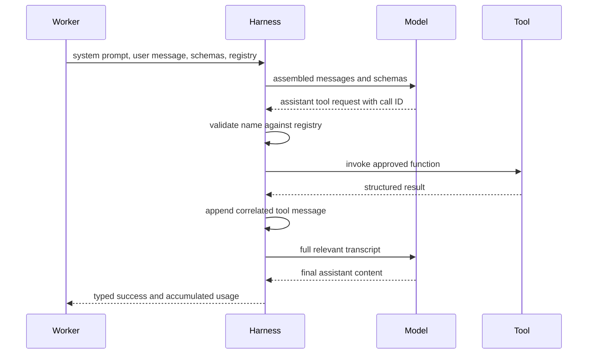
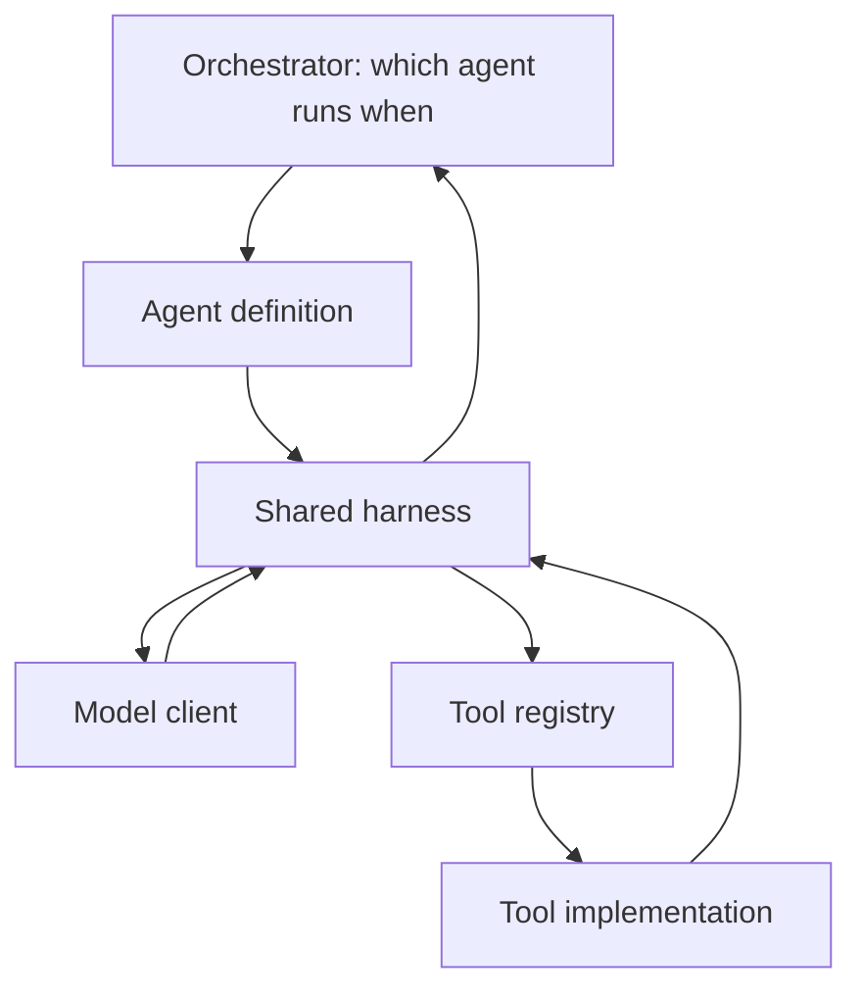
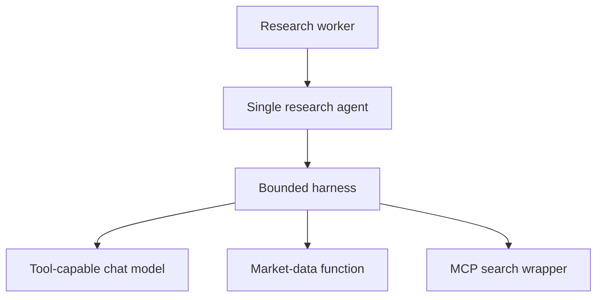

# Chapter 6: The First Tool-Using Agent

The worker can already fetch market data without an agent. Application code chooses the function, supplies arguments, and formats the result. That is useful automation, but no model makes a decision.

A tool-using agent adds one narrow capability: the model may request a function by name, inspect its real result, and continue the conversation. The model still does not execute Python. A surrounding harness owns every effect.

This chapter isolates that harness before any graph schedules multiple agents. The small scope makes four mechanics visible: model-facing schemas, application-owned dispatch, correlated tool results, and a hard limit on repetition.

> **Chapter snapshot**
> - **Starting point:** Deterministic functions and an MCP search boundary exist, but no model can request tools through a controlled loop.
> - **Focus in this chapter:** An allowlisted single-agent harness that preserves message causality, executes requested tools, accumulates usage, and returns typed outcomes within a turn budget.
> - **Finished repository:** The current shared loop lives in `backend/worker/agent_harness.py` and serves several later agents; this chapter studies its behavior before graph orchestration.
> - **Coming next:** Chapter 7 isolates provider-specific model transport and discovers reviewed skills without hardcoding them into each agent.

## What This Chapter Explains

Tool calling is a message protocol, not model-side code execution. The application sends descriptions of available functions. The model may return a structured request. The harness checks that request against its own registry, invokes approved code, appends the result with the matching call ID, and asks the model to continue.

The harness repeats until one of two terminal conditions:

```text
assistant content with no tool calls -> success
turn budget exhausted             -> max_turns_exceeded
```

Those outcomes must have different result shapes. A sentence such as “the agent did not finish” cannot be allowed to resemble completed research.

## Message Lifecycle



The model proposes an action. The harness mediates it. That division is the central trust boundary of the first agent.

## Schemas Describe; Registries Authorize

A tool schema tells the model what it may request and how arguments should be shaped:

```python
FETCH_STOCK_DATA_SCHEMA = {
    "type": "function",
    "function": {
        "name": "fetch_stock_data",
        "description": "Fetch current price and basic fundamentals.",
        "parameters": {
            "type": "object",
            "properties": {
                "ticker": {"type": "string"},
                "market": {
                    "type": "string",
                    "enum": ["US", "India"],
                },
            },
            "required": ["ticker", "market"],
        },
    },
}
```

The description guides model choice, and JSON Schema documents the intended arguments. Neither grants authority. The application-owned registry connects a reviewed name to executable code:

```python
TOOL_REGISTRY = {
    "fetch_stock_data": fetch_stock_data,
}

if function_name not in TOOL_REGISTRY:
    return {"error": f"unknown tool: {function_name}"}

result = TOOL_REGISTRY[function_name](**function_args)
```

This explicit mapping is an allowlist. Dynamic lookup through `globals()`, imports derived from model text, or evaluation of generated code would turn an untrusted string into authority.

The current dispatcher recognizes both synchronous and asynchronous functions. Unknown names produce an error object rather than executing anything. Python still raises argument errors inside the called function; schema validation before dispatch remains a later hardening step.

> **Production Lens:** The allowlisted dispatcher is production-shaped because model text cannot create new authority. A stronger boundary also validates arguments against the offered schema, imposes per-tool timeouts and output limits, and records caller, duration, and result status without logging secrets.

## The Transcript Preserves Causality

A model endpoint has no hidden continuation between requests. Each turn receives the relevant conversation again. After a tool request, the harness appends both the assistant message containing the request and one tool message per result.

```python
history.append(assistant_message)
history.append({
    "role": "tool",
    "tool_call_id": tool_call["id"],
    "content": json.dumps(result),
})
```

The call ID is not decoration. One assistant message may request several tools. Each result must identify the request it satisfies, or two searches and two ticker lookups become ambiguous.

```text
user      -> What is Apple's current price?
assistant -> call_1: fetch_stock_data(AAPL, US)
tool      -> call_1: {"price": 305.93, "currency": "USD"}
assistant -> Apple is trading at USD 305.93.
```

The second model call is grounded only when it receives the original question, the assistant's request, and the correlated result. Sending only the result loses the reason it was requested. Sending only earlier messages causes the model to guess again.

## Context Assembly Has One Owner

The context assembler decides what is sent on each model call. It prepends the agent's system prompt and removes stale provider-specific `thinking` fields while preserving user, assistant, tool-call, and tool-result messages.

```python
def assemble_context(history: list[dict], system_prompt: str) -> list[dict]:
    messages = [{"role": "system", "content": system_prompt}]

    for message in history:
        if message["role"] == "assistant" and "thinking" in message:
            message = {
                key: value
                for key, value in message.items()
                if key != "thinking"
            }
        messages.append(message)

    return messages
```

Context-window trimming belongs at this boundary when histories become large. The current repository does not implement compaction because its original runs were small. Naming an owner for future behavior is useful; claiming an unbuilt policy is not.

## The Loop Is a Budgeted State Machine

A fixed two-call demonstration proves one transcript. A reusable agent must allow another tool request after the first result, and it must process multiple calls from one assistant message.

The current loop exposes that control flow directly:

```python
for _ in range(max_turns):
    messages = assemble_context(history, system_prompt)
    result = await chat(messages, tool_schemas)
    response = result["message"]
    history.append(response)

    tool_calls = response.get("tool_calls")
    if not tool_calls:
        return {
            "status": "success",
            "answer": response["content"],
            "usage": total_usage,
        }

    for tool_call in tool_calls:
        tool_result = await _call_tool(
            tool_call["function"]["name"],
            tool_call["function"]["arguments"],
            tool_registry,
        )
        history.append({
            "role": "tool",
            "tool_call_id": tool_call["id"],
            "content": json.dumps(tool_result),
        })
```

`max_turns` is a cost and reliability policy. The current default is five. Without a cap, a confused model can request tools indefinitely, consuming model tokens, latency, market-data calls, and search quota.

Usage is accumulated on every model turn. Counting only the final answer would understate any run that used tools. When the loop exhausts its budget, it returns a distinct status with the real partial results and accumulated usage:

```python
{
    "status": "max_turns_exceeded",
    "partial_results": [...],
    "usage": total_usage,
}
```

The worker and UI can now distinguish completed analysis from a bounded give-up.

## Harness and Orchestrator Are Different Layers

A **harness** lets one agent act. It assembles context, calls a model, dispatches approved tools, correlates results, enforces limits, and returns a typed outcome.

An **orchestrator** schedules several agents and moves shared state among them. It may decide that Fundamentals, Technical, and News run before Risk, but it should not duplicate the message loop inside every graph node.



This chapter establishes the lower layer. Chapter 8 later adds graph scheduling above it.

## Behavior Evidence

Scripted model responses separate harness guarantees from model variability:

| Situation | Observable result | Guarantee demonstrated |
|---|---|---|
| A known name has valid arguments | The registered function runs and its result is appended. | Schema presentation and execution authority remain separate. |
| A response names an unknown tool | No function runs; the transcript receives an error result. | The registry is an allowlist. |
| One assistant message requests two tools | Two results retain two matching call IDs. | Concurrent requests remain causally identifiable. |
| A later response contains ordinary content | The harness returns `success`. | Content without tool calls is terminal. |
| Every response requests another tool | The harness stops exactly at `max_turns`. | Repetition is bounded. |
| Three model calls report usage | Returned usage equals the sum of all three calls. | Cost evidence covers the whole run. |

These checks do not require live market data or a hosted model. A fake chat function and harmless registry are enough to prove the state machine.

## Incident: Correct Data, Incorrect Reasoning

The first real runs fetched valid numbers but did not guarantee valid interpretation. One answer described a price near the high end of its 52-week range as near the low. Another scaled a multi-trillion-dollar market capitalization incorrectly.

The evidence separated retrieval failure from synthesis failure: raw tool results contained correct values, while the final prose transformed them incorrectly. The design rule changed. Arithmetic thresholds, valuation formulas, and hard stops remain deterministic Python. Models explain and weigh those outputs; they do not replace authoritative calculations.

## Architecture After This Chapter



There is one agent and no graph orchestrator. The model endpoint may be local or hosted; the harness contract does not grant it direct access to either tool.

## Read the Chapter Code

| File | What to inspect |
|---|---|
| `backend/worker/agent_harness.py` | Allowlisted dispatch, multi-call handling, turn limits, typed outcomes, and usage accumulation. |
| `backend/worker/context_assembler.py` | System-prompt placement and preservation of the tool transcript. |
| `backend/worker/agent.py` | The evolved agent definition that supplies prompt and capabilities to the shared harness. |
| `backend/worker/llm_experiments/test_tool_loop.py` | The earlier isolated tool-loop experiment retained in the workspace. |

## Known Limitations

The first agent has broad responsibilities across fundamentals, technical signals, news, and synthesis. The harness does not yet validate arguments against JSON Schema, compact long histories, persist transcripts, assign per-tool identities, or implement a complete retry policy. Live behavior depends on model and provider configuration that the repository does not reproduce with an offline fixture.

The turn cap bounds one failure mode; it does not make model output deterministic or correct.

## Next

Before one harness supports several specialized agents, provider-specific message behavior and capability registration need stable owners. Chapter 7 puts model transport behind one normalized client and turns reviewed skill folders into discoverable options while keeping mandatory work on direct application paths.
