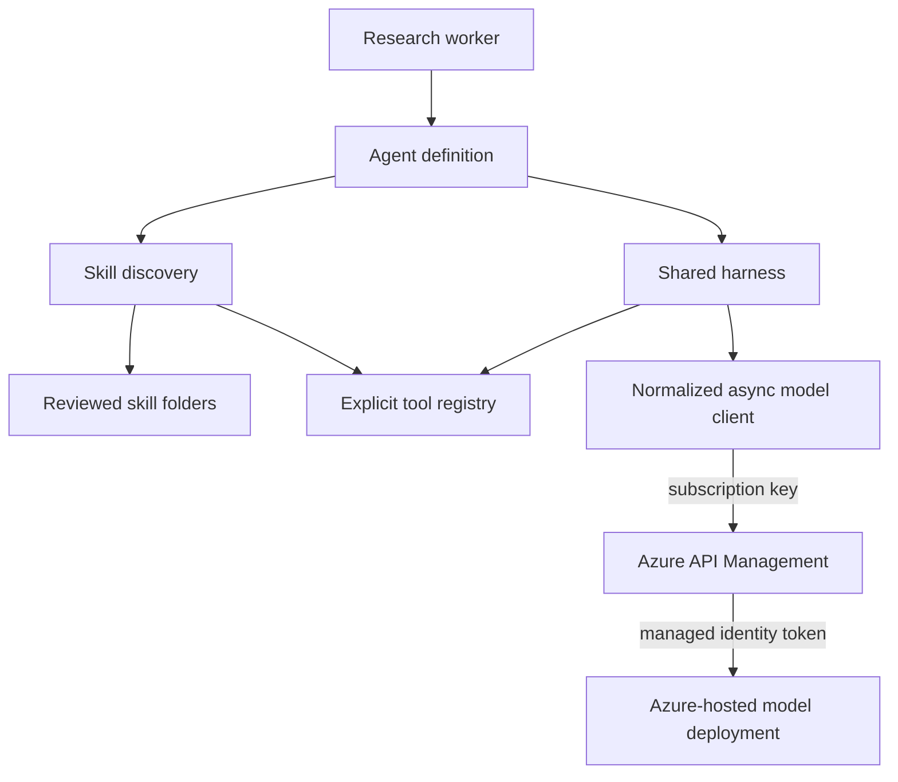
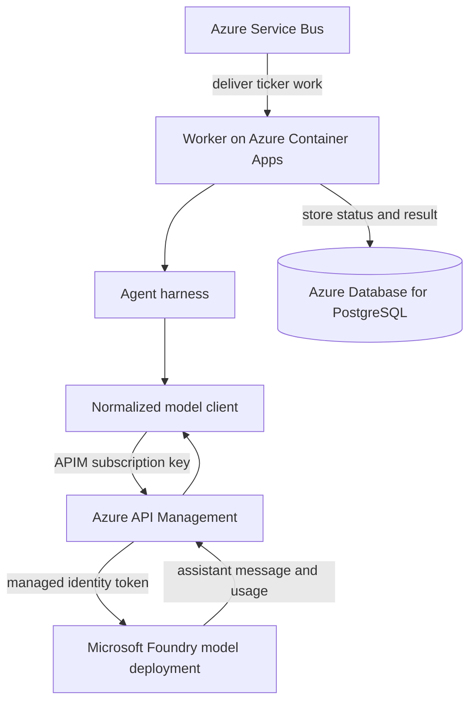

# Chapter 7: Model Boundaries and Skills

The first agent can request tools, but its dependencies are still easy to confuse with its behavior. A raw HTTP client knows one provider's message shape. One agent lists every capability by hand. Changing the provider or adding another skill can therefore force changes into the harness that should only know how to run a conversation.

This chapter establishes two application-owned boundaries before graph orchestration multiplies the number of callers. A model client normalizes transport details behind one `chat()` contract. Skill discovery turns reviewed packages on disk into model-visible options without editing each agent.

A third boundary runs through both: not every useful function should be a model-selected tool. Mandatory data acquisition belongs to deterministic application code. Model choice is reserved for moments when choosing the next capability carries meaning.

> **Chapter snapshot**
> - **Starting point:** One bounded agent harness exists, but provider wire formats and capability registration can still leak into callers.
> - **Focus in this chapter:** A normalized asynchronous model client, usage reporting, reviewed skill discovery, and an explicit choice between direct execution and model-selected tools.
> - **Finished repository:** The current implementation preserves these boundaries in `backend/worker/llm/model_client.py`, `backend/worker/skills/discovery.py`, and `backend/worker/agent_harness.py`.
> - **Coming next:** Chapter 8 uses the shared boundaries to schedule specialized agents in a graph; Chapter 10 later evolves the final synthesis stages.

## What This Chapter Explains

The harness needs one stable model operation: send messages and optional tool schemas, then receive one normalized assistant message plus usage. It should not know which authentication header, URL shape, API version, or argument encoding the provider expects.

Agents also need a stable way to receive optional capabilities. They should not import each skill by name. Discovery reads reviewed packages from a trusted directory and builds the schemas and registry consumed by the same harness.

These boundaries reduce repeated wiring. They do not make model providers behaviorally equivalent, and they do not make arbitrary code safe to load.

## Runtime Architecture

The current model path is top-down: an agent uses the shared harness, the harness calls one normalized client, and that client reaches the deployed model through Azure API Management (APIM).



APIM is a gateway and identity boundary. It is not the source of model capacity. The worker still holds an APIM subscription key, while APIM uses its managed identity to authenticate to the model resource. Neither fact implies automatic retries, semantic caching, load balancing, or additional token quota.

## One Application-Owned Model Contract

The harness consumes a provider-neutral result shape:

```python
async def chat(messages: list[dict], tools: list[dict]) -> dict:
    return {
        "message": {
            "role": "assistant",
            "content": "...",
            "tool_calls": [],
        },
        "usage": {
            "prompt_tokens": 0,
            "completion_tokens": 0,
            "total_tokens": 0,
            "estimated_cost_usd": 0.0,
        },
    }
```

The rest of the worker depends on this contract rather than a provider SDK response class. A backend change belongs inside `chat()`. Raw fields such as `choices[0]` should not appear in the harness or agents.

Normalization has a limit. Models still differ in tool choice, prose, context windows, latency, and schema adherence. Swappable transport means call sites remain stable; it does not mean outputs are equivalent.

## Wire Formats Stay at the Boundary

The original local endpoint returned tool arguments as dictionaries. Azure's chat API expects those arguments encoded as JSON strings when an assistant tool-call message is sent back in history. Dispatch still needs the canonical in-process dictionary.

The model client converts an outbound copy:

```python
def _stringify_tool_call_args(messages: list[dict]) -> list[dict]:
    prepared = []
    for message in messages:
        if message.get("tool_calls"):
            message = {
                **message,
                "tool_calls": [
                    {
                        **call,
                        "function": {
                            **call["function"],
                            "arguments": json.dumps(
                                call["function"]["arguments"]
                            ),
                        },
                    }
                    for call in message["tool_calls"]
                ],
            }
        prepared.append(message)
    return prepared
```

The fresh copy is the design decision. The original message list is also the transcript that the harness continues to extend. Mutating dictionaries into strings there would leak the provider's wire format back into dispatch and break `tool_function(**function_args)` on a later turn.

The response path performs the reverse conversion before returning the normalized message. Callers therefore see one canonical dictionary form in both old and new transcript entries.

## Asynchronous Transport Must Yield

The first model client made a synchronous HTTP request from asynchronous callers. Three graph branches looked parallel but ran almost sequentially: measured wall-clock time was about 45 seconds, close to the sum of the individual calls rather than the longest call.

The current boundary uses `httpx.AsyncClient`:

```python
async with httpx.AsyncClient(timeout=90.0) as client:
    response = await client.post(
        CHAT_URL,
        headers={
            "Ocp-Apim-Subscription-Key": APIM_SUBSCRIPTION_KEY,
            "Content-Type": "application/json",
        },
        json={
            "messages": _stringify_tool_call_args(messages),
            "tools": tools,
        },
    )
```

`async def` alone does not create concurrency. A coroutine yields only at an operation that can suspend. A synchronous `requests.post()` freezes the event loop; `await client.post()` allows sibling tasks to progress.

The explicit 90-second timeout came from observed model latency under shared capacity. It is not a universal value. The current implementation also creates a client per call. A long-lived worker would normally reuse a configured client for connection pooling and close it cleanly during shutdown.

> **Production Lens:** The application-owned contract, asynchronous transport, and explicit timeout are production-shaped boundaries. Production policy should centralize client reuse, retries, rate-limit handling, telemetry, and shutdown without hiding provider failures or pretending all models behave alike.

## Usage Evidence Belongs With the Model Client

The model client knows which deployment answered and receives provider usage metadata. It returns normalized token counts and an estimated cost:

```python
prompt_tokens = raw_usage.get("prompt_tokens", 0)
completion_tokens = raw_usage.get("completion_tokens", 0)
estimated_cost_usd = (
    prompt_tokens / 1000 * PRICE_PER_1K_PROMPT_TOKENS
    + completion_tokens / 1000 * PRICE_PER_1K_COMPLETION_TOKENS
)
```

The harness accumulates those values across turns. Later graph state uses a reducer so parallel agents append separate usage records instead of overwriting one another.

The current dollar rates are explicitly placeholders. Provider token counts are evidence; the conversion is application policy. A trustworthy estimate needs current prices for the exact deployment, region, pricing unit, cached-token rules, and gateway charges.

## Skills Package Judgment for Later Use

A deterministic tool computes or retrieves a value. The first discoverable skill instead returns instructions that a model applies on a later turn.

```text
skills/
  assess_news_sentiment/
    SKILL.md
    skill.py
```

The Markdown file contains flat frontmatter for discovery and a rubric in its body. The rubric distinguishes material events such as fraud allegations, regulatory investigations, and serious recalls from ordinary analyst commentary, rumors, or old resolved news.

The loader is intentionally small:

```python
def load_instructions() -> str:
    content = _SKILL_FILE.read_text()
    _, _, body = content.split("---", 2)
    return body.strip()
```

Calling `load_instructions()` does not assess sentiment. It returns guidance. The model-facing name describes why an agent may choose the capability, while the Python function name describes what the code actually does.

Keeping the rubric out of every system prompt saves unconditional context and preserves an observable selection step. It also makes the reviewed instruction artifact independently readable.

## Discovery Builds Schemas and Authority Together

Hardcoding one skill inside one agent proves usage but does not scale. Discovery scans trusted local folders for `SKILL.md`, parses the frontmatter, imports the adjacent loader, and creates both a model-facing schema and an application registry entry.

```python
for skill_dir in sorted(SKILLS_DIR.iterdir()):
    skill_md = skill_dir / "SKILL.md"
    if not skill_dir.is_dir() or not skill_md.exists():
        continue

    fields = _parse_frontmatter(skill_md)
    module = importlib.import_module(f"skills.{skill_dir.name}.skill")
    tool_registry[fields["name"]] = module.load_instructions
```

Sorted traversal makes discovery deterministic. A folder without `SKILL.md` is ignored. The resulting schema has no arguments because the current skill only loads instructions.

Discovery is dynamic inside a trusted image; it is not a sandbox or plugin marketplace. Importing `skill.py` executes application code. Production packaging should validate required fields, reject duplicate model-facing names, constrain paths, and include only reviewed artifacts.

The parser is deliberately minimal because current frontmatter contains flat `name: value` pairs. If the format grows to nested or multiline YAML, a real YAML parser should replace string splitting. The current implementation also lacks duplicate-name validation.

## Direct Call or Model Choice

The model should choose only when choice carries meaning.

Fundamentals must fetch fundamentals. Technical analysis must fetch price history. Asking a model whether to perform mandatory acquisition adds a turn and schema tokens without adding judgment. Those agents call Python directly and then make one synthesis call.

News is different. It may choose a query, inspect results, load the sentiment rubric, refine its search, or stop. It uses the full tool loop.

| Harness path | Use when | Cost shape |
|---|---|---|
| `run_synthesis` | Data acquisition is mandatory and deterministic. | One model call and no tool schemas. |
| `run_agent` | The next capability depends on evidence and judgment. | One or more model calls plus schema tokens. |

This distinction later protects valuation formulas and hard-stop rules. The application computes authoritative results even when an agent explains or weighs them.

## Behavior Evidence

| Situation | Observable result | Boundary demonstrated |
|---|---|---|
| A transcript contains dictionary tool arguments | The outbound copy contains JSON strings; the original still contains dictionaries. | Provider encoding does not mutate application state. |
| Two delayed chat calls run with `asyncio.gather` | Wall time approaches one delay rather than their sum. | Network waiting yields to sibling tasks. |
| A fake response reports known token counts | The client returns those counts and the harness sums all turns. | Usage ownership is explicit. |
| A reviewed skill folder is present | Its schema and loader appear in deterministic discovery order. | Capability registration is not agent-specific. |
| A folder lacks `SKILL.md` | Discovery skips it. | Presence of arbitrary code does not advertise a skill. |
| Fundamentals uses `run_synthesis` | No model-facing tool schema is sent for required acquisition. | Mandatory work remains a direct call. |

## Incident: Compatible APIs Were Not Identical

The model swap changed only the client, validating the intended boundary. It still exposed a real incompatibility: dictionary tool arguments accepted by the local integration had to be JSON strings on Azure's wire format. The first request succeeded; resending the assistant tool-call message on the next turn failed with `400 Bad Request`.

The evidence localized the problem. Dispatch had already consumed a valid dictionary, and only the outbound provider request rejected the shape. Conversion stayed inside the model client, preserving one canonical form everywhere else.

## Incident: The Gateway Lost a Required Path Segment

APIM's client-facing prefix was stripped before forwarding, while the backend Azure route still required `/openai/...`. The forwarded request lost a required segment and returned `404`.

The failure was at the gateway-to-backend boundary, not in harness logic. Correcting the API path configuration preserved the backend route. The operating rule is to test the smallest gateway request and identify which component generated the error before changing application code.

## Azure Resources for This Stage

This chapter activates the model path used by the current worker:

| Responsibility | Active resource |
|---|---|
| Run the worker and agent code | Azure Container Apps |
| Authenticate and route model requests | Azure API Management |
| Produce chat completions and tool requests | Azure-hosted model deployment in Microsoft Foundry |

The distributed job resources from Chapter 3 remain active around this path: Service Bus delivers work and PostgreSQL stores durable status and results. APIM uses managed identity for the backend request; the worker-facing APIM subscription key remains a secret that requires management and rotation.

## Azure Architecture



The gateway centralizes routing and backend identity. It does not create model quota or guarantee retries unless corresponding policies and capacity exist.

## Read the Chapter Code

| File | What to inspect |
|---|---|
| `backend/worker/llm/model_client.py` | Provider request construction, argument conversion, async transport, timeout, and usage normalization. |
| `backend/worker/agent_harness.py` | The two execution paths: bounded tool loop and direct-fetch synthesis. |
| `backend/worker/skills/discovery.py` | Deterministic folder scanning, minimal frontmatter parsing, schema creation, and loader registration. |
| `backend/worker/skills/assess_news_sentiment/SKILL.md` | The reviewed rubric exposed as a model-selectable capability. |
| `backend/worker/skills/assess_news_sentiment/skill.py` | The instruction loader that keeps frontmatter out of the tool result. |

## Known Limitations

Only one discoverable skill exists in the current repository. Discovery trusts code packaged in the image, has no duplicate-name check, and uses a parser suitable only for flat frontmatter. The model client creates a new HTTP client per call, uses placeholder price constants, reads required environment values at import time, and has no offline provider fixture.

APIM narrows model-resource credential exposure, but the worker's subscription key still requires secret management. Transport normalization does not make model behavior deterministic across providers.

## Run This Stage

- **Repository tag:** `chapter-07-complete`.
- **Azure resources:** Azure API Management in front of an Azure-hosted model deployment in Microsoft Foundry, alongside the Chapter 3 stack. Set `APIM_PUBLISHER_EMAIL` in `infra/.local-config` (see [Azure Setup and Deployment](azure-setup.md)) and provision with `./infra/deploy.sh infra/params/chapter-07.json`.
- **Run it without an agent call:** the model client's own tests exercise transport and usage-normalization behavior with no live provider:

  ```bash
  git switch --detach chapter-07-complete
  cd backend/worker
  uv sync
  uv run python -m unittest tests.test_model_client -v
  ```

- **Run it end to end:** once your own APIM instance fronts a deployed model, set `APIM_BASE_URL`, `APIM_SUBSCRIPTION_KEY`, and `APIM_API_VERSION` (plus `DATABASE_URL`, `SERVICEBUS_CONNECTION_STRING`, and `TAVILY_API_KEY` from earlier stages) and run the API and worker as in Chapter 5.

## Next

The worker now has one harness, one normalized model boundary, and discoverable reviewed capabilities. Chapter 8 uses those shared pieces to schedule specialized agents without copying the message loop or provider client into every graph node.
