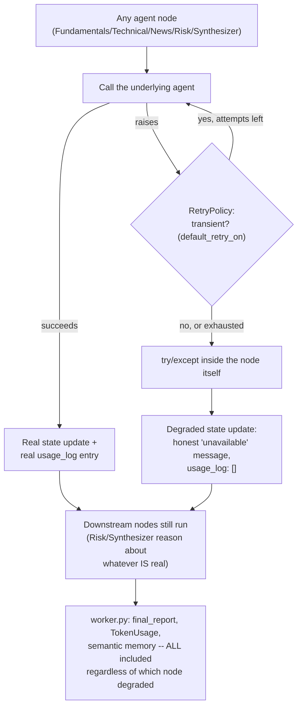
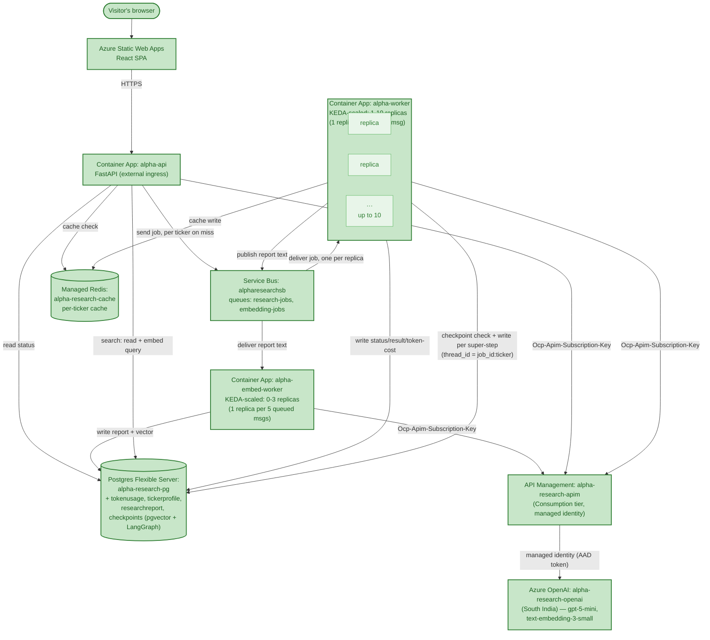

# Chapter 7 — Resilience

## The Problem, Stated Precisely

Checkpointing (Chapter 6) answers "how do we not lose everything when the whole worker process dies." This chapter answers a narrower, more common question: what happens when one *individual* tool or agent call fails — not the process, just one call — and how does the system degrade gracefully instead of crashing outright.

The starting motivation was concrete, not hypothetical: Chapter 6's own testing had already produced a real `httpx.ReadError` in `news_node`. Before this chapter, nothing in the codebase would have retried it, and nothing would have contained the blast radius if it had been a *permanent* failure rather than a transient one.

## Two Kinds of Failure, Two Different Mechanisms — a Terminology Check Worth Getting Right

Before building anything, a genuinely useful clarifying question surfaced a real distinction: `RetryPolicy` (this chapter) and `agent_harness.py`'s `MAX_TURNS = 5` (already built, back in Phase 4) sound similar but aren't. `RetryPolicy` recovers from an *exception* — the call genuinely failed. `MAX_TURNS` bounds a tool-calling loop that's succeeding at each individual step but might never converge on a final answer — no exception involved at all, just a safety valve on iteration count. Both are real "how does an orchestrator loop stop" patterns, alongside two more that surfaced in the same conversation and are honestly **not built anywhere in this project yet**: token/context-budget exhaustion (named as the Context Assembler's responsibility back in Phase 4, still just a placeholder) and repeated-identical-tool-call detection (today only caught indirectly, by burning through all of `MAX_TURNS` before giving up).

## Step One: `RetryPolicy`, Proven on One Node Before All Five

LangGraph's `add_node(..., retry_policy=RetryPolicy())` retries a node's function call in place — inside its own super-step attempt — before letting a failure escalate. Its default: 3 attempts, exponential backoff, jitter, and a real predicate worth reading rather than assuming:

```python
def default_retry_on(exc):
    if isinstance(exc, ConnectionError): return True
    if isinstance(exc, httpx.HTTPStatusError): return 500 <= exc.response.status_code < 600
    if isinstance(exc, (ValueError, TypeError, ArithmeticError, ...)): return False
    return True   # anything else, including httpx.ReadError, falls through to retry
```

Proven first on just `news_node` — the exact node the real Chapter 6 crash hit — with a simulated `httpx.ReadError` on the first call: the node was called twice, the graph completed normally, and the exception never reached `run_research` at all. Only *one* real, paid LLM call happened (the retry), not two, since the first attempt failed before ever reaching the model. Rolled out to all five nodes afterward and proven again with a single real run where every node failed once and recovered: total cost matched a normal single run, confirming no node's real work got duplicated.

## Step Two, First Attempt: `error_handler` — a Real LangGraph Feature That's Unreliable for This Project's Main Failure Surface

`RetryPolicy` only covers *transient* failures. A genuinely broken ticker (a real `ValueError`, not a network blip) exhausts its retries immediately — `default_retry_on` explicitly excludes `ValueError` — and needs a different mechanism: graceful degradation instead of a crash.

LangGraph has a real, documented feature for exactly this: `add_node(..., error_handler=my_fallback)`, where the handler receives `NodeError` (a type-injected parameter carrying the real failed node name and exception — verified directly, not assumed) and can return a fallback state update instead of letting the graph fail.

It was built, wired onto all five nodes, and tested — and the test caught something real: **`error_handler` works correctly for a solo, sequential node, but does not reliably suppress the original exception when the failing node is part of a concurrent parallel fan-out** — exactly Fundamentals/Technical/News's actual shape in this graph. Reproduced cleanly in an isolated 3-node toy graph before trusting the finding against the real one: a linear `a -> b(broken) -> END` graph with `error_handler` on `b` completed correctly; the same `error_handler` on a node fired *alongside* two siblings from `START` still raised, even though the handler's own print statement confirmed it *had* run and produced a fallback value. Traced to the actual cause rather than left as an unexplained quirk: LangGraph runs concurrent nodes through an `AsyncBackgroundExecutor` that independently re-raises any submitted task's exception on exit — a separate code path from the one that's supposed to honor "this failure was already handled" (`SKIP_RERAISE_SET`, `handled_exception_ids`). The two mechanisms don't coordinate for this specific case in the installed version.

**Decision, not a workaround**: rather than build Option B on a mechanism demonstrably inconsistent for this project's most important failure surface, `error_handler` was abandoned in favor of something that works identically everywhere.

## Step Two, Real Version: Degradation Inside Each Node Itself

A plain `try/except` around each node's own call to its underlying agent, returning a degraded state update as a normal return value — the node never raises to the graph engine at all, sidestepping the `error_handler`/concurrent-fan-out inconsistency entirely:

```python
async def fundamentals_node(state: ResearchState) -> dict:
    try:
        result = await fundamentals_agent.run(state["ticker"], state["market"])
    except Exception as exc:
        return await _degraded_result(
            state["job_id"], state["ticker"], "fundamentals", "fundamentals_summary", exc, {"fundamentals_data": {}}
        )
    ...
```

Proven against the real 5-agent graph with `fundamentals_agent.run` genuinely broken: the graph completed without raising, `fundamentals_summary` carried an honest "unavailable" message, and — this is the part worth noticing — **Risk's own real LLM judgment explicitly reasoned about the missing fundamentals data** ("*the unavailable fundamentals data plus...*"), and the Synthesizer's final report was coherent and honest about the gap ("*Unable to rely on the company's reported financials*"), not a template failure message. Total real cost (`8,026` tokens) reflected genuine spend from the four nodes that succeeded — the exact "lost cost accounting" gap the simpler worker-level approach (see below) would have had.

## A Second, Real Bug Found Only By Testing All the Way Through `worker.py`

The graph-level fix was real and proven — but the first live test (see below) returned a suspiciously bare `"SHOP: fundamentals data unavailable"`, discarding a real degraded report that should have existed. Re-reading `worker.py`'s post-processing confirmed why: it was written *before* graceful degradation existed, and gated `final_report` inclusion, `TokenUsage` logging, and the semantic-memory publish all behind `fundamentals_data` specifically succeeding — silently throwing away Technical/News/Risk/Synthesizer's real work whenever Fundamentals alone failed. Fixed by decoupling those three things from the fundamentals-specific branch entirely; only the deterministic price line and profile-memory write (which genuinely need real fundamentals data) stayed conditional. Re-verified locally through the real `process_ticker` function (not just `run_research`): the fixed version correctly included the real report, wrote a `TokenUsage` row with the genuine partial cost, and published to semantic memory — all three restored.

## Deployed and Verified Live — Including a Test That Was Wrong the First Time

Rebuilt and redeployed `alpha-worker` twice — once for the retry/degradation code, once more for the `worker.py` fix — old revisions confirmed fully deprovisioned each time.

**A normal ticker first**, confirming no regression.

**Then a real failure injection**, following `phases.md`'s own suggested test almost literally: temporarily corrupted the live `apim-subscription-key` secret and restarted the worker, so every real model call would fail with a genuine `401`. The first attempt at this test was **invalid and caught before being trusted**: the ticker used had already been researched earlier that same day, so the request hit the same-day Redis result cache and never touched the worker or the corrupted key at all — a clean illustration of why "the job returned a normal-looking result" isn't proof of anything without checking *why*. Re-run with a genuinely fresh ticker, the real failure showed up honestly: `"synthesizer unavailable: Client error '401 Access Denied' for url '...chat/completions...'"`, embedded directly in the completed job's report — the job finished cleanly, not stuck, not crashed, with the real cause visible in the output.

**Reverting the key surfaced one more real, non-obvious gotcha**: `az containerapp revision restart` updated the running replica but did not reliably pick up the reverted secret value on the first (or even second) attempt — confirmed via the still-active replica still returning `401`s against a secret that `az containerapp secret list` showed was already correct. Resolved the same way every other deploy in this project has been resolved when in doubt: forced a genuinely new revision (`az containerapp update --revision-suffix ...`) rather than trusting an in-place restart, the same reliable mechanism used everywhere else. A fresh ticker afterward confirmed real data flowing normally again.

## Key Files From This Chapter

| File | What it does |
|---|---|
| `backend/worker/agents/graph.py` | `RetryPolicy()` on all five `add_node()` calls (transient failures). `_degraded_result()` plus a `try/except` inside each of the five node functions (persistent failures) — deliberately not `error_handler=`, for the reason found above. |
| `backend/worker/worker.py` | `process_ticker`'s post-processing no longer gates `final_report`, `TokenUsage`, or the semantic-memory publish behind fundamentals specifically succeeding — only the deterministic price line and profile-memory write still do. |

## The Flow So Far



## Azure Components Used This Chapter

None new, and no new edges either — unlike Chapter 6, this chapter's work is entirely in-process logic (retries, in-function fallback handling) with no new external interaction pattern to represent. The one real infrastructure action this chapter took was diagnostic/corrective, not additive: temporarily mutating the `apim-subscription-key` secret on `alpha-worker` to prove the failure path, then restoring it.

## The Architecture So Far

No new box this chapter, and no new edges either — every node and edge below is exactly what Chapter 6 ended with. Shown again for continuity, not because anything moved.



## Where Phase 7 Actually Stands

Both real failure modes phases.md names — transient (retries/backoff) and persistent (graceful partial results) — are built, deployed, and proven against the real 5-agent graph and the real live system, not just asserted. Failed-job tracking (the third phases.md item) exists at the ticker level: a permanently-failed *ticker* now gets a real `"failed"` `TickerJob` status rather than crashing the worker (built earlier in this same chapter's work, alongside the graph-level degradation). Dead-letter handling itself is Service Bus's own existing, unconfigured-by-us mechanism (`maxDeliveryCount: 10`) — real, but never exercised end-to-end in this project; worth naming as a boundary rather than silently assuming it's "covered."

Two real, non-obvious findings came out of this chapter that weren't part of the original plan: LangGraph's `error_handler` is a real but currently-unreliable mechanism for exactly this project's most important failure surface (concurrent fan-out) — documented and avoided, not silently worked around. And `worker.py`'s own post-processing had a genuine bug that would have quietly defeated the entire point of graph-level graceful degradation, found only because the live test's result looked *suspiciously* bare rather than being accepted at face value.

## What Came Out of This Chapter

- A precise, tested distinction between two similar-sounding "retry" concepts: `RetryPolicy` (recovers from a failed call) and `agent_harness.py`'s `MAX_TURNS` (bounds a successfully-looping-but-not-converging agent) — plus an honest accounting of two more real orchestrator-exit patterns (token-budget exhaustion, repeated-tool-call detection) that exist nowhere in this codebase yet.
- `RetryPolicy` proven twice: on one node in isolation, then across all five simultaneously in one real run — in both cases, a transient failure cost nothing extra, since the failing attempt never reached the model.
- A real LangGraph limitation found through direct reproduction, not assumption: `error_handler` doesn't reliably suppress an exception when the failing node shares a super-step with concurrent siblings, traced to a genuine gap between two internal mechanisms that don't coordinate for this case.
- A deliberate pivot to a simpler, framework-independent mechanism (in-function `try/except`) after finding the framework-native one unreliable for the case that mattered most — proven against the real graph, including Risk and Synthesizer's own LLM reasoning visibly adapting to a real degraded input rather than just mechanically not crashing.
- A second real bug, found only by testing all the way through to `worker.py`, not stopping at the graph boundary: post-processing logic written before graceful degradation existed was silently discarding real partial work. Fixed and re-verified through the actual `process_ticker` function.
- A live test caught being wrong before being trusted: a same-day cache hit made a "failure test" look like a clean success, until checking *why* it succeeded so quickly revealed the real cause.
- A second live deploy gotcha, distinct from Chapter 6's stale-API-revision one: `revision restart` doesn't reliably guarantee a secret change takes effect, resolved by forcing a genuinely new revision instead — the same discipline used for every other deploy in this project, now proven necessary here too.
