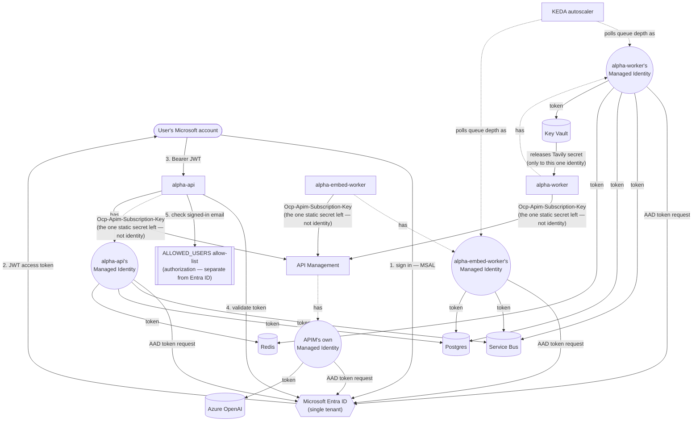

# Chapter 8 — Auth & Trust Boundaries

## The Problem, Stated Plainly

Every phase up to this point has treated `alpha-api` as an open door: any request, from anyone, gets served. That was fine while this was a solo local project — it stops being fine the moment it's a real thing running on the internet with a real URL. This chapter draws the actual trust boundary: what the browser is allowed to touch, and what it takes to prove a request is really coming from someone allowed to be here.

`phases.md` scopes this into two halves — user-facing auth on the FastAPI endpoints, and switching backend-to-Azure-service calls from embedded credentials to Managed Identity. Given the real size of the second half (Postgres, Service Bus, and Redis all currently use plain passwords/keys, not identity), this phase is being built in five explicit stages, one commit each: **(A)** app-level auth, **(B)** Managed Identity for Postgres + Service Bus, **(C)** Redis (pending a real check of whether the tier in use even supports Entra ID auth), **(D)** Key Vault for the one credential that can't use Managed Identity at all (`TAVILY_API_KEY`, a third-party service), **(E)** documenting the trust boundary explicitly. This chapter covers Stage A.

## Stage A: Which Kind of Auth, and Why

Four real options existed, not just "add an API key":

1. **Microsoft Entra ID + OAuth2/OIDC** — the standard Azure-native pattern. Reuses identity that already exists (this project's own Azure tenant) rather than inventing a login system.
2. **Azure AD B2C** — the same mechanics, but for apps that need to let arbitrary public users sign up (email/password, social logins), via a separate B2C tenant. Not clearly justified here — this isn't a public-signup product.
3. **Roll our own JWT auth** — a real `User` table, a `/login` endpoint, password hashing, our own signed tokens. Legitimate, but means being responsible for password storage correctly — a real, avoidable liability when Entra ID can own that instead.
4. **Azure Static Web Apps' built-in auth** — zero custom frontend code, but designed around SWA's own "linked backend" concept; not confirmed to cleanly protect an independently-hosted Container App the way `alpha-api` is set up. Not pursued without verifying that first.

Went with **Entra ID** — the real production pattern, reusing identity that already exists, without taking on password storage ourselves.

**A genuinely important distinction surfaced before building anything**: authentication (proving who someone is) and authorization (deciding whether they're allowed to use *this* app) are two different problems, and Entra ID only solves the first one for free. If the app registration is opened up to accept any Microsoft account — which is what letting a family member sign in with their own personal account would require — then by default *anyone* with a Microsoft account could sign in, not just the intended person. The real design needs a small, explicit allow-list on top of Entra ID's identity check: a real person is verified as real, and *separately*, checked against a short list of who's actually permitted. That allow-list isn't built yet — it's a Stage A backend piece still ahead in this same chapter — but the decision to need one was made up front, not discovered as a gap later.

## Azure-Side Setup

**App registration.** `az ad app create --display-name "alpha-research-app" --sign-in-audience AzureADMyOrg` — single-tenant for now (just the project owner), a one-setting change away from opening to any Microsoft account later. Gives back a **Client ID** (`6df6979f-672a-405a-a8ea-5d9e73369bf1`) — a unique identifier for this registration, and a **Tenant ID**, identifying which Entra ID directory it lives in (the same one this whole Azure subscription already lives in).

**Service Principal — a real, separate step, not automatic.** Creating the app registration alone does *not* create a working sign-in target — confirmed directly (`az ad sp show` returned "does not exist" right after `az ad app create` succeeded). An app registration is closer to a *definition* of the app; the Service Principal is the *local identity object* that represents it inside this specific tenant, and it's what Entra ID actually checks against during a real sign-in — permissions, consent, sign-in eligibility all attach here, not to the app registration itself. Without it, nobody could have signed in at all, even with a valid Client ID. Created explicitly: `az ad sp create --id <client-id>`.

**Redirect URIs, and a real gotcha in how they're registered.** Registered two URLs — the live Static Web App, and `localhost:5173` for local testing — but *where* they were registered mattered as much as the values themselves. Entra ID's app registration UI/API distinguishes a "Web" platform from a "SPA" (Single-Page App) platform for the exact same kind of redirect URI, and the two behave differently for a reason worth being precise about:

Sign-in doesn't hand back a token immediately — it hands back a short-lived, one-time-use *code* first, and something has to trade that code for the real token in a separate step (the Authorization Code flow). For a server-backed app, the server does that trade using a client secret only it knows. Our frontend has no server involved in login at all — it's the browser itself that has to do the trade, and a browser can't safely hold a secret (anyone can read a SPA's JavaScript). **PKCE** solves that: the browser makes up a random, temporary value at the start of login and proves it still has that same value at the end, substituting for a secret it could never safely keep.

That final code-for-token trade is a network request the *browser* makes directly to Entra ID — and browsers enforce **CORS**, refusing to let JavaScript see a cross-origin response unless the server explicitly allows it. Entra ID only sends those CORS-allowing headers on that endpoint for redirect URIs registered under the "SPA" platform, because that's the signal that a browser (not a server) will be doing the trade. Registering under "Web" instead would have looked completely fine through the redirect itself — the failure would only show up at the very last step, as a browser CORS error trading the code for a token. Registered correctly this time (`az rest PATCH` against `spa.redirectUris`, since this CLI version has no direct flag for it — same gap already hit with APIM policies back in Chapter 5), and verified by reading the value back rather than trusting the PATCH's empty response.

**API scope.** Exposed `access_as_user` under `api://6df6979f-672a-405a-a8ea-5d9e73369bf1/`. The problem this solves: Entra ID issues tokens for many different apps using the same signing process, so a token being validly signed doesn't prove it was meant for *this* API — a token issued for some other Microsoft service would look just as "real." Requesting this specific scope at the start of login stamps the resulting token's `aud` (audience) claim with this API's own identifier; the backend will check that claim later and reject anything not stamped for it, even a genuinely valid token. On a single frontend talking to its own single backend, the scope was exposed on the *same* app registration used for the SPA rather than splitting into two separate registrations — the more "textbook" separated pattern, but not clearly justified for a 1:1 frontend/backend relationship like this one.

## Frontend: `@azure/msal-browser` + `@azure/msal-react`

- `frontend/src/authConfig.js` (new) — Client ID, tenant, and the scope request, read from build-time env vars (`VITE_ENTRA_CLIENT_ID`, `VITE_ENTRA_TENANT_ID`, `VITE_ENTRA_API_SCOPE`) — none of these are secrets, for the same PKCE-driven reason a SPA can't hold a client secret either; the actual security comes from Entra ID trusting the registered redirect URI and the PKCE proof, not from hiding a Client ID.
- `frontend/src/main.jsx` — creates a `PublicClientApplication`, wraps the app in `MsalProvider`. Explicitly sets the active account on login success — MSAL doesn't infer this on its own if more than one Microsoft account happens to exist in the same browser.
- `frontend/src/App.jsx` — the app is now genuinely gated: `UnauthenticatedTemplate` shows a sign-in screen, `AuthenticatedTemplate` shows the real ticker-research UI. Every existing API call (`POST /research`, and the status-polling `GET /research/{job_id}`) now calls `acquireTokenSilent` first and attaches the result as `Authorization: Bearer <token>` — falling back to an interactive popup only if silent acquisition genuinely needs user interaction.
- Env vars added in both `frontend/.env.local` (local testing) and the GitHub Actions deploy workflow (production) — same plain, non-secret pattern already used for `VITE_API_URL`.

**A real, working test that looked broken at first.** Clicking "Sign in with Microsoft" landed straight back on the app's home screen — no visible Microsoft login form at all, which looked like the redirect wasn't firing. It was real sign-in the whole time, just too fast to see: already being signed into a Microsoft account in that browser (from using the Azure Portal), Entra ID recognized the existing session for an account already valid for this single-tenant app, and completed the whole redirect-and-authenticate silently rather than showing an interactive prompt. Confirmed properly rather than left ambiguous: DevTools → Application → Session Storage → `msal.*` keys present, containing a real cached account and token. Not something to chase down as a bug — a real illustration that "the browser bar didn't visibly change" isn't proof nothing happened when redirects can complete in well under a second.

## Backend: Validating the Token, and a Debugging Journey Worth Documenting in Full

Chose `fastapi-azure-auth` over hand-rolling JWT validation — a maintained library that fetches Entra ID's public signing keys, verifies signature/issuer/audience/expiry, and caches the key set (24h) automatically inside the dependency's own call path, no separate startup wiring needed. `backend/api/auth.py` wraps it in `require_user`, which does the authn/authz split the family-member question already flagged as necessary: `azure_scheme` (the library) proves *who* someone is; `require_user` separately checks their `preferred_username`/`email` against an explicit `ALLOWED_USERS` list before letting the request through — a real, valid token from a real signed-in person still gets rejected if they're not on it.

**Getting the config right took four real, sequential discoveries — each one found by decoding an actual live token rather than guessing further, the same discipline as everywhere else in this project:**

1. **A 403, not a 401, and my own code never ran.** The very first live test rejected with `Forbidden`, but a debug write inside `require_user` never fired — proving the rejection happened *inside* the library, before reaching my own allow-list check at all. Traced to `is_guest()`: this Azure tenant was created from a personal Microsoft account (`hotmail.com`), so Entra ID's `idp` claim differs from `iss` even for the tenant *owner's own* sign-in — a heuristic built for distinguishing real invited guests in a work tenant misfires for a personal-account-owned tenant. Fixed with `allow_guest_users=True` — safe here specifically because `require_user`'s own allow-list is the real authorization boundary regardless; relaxing Entra's guest check doesn't widen who can actually use the app.
2. **Past the guest check, now a 401 — an audience mismatch.** Decoded the real token directly (copied from the browser's Network tab, decoded client-side in the console — nothing sent to a third party): `aud: "api://6df6979f-.../"`, the App ID URI, not the bare Client ID the code was checking against. Also revealed something unplanned: `ver: "1.0"` — a v1.0 token, despite MSAL's modern flow, because the app registration's manifest never explicitly requested v2.0 tokens. Fixed both at the root: set `api.requestedAccessTokenVersion: 2` on the app registration (`az rest PATCH`, the CLI gap again), and updated `app_client_id` to the App ID URI form to match the v1.0 token's shape.
3. **A fresh v2.0 token flipped the audience format in the opposite direction.** `ver: "2.0"` confirmed correctly this time — but `aud` was now the *bare* Client ID, not the App ID URI. A real, counter-intuitive Entra ID behavior specific to this project's setup: when the same app registration is both the client and the API scope being requested, v2.0 tokens use the bare GUID for `aud`, the opposite of what the v1.0 token had. Reverted `app_client_id` back to the bare Client ID.
4. Both fixes were verified against real decoded tokens at each step, not assumed correct from documentation — the kind of detail that's easy to get backwards twice in a row if you fix it once and stop checking.

## A Second, Unrelated Bug — Found Only By Testing All the Way Through

Once auth itself passed, a submitted job sat "Analyzing..." indefinitely. The cause had nothing to do with Entra ID: the local `alpha-api` instance used for testing never had `DATABASE_URL` set, so it silently defaulted to local dev Postgres — while `SERVICEBUS_CONNECTION_STRING` was the real, shared Azure Service Bus namespace. That mismatch published a completely real message to the real queue, for a `TickerJob` row that only existed in a local database the live worker has never heard of.

**The live worker crashed.** `AttributeError: 'NoneType' object has no attribute 'status'` at the line marking a ticker "running" — confirmed directly from live container logs, not inferred. This exposed a real, previously-unknown gap in Phase 7's own crash-containment: the `try/except` built there wrapped only the `run_research()` call, not the earlier step that looks up and marks the `TickerJob` row. A missing or mismatched row — this specific local/Azure mismatch, but potentially other real causes too — crashed the *entire worker process* the exact same dangerous way Phase 7 was built to prevent, and Service Bus was already redelivering and re-crashing it on a loop.

Fixed immediately, deployed as its own urgent release ahead of the rest of this stage: an explicit `if task is None: return` right after the lookup, logging and skipping cleanly — there's no real row to mark "failed" either, so skipping is the honest outcome. Confirmed live: the same redelivered message hit the fixed code and logged `No TickerJob row found ... -- skipping` instead of crashing. Local testing was then corrected properly — rather than working around the symptom, `DATABASE_URL` for local runs was pointed at the real Azure Postgres, matching the already-real Service Bus connection, so local testing is fully consistent with the real deployed system instead of half-local, half-Azure.

## Deployed and Verified Live — Both Directions of the Allow-List

`alpha-api` rebuilt and redeployed with the real auth code and the real Entra config (Tenant ID, Client ID, API scope, allow-list) as Container App env vars — none of them secrets, same reasoning as the frontend's. Old revision confirmed fully deprovisioned before trusting the new one, same discipline as every other deploy this project has done.

**Verified live, not just locally:**
- An unauthenticated request to the real public API: `401 Not authenticated`.
- A real, valid, correctly-scoped token from a real sign-in, with the allow-list temporarily pointed at a different email: `403 Not authorized to use this application` — proving the two-layer design actually works on a genuinely valid token, not just on malformed ones. The allow-list reverted, and the *same* token immediately succeeded again — both directions proven with one real token, not assumed from the code reading correctly.

## Key Files From This Chapter

| File | What it does |
|---|---|
| `frontend/src/authConfig.js` | MSAL config — Client ID, tenant authority, redirect URI, and the requested API scope. |
| `frontend/src/main.jsx` | Creates the `PublicClientApplication`, wraps the app in `MsalProvider`, sets the active account on login. |
| `frontend/src/App.jsx` | Gates the app behind `AuthenticatedTemplate`/`UnauthenticatedTemplate`; attaches a real Bearer token to every existing API call. |
| `frontend/.env.local`, `.github/workflows/azure-static-web-apps-nice-water-0e7781500.yml` | Client ID/Tenant ID/API scope as plain, non-secret build-time env vars — local and production. |
| `backend/api/auth.py` (new) | `SingleTenantAzureAuthorizationCodeBearer` wired up (`allow_guest_users=True`, for the personal-account-tenant reason above), plus `require_user` — the separate allow-list authorization check on top of Entra ID's own authentication. |
| `backend/api/main.py` | `Depends(require_user)` added to all three real endpoints (`POST /research`, `GET /research/{job_id}`, `GET /search`). |
| `backend/worker/worker.py`, `backend/embed-worker/embed_worker.py` | A real Phase 7 gap closed (the `if task is None: return` guard); Stage B's `DefaultAzureCredential`-based `ServiceBusClient`; a second gap closed (message-parsing `try/except` so a malformed message is dropped, not crash-looped). |
| `backend/api/main.py` (Stage B) | `ServiceBusClient` construction switched to `fully_qualified_namespace=...` + `DefaultAzureCredential()`, opened once in `lifespan` and closed alongside the credential on shutdown. |

## Stage B: Managed Identity for Service Bus

The three real endpoints are now behind a human identity check. Stage B asks a different question: what proves *the services themselves* are who they claim to be, talking to each other? Until now, `alpha-api` and `alpha-worker` authenticated to Service Bus with a SAS connection string — a long-lived shared secret, sitting in a Container Apps secret, doing the same job for machine-to-machine auth that a password would for a person. Managed Identity replaces that with the same kind of identity Entra ID already gives people: each Container App gets its own system-assigned identity in Entra ID, and Azure RBAC roles grant that identity permission to specific queues — no secret to leak, rotate, or accidentally commit.

**The RBAC design mirrors the old SAS keys' precision on purpose.** The old setup used one SAS key per queue per direction; the new setup grants `Azure Service Bus Data Sender`/`Data Receiver` scoped to the individual queue, not the whole namespace — `alpha-api` can only send to `research-jobs`, `alpha-worker` can only receive from `research-jobs` and send to `embedding-jobs`, `alpha-embed-worker` can only receive from `embedding-jobs`. Nothing gained blast radius by moving to Managed Identity.

**The code change itself is small**: `ServiceBusClient.from_connection_string(...)` becomes `ServiceBusClient(fully_qualified_namespace=..., credential=DefaultAzureCredential())`. `DefaultAzureCredential` is what makes this portable — it tries several auth methods in order, so the exact same code uses the Container App's Managed Identity in Azure and falls back to the developer's own `az login` session locally, provided that account has been granted matching roles (the same pattern already used for the Postgres Entra admin). One real, non-obvious dependency gap surfaced here: `azure.identity.aio`'s async credential needs `aiohttp` for its transport, but doesn't pull it in as a dependency — it only shows up as `ModuleNotFoundError` the first time the code actually runs.

### A Real Incident, Mid-Migration

Testing this honestly meant sending a real message through the real queue with the real new code — and that is exactly what caused a real production incident. An isolated test proved the new `DefaultAzureCredential` send path worked by sending a message that happened to be plain text, not JSON. The *old*, still-live worker picked it up and crashed: its message loop called `json.loads(str(msg))` with no `try/except` around it at all — a gap Phase 7's resilience work never covered, because that work wrapped `run_research()` itself, not the parsing step before it. Service Bus kept redelivering the same unparseable message to a worker that kept crashing on it, evidenced live by repeatedly-fresh "Worker started" log timestamps.

Resolving it took the same discipline as every other incident in this project — verify, don't assume:
1. `az containerapp update --max-replicas 0` was rejected outright by the CLI (`must be in the range [1,1000]` — Container Apps has no direct "scale to zero on demand" switch). `az containerapp revision deactivate` worked instead, and its effect was independently verified (`revision list --all` showing `Active: False`, `Replicas: 0`), not just trusted from the command's own success message.
2. With no competing consumer left, the one stray message was received and completed directly from the queue — confirmed the queue was actually empty afterward, not assumed.
3. **The real gap was fixed before anything else was deployed**: both `worker.py`'s and `embed_worker.py`'s message loops now wrap the parse step in its own `try/except` — a malformed message is logged and dropped (`complete_message()`, so it isn't redelivered) instead of taking the whole process down.
4. The revision was reactivated and confirmed `Running` with a healthy replica before moving on.

### Genuine End-to-End Verification

An isolated send test proves auth works; it doesn't prove the system works. Before deploying to all three live Container Apps, a local worker (pointed at the local database) was run alongside a script that does exactly what `/research` does — create a `TickerJob` row, send the job via the new Managed-Identity `ServiceBusClient` — against the *real* Azure Service Bus namespace. Production's still-old worker won the first race for the message (harmlessly — it logged `No TickerJob row found ... -- skipping`, the Phase 7 guard from Stage A working exactly as designed on a job it couldn't find). A resend let the local worker win instead, and it ran the real research graph end-to-end: a real web search, a real sentiment call, a real report, `status: done` confirmed directly in the database.

That test had one real side effect worth admitting rather than hiding: the still-old production embed-worker grabbed the resulting embedding message and wrote a genuine `ResearchReport` row into the *production* database — meaning a test artifact would otherwise have quietly shown up in real `/search` results. Caught and cleaned up directly (the row deleted, the temporary Postgres firewall rule removed) rather than left as silent pollution.

**All three services were then rebuilt and redeployed** — `alpha-api`, `alpha-worker`, `alpha-embed-worker` — each new revision confirmed `Running` via its own real startup log line (`Worker started, waiting for messages...`, etc.) authenticating with Managed Identity, not merely "Running" revision state. With that proven live, the old SAS secrets (`servicebus-conn`, `servicebus-embed-conn`, `servicebus-embed-listen-conn`) and the env vars pointing at them were removed from all three apps — the final cleanup step, not left as unused dead credentials.

## Stage B, Continued: The Postgres Blocker Wasn't a Bug

The `pgaadauth_create_principal` function that Stage B's Postgres half depends on had been raising `UndefinedFunction` on every attempt — despite AAD auth being enabled on the server, an Entra admin configured, a real admin connection proven working, and every detail matching Microsoft's own documentation exactly. It looked, for a while, like a genuine Azure-side gap worth a support ticket.

**It wasn't.** The function only exists in the special `postgres` maintenance database — never in the application database (`alpha`), even though the server, the extension, and the admin's permissions are otherwise completely identical either way. Every earlier attempt connected to `alpha`, the natural thing to do since that's where the real tables live — which is exactly why a server restart and an extension-allowlist check both came back clean: they were checking the wrong thing entirely. A Microsoft Q&A thread surfaced the exact same confusion from other users, and reconnecting as the same AAD admin to `dbname=postgres` specifically confirmed it immediately — the function ran on the first try. **The lesson generalizes past Postgres**: a function or feature "not existing" can mean the wrong scope, not a broken platform — worth checking before escalating to "this must be a bug."

With that resolved, the rest followed the same shape as Service Bus: all three roles (`alpha-api`, `alpha-worker`, `alpha-embed-worker` — names must exactly match each Managed Identity's Entra ID display name, confirmed via `az ad sp show`) created with `isAdmin=false`, then granted least-privilege table and sequence permissions matching each service's real access pattern — `alpha-api` gets SELECT+INSERT on `tickerjob` and read-only SELECT on `researchreport`; `alpha-embed-worker` gets INSERT-only on `researchreport`, genuinely unable to read anything back.

**The code migration needed a real branch, not a drop-in fallback.** Service Bus's `DefaultAzureCredential` works unchanged locally (via `az login`) and in Azure (via Managed Identity) because both environments talk to the same real Service Bus namespace. Postgres doesn't have that luxury: local dev uses a Docker container with no AAD support at all. So `DATABASE_HOST` being set is what switches a service into Managed Identity mode — SQLAlchemy's `creator` callable fetches a fresh AAD token per new physical connection — while local dev keeps using the old password-based `DATABASE_URL` path unchanged.

**Two more real permission gaps surfaced live, neither one guessed in advance:**
1. LangGraph's `AsyncPostgresSaver.setup()` runs `CREATE TABLE IF NOT EXISTS` on every single startup, even when the tables already exist — Postgres checks the `CREATE` privilege on the schema *before* it checks whether the table is already there. Fixed by granting `CREATE ON SCHEMA public` specifically to `alpha-worker`, the one role that actually calls `setup()`.
2. A real user submitted a real `MSFT` research job through the live app — and its embedding step crashed `alpha-embed-worker` with `InsufficientPrivilege: permission denied for table researchreport`, despite `alpha-embed-worker` having an explicit `INSERT` grant on that exact table. The cause: SQLAlchemy issues `INSERT ... RETURNING` to fetch the row's generated primary key, and Postgres requires `SELECT` on the *returned* columns for that, not just `INSERT` — a real, easy-to-miss Postgres permission rule. Granting `SELECT` fixed it; Service Bus's own redelivery retried the same message a minute later and it succeeded.

That second failure also exposed a second resilience gap, the same shape as the message-parsing fix earlier in this chapter: `embed_worker.py`'s `process_message()` call wasn't wrapped in a `try/except` either, so this failure (or any other) crashed the *entire* process, not just that one job. Fixed — but deliberately not the same way as a malformed message. A malformed message can never succeed no matter how many times it's retried, so it gets dropped. A processing failure like this one might be transient, or (as it was here) genuinely fixable — so the fix catches the exception, logs it, and deliberately does **not** call `complete_message()`, leaving Service Bus's own lock-expiry and `maxDeliveryCount` redelivery to retry it later, without the whole process dying and taking every other in-flight job down with it.

**Verified end-to-end on that same real job**, watched live across all three services' logs simultaneously: `alpha-api` created and read the `TickerJob` row under its own Managed Identity role, `alpha-worker` processed it (checkpointer `setup()` succeeding, a real `TickerProfile` upsert) and published to `embedding-jobs`, and `alpha-embed-worker` — after the one redelivery — embedded and stored the report. Confirmed directly in the live database afterward, not just from log lines: `tickerjob.status = 'done'` and a real `researchreport` row for that exact job. Old password secrets removed from all three apps immediately after.

## Stage C: Redis Is a Different Shape of Problem

Postgres and Service Bus both turned out to support Managed Identity in a similar shape: get a token, hand it to the client, done (Postgres) or handled transparently by `DefaultAzureCredential` (Service Bus). Redis broke that pattern in a way worth naming explicitly: **a connection's token doesn't just need to be valid at connect time — it needs to be refreshed and re-sent periodically for as long as the connection stays open.** A client that authenticates once and never renews will eventually get disconnected mid-session as the token expires. This is a real, structurally different requirement, not a smaller version of the same problem.

The cache itself turned out to genuinely be **Azure Managed Redis** (confirmed via its SKU shape, `Balanced_B0`, and `kind: v2` — not the older Redis Enterprise tier that Microsoft's own docs say lacks Entra support at all). Managed Identity is supported and even enabled by default; the missing piece was wiring the client to use it. The `redis-entraid` package (from the Redis team, not Microsoft) supplies a `CredentialProvider` that does the token refresh loop automatically — confirmed, not assumed, by inspecting its actual class hierarchy: it implements both a sync and a genuinely async credential-fetch method, so it plugs cleanly into this project's `redis.asyncio` client without silently blocking the event loop.

**A recommendation made too quickly, corrected before it caused damage.** The first instinct on discovering that this Redis instance runs in OSS Cluster mode (data sharded across multiple nodes) — while the existing code used a plain, non-cluster-aware client — was "just switch to the cluster-aware client." That recommendation didn't survive contact with the actual fix: `RedisCluster` discovers shard locations as raw IP addresses, and Azure's TLS certificate is only valid for the public hostname, not those IPs — so the "simple" swap immediately failed with a certificate error. The *real* fix is either recreating the cache with a proxy-based clustering policy (no direct shard connections, no cert mismatch) or standing up real VNet networking with private DNS — both genuinely bigger than "add auth." Caught this before implementing it wholesale, walked the finding back honestly, and the decision was made explicitly: fix the auth this stage, leave the cluster-routing gap as its own tracked item rather than let scope quietly balloon.

**Verified on two separate real jobs**, the second specifically *after* disabling password authentication entirely on the Redis resource (`access-keys-authentication: Disabled` — the same "close off the unused path completely" step already taken for Postgres and Service Bus). Confirmed not just from clean logs but from the data itself: `worker.py` writes to Redis *before* marking a job `done`, so a job showing `done` in the database is itself proof the Redis write succeeded — a failure there would have surfaced as `failed`, per the same Phase 7 error handling built earlier in this project.

## Stage D: A Routine Task That Turned Into an Incident

Stage D's plan was simple on paper: Tavily's API key is a real, currently-active credential with no Managed-Identity-native way to authenticate (it's a third-party service, not an Azure resource) — so the standard pattern is Key Vault plus Managed Identity, the secret lives in exactly one place, and only identities explicitly granted access can read it. That plan was correct. What actually happened first was something else entirely.

**Scoping the task surfaced a live, serious problem that had nothing to do with Tavily specifically.** `alpha-worker` and `alpha-embed-worker`'s Dockerfiles both do `COPY . .` with no `.dockerignore` entry excluding `.env.local` — the file every local developer's real secrets live in. That meant every image ever pushed to Azure Container Registry for those two services had the actual secrets file baked directly into it, retrievable by anyone who could pull the image, regardless of whatever Managed Identity or Key Vault setup existed at the Container App level. This wasn't inferred — the actual `:latest` images were pulled and inspected directly, and `/app/.env.local` was sitting right there with real content in both.

**This became a real, if small-scale, incident response**, not a quiet fix folded into Stage D:
- The Postgres `pgadmin` password was rotated as a precaution — inspecting the actual leaked file afterward showed it wasn't the credential actually exposed there, a useful reminder to verify rather than assume even when a rotation is harmless either way.
- Four Service Bus SAS authorization rules (unused since Stages B's Managed Identity migration, but still real, valid credentials sitting in the leaked images) were deleted outright, after confirming no code anywhere still referenced them.
- The shared APIM subscription key — actively used by all three services — was regenerated and updated everywhere it's actually used.
- The Tavily key itself was rotated by generating a fresh one.
- `.dockerignore` gained `.env`/`.env.local` entries across all three services, and the fix was verified the same way the leak was found: by pulling the freshly built images and confirming the file was gone, not by trusting the Dockerfile change alone.

**The Key Vault code itself then caused a second real incident, in the same session.** The first version fetched the Tavily secret *inside* `search_server.py` — the subprocess spawned fresh for every single `search_web` call. Two things went wrong, both found live rather than anticipated: the MCP library's subprocess spawner only inherits a narrow safe-list of environment variables into the child by default (confirmed by reading its actual source, not assumed), so relying on `KEY_VAULT_URL` reaching the subprocess implicitly was never guaranteed to work reliably. And more consequentially, a Key Vault round-trip *on every search call* added enough latency that a real job (`NVDA`, four searches) took long enough that the Service Bus message's lock expired before the worker could acknowledge it — crashing the process with an uncaught `MessageLockLostError`. The actual research work had already finished correctly and saved its result; only the final acknowledgment failed. This is the same *shape* of bug fixed twice already in this chapter (one unhandled exception taking down the entire worker, not just the one job it was handling) — this time in a third location.

Fixed at the source, not patched around the symptom: the Tavily key is now resolved exactly once, in the parent process, and handed to each subprocess explicitly via `env=` — the same "resolve once, reuse" shape already used for Postgres and Redis credentials. `receiver.complete_message()`'s own call site is now wrapped in its own `try/except`, since completing a message is itself an operation that can fail and shouldn't be allowed to take the whole worker down when it does. And since a message *can* be redelivered for work that already finished successfully — exactly what just happened — `process_ticker` now checks for `status == "done"` up front and skips redelivered work instead of silently repeating a real LLM/Tavily call for no benefit.

**Verified on real jobs, before and after.** `NVDA` reproduced the actual bug live — slow searches, a real `MessageLockLostError` — while confirming the underlying work and database write had both still succeeded, and that Service Bus's own queue state came back clean afterward with nothing stuck. `MU`, after the fix, completed in about 43 seconds total, comfortably inside the message lock window, with no errors anywhere in the chain.

## Stage E: The Trust Boundary, Written Down Honestly

Every prior stage in this chapter built one piece of authentication. Stage E's job is different: step back and write down, in one place, exactly what's trusted, what isn't, and where the real edges are — not as a diagram that looks reassuring, but as an accurate one.

**What the browser can reach.** Exactly one thing: `alpha-api`'s public HTTPS endpoints. Nothing else in this system has a public-facing door a browser can knock on directly. Every request to `/research`, `/research/{job_id}`, and `/search` requires a real Entra ID sign-in and passes through the authorization allow-list built in Stage A. A browser never talks to Postgres, Redis, Service Bus, Azure OpenAI, or Tavily — it only ever talks to `alpha-api`, and only after proving who it is.

**What only the backend touches, and how each hop actually authenticates:**

| From | To | Auth mechanism |
|---|---|---|
| Browser | `alpha-api` | Entra ID sign-in (MSAL) + JWT validation + allow-list |
| `alpha-api`, `alpha-worker`, `alpha-embed-worker` | Service Bus | Managed Identity (Stage B) |
| `alpha-api`, `alpha-worker`, `alpha-embed-worker` | Postgres | Managed Identity (Stage B) |
| `alpha-api`, `alpha-worker` | Redis | Managed Identity (Stage C) |
| `alpha-worker`, `alpha-embed-worker`, `alpha-api` | Azure OpenAI (via APIM) | APIM subscription key → APIM's own Managed Identity to Foundry |
| `alpha-worker` | Tavily | Key Vault secret, Managed-Identity-gated (Stage D) |
| KEDA (autoscaling) | Service Bus | Managed Identity (found and fixed while writing this section — see below) |

That table in diagram form — deliberately showing *only* identity relationships (who authenticates as whom, who issues and validates tokens, where the one remaining static secret sits), not the message/data flow already diagrammed elsewhere in this project:

**Two things this table deliberately does not gloss over:**

1. **The boundary is identity-based, not network-based.** Every resource in this system — Postgres, Redis, Service Bus, Key Vault, the container registry — still has public network access enabled. There's no VNet, no private endpoint, anywhere in this project. That means the real protection is "you need a valid Managed Identity token or Entra ID sign-in," not "you can't even reach the server." Those are genuinely different security postures, and conflating them would overstate what's actually been built. Network isolation is a legitimate next step, not something this phase claims to have done.
2. **One static secret still remains, by necessity, not oversight.** The APIM subscription key isn't Managed-Identity-based on the *caller's* side — Tavily and the four data stores all got that treatment, but APIM's own subscription-key model is how *callers* authenticate to APIM (APIM's own call onward to Foundry is Managed Identity, which is a separate hop). Modernizing this further — e.g., validating a JWT at the APIM layer instead of a subscription key — is a real, legitimate future step, not something this project has done yet.

### Two More Real Bugs, Found by Writing This Down Honestly

Building this table meant re-verifying every row against the actual live system rather than trusting memory of what was built — and that check surfaced two real, live bugs that had nothing to do with documentation.

**The KEDA autoscaler was silently broken**, and it was this chapter's own earlier cleanup that broke it. Stage B deleted the Service Bus SAS secrets once the *application* code moved to Managed Identity — but `alpha-worker` and `alpha-embed-worker`'s KEDA scale rules (a separate thing from the app's own connection code, easy to forget) still pointed at those exact deleted secrets. Nothing crashed — `alpha-worker`'s minimum-one-replica setting and steady test traffic kept a replica alive the whole time — but real autoscaling (scaling up under load, and for `alpha-embed-worker`, scaling up *from zero* at all) was quietly non-functional. Fixing it properly took three real, live-discovered corrections: the installed CLI had no flag for identity-based scale rules at all (worked around via a full `--yaml` template edit); the `namespace` field needed the bare namespace name, not the FQDN used everywhere else in this project (confirmed by reading the actual DNS failure — a doubled `.servicebus.windows.net.servicebus.windows.net` — not guessed); and KEDA's own metric polling needs a broader "Data Owner" role than the "Data Receiver" role the app's own code needs, confirmed against KEDA's own scaler documentation rather than assumed.

**The frontend was hiding its own real errors.** While all this infrastructure work was happening, a live user hit a genuine "Could not reach the server" error — except the backend was completely healthy the whole time (proven directly: curl succeeded, the CORS preflight succeeded, no error in any log). The real cause turned out to be `App.jsx` itself: every possible failure — an expired sign-in session, a clean `401`/`403` from a perfectly reachable server, or an actual network failure — funneled into the exact same generic message. That's a real cost, not a hypothetical one: it made a simple "please sign in again" situation look identical to a full backend outage, and real time went into checking backend health before the actual cause was found by reading the frontend's own error-handling code. Fixed by staging the error handling so each failure point reports what actually happened — verified live when the same user's next real submission succeeded immediately after signing in again.

## Where This Stands

All five stages of Phase 8 are complete. Every one of `alpha-api`, `alpha-worker`, and `alpha-embed-worker`'s connections — to Entra ID, Service Bus, Postgres, Redis, and the one third-party secret this app depends on — run on real Azure identity or Key Vault instead of a long-lived plaintext credential, access-key/password authentication is switched off entirely at the resource level for all three data stores, and the trust boundary is written down honestly, limitations included. Two items remain deliberately open, tracked rather than hidden: the Redis OSS Cluster routing gap from Stage C (a plain client against a sharded cache), and the two named limitations above (no network isolation, one remaining static APIM key) — both real, both known, neither silently left for someone to discover later.
