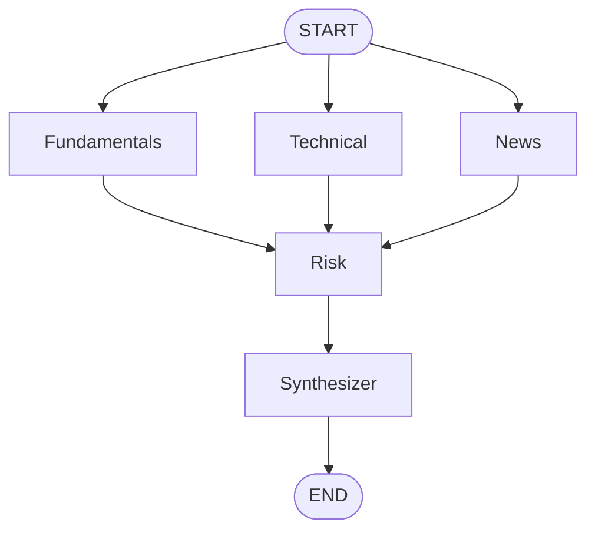
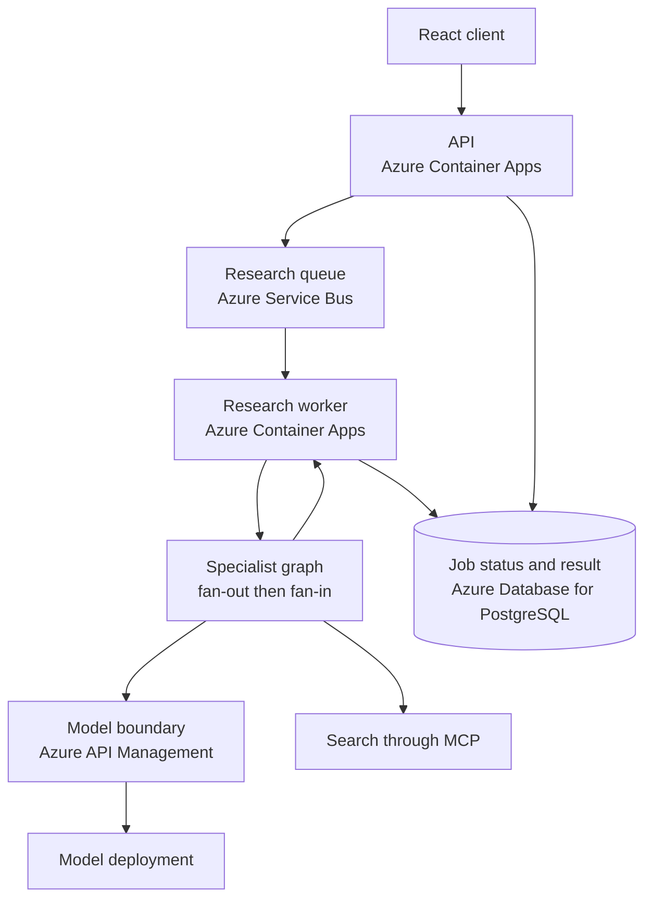
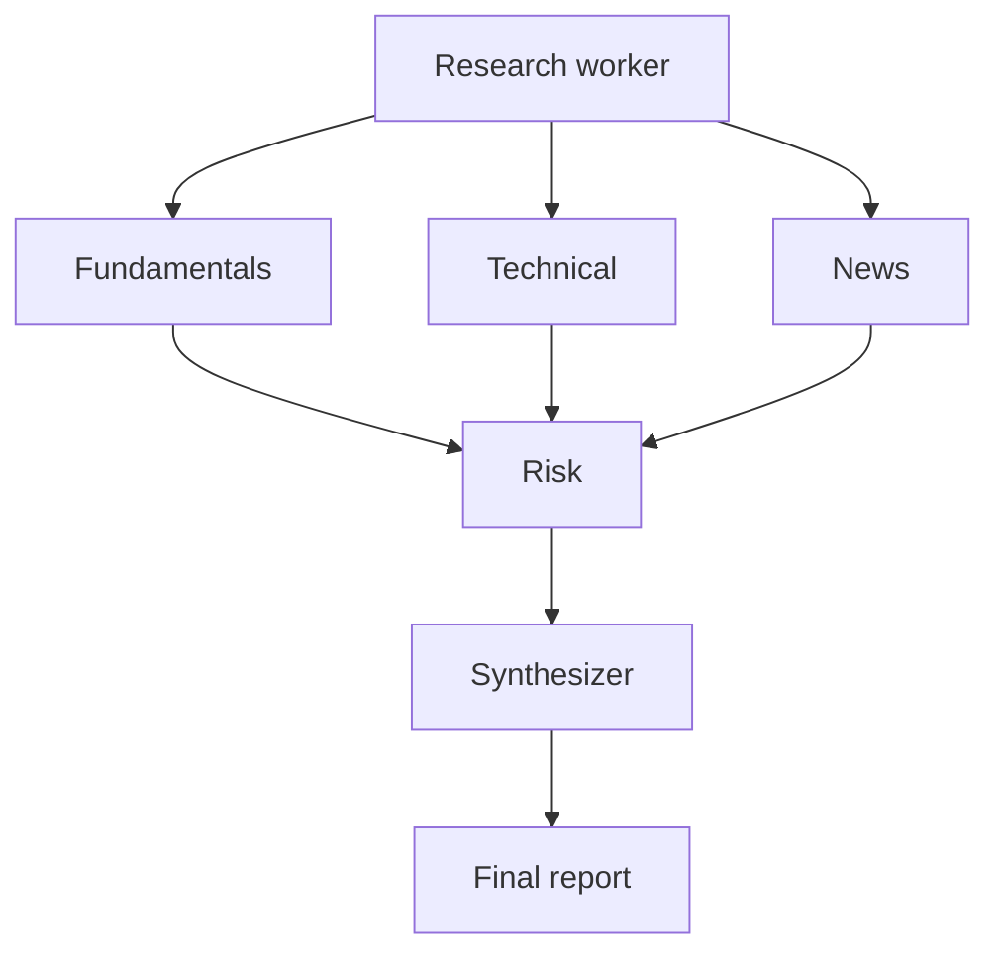

# Chapter 8: The Multi-Agent Graph

A tool-using agent can collect several kinds of evidence, but one prompt still has to decide what matters, when to stop searching, and how to combine unlike signals. In the Stock Research Assistant, that single role had grown to include fundamentals, price behavior, news, cross-signal risk, and final report writing.

The next design change is specialization. Separate agents own separate questions, while a graph makes their dependencies explicit. The chapter-stage design has five nodes: Fundamentals, Technical, and News run as independent specialists; Risk waits for all three; Synthesizer writes the report. The finished repository later replaces Synthesizer with Devil's Advocate and Decision, but it retains the same fan-out and fan-in at the front of the graph.

> **Chapter snapshot**
> - **Starting point:** One shared harness can run tool loops and one-shot synthesis through a common model boundary.
> - **Focus in this chapter:** A five-node orchestration graph with parallel specialists, a fan-in barrier, single-writer state, and additive usage records.
> - **Finished repository:** The current graph has six nodes and a different decision tail; the chapter's fan-out, Risk barrier, and usage reducer remain directly visible in the current source.
> - **Coming next:** Chapter 9 separates in-flight progress, durable ticker facts, and semantic report retrieval into distinct memory paths.

## What This Chapter Explains

The graph answers a scheduling question: which work can run now, and which work must wait? It does not replace the agent harness. Each node still delegates model and tool interaction to the shared harness from earlier chapters.

The chapter-stage lifecycle has three dependency groups:

```text
Super-step 1: Fundamentals + Technical + News
Super-step 2: Risk
Super-step 3: Synthesizer
```

This arrangement makes two promises. The first three agents have no data dependency on one another, so they may overlap. Risk sees all three completed specialist results, and Synthesizer sees the resulting cross-signal assessment. Those are ordering promises, not performance promises: blocking work inside a node can still make the runtime effectively sequential.

## Design: Responsibilities Before Nodes

Specialization is useful only when each role has a clear boundary.

| Role | Evidence it owns | Execution style | Result |
|---|---|---|---|
| Fundamentals | Price and company fundamentals | Required market-data call, then one synthesis | Financial and valuation summary plus raw data |
| Technical | Price history and indicators | Required history call, then one synthesis | Momentum summary |
| News | Recent external events | Bounded tool loop with search | News assessment |
| Risk | All three specialist results | Deterministic flags, then synthesis | Cross-signal risks |
| Synthesizer | Prior summaries | Synthesis only | Reader-facing report |

Fundamentals and Technical do not ask the model whether required source data should be fetched. Application code makes those direct calls and gives the result to a one-shot synthesis. News keeps a tool loop because selecting a useful query and deciding whether more search is needed are genuine choices.

Risk also preserves a deterministic boundary. Python derives explicit flags from available data before the model explains their significance. Synthesizer adds no evidence; it combines what the earlier nodes produced.

The orchestrator, harness, and agent definition therefore have different jobs:

- The **orchestrator** schedules nodes and moves shared state.
- The **harness** mediates model messages, tool calls, turn limits, and usage.
- The **agent definition** supplies the prompt, input preparation, and allowed capabilities.

Putting another model loop inside a graph node would duplicate the harness and blur those responsibilities.

## Architecture: Fan-Out and Fan-In

The graph begins with three outgoing edges from `START`. Their results converge on Risk, creating a barrier. Synthesizer runs only after that barrier completes.



The barrier belongs to the graph. Risk does not poll three agents or inspect completion flags. LangGraph makes Risk runnable after all incoming branches in that super-step finish and their state updates have been merged.

The decisive wiring is small:

```python
builder.add_edge(START, "fundamentals")
builder.add_edge(START, "technical")
builder.add_edge(START, "news")

builder.add_edge("fundamentals", "risk")
builder.add_edge("technical", "risk")
builder.add_edge("news", "risk")

builder.add_edge("risk", "synthesizer")
builder.add_edge("synthesizer", END)
```

The current repository changes only the tail of this topology. Risk now leads to Devil's Advocate, then Decision. Chapter 10 explains why.

## Shared State Is an Ownership Contract

LangGraph passes one state object through the workflow. The important property is not its size but the writer for each field. In the chapter-stage graph, each summary has one owner: Fundamentals writes `fundamentals_summary`, Technical writes `technical_summary`, and so on.

Usage is different. Every parallel specialist contributes token and cost data. A shared running total would create a read-modify-write race: all three branches could read the same initial value, add their own usage, and overwrite one another.

The state therefore records independent usage events with an additive reducer:

```python
class ResearchState(TypedDict):
    fundamentals_summary: str
    technical_summary: str
    news_summary: str
    risk_summary: str
    final_report: str
    usage_log: Annotated[list[dict], operator.add]
```

Each node returns one list entry:

```python
return {
    "technical_summary": summary,
    "usage_log": [result.get("usage", {})],
}
```

Concatenation is the correct merge operation because each record is independent. The worker can sum the merged list after the graph finishes. Other shared values need reducers only when their update algebra is equally clear, such as set union for unique facts.

## Runtime Behavior

The graph's behavior is visible through node intervals and final state, not through the diagram alone.

| Situation | Observable result | What it demonstrates |
|---|---|---|
| Three fake specialists each wait one second | Fan-out finishes near one second plus overhead | The scheduler can overlap independent nodes |
| Risk records its start time | It starts after the latest specialist end time | Incoming edges form a barrier |
| Specialists emit usage values 10, 20, and 30 | Final total is always 60 | The reducer preserves concurrent contributions |
| One node uses blocking I/O | Starts serialize and elapsed time approaches the sum | `async def` alone does not create concurrency |

For nonblocking branches, elapsed time should roughly follow:

$$
T_{fanout} \approx \max(T_F, T_T, T_N)
$$

The comparison is approximate because graph scheduling, network latency, provider throttling, and thread-pool limits add overhead. Per-node monotonic timestamps make the evidence stronger than one total duration.

## Incident: A Parallel Graph Ran Sequentially

The first graph had the right edges, yet traces showed Fundamentals ending before the other specialists meaningfully began. Total duration was close to the sum of branch durations rather than their maximum.

The blocking work was below the graph. A synchronous `requests.post()` in the model client held the event-loop thread, so sibling coroutines could not progress. Replacing it with an awaited `httpx.AsyncClient.post()` produced overlapping intervals. Later traces exposed the same class of problem in synchronous `yfinance` calls; the current agents move those calls through `asyncio.to_thread`.

The graph did not need different edges. The operating rule changed instead: concurrency is a measured runtime property. An asynchronous function declaration and a fan-out diagram are insufficient evidence.

## Capacity Has Two Axes

The graph introduces concurrency within one ticker. Queue consumers introduce concurrency across tickers.

```text
intra-ticker concurrency = specialist branches in one graph
inter-ticker concurrency = worker replicas consuming ticker messages
```

Increasing both multiplies pressure on the model deployment, web search, outbound connections, and database writes. Azure API Management can govern and observe requests, but it does not create model token capacity. A model `429` is therefore capacity evidence, not proof that the graph is incorrectly asynchronous.

A useful reading sequence separates three questions. Fake agents prove scheduling without external ceilings. One live ticker proves integration and reveals branch timing. A deliberately bounded batch reveals shared quota behavior. The graph topology should not be changed until those observations identify the limiting layer.

> **Production Lens:** Explicit dependencies, single-writer fields, reducers for multi-writer state, and measured nonblocking I/O are production-shaped choices. This chapter-stage graph still fails as one run when a node fails, and its model and search quotas remain shared constraints. Later chapters add checkpoints, retry policy, and graceful degradation without changing the basic fan-out barrier.

## Azure Resources for This Stage

The graph runs inside the research worker already hosted by Azure Container Apps. Azure Service Bus delivers one ticker message to that worker, and Azure Database for PostgreSQL remains the authority for job status and results. Model requests pass through the existing Azure API Management boundary to the deployed model; search remains an external read capability exposed through the application's MCP boundary.

No new Azure resource is introduced merely because one worker now contains several graph nodes. The architectural change is inside the worker: one queue message now drives several specialized model interactions with explicit dependency order.

## Azure Architecture



The main flow is top-down from submission to persistence. Model and search calls are subordinate dependencies of graph nodes, not new owners of the job lifecycle.

## Architecture After This Chapter

At this point, one ticker message produces three specialist assessments, one cross-signal risk assessment, and one synthesized report. The worker remains the owner of the graph invocation and final persistence.



## Known Limitations

The chapter-stage Synthesizer has no explicit dissenting role and no authoritative BUY/HOLD/SELL contract. One failed node can fail the run. Completed state is not yet durable at graph boundaries, and the system has no graph-native retry or partial-result policy at this stage. Live execution also consumes several model calls and may consume multiple search operations per ticker.

The finished repository has moved beyond this exact five-node topology, and no curated Chapter 8 tag exists. The chapter therefore treats the five-node graph as a design milestone and points to current files only for the mechanisms that remain.

## Read the Chapter Code

| Current workspace path | What to inspect |
|---|---|
| `backend/worker/agents/graph.py` | The retained specialist fan-out, Risk barrier, single-writer state fields, and `usage_log` reducer; the current tail has two later nodes |
| `backend/worker/agents/fundamentals_agent.py` | A required data fetch followed by one-shot synthesis |
| `backend/worker/agents/technical_agent.py` | Blocking market-data work moved off the event loop |
| `backend/worker/agents/news_agent.py` | A specialist that keeps genuine search and tool choice |
| `backend/worker/agents/risk_agent.py` | Deterministic risk flags combined with cross-signal synthesis |
| `backend/worker/agent_harness.py` | The shared model/tool loop that graph nodes reuse rather than reimplement |

## Next

The graph can move state during one run, but that does not answer what the system should remember while work is in flight or after a report is complete. Chapter 9 separates short-lived progress, exact ticker profiles, and semantic report search by lifetime and lookup behavior.
