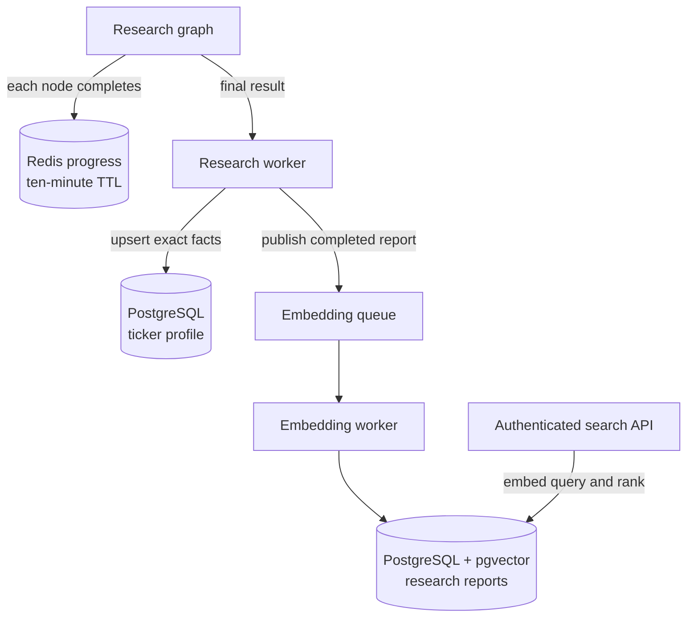
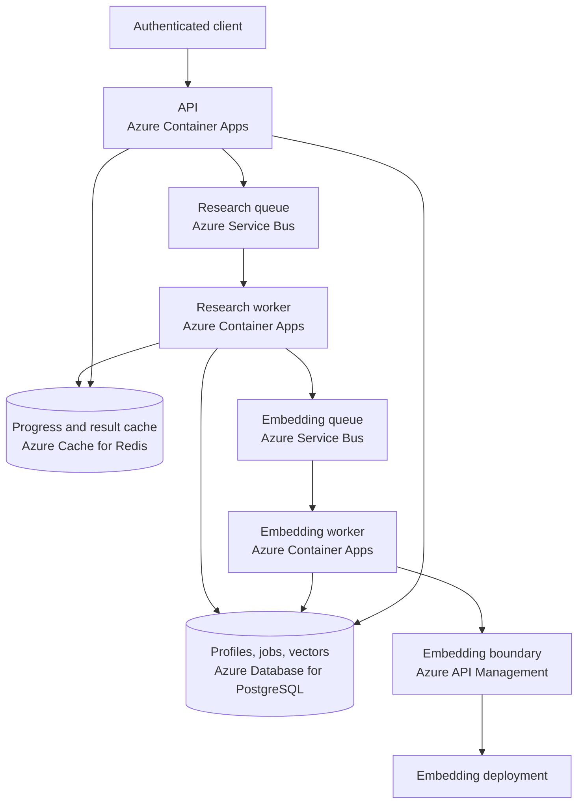

# Chapter 9: Memory and Retrieval

"Add memory" sounds like one feature until the application must decide what to remember, how long to keep it, and how to find it again. A running research job needs short-lived progress. Repeated research needs stable ticker facts. A person searching old reports needs similarity rather than an exact key.

Those needs have different owners and failure modes. This chapter keeps them separate: Redis holds in-flight progress, PostgreSQL holds exact ticker profiles, and PostgreSQL with pgvector supports semantic report search. Completed-result caching is a fourth, existing behavior. LangGraph checkpointing is not one of these memory tiers; Chapter 11 gives workflow recovery its own design.

> **Chapter snapshot**
> - **Starting point:** The multi-agent graph produces specialist results and one final report for each ticker.
> - **Focus in this chapter:** Separate memory paths for in-flight progress, durable entity facts, and semantic report retrieval.
> - **Finished repository:** The current workspace implements all three paths, although its duplicated progress readers have drifted: the API knows the six current agents while the worker-side read helper still names Synthesizer.
> - **Coming next:** Chapter 10 replaces consensus synthesis with explicit dissent and a structured decision.

## What This Chapter Explains

Memory is best classified by lifetime and lookup behavior, not by storage product.

| Feature | Store | Lifetime | Lookup | Responsibility |
|---|---|---|---|---|
| Completed-result cache | Redis | Until the cache policy expires | Market, ticker, date | Avoid repeated finished research |
| Progress memory | Redis | Ten minutes | Job, ticker, agent | Expose completed stages during a run |
| Ticker profile | PostgreSQL | Durable | Ticker, market | Preserve structured entity facts |
| Semantic report memory | PostgreSQL and pgvector | Durable | Vector similarity | Find prior reports by meaning |

These rows may all be called memory in conversation, but they are not interchangeable. A progress string cannot reconstruct a graph. A vector match is not an authoritative ticker profile. A cached final result says nothing about which agent has just completed.

## Lifecycle Before Storage

One ticker moves through the memory paths in this order:



The embedding path begins after research has produced a report. Search indexing is therefore eventually consistent. A completed job can be visible through ordinary job retrieval before its semantic result appears.

## In-Flight Progress Is Ephemeral

Progress answers a narrow question: which agents have completed for this job and ticker? The key includes all three identities because one API job can contain several tickers, and two jobs can research the same ticker concurrently.

```python
PROGRESS_TTL_SECONDS = 600

def _key(job_id: str, ticker: str, agent_name: str) -> str:
    return f"progress:{job_id}:{ticker}:{agent_name}"

async def write_progress(job_id, ticker, agent_name, summary):
    await redis_client.set(
        _key(job_id, ticker, agent_name),
        summary,
        ex=PROGRESS_TTL_SECONDS,
    )
```

A graph node writes only after it has a result. An absent key means "not completed," not an empty answer. The ten-minute time to live keeps progress from becoming a second report database. Runs that routinely exceed that policy need a measured longer value or refresh-on-write behavior.

The API reads progress only for ticker rows that are not terminal. Its observable contract evolves as work completes:

```text
{"status":"running","progress":{}}
{"status":"running","progress":{"AAPL":{"technical":"..."}}}
{"status":"done","result":{...}}
```

The API and worker are separate Python projects, so the read contract is duplicated. Current source demonstrates the risk: the API iterates the current six agent names, while `backend/worker/memory/short_term.py` still lists `synthesizer`. The worker helper is not the public status path, but the mismatch is evidence that duplicated contracts need compatibility checks or a shared representation such as a Redis hash.

## Ticker Profiles Use Exact Identity

A ticker profile stores facts that are stable enough to reuse: sector, industry, first and last research times, and research count. None requires semantic search.

```python
class TickerProfile(SQLModel, table=True):
    __table_args__ = (UniqueConstraint("ticker", "market"),)

    ticker: str = Field(index=True)
    market: str
    sector: str | None = None
    industry: str | None = None
    research_count: int = 1
```

Market is part of the identity because the same symbol can refer to different instruments across exchanges. The worker updates the profile after a successful fundamentals result, preserving `first_researched_at`, refreshing `last_researched_at`, and incrementing the count.

The current implementation performs a read followed by insert or update. The database uniqueness constraint prevents two durable identities for the same `(ticker, market)`, but the application-level sequence is still exposed to concurrent conflicts. A database-native upsert would make that ownership transition atomic.

## Semantic Memory Serves the Reader

Past reports are model-generated opinions based on data available at an earlier time. The system has no outcome tracking that establishes whether a prior recommendation was correct. Injecting similar reports into a new research run would therefore risk anchoring current analysis on stale, unevaluated text.

Semantic retrieval still solves a useful reader problem: find prior work when the query is conceptual rather than an exact ticker or date. The design exposes that capability through authenticated search instead of silently adding retrieved text to agent context.

The stored vector dimension matches the embedding model:

```python
EMBEDDING_DIM = 1536

class ResearchReport(SQLModel, table=True):
    job_id: str = Field(index=True)
    ticker: str
    market: str
    report_text: str
    embedding: list[float] = Field(
        sa_column=Column(Vector(EMBEDDING_DIM))
    )
```

At query time, the API scrubs personally identifiable information from free text, embeds the query with the same model family, and orders reports by cosine distance. Exact scans are adequate for a small collection. Approximate indexes require representative recall measurements rather than assumption.

## Embedding Is Outside the Critical Path

The research worker does not wait for an embedding call before marking useful research complete. It publishes a compact event to `embedding-jobs`:

```json
{
  "job_id": "job-123",
  "ticker": "ADBE",
  "market": "US",
  "report_text": "..."
}
```

The embed worker owns vector generation and the `ResearchReport` write. If it is stopped, research can still finish and the queue retains indexing work. When it returns, reports become searchable later.

This independence also creates a redelivery requirement. A failure after the database commit but before message completion can deliver the same event again. The current report table has no uniqueness constraint covering that event identity, so duplicate rows remain a known risk. Queue durability is not exactly-once storage.

## Behavior Evidence

| Situation | Observable result | Design conclusion |
|---|---|---|
| One specialist completes | Its Redis key appears while unfinished agents remain absent | Progress is visible before final completion |
| The same ticker is researched twice in one market | One profile row has a count of two | Exact identity is `(ticker, market)` |
| The embed worker is stopped | Research reaches `done`; the embedding message remains queued | Indexing is outside the research critical path |
| The embed worker restarts | The report later appears in semantic search | Search is eventually consistent |
| A query paraphrases a report without naming its ticker | That report can rank first | Retrieval uses meaning rather than an exact key |

## Incident: A Feature Was Only Half Deployed

The worker wrote Redis progress, but public polling returned only `{"status":"running"}`. Redis data and the write path were correct. The API was running an older revision without the matching read path.

The evidence changed the deployment rule: a cross-service feature is complete only when every participating service revision is current and the public behavior works. Rebuilding the writer does not deploy a writer-and-reader contract.

> **Production Lens:** Separating memory by lifetime and moving embeddings to an independent queue are production-shaped choices. The current implementation still needs database migrations, idempotent embedding writes, retention policy, retrieval evaluation, and a single progress-name contract. Semantic similarity makes reports discoverable; it does not make them verified evidence for a new recommendation.

## Azure Resources for This Stage

Azure Cache for Redis stores short-lived progress and the existing result cache. Azure Database for PostgreSQL stores ticker profiles and, with pgvector enabled, report embeddings. Azure Service Bus carries `embedding-jobs`, and a separate Azure Container Apps worker consumes them. Embedding requests use the existing model boundary through Azure API Management.

These resources have distinct runtime responsibilities. Redis is disposable coordination state. PostgreSQL is durable application state. Service Bus decouples report completion from indexing. The embedding worker can scale independently from research workers.

## Azure Architecture



## Architecture After This Chapter

The graph remains responsible for one research run. Memory surrounds it without becoming part of its reasoning: progress is written during nodes, profiles are updated by the worker, and semantic indexing starts after the report exists.

## Known Limitations

The repository has no versioned database migrations or local composition for all three stores. The profile update is not a database-native upsert. Embedding redelivery can create duplicate report rows. Retrieval quality has no labeled evaluation set. The duplicated progress readers have drifted, even though the public API currently names the six current nodes correctly.

No curated Chapter 9 tag exists, so this chapter does not present Git inspection commands or claim a historical snapshot is available.

## Read the Chapter Code

| Current workspace path | What to inspect |
|---|---|
| `backend/worker/memory/short_term.py` | Progress key shape, TTL, and the stale worker-side reader list |
| `backend/worker/agents/graph.py` | Progress writes at node completion |
| `backend/api/main.py` | Public progress reads and semantic search by cosine distance |
| `backend/worker/models.py` | Exact-key `TickerProfile` identity and timestamps |
| `backend/worker/worker.py` | Profile updates and publication of embedding work |
| `backend/embed-worker/embed_worker.py` | Embedding consumption and durable report writes |
| `backend/embed-worker/models.py` | The 1,536-dimension pgvector report schema |

## Run This Stage

- **Repository tag:** `chapter-09-complete`.
- **Azure resources:** Azure Cache for Redis, pgvector enabled on the Chapter 3 PostgreSQL server, and a new `embedding-jobs` Service Bus queue with a separate Azure Container Apps worker to consume it. Set `REGISTRY_LOGIN_SERVER` in `infra/.local-config` (see [Azure Setup and Deployment](azure-setup.md)) and provision with `./infra/deploy.sh infra/params/chapter-09.json`.
- **Run it offline:** the worker and the new embed-worker each have their own test suites that run without Redis, Postgres, or a live model:

  ```bash
  git switch --detach chapter-09-complete
  cd backend/worker && uv sync && uv run python -m unittest discover -s tests -v
  cd ../embed-worker && uv sync && uv run python -m unittest discover -s tests -v
  ```

- **Run it end to end:** in addition to the earlier variables, set `REDIS_URL` for the API and worker, and run the embed-worker as its own process against `DATABASE_URL` and a Service Bus connection string scoped to the `embedding-jobs` queue:

  ```bash
  cd backend/embed-worker
  DATABASE_URL=... SERVICEBUS_CONNECTION_STRING=... uv run python embed_worker.py
  ```

## Next

Memory makes work visible and searchable, but a Synthesizer can still turn repeated agreement into a confident conclusion without testing the shared premise. Chapter 10 replaces that tail with explicit counter-evidence and a decision boundary that keeps deterministic calculations under application control.