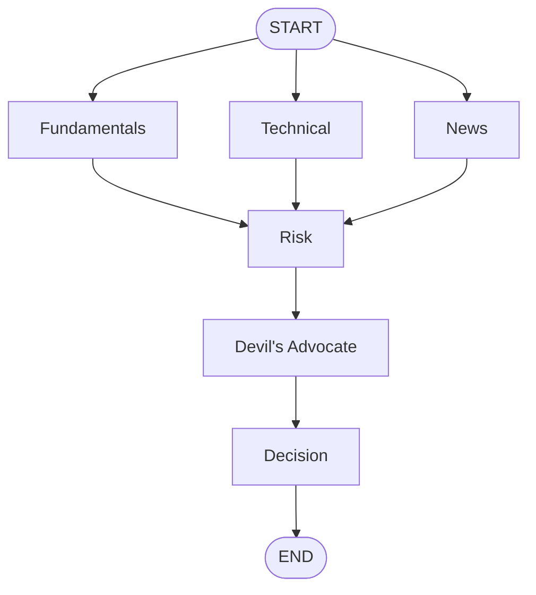
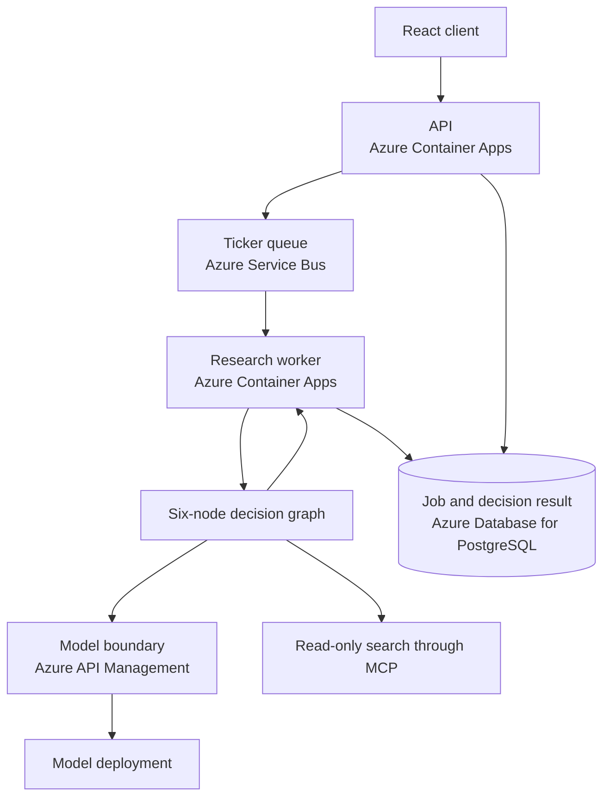

# Chapter 10: Decision and Dissent

The five-node graph ends with a Synthesizer. It can write coherent prose, but its authority is unclear. It appears to summarize, judge valuation, enforce disqualifying facts, and issue a recommendation at once. Consensus also has no structural opponent: repeated optimism can look like independent confirmation even when several agents share the same premise.

The graph tail therefore changes. A read-only Devil's Advocate searches for counter-evidence to claims already made. Decision weighs that counter-thesis with the specialist record. Deterministic Python computes intrinsic value and hard stops so financial arithmetic and policy comparisons do not depend on model transcription.

> **Chapter snapshot**
> - **Starting point:** Fundamentals, Technical, and News fan out; Risk waits for all three; Synthesizer writes the report.
> - **Focus in this chapter:** Replace Synthesizer with an explicit dissent role and a structured Decision role backed by deterministic calculations.
> - **Finished repository:** The current workspace implements the six-node graph, read-only dissent, historical-P/E valuation, and hard-stop fields, while leaving several enforcement gaps visible.
> - **Coming next:** Chapter 11 persists graph position at super-step boundaries so redelivered work can resume.

## What This Chapter Explains

The new tail separates three kinds of authority:

| Component | Responsibility | Allowed capability | Authority |
|---|---|---|---|
| Devil's Advocate | Find evidence that weakens the current case | Read-only web search | Counter-thesis, not verdict |
| Decision model | Weigh narrative signals | Valuation and hard-stop result access | Structured recommendation text |
| Deterministic Python | Calculate and compare trusted values | In-process data only | Persisted valuation and hard-stop facts |

The model may choose which calculation to inspect while reasoning. It does not supply the financial inputs, reimplement formulas, or become the source of the persisted deterministic fields.

## Architecture: An Adversarial Decision Tail



Synthesizer is removed rather than retained beside the new nodes. Otherwise two components would own the final report. Devil's Advocate runs after Risk so it can challenge the strongest assembled case. Decision runs last so the counter-thesis cannot be omitted merely because both tail nodes started together.

The decisive current wiring is:

```python
builder.add_edge("risk", "devil_advocate")
builder.add_edge("devil_advocate", "decision")
builder.add_edge("decision", END)
```

Decision alone writes `final_report`, `recommendation`, `overall_score`, `hard_stops_triggered`, and `intrinsic_value` into graph state.

## Dissent Is Specific and Read-Only

Devil's Advocate is not a generic negative persona. It receives the four existing summaries and searches for evidence that contradicts their concrete claims. Its registry contains only search:

```python
tool_schemas = [SEARCH_WEB_SCHEMA]
tool_registry = {"search_web": search_via_mcp}

result = await run_agent(
    SYSTEM_PROMPT,
    user_message,
    tool_schemas,
    tool_registry,
)
```

The harness cannot dispatch a database write, queue operation, or recommendation change because none is registered. This is a real capability boundary inside the process, though the worker process itself still has broader credentials for its own responsibilities.

The prompt asks for no more than two searches, but current code does not enforce that count in the registry or harness. A third request can still be dispatched within the harness turn limit. The prose policy reduces wandering; it is not a hard budget.

Malformed output is parsed into a low-confidence fallback rather than being copied into state as if it were valid structured dissent. That protects the state shape, not the quality of the underlying evidence.

## Trusted Data Stays Outside Model Arguments

Decision needs multi-year earnings per share, monthly prices, current price, return on equity, debt-to-equity, and free-cash-flow history. Asking the model to reproduce those values in tool arguments would consume tokens and create transcription risk.

Application code fetches the data once. Two zero-argument tools close over the same trusted object:

```python
extended_data = await asyncio.to_thread(
    fetch_extended_fundamentals,
    ticker,
    market,
)

async def compute_intrinsic_value_tool():
    return compute_intrinsic_value(
        extended_data.get("eps_history", {}),
        extended_data.get("monthly_prices"),
        extended_data.get("current_price"),
    )
```

The model controls whether it requests a calculation during its reasoning loop. The application controls the source values. The deterministic functions control the result. This division keeps agentic choice without delegating arithmetic truth.

## Intrinsic Value Is a Deterministic Method

The valuation uses historical price-to-earnings ratios rather than a model-generated target. For each fiscal year with positive EPS, it averages monthly closing prices over the trailing year ending at the company's reported fiscal-year end and computes:

$$
P/E_y = \frac{\text{average price}_y}{EPS_y}
$$

The mean historical P/E becomes the intrinsic multiple. The latest and minimum historical multiples, plus P/E growth when available, produce best and worst cases. Each price scenario is the latest positive EPS multiplied by its selected multiple.

```python
intrinsic_pe = sum(pe_values) / len(pe_values)
intrinsic_price = latest_eps * intrinsic_pe
best_case_price = latest_eps * best_case_pe
worst_case_price = latest_eps * worst_case_pe
```

The margin-of-safety policy labels current price at or below 80 percent of intrinsic value as `BUY`, price up to intrinsic value as `WAIT`, and a higher price as `OVERPRICED`. These thresholds are application policy, not universal finance rules. Reported fiscal-year-end dates keep the method market-agnostic rather than assuming one national calendar.

## Hard Stops Are Pure Comparisons

The current hard-stop function checks three signals available for both supported markets:

- Return on equity below 8 percent.
- Debt-to-equity above 200 in the provider's ratio-times-100 units.
- Negative free cash flow across all available values in a slice of up to the two most recent reported years.

```python
if roe is not None and roe * 100 < MIN_ROE_PCT:
    stops.append("Return on equity is below the quality floor.")

if debt_to_equity is not None and debt_to_equity > MAX_DEBT_TO_EQUITY:
    stops.append("Debt-to-equity exceeds the leverage ceiling.")
```

One available negative year is therefore enough to trigger the current rule; it does not require two complete years. Missing data does not trigger a stop. That avoids equating unknown with failed, but it also means a recommendation can proceed with incomplete evidence. Data sufficiency needs its own field if policy must distinguish those states.

## Structured Output Still Needs Postconditions

Decision asks for a recommendation enum, a score, and a short evidence-based summary. Parse failure falls back to `HOLD`, no score, and a visible synthesis error. After the model loop, the application recomputes deterministic fields and overwrites those result keys:

```python
parsed["hard_stops_triggered"] = check_hard_stop_rules(extended_data)
parsed["intrinsic_value"] = compute_intrinsic_value(
    extended_data.get("eps_history", {}),
    extended_data.get("monthly_prices"),
    extended_data.get("current_price"),
)
```

This guarantees the stored calculations come from Python. It does not guarantee that the recommendation obeys them. Current code can retain `BUY` while attaching a nonempty hard-stop list. It also parses JSON without fully enforcing the recommendation enum or score range.

That gap matters because "hard stop" implies an application postcondition. If a triggered stop must rule out `BUY`, deterministic code must enforce the chosen override policy after parsing. Prompt instructions are not equivalent to that guarantee.

## Behavior Evidence

| Input or event | Observable result | What it demonstrates |
|---|---|---|
| The dissent registry is inspected | Only `search_web` is callable | Read-only capability is enforced by dispatch surface |
| A scripted model requests valuation twice | Both calls return the same result from one captured dataset | Calculation is deterministic and model arguments cannot alter inputs |
| Fixture data crosses a hard-stop threshold | The Python stop list changes at the exact boundary | Policy is testable without a model |
| The model returns malformed JSON | Decision falls back to `HOLD` with no score | Parse failure does not corrupt state shape |
| The model returns `BUY` while low ROE triggers a stop | Both `BUY` and the stop remain in current output | Recommendation enforcement is still incomplete |

## Incident: More Reasoning Crossed Two Capacity Boundaries

Standalone checks passed, but the expanded graph produced a model `429`. The added dissent and decision turns had raised request and token pressure enough to reach the deployment limit. Available model capacity was increased in response to that measured ceiling.

The same longer run exceeded a 60-second Service Bus message lock. The result had already been persisted when message completion failed, so Service Bus redelivered it. The worker's completed-row guard skipped the duplicate expensive graph run.

The incident connects three costs that are easy to inspect separately: more reasoning raises token rate, wall-clock duration, and redelivery probability. Capacity and lock settings should follow observed distributions, while idempotency remains necessary because a longer lock cannot guarantee exactly-once completion.

> **Production Lens:** Read-only dissent, trusted in-process calculation inputs, structured outputs, and authoritative deterministic fields are production-shaped choices. Current code still has a prompt-only search budget, partial JSON validation, no explicit data-sufficiency policy, and no deterministic override when hard stops contradict `BUY`. Those are decision-policy gaps, not writing-quality problems.

## Azure Resources for This Stage

No new Azure resource is required for the two new graph roles. They run in the existing research worker on Azure Container Apps. Model traffic continues through Azure API Management to the deployed model, read-only counter-evidence uses the existing search boundary, Service Bus carries ticker work, and PostgreSQL stores the resulting structured decision with the job result.

The operational change is increased use of existing capacity. Two additional reasoning roles can raise model calls, search calls, worker duration, and the chance that a queue lock expires.

## Azure Architecture



## Architecture After This Chapter

The graph now has six nodes. Specialist fan-out and Risk remain unchanged; the tail is `Risk -> Devil's Advocate -> Decision`. Decision owns the final report and structured recommendation, while deterministic functions own valuation and stop facts.

## Known Limitations

The output remains educational research, not an executable trade instruction. Historical P/E is one valuation method, and its thresholds are starting policy values. Missing data is not modeled as a separate sufficiency state. Search limits and recommendation overrides are not enforced in code. The current progress contract remains duplicated across services.

No curated Chapter 10 tag exists, so the current workspace is the only code reference and no Git comparison is presented.

## Read the Chapter Code

| Current workspace path | What to inspect |
|---|---|
| `backend/worker/agents/graph.py` | The six-node topology and Decision-owned state fields |
| `backend/worker/agents/devil_agent.py` | The read-only search registry and structured dissent fallback |
| `backend/worker/agents/decision_agent.py` | Zero-argument closures, model parsing, and deterministic postprocessing |
| `backend/worker/tools/extended_fundamentals.py` | The trusted data assembled before model tool choice |
| `backend/worker/tools/valuation.py` | Historical-P/E calculations and margin-of-safety labels |
| `backend/worker/tools/hard_stops.py` | Threshold units, boundary comparisons, and missing-data behavior |
| `backend/worker/worker.py` | Persistence, message redelivery guard, and structured decision output |

## Next

The decision graph now has explicit dissent and deterministic evidence, but a worker crash can still cause expensive completed stages to run again. Chapter 11 persists graph position at completed super-step boundaries and makes the resume guarantee precise.