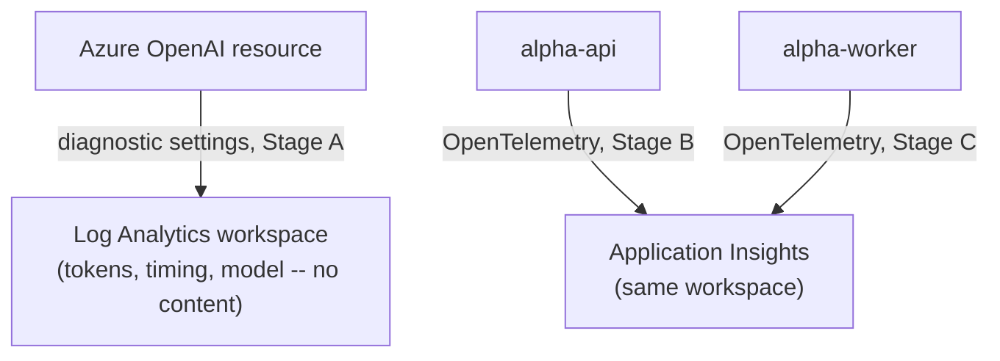
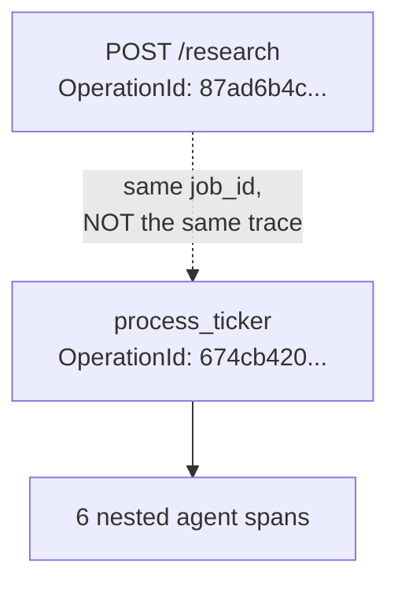
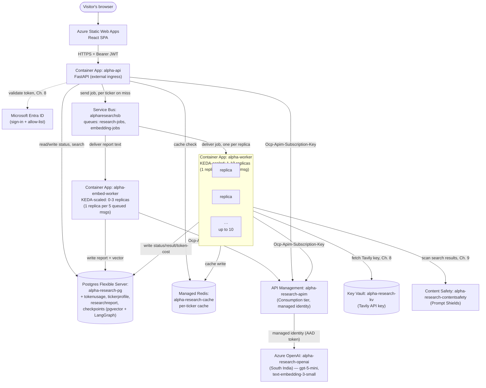
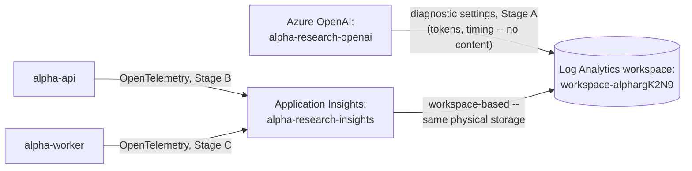

# Chapter 10 — Observability

## The Problem, Stated Plainly

Every phase up to this point has been verified by reading logs and eyeballing timestamps — real discipline, but a real ceiling too. Once something is deployed, there's been no way to ask "how long did each part of this job actually take," "what did this specific call cost," or "why was this slow" without stitching together `print()` statements by hand. `phases.md` calls this out explicitly, and adds a real bar beyond "add some dashboards": *use the gathered data to make at least one real improvement, not just a dashboard nobody acts on.* This chapter is built in five stages, each ending in real, verified evidence — and it does end with a genuine fix, found only because the tracing existed to find it.

## Stage A: Azure OpenAI's Own Diagnostic Logs

The cheapest possible win, checked first per this project's standing habit of using what Azure already provides before building anything: **diagnostic settings** on the `alpha-research-openai` resource itself, exported to the existing Log Analytics workspace (`workspace-alphargK2N9`, already provisioned for Container Apps' own logs) — zero code changes, captures `promptTokens`/`completionTokens`, model name/version, request duration, and HTTP result for every call, regardless of which client made it.

**A real config gotcha, not just latency.** The first attempt used the CLI's default settings and genuinely never worked — a real call sat unqueryable for 15+ minutes, past any reasonable ingestion delay. The actual cause: `logAnalyticsDestinationType` had silently stayed `null` (the legacy shared `AzureDiagnostics` table) instead of `Dedicated` (resource-specific tables), because `az monitor diagnostic-settings create --export-to-resource-specific true` didn't actually apply the setting — confirmed by reading the raw resource JSON via `az rest`, not assumed from the CLI's own success message. Fixed with a raw `az rest PUT`, the same CLI-gap workaround this project has hit before.

**A real, worth-knowing limit.** Despite the category being named "RequestResponse," Azure's `properties_s` payload contains *no prompt or completion text at all* — only metadata (byte lengths, token counts, timing, model info). Verified directly: a test call with a unique marker string (`PHASE10DIAGTEST`) never appeared anywhere in the logged properties, only its real token counts did. For what this phase actually needs — cost and performance visibility, not content auditing — that's sufficient, and deliberately not pursued further.

## Stage B: OpenTelemetry in `alpha-api`

No Application Insights resource existed yet — Container Apps' own logging goes straight to Log Analytics as plain container stdout, not through App Insights at all. Provisioned a real, workspace-based Application Insights resource (`alpha-research-insights`), then wired the `azure-monitor-opentelemetry` distro into `alpha-api`: `configure_azure_monitor()` plus `FastAPIInstrumentor.instrument_app(app)`, auto-instrumenting every route with zero per-endpoint code.

**The one deliberate addition**: `job_id` as a custom span attribute on `/research`'s request span (`main.py`):

```python
trace.get_current_span().set_attribute("job_id", job_id)
```

App Insights' own operation ID isn't ours to query by — without this, there'd be no way to find "everything related to this one job" later. Verified live: drove a real request through the deployed container (via `TestClient`, since exercising the real Entra OAuth flow from a script isn't practical) and found the exact `job_id` sitting in the request's `Properties` field in Log Analytics afterward.

## Stage C: Tracing Through `alpha-worker`'s Agent Graph

The more interesting half. `worker.py` gets the same `configure_azure_monitor()` setup, plus `HTTPXClientInstrumentor().instrument()` — auto-instrumenting every outbound HTTP call (Azure OpenAI via APIM, Tavily, Content Safety) with no changes to those files at all. `process_ticker` opens one root span per ticker, carrying `job_id`/`ticker`/`market` and the real Service Bus queue-wait time (`msg.enqueued_time_utc`) — `phases.md` explicitly asks for queue time as part of a job's lifecycle, and Service Bus already tracks it; this just surfaces it on the same trace as everything else.

Each of the 6 LangGraph agent nodes in `agents/graph.py` gets its own named child span (`agent:fundamentals`, `agent:news`, etc.), tagging token usage after the call succeeds. This is what actually gives "each agent's duration" — not a single undifferentiated blob per job.

**A real, unresolved gap, reported honestly rather than glossed over.** An isolated test proved `HTTPXClientInstrumentor` genuinely works — a real Azure OpenAI call produced a real dependency span, correctly nested, when force-flushed. But the *actual* AAPL job's six agent spans showed **no nested httpx dependency spans** for their own model calls, despite calling the exact same code path. Checked httpx version compatibility, import ordering, and mid-deploy replica overlap — none explained it. Left as a known, tracked gap rather than chased indefinitely: the per-agent spans (which do work, proven with real data) already satisfy what this phase needs.

## Stage D: Tracing a Job End-to-End

**The honest shape of it**: a job's story lives in three separate places, not one continuous waterfall. `job_id` is the correlation key *across* them, not a single trace ID:

1. `alpha-api`'s own trace (`POST /research`).
2. `alpha-worker`'s trace (`process_ticker` + 6 nested agent spans).
3. Azure OpenAI's raw diagnostic logs (Stage A) — correlated by Azure's own ID, not `job_id`; a separate lookup.

(1) and (2) are separate because Service Bus doesn't propagate trace context across the queue in this setup — confirmed directly: `POST /research`'s `OperationId` and `process_ticker`'s `OperationId` are genuinely different values for the same real job.

**A second real portal gotcha, distinct from the diagnostic-settings one.** Querying `AppRequests`/`AppDependencies` from inside the Application Insights resource's own **Logs** blade failed outright — `Failed to resolve table expression named 'AppRequests'` — even though the exact same tables were directly queryable via the CLI against the underlying Log Analytics workspace. This is a known, real quirk of workspace-based Application Insights: querying from the **Log Analytics workspace's own Logs blade** works reliably; the App Insights resource's own Logs blade sometimes doesn't expose the same tables. The bulletproof version, verified working:

```kql
let jobid = "PASTE_JOB_ID_HERE";
union AppRequests, AppDependencies
| where Properties has jobid
| project TimeGenerated, Type, Name, DurationMs, Success, Properties
| order by TimeGenerated asc
```

Real output from job `b91a6e04-09ae-419e-b074-545488a9f734` (AAPL) also caught something unplanned: a second `process_ticker` row, 11ms, with the *same* `job_id` — a genuine Service Bus redelivery of an already-completed message, correctly caught by Phase 8's "already done, skip" idempotency guard instead of being reprocessed. A real, live re-confirmation of a much earlier fix, found purely as a side effect of building this query.

## Stage E: Closing the Loop — a Real Bug, Found By the Tracing Itself

`phases.md`'s actual bar for this phase isn't "traces exist" — it's "the traces informed a real fix." The AAPL job's own timing data made this obvious in hindsight: `agent:fundamentals` (73.8s), `agent:technical` (68.5s), and `agent:news` (71.3s) all clustered suspiciously close together despite doing completely different work — real, measured, not assumed.

**The cause**: `fetch_stock_data()`, `fetch_technical_indicators()`, and `fetch_extended_fundamentals()` are synchronous, blocking `yfinance` calls, invoked unawaited from async agent code (`fundamentals_agent.py`, `technical_agent.py`, `decision_agent.py`). The exact same bug class `model_client.py`'s own docstring already documents having hit and fixed once, in a different file this fix never touched: a blocking call freezes the *entire* event loop, silently serializing branches the graph runs "in parallel."

**Fixed by wrapping each call site in `asyncio.to_thread()`** — the blocking I/O now runs off the event loop instead of on it. Verified with a real before/after, not assumed:

| | Before (buggy) | After (fixed) |
|---|---|---|
| `agent:fundamentals` | 73.8s | **8.9s** |
| `agent:technical` | 68.5s | **6.3s** |
| `agent:news` | 71.3s | **12.4s** |
| `process_ticker` total | 98.9s | **41.4s** |

A **~58% reduction** in per-ticker wall-clock time, from one fix the tracing itself surfaced — the concrete "acted on the data" deliverable this phase is supposed to produce, not a dashboard nobody looks at.

## Frontend: Showing the Job ID

A real, practical gap once the debugging story existed: if a user says "the AAPL report looked wrong," there was no way to find its `job_id` without dev tools or a direct database query. The frontend already receives it from `POST /research`'s response — it just never surfaced it. `App.jsx` now shows a small, muted line under each completed report with a one-click copy button, so "something looked off" becomes "here's the ID, here's the trace" instead of a support archaeology exercise.

## Key Files From This Chapter

| File | What it does |
|---|---|
| `backend/api/main.py` | `configure_azure_monitor()` + `FastAPIInstrumentor`; `job_id` stamped as a custom span attribute on `/research`. |
| `backend/worker/worker.py` | Same Azure Monitor setup plus `HTTPXClientInstrumentor`; `process_ticker` wrapper opens the root span per ticker, carrying `job_id`/`ticker`/`market`/queue-wait time. |
| `backend/worker/agents/graph.py` | Each of the 6 node functions wrapped in its own named span (`agent:fundamentals`, etc.), tagging token usage. |
| `backend/worker/agents/fundamentals_agent.py`, `technical_agent.py`, `decision_agent.py` | The real blocking-call fix — `asyncio.to_thread()` around each synchronous yfinance call. |
| `frontend/src/App.jsx` | Job ID display + copy-to-clipboard on the completed report. |

## The Flow So Far

**1. What each stage wired up**



**2. How `job_id` ties two separate traces together (Stage D)**



The dotted line is deliberate — it's a `job_id` match, not a parent-child span relationship. Service Bus doesn't propagate trace context across the queue in this setup, so these stay two separate operations, correlated by our own field rather than by the platform automatically.

## Azure Components Used This Chapter

One new resource: **Application Insights** (`alpha-research-insights`), workspace-based, linked to the existing Log Analytics workspace — no new compute, no new network path from the browser. Diagnostic settings added to the existing `alpha-research-openai` resource (Stage A), exporting to the same workspace.

## The Architecture So Far

This is the diagram every chapter has grown, one real piece at a time, since Chapter 1's single box — last updated in Chapter 6. It went stale for three real phases in a row: Chapters 7-9 each added genuinely new resources (Entra ID and Key Vault in Chapter 8, Content Safety in Chapter 9) without bringing this shared diagram along. Brought fully current here, along with Application Insights, this chapter's own new piece.



**This chapter's own addition, kept as a separate diagram rather than folded into the one above** — the resource-topology diagram answers "who calls whom"; this one answers "who reports telemetry, and to where," a genuinely different question that would just clutter the first diagram if merged in.



## Where This Stands

Per-agent duration, token usage, queue-wait time, and cross-trace `job_id` correlation are all real, deployed, and verified against live jobs — not just configured and assumed. One real bug, found only because this tracing existed, is fixed and measured: a ~58% reduction in per-ticker processing time.

Left deliberately open, not silently: the httpx dependency-span gap inside real agent runs (Stage C) is unresolved — the mechanism is proven to work in isolation, but doesn't show up nested inside the real graph's spans, and hasn't been root-caused. Stage A's diagnostic logs remain a separate, non-joinable data source (Azure's own correlation ID, not `job_id`). No distributed trace propagation exists across the Service Bus queue boundary — `job_id` is a manual correlation key, not an automatic one. And no alerting or dashboards were built on top of any of this — the data is real and queryable, but nothing yet watches it proactively. All real, all known, none hidden.
