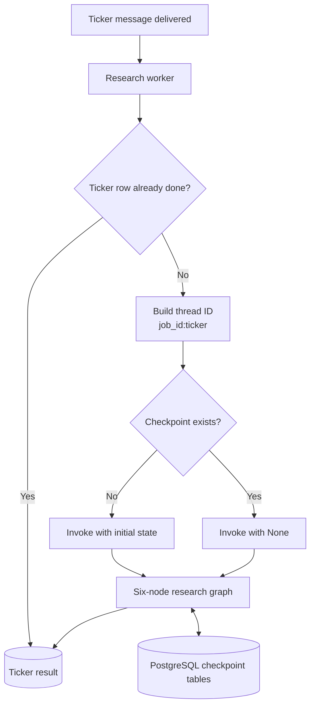
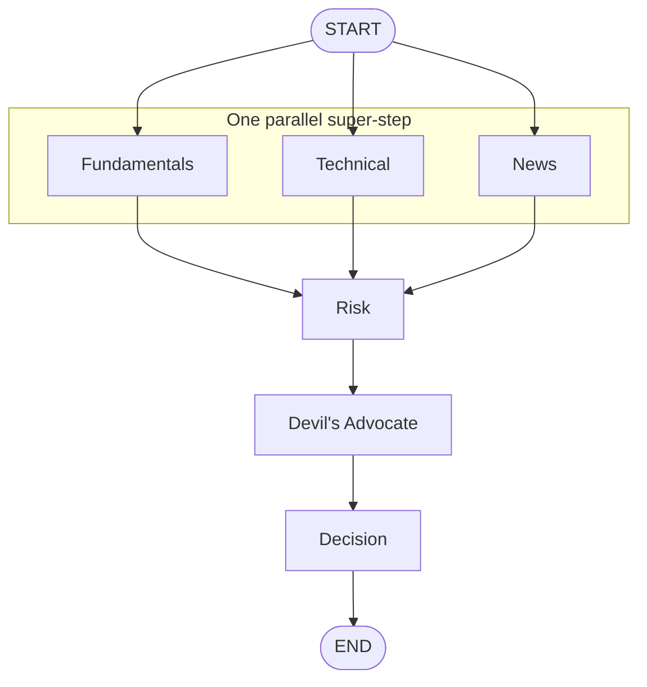
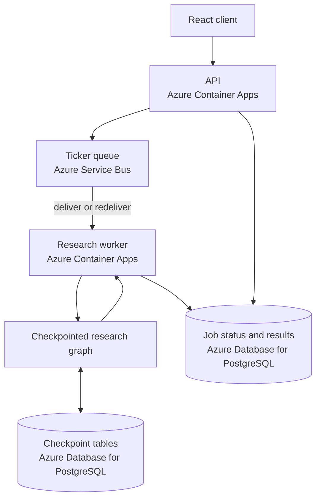

# Chapter 11: Checkpointing

Azure Service Bus can redeliver a ticker message after a worker disappears, but the message contains only the request. Without durable graph state, a replacement worker starts the research workflow again. Completed model and search calls repeat, latency returns, and the same usage may be purchased twice.

Checkpointing preserves a different thing from the queue. Service Bus preserves that work must happen. LangGraph preserves where a specific graph execution reached a completed commit boundary. Understanding that boundary is more important than adding a database saver and calling the workflow durable.

> **Chapter snapshot**
> - **Starting point:** The current six-node graph ends with Devil's Advocate and Decision, while Service Bus can redeliver unfinished ticker work.
> - **Focus in this chapter:** Stable per-ticker thread identity, PostgreSQL-backed graph checkpoints, fresh-versus-resume invocation, and super-step commit semantics.
> - **Finished repository:** The current worker creates an `AsyncPostgresSaver`, compiles the graph with it, checks for an existing thread, and resumes with `None`.
> - **Coming next:** Chapter 12 handles failures that do not require process recovery through retries and graceful degradation.

## What This Chapter Explains

Queue durability and workflow durability answer different questions:

| Mechanism | Durable fact | Recovery behavior |
|---|---|---|
| Azure Service Bus | A ticker request still needs processing | Redeliver the message |
| LangGraph checkpointer | Completed graph super-steps for one ticker run | Resume from the latest saved state |
| PostgreSQL job row | Public status and final result | Let API and worker coordinate application state |

The checkpointer does not make every instruction or tool call independently durable. It saves graph state at super-step boundaries. Work completed inside an uncommitted parallel super-step may run again.

## Recovery Lifecycle

One redelivered ticker follows this decision path:



The completed-row check and graph checkpoint solve related but distinct duplicate-work cases. If the whole ticker already finished, the worker skips it. If it stopped partway through, the stable thread lets LangGraph resume.

## One Ticker Run Needs One Stable Thread

An API job can fan out into several ticker messages. Using `job_id` alone would mix independent graph histories. The application combines job and ticker:

```python
thread_id = f"{job_id}:{ticker}"
config = {"configurable": {"thread_id": thread_id}}
existing = await checkpointer.aget_tuple(config)
resume_input = None if existing else initial_state
result = await graph.ainvoke(resume_input, config)
```

`thread_id` is application identity for one graph execution. A `checkpoint_id` identifies one saved state within that thread, and parent checkpoint IDs link the history. The application does not choose individual checkpoint IDs; it asks the saver for the latest state under the stable thread.

The `aget_tuple` check prevents two opposite mistakes. A fresh thread must receive initial state. An existing thread must receive `None` so LangGraph resumes rather than treating repeated input as a new update. Calling `None` for a never-seen thread produces no starting state.

## The Saver Belongs to the Worker Lifetime

Checkpointing is attached when the graph is compiled:

```python
def build_graph(checkpointer=None):
    builder = StateGraph(ResearchState)
    # Nodes and edges are registered here.
    return builder.compile(checkpointer=checkpointer)
```

The optional argument preserves a useful non-durable path for isolated graph checks. The deployed worker creates one `AsyncPostgresSaver` around its receive loop, runs `setup()` once at startup, and passes the saver through `process_ticker` to `run_research`.

`setup()` creates and manages four saver tables: `checkpoints`, `checkpoint_blobs`, `checkpoint_writes`, and `checkpoint_migrations`. These tables share the existing application database, but their lifecycle belongs to the checkpoint library.

One integration failure revealed that the database URL is not a neutral string. SQLAlchemy accepts `postgresql+psycopg://...`; the saver expects ordinary libpq connection syntax. Passing the dialect-qualified URL caused a `ProgrammingError`. Current local code removes `+psycopg`, while the managed-identity path constructs conninfo with `psycopg.conninfo.make_conninfo`.

## Resume Semantics Are Observable

A minimal sequential graph makes the promise testable without model calls:

```python
calls = {"a": 0, "b": 0, "c": 0}

def c(state):
    calls["c"] += 1
    if calls["c"] == 1:
        raise RuntimeError("simulated crash")
    return {"value": state["value"] + 1}

# First invocation uses {"value": 0} and fails in c.
# Second invocation uses None with the same thread ID.
assert calls == {"a": 1, "b": 1, "c": 2}
```

The assertion is the important evidence. Nodes `a` and `b` belong to committed sequential super-steps and do not run again. The failed node does. Repeating the original input instead of `None` changes the behavior and can rerun earlier work.

The experiment uses `InMemorySaver` when only invocation semantics matter. That saver cannot survive process termination. PostgreSQL is required to prove recovery across a worker restart.

## Super-Steps Are the Commit Boundary

In the current graph, Fundamentals, Technical, and News are ready together. Their writes form one parallel super-step. Risk, Devil's Advocate, and Decision are later sequential steps.



Suppose Fundamentals and Technical finish but News raises before the parallel step commits. Redis can already contain two progress summaries because those writes happen inside the nodes. The durable graph checkpoint still lacks the whole super-step. Resumption reruns all three siblings.

There is no contradiction. Redis progress and checkpoint state have different transaction boundaries. If Risk fails after the fan-out commits, the three specialist calls are preserved. If Decision fails, all earlier completed super-steps are preserved.

Independent branch durability would require a different graph or persistence design. Serializing the specialists would give each its own commit boundary but would discard the latency benefit of fan-out. The application accepts batch-level recovery for the parallel step and later uses retries to reduce transient branch failures.

## Behavior Evidence

| Failure point | State visible before restart | Expected resume behavior |
|---|---|---|
| Sequential node `c` in a toy graph | Checkpoints for `a` and `b` | Run only `c` again |
| News before specialist fan-out commits | Some Redis progress may exist; fan-out checkpoint is absent | Rerun all three specialist siblings |
| Risk after fan-out commits | Specialist super-step is durable | Resume at Risk |
| Worker stops after final result persistence | Ticker row is already `done` | Skip the redelivered message before graph invocation |
| New ticker under the same API job | Different `job_id:ticker` thread | Start with independent initial state |

## Incident: Completed Siblings Were Not Yet Durable

A News `httpx.ReadError` occurred while its parallel siblings were running. Redis showed completed Fundamentals and Technical summaries, but PostgreSQL did not contain a committed fan-out checkpoint. Token usage on resume was consistent with rerunning the parallel batch.

A later failure injected in Risk produced the positive case: the specialist super-step had committed, so resumption did not repeat those three agents. A live worker restart during a QCOM job then exercised the complete path. Service Bus redelivered the ticker, the stable thread resumed, and total usage stayed in the range of one normal run rather than two complete runs.

The claim became precise: completed super-steps resume; an incomplete parallel super-step reruns as a unit.

> **Production Lens:** PostgreSQL-backed checkpoints and stable per-ticker thread IDs are production-shaped choices. The implementation still lacks retention and pruning for completed checkpoint histories, so saver tables can grow without bound. It also lacks an automated worker-kill integration test that proves database-backed resume across deployed revisions.

## Azure Resources for This Stage

Checkpointing reuses Azure Database for PostgreSQL; it does not introduce a new Azure service. Azure Service Bus continues to preserve and redeliver ticker requests, while the research worker in Azure Container Apps uses PostgreSQL for both application rows and LangGraph checkpoint tables.

Those responsibilities should remain distinct in reasoning even though they share infrastructure. Service Bus decides that a request is delivered again. The worker chooses the stable thread. LangGraph and PostgreSQL decide which completed workflow state is available.

## Azure Architecture



## Architecture After This Chapter

The graph topology is unchanged. The worker now compiles it with a PostgreSQL saver and chooses fresh or resume input from the existence of the per-ticker thread. Checkpoints are written after completed super-steps.

## Known Limitations

Parallel siblings are committed as one super-step, not independently. Completed histories are not pruned. `InMemorySaver` proves invocation semantics but not restart recovery. The repository has no automated kill-and-resume integration test. Checkpoint setup creates its own tables, but the broader application still lacks versioned migration assets.

No curated Chapter 11 tag exists, so this chapter points to current source and does not include Git commands or a `See What Changed` section.

## Read the Chapter Code

| Current workspace path | What to inspect |
|---|---|
| `backend/worker/agents/graph.py` | `build_graph`, `job_id:ticker` thread identity, `aget_tuple`, and `None` resume input |
| `backend/worker/worker.py` | Saver lifetime, URL adaptation, `setup()`, and the completed-row redelivery guard |
| `backend/worker/pyproject.toml` | The PostgreSQL checkpoint package used by the worker |
| `backend/worker/memory/short_term.py` | The separate Redis progress boundary that can be visible before a graph super-step commits |

## Run This Stage

- **Repository tag:** `chapter-11-complete`.
- **Azure resources:** none new; checkpointing reuses the Chapter 9 PostgreSQL server rather than adding a service. Redeploy with `./infra/deploy.sh infra/params/chapter-11.json` to update the worker image (see [Azure Setup and Deployment](azure-setup.md)).
- **Run it offline:**

  ```bash
  git switch --detach chapter-11-complete
  cd backend/api && uv sync && uv run python -m unittest discover -s tests -v
  cd ../worker && uv sync && uv run python -m unittest discover -s tests -v
  cd ../embed-worker && uv sync && uv run python -m unittest discover -s tests -v
  ```

- **Run it end to end:** same variables and process layout as Chapter 10. To see resume behavior, kill the worker process mid-run on a submitted ticker and restart it — the graph should continue from its last completed super-step instead of repeating finished nodes.

## Next

Checkpointing recovers workflow position after interruption, but many failures occur while the worker remains alive: a model call times out, a read fails, or one node exhausts retries. Chapter 12 adds bounded retry and honest degraded results for those smaller failure boundaries.