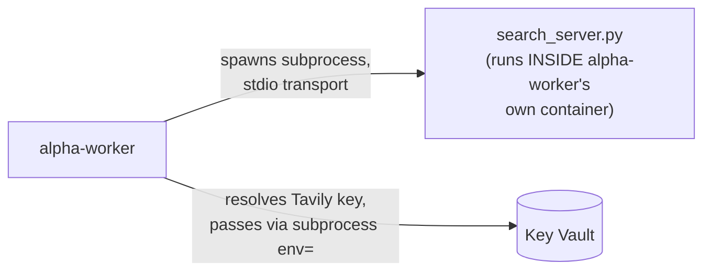
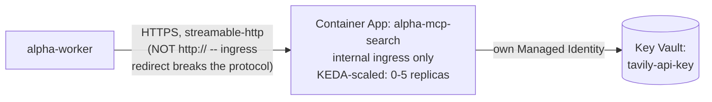

# Chapter 11 — Scaling Validation

## The Problem, Stated Plainly

Two real, distinct pieces of unfinished business, both named explicitly in `phases.md`. First: `alpha-api` and `alpha-worker` have autoscaled since Phase 2, but nobody had ever actually watched it happen — configured and trusted, not proven. Second: since Phase 3, the MCP search server has run as Option A — a subprocess spawned fresh by `alpha-worker` for every search — a deliberate simplification at the time, to learn MCP's protocol mechanics before its deployment shape. This phase graduates it to Option B: its own Container App, reached over HTTP, scaling independently.

## Stage A: Proving `alpha-worker`'s Queue-Depth Autoscaling

Checked the real configuration before testing anything: `alpha-worker` has `minReplicas: 1` (always one replica ready to receive messages, no cold-start delay), `maxReplicas: 10`, and a genuine KEDA rule scaling on Service Bus queue depth (`azure-servicebus` scaler, roughly one replica per queued message, authenticated via the app's own system-assigned identity — no connection string). `alpha-api` has `minReplicas: null` (scales to zero when idle) and no custom rule, relying on Container Apps' default HTTP-concurrency scaler.

**Real load test**: submitted one `/research` call with 8 fresh tickers at once — 8 real Service Bus messages landing simultaneously. Watched the real timeline:

| Time | Replicas | Queue depth |
|---|---|---|
| 09:05:08 | 1 | 8 |
| 09:05:37 | **8** | 7 |
| 09:07:02 | 8 | **0** (drained) |
| 09:10:49 | 7 | 0 (cooldown ending) |
| 09:11:18 | **1** | 0 |

Scale-out was essentially instant (one 30-second KEDA poll cycle). The queue drained in under two minutes with 8 replicas working it. Scale-in correctly waited out the full 300-second cooldown before dropping straight back to the configured floor. Nothing here needed tuning — the existing settings worked exactly as designed.

`alpha-api`'s own scaling was deliberately not load-tested with the same rigor: it does almost nothing per request (validate, write one row, queue a message, reply — ~300-500ms measured across this project's own tests), so a single replica can serve far more concurrent users than would ever approach the default concurrency threshold. `alpha-worker` ties up a replica for 40-100+ seconds *per ticker* — that's the genuine bottleneck this system has, and it's the one this stage actually needed to prove.

## Stage B: Graduating the MCP Search Server

**The code changes.** `mcp_server/search_server.py` switches from `mcp.run()` (stdio default) to `mcp.run(transport="streamable-http", host="0.0.0.0", port=8811, stateless_http=True, json_response=True)`. It now resolves its own Tavily key from Key Vault via its own Managed Identity — there's no longer a parent process to resolve it once and hand it down via subprocess `env=`, the exact mechanism that caused a real `MessageLockLostError` incident in Chapter 8 (a Key Vault round-trip on every single search call). `tools/web_search.py` shrinks correspondingly: no more `StdioServerParameters`, no more Key Vault client, just an HTTP URL (`streamable_http_client`). `mcp_server/` becomes its own real uv project — its own `pyproject.toml`, `uv.lock`, `Dockerfile` — deployed independently of `alpha-worker` for the first time.

**Deployment surfaced three real, distinct problems — worth walking through in full, since each one is a genuinely different class of mistake.**

**1. A process mistake, not an Azure issue.** The new `alpha-mcp-search` image was built and deployed correctly, but `alpha-worker` itself was never rebuilt with its own updated `web_search.py`. It kept running the old subprocess-based code — and removing `KEY_VAULT_URL` from `alpha-worker` as "cleanup" (reasoning the new code no longer needed it) broke the *old*, still-running code's own fallback path instead. Confirmed directly: `az containerapp show` on the running image tag predated the `web_search.py` commit. Fixed by actually rebuilding and redeploying `alpha-worker`.

**2. A real RBAC propagation delay** — the same class of issue Chapter 9 hit with Content Safety. The new Container App's Managed Identity was granted "Key Vault Secrets User" correctly, but its very first cold-start tried to fetch the secret before the grant had propagated through Entra ID. Confirmed by directly testing the exact same fetch a few minutes later from a fresh process — it succeeded immediately, with no config change at all.

**3. The real root cause, found by capturing raw HTTP traffic.** Even after both fixes above, `alpha-worker` calling the new service still hung indefinitely at the MCP protocol's session-initialization step — despite the server working flawlessly when called from its own container, and basic network connectivity (a plain GET) succeeding normally. Wrapping the client's `httpx` calls with debug logging showed exactly what was happening on the wire:

```
POST http://alpha-mcp-search.../mcp  ->  301 Moved Permanently
  Location: https://alpha-mcp-search.../mcp
GET https://alpha-mcp-search.../mcp  ->  200 OK, content-type: text/event-stream
```

Azure Container Apps' internal ingress force-redirects HTTP to HTTPS with a 301 — and per HTTP convention, `httpx`'s default redirect-following **downgrades a POST to a GET** on a 301, silently dropping the real MCP `initialize` request body entirely. The server correctly opened its SSE listening stream for the GET it actually received — the wrong endpoint for what the client needed — and the client waited forever for a JSON-RPC response that could never arrive, since its real request was never delivered. Fixed by pointing `MCP_SEARCH_URL` at `https://` directly, skipping the redirect (and the silent method downgrade) entirely.

**Verified for real, twice.** First, a direct isolated call from inside `alpha-worker` to the new service — a real Tesla search result came back. Then a full production job (`CRM`), watched end to end: `agent:news` (8.5s) and `agent:devil_advocate` (20.3s) both made genuine `search_web` calls through the new standalone service, real console logs showing the actual search queries the model chose, job completed cleanly in 45.4s total.

**One honest scaling observation, not a failure.** A burst of 4 fresh tickers (each with News/Devil's Advocate potentially calling the search service) never pushed `alpha-mcp-search` past 1 replica. Each search call is short — a few seconds — and 4 tickers' occasional calls don't pile up enough *simultaneous* requests to cross the default HTTP-concurrency scale threshold on one replica. The mechanism itself (scale-to-zero, scale-out under real concurrency) is the same platform default already proven for `alpha-api`; this specific test's load simply never demanded more than one replica, which is itself a correct, honest result.

## Key Files From This Chapter

| File | What it does |
|---|---|
| `backend/worker/mcp_server/search_server.py` | Switched to `streamable-http` transport; resolves its own Tavily key from Key Vault via its own Managed Identity. |
| `backend/worker/mcp_server/pyproject.toml`, `uv.lock`, `Dockerfile` (new) | Its own standalone uv project and deployable, independent of `alpha-worker`. |
| `backend/worker/tools/web_search.py` | No longer touches Key Vault or spawns a subprocess — just an HTTP client pointed at `MCP_SEARCH_URL`. |

## The Flow So Far

**1. Before this chapter — Option A**



**2. After this chapter — Option B**



## Azure Components Used This Chapter

One new resource: **Container App `alpha-mcp-search`** — internal-only ingress (never reachable from outside this system), its own system-assigned Managed Identity, scale-to-zero with a 5-replica ceiling. Reuses the existing `alpha-env` Container Apps environment and the existing `alpha-research-kv` Key Vault — no new infrastructure beyond the one app itself.

## Where This Stands

`alpha-worker`'s queue-depth autoscaling is proven with a real, fully-captured scale-up-and-back-down cycle. The MCP search server is genuinely graduated to Option B — its own deployable, its own identity, reached over the network rather than spawned in-process — with three real incidents found and fixed along the way, the most consequential being a non-obvious interaction between Azure's own ingress behavior and `httpx`'s default redirect semantics that would be easy to hit again in any future internal-service-to-service HTTP call in this project.

Left deliberately open: `alpha-mcp-search`'s own scaling was proven correct in mechanism (same platform default as `alpha-api`) but never pushed past 1 replica by this chapter's own test load — a heavier, more sustained concurrent-search burst would be needed to see it scale further, and hasn't been run. Worth remembering for any future service reached over Container Apps' internal ingress: always call it via `https://`, never `http://` — the redirect-and-silent-method-downgrade failure mode this chapter found is generic to any POST-based protocol over that path, not specific to MCP.
