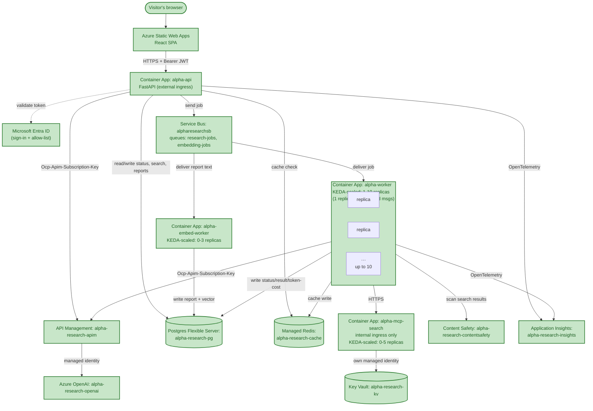

# Chapter 12 — Polish & Final Wiring

## The Problem, Stated Plainly

`phases.md`'s bar for this phase is different in kind from every chapter before it: not a new capability, but making the whole thing feel finished — final UI polish, real error states for failed jobs, and a README that actually describes the system as it exists, not as it existed several phases ago. One explicit non-goal, stated in `phases.md` itself: upgrading the polling-based return path to a streaming one is an *enhancement* over an already-working mechanism, not a gap to close — deliberately left out of scope here.

What actually filled this chapter ended up being a genuine mix: a real, substantial new feature requested mid-phase (browsing past reports), a real bug found in how failures were surfaced, a stale README that had drifted three phases behind reality, a real production regression caught and fixed live while doing "routine" cleanup, and a full visual redesign — iterated with the user via a live preview before anything shipped.

## Explicit Per-Ticker Failure State

A real gap, found by re-reading `get_research()` rather than assuming it was fine: a multi-ticker job that partially fails (one ticker's research permanently errors, others succeed) returned a single top-level `"status": "done"` for the *whole* job, with no reliable signal for *which* ticker failed. The frontend's only option was string-sniffing the raw exception text embedded in `summary` — fragile, and indistinguishable from the *other* legitimate reason a ticker might lack a `decisions` entry (old, pre-Decision-agent cached data).

Fixed with an explicit `ticker_status: {ticker: status}` map added to `/research/{job_id}`'s response, and a new `FailedReport` component in `ReportView.jsx` that renders a clearly-styled failure card — driven by that real status field, not text-matching. Verified thoroughly on the *shared* code path (the `/reports` and `/research/{job_id}` endpoints, proven correct against real multi-day historical data — see below) but not against a real naturally-occurring failed ticker within a reasonable number of retries: `alpha-api`'s scale-to-zero raced with `az containerapp exec` (`"Cannot attach to a container that is not running"`), a real but unrelated infrastructure flakiness rather than a code issue. Left as a known gap, verified by code review rather than a live failure, honestly.

## A New Feature, Requested Mid-Phase: The History Tab

Not in the original plan for this chapter — asked for directly: a way to browse past reports, filterable by ticker and date. The real design question was whether this needed new storage at all, and it didn't: `TickerJob` already persists `ticker`, `market`, `status`, `result` (the full per-ticker report JSON), and `created_at` for every job ever run. A new `GET /reports` endpoint lists and filters those existing rows — no new table, just a way to query across jobs instead of one job at a time. Selecting an entry reuses the *existing* `/research/{job_id}` endpoint to fetch full detail, narrowed down to the one ticker selected.

**Verified against real, multi-day historical data, not synthetic fixtures**: a no-filter call, a case-insensitive ticker filter (`ticker=aapl` correctly matched 4 real AAPL reports spanning August 20th through 29th), and a date-range filter (correctly bounded to 19 real reports across a 3-day window, properly ordered) — all against data this project's own testing had already accumulated over the preceding sessions.

**Simplified again after the user saw it working**: the date-range filter was dropped entirely once the History tab was live — ticker alone is enough, and the results render as a plain table (Ticker/Market/Recommendation/Date) that loads every prior run by default rather than requiring a search first. A real, live confirmation closed the loop: the user opened the deployed site, clicked History, watched it show "Searching..." briefly, then saw the full table populate — exactly the intended behavior, not a bug, and proven by an actual user in an actual browser rather than a script.

## The README Was Three Phases Stale

Reading it before touching it revealed a real problem: the "Architecture" section still said *"App Insights / OpenTelemetry ← not built yet (Phase 10)"* despite Phase 10 being long complete, described a five-agent graph ending in Synthesizer (replaced back in Chapter 5's real build), and had no mention of Content Safety, the `alpha-mcp-search` graduation, or any of Chapters 9–11's work. Rewritten to reflect the real current state — the 6-agent graph, guardrails, observability, the scaling work, the History tab — with an updated Azure topology diagram matching Chapter 11's.

## A Real Regression, Caught Live, While Doing Routine Cleanup

The README itself had flagged a deferred task: the KEDA queue-depth scale rule was deliberately left at an aggressive `messageCount=1` for Phase 11's testing, with a note to revert it "near project completion." Phase 12 is that point.

Reverting it should have been trivial — `az containerapp update --scale-rule-metadata ...` — but checking the result directly (not trusting the command's own success output, the standing discipline this whole project has followed) showed the `identity: system` field had silently vanished from the scale rule. Without it, KEDA has no way to authenticate to Service Bus at all; autoscaling would have been quietly broken by a "routine" config change. A follow-up attempt via `az containerapp update --yaml` made it *worse* — the exported YAML round-tripped through an older API version and came back with the metadata fields themselves blanked out.

**Root cause**: the identity-based custom-scale-rule feature isn't supported by the API version `az containerapp update`/`show -o yaml` target by default (`2024-03-01` rejects the `identity` field outright — confirmed by trying it directly and reading the real error). Fixed with a direct ARM REST PATCH against a current API version (`2025-07-01`), verified by re-fetching the resource afterward: `identity: "system"`, `messageCount: "5"`, structurally identical to the configuration already proven working throughout Chapter 11's real scaling tests.

## Visual Redesign, Iterated With a Live Preview

The existing frontend had never actually been designed — `index.css` and much of `App.css` were still the unmodified Vite+React starter template: a generic violet accent, a boxed 1126px layout with vertical border lines, a bold 56px heading, and real dead code (`.hero`, `#next-steps`, `#docs`, `#spacer`, `.ticks`, `.counter`) from a splash page this project never had, confirmed unused in any JSX before deletion.

Redesigned toward the reference the user gave — Google's homepage: one focal action, generous whitespace, minimal chrome. The market selector, ticker input, and Analyze button merged into a single rounded search-bar pill; the heading became a quiet lowercase "alpha." wordmark; buttons settled into two consistent treatments (filled-pill primary, outlined-pill secondary) instead of default browser styling scattered around the app.

**Reviewed before shipping, not after**: rather than deploy and hope, a static HTML preview was built using the *exact* CSS tokens and class names from the real `App.css` — not a reimagined mockup, a faithful mirror — published as an artifact for direct review. Real, useful feedback came back from that preview twice: once approving the overall direction, and once specifically simplifying the History tab screen (drop the date fields, use a table) before either had ever touched the live site. Only after both rounds of approval did the change ship — confirmed live afterward by fetching the deployed CSS directly and checking for the new class names (`wordmark`, `search-bar`, `history-table`) rather than assuming the push succeeded.

## Key Files From This Chapter

| File | What it does |
|---|---|
| `backend/api/main.py` | New `GET /reports` endpoint (filter by ticker/date, reusing `TickerJob`); `ticker_status` added to `/research/{job_id}`'s response. |
| `frontend/src/ReportView.jsx` | New `FailedReport` component, driven by `ticker_status` instead of string-matching raw error text. |
| `frontend/src/App.jsx` | Tab bar (New Research / History); `HistoryTab` component; `Wordmark` component; search-bar structure. |
| `frontend/src/App.css`, `index.css` | Dead Vite-template CSS removed; new wordmark/search-bar/tab/history-table styles. |
| `README.md` | Rewritten to reflect the real current state through Phase 11. |

## The Architecture So Far

No new Azure resource this chapter — everything here is application code, frontend design, and a configuration fix to an existing resource (`alpha-worker`'s scale rule). The master diagram is unchanged from Chapter 11; shown again here only for continuity, with nothing newly highlighted.

`GET /reports` is worth naming even though it added no new box: it's the first read path in this whole project that queries `TickerJob` *across* jobs rather than within one — a new *access pattern* on existing infrastructure, not a new piece of infrastructure.

## Azure Components Used This Chapter

None new. One existing resource reconfigured: `alpha-worker`'s KEDA scale rule, `messageCount` reverted from `1` to `5`, fixed via a direct ARM REST PATCH after the CLI's default API version silently dropped the rule's `identity` field.

## Where This Stands

The History tab, explicit per-ticker failure states, a current README, the KEDA revert, and a genuine visual redesign are all live and verified — the redesign specifically confirmed twice: once via a faithful pre-deploy preview the user reviewed and iterated on, and once live in production by fetching the deployed CSS directly for the new class names.

Left open, honestly: the failed-ticker UI path is verified by code review and by the shared "done" path's extensive real-data testing, not by a real naturally-occurring failure (blocked by `alpha-api`'s scale-to-zero racing `az containerapp exec`, an infrastructure flakiness rather than a code concern). The streaming return path remains explicitly out of scope, per `phases.md`'s own framing of it as an enhancement rather than a gap. And the standing deferred items from earlier chapters — the TLS and Pydantic deep-dives, the Redis OSS-cluster routing gap, and Chapter 10's unresolved httpx dependency-span gap — are all still open, still tracked, none forgotten.
