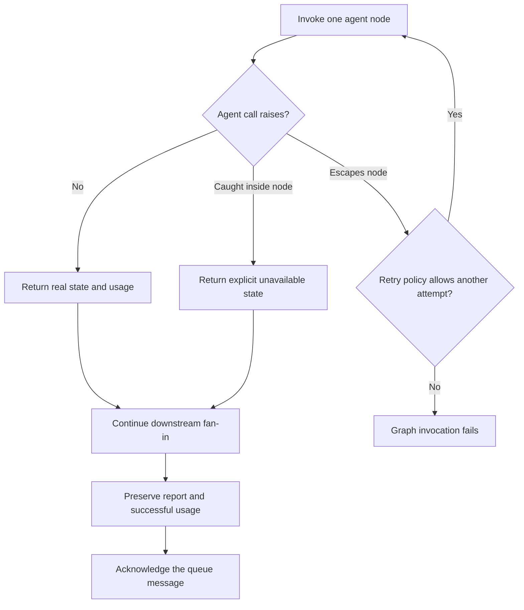
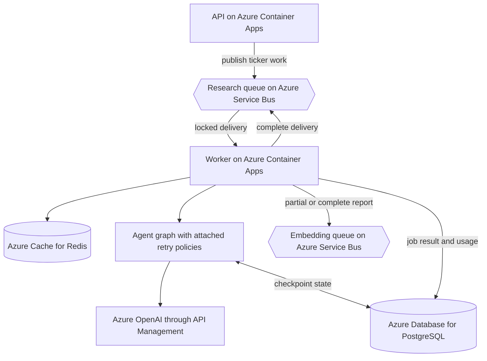
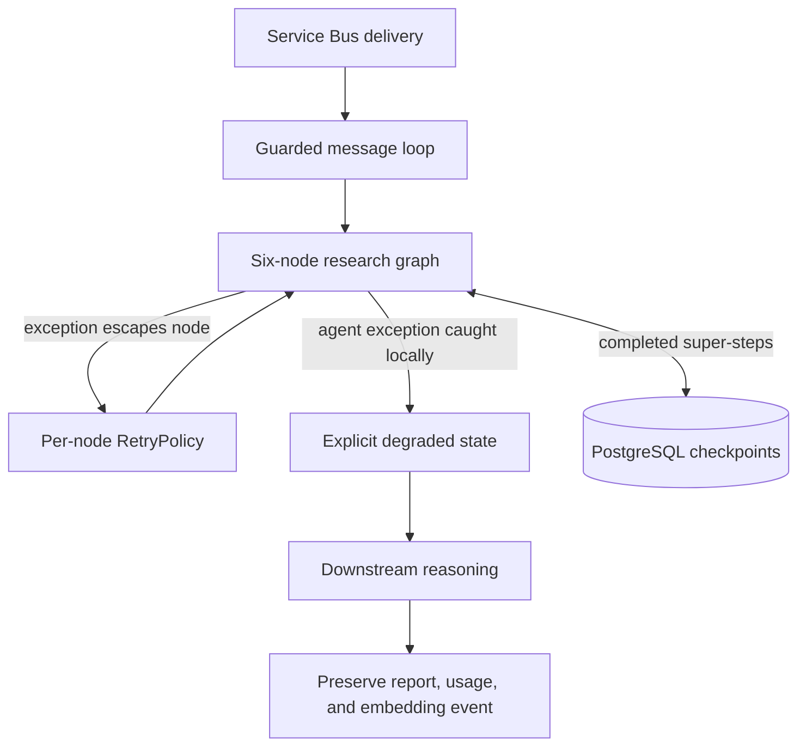

# Chapter 12: Resilience

Checkpointing answers a process-level question: after execution stops, where can a replacement continue? It does not answer the more frequent call-level question: what should happen when one HTTP request, model call, or graph node fails while the worker is still running?

The application needs two answers. A transient failure should be retried without restarting the graph. A persistent failure should become explicit degraded data so independent work can still reach the user. Treating both cases as retry either wastes time on permanent errors or turns recoverable network faults into failed jobs.

> **Chapter snapshot**
> - **Starting point:** Chapter 11 gives each ticker run a stable checkpoint thread and can resume from completed super-steps.
> - **Focus in this chapter:** The intended retry-before-degradation model, the current implementation gap, preservation of partial work, and failure containment around the worker message loop.
> - **Finished repository:** The current six-node graph attaches retry policies but catches agent exceptions inside every node, so those failures degrade immediately instead of reaching graph retry. The worker still protects message parsing, graph execution, post-processing, and acknowledgment.
> - **Coming next:** Chapter 13 authenticates users at the API boundary without changing the retry-versus-degradation model.

## What This Chapter Explains

Resilience is not one catch block. It is a set of boundaries chosen according to what failed and what can still be trusted.

A robust node should first get a limited chance to recover from a qualifying transient exception. If the failure persists, it should return an honest unavailable value instead of destroying useful sibling results. The current graph only implements the second half reliably: broad in-node catches convert agent failures to degraded state before LangGraph can retry them. Checkpointing remains available when the invocation itself stops. Around the graph, the worker prevents malformed messages, missing database rows, redelivery, and acknowledgment failures from ending the process.

The result is not a promise that every job succeeds completely. Missing evidence stays visible, completed work is preserved, and one bad message does not take unrelated jobs with it. Reliable transient retry remains a gap until retryable exceptions are allowed to reach the graph policy or are retried explicitly inside the node.

## Failure Lifecycle

The retry decision belongs before degradation because only an exception that escapes the node reaches LangGraph's retry policy. In the current implementation, each node catches `Exception` around its agent call and returns an ordinary state update. That means typical agent failures take the degradation branch immediately; the retry branch applies only to exceptions raised outside those catches.



Four mechanisms participate, but they repeat different units of work:

| Mechanism | Trigger | Unit repeated or preserved | Responsibility |
|---|---|---|---|
| Node retry | A qualifying exception escapes a node attempt | One node invocation | Intended recovery path; broad node catches currently bypass it for agent failures |
| Harness turn limit | A model keeps requesting tools successfully | Model and tool conversation turns | Bound an unproductive agent loop |
| Checkpoint resume | A workflow invocation stops | Completed super-steps | Recover durable graph position |
| Worker containment | Parsing, lookup, graph, post-processing, or acknowledgment fails | The message loop remains alive | Isolate one job from the worker process |

`DEFAULT_MAX_TURNS = 5` in the harness is not a retry count. No exception is required for that limit to fire. It stops a model that continues asking for tools without producing a final answer. The repository still has no explicit token or context budget and no repeated-identical-tool-call detector, so the turn cap is only a coarse upper bound on those failure modes.

## Retry at the Node Boundary

A transient model or network failure should not invalidate an entire parallel super-step. The failure that motivated this boundary was an `httpx.ReadError` in News while Fundamentals and Technical were running beside it. Retrying News in place gives that branch a chance to recover before the fan-out fails.

The graph assigns the same policy to every model-calling node:

```python
builder.add_node("fundamentals", fundamentals_node, retry_policy=RetryPolicy())
builder.add_node("technical", technical_node, retry_policy=RetryPolicy())
builder.add_node("news", news_node, retry_policy=RetryPolicy())
builder.add_node("risk", risk_node, retry_policy=RetryPolicy())
builder.add_node("devil_advocate", devil_advocate_node, retry_policy=RetryPolicy())
builder.add_node("decision", decision_node, retry_policy=RetryPolicy())
```

The default policy has finite attempts, exponential backoff, jitter, and a predicate that rejects plainly programmer-like failures while allowing qualifying connection and server failures. Those exact defaults belong to the installed LangGraph version, not to the application's contract. Production tuning must inspect and pin the version rather than assuming a remembered default.

An isolated policy test can use a node that increments a counter, raises `httpx.ReadError` on its first call, and succeeds on its second. That proves LangGraph's policy can retry an escaping exception; it does not prove the application nodes expose their agent failures to that policy. A repository-level test should inject the failure through an actual agent call and currently expect immediate degradation, making the gap executable rather than assumed.

## Degraded State Is Data

Retries must end. At that point, downstream reasoning needs a value it can inspect rather than an exception that erases the whole super-step.

Each node catches persistent failure around its agent call and delegates to `_degraded_result`. The helper records visible progress, writes an explicit message such as `fundamentals unavailable: ...`, and contributes no usage for the failed node. Fundamentals also returns empty structured data because later code distinguishes facts from narrative summaries.

```python
try:
    result = await fundamentals_agent.run(state["ticker"], state["market"])
except Exception as exc:
    return await _degraded_result(
        state["job_id"], state["ticker"],
        "fundamentals", "fundamentals_summary", exc,
        {"fundamentals_data": {}},
    )
```

The function returns normally after degradation. Risk and Decision can therefore reason over the remaining evidence and disclose what is missing. Successful parallel siblings retain their `usage_log` entries.

This plain in-node catch is deliberate. An experiment with LangGraph's `error_handler` found that the handler could produce a fallback value in a parallel fan-out while the async executor still re-raised the original exception. A mechanism that behaved differently on the application's main failure surface was not a dependable boundary, so the graph uses ordinary Python control flow.

Catching `Exception` is broad. It protects the workflow from dependency failures, but it can also turn programming defects into degraded output. A production service needs typed failure categories, structured telemetry, and alerts that separate expected dependency degradation from violated invariants.

> **Production Lens:** Finite retry followed by explicit degraded state is the production-shaped target because it preserves evidence without claiming completeness. The current broad catches skip the retry stage for ordinary agent failures. Production should classify retryable dependency failures separately from authentication, validation, and programming errors, then place degradation after the retry budget and alert on sustained degradation rates.

## Preserve Independent Work

Graceful degradation changes which post-processing conditions are valid. An older worker path treated successful Fundamentals data as the gate for the final report, token usage, and semantic-memory publication. When Fundamentals degraded, that gate discarded valid Technical, News, Risk, and final-stage work.

The current worker separates artifacts by their real dependency:

| Artifact | Requires Fundamentals data? | Behavior when Fundamentals degrades |
|---|---|---|
| Deterministic price line | Yes | Uses an unavailable message |
| Ticker profile sector and industry | Yes | Skips the profile update |
| Final report | No | Preserves any report the graph produced |
| Token usage | No | Records usage from successful agents |
| Semantic-memory event | No | Publishes a real partial report for embedding |

This is a general resilience rule: a failed input should suppress only outputs that actually depend on it. Partial success has value only when post-processing does not accidentally collapse it back into all-or-nothing behavior.

| Injected condition | Observable result | Guarantee demonstrated |
|---|---|---|
| An isolated graph node lets a retryable read error escape | The node runs twice; the graph completes | LangGraph retry works when the exception reaches it |
| A current application agent raises a read error | Its node returns unavailable on the first attempt | The in-node catch currently bypasses graph retry |
| Fundamentals fails persistently | Its summary says unavailable; siblings remain present | Degradation preserves independent work |
| A downstream stage receives degraded input | Its output identifies missing evidence | Partial output does not imply complete evidence |
| One specialist fails after siblings succeed | Successful usage remains in the total | Cost accounting follows actual work |

## Protect the Message Loop

The graph is only one part of the worker lifecycle. Failures before and after `run_research` need policies based on whether another delivery could change the outcome.

A queue message for a nonexistent `(job_id, ticker)` row cannot be processed, so the worker logs and skips it instead of dereferencing `None`. A message whose row is already `done` is a redelivery of completed work, so the worker skips another model purchase. Malformed JSON will not become valid through retry, so the worker logs it and completes the message. An exception that escapes the graph marks that ticker failed without killing the process.

Acknowledgment has a different failure mode. `complete_message()` can fail after useful work and the database commit have already succeeded. The worker catches that failure and leaves Service Bus to redeliver. On redelivery, the `done` check prevents another graph run.

| Situation | Worker decision | Reason |
|---|---|---|
| Malformed message | Log and complete it | Repetition cannot repair its shape |
| Missing database row | Log and skip processing | No authoritative job exists to update |
| Row already `done` | Skip the graph | The result has already committed |
| Graph exception escapes | Mark this ticker `failed` | Isolate the job from the process |
| Message lock is lost during completion | Log and keep the loop alive | Redelivery plus the `done` check is safe |

This is not exactly-once processing. Service Bus can deliver a message more than once. The worker instead makes the expensive path idempotent enough for a common redelivery case by checking durable job state before running the graph again.

## Incident: A Failure Test That Did Not Fail

A historical degradation test temporarily invalidated the worker's API Management subscription key so model calls would return `401`. The first ticker returned a normal result. That looked like resilience until elapsed time and cache behavior were inspected: the ticker had already been researched that day, so Redis returned its cached result and no model call occurred.

The test was rerun with a fresh ticker. The completed result then contained an explicit unavailable message from the real `401`, proving degradation rather than cache success. Restoring the secret exposed another operational issue: restarting a Container Apps revision did not reliably load the restored value, while creating a new revision did.

The resulting rule is simple: failure injection needs evidence that the intended path executed. A response alone is not enough. Use a fresh cache key and inspect node logs or traces to distinguish dependency behavior from a cache hit.

## Azure Resources for This Stage

Chapter 12 adds no Azure resource. It changes how the worker behaves across resources already active in the application:

| Active resource | Resilience responsibility in this chapter |
|---|---|
| Azure Container Apps | Hosts the worker process whose message loop must remain alive |
| Azure Service Bus | Delivers research and embedding messages, locks deliveries, and can redeliver unacknowledged work |
| Azure Database for PostgreSQL | Stores job state, results, usage, profiles, and graph checkpoints |
| Azure Cache for Redis | Returns same-day cached research and can mask a failure-injection path |
| Azure OpenAI through API Management | Represents a model dependency subject to transient and persistent failures |

The code still needs end-to-end dead-letter testing and an explicit lock-renewal or bounded-duration policy. Service-level delivery features do not prove that the application handles every terminal state correctly.

## Azure Architecture

The deployed flow remains top-down. The chapter adds recovery decisions inside the worker rather than another service.



The primary path runs from the API through Service Bus to the worker. Redis may end the request early with cached data. Otherwise the graph calls model dependencies and records checkpoints, while the worker commits durable results before acknowledging the message.

## Architecture After This Chapter

Within the worker, each failure is handled at the narrowest boundary that still has enough evidence to make the decision:



## Known Limitations

- Dead-letter handling exists at the service level but has no end-to-end project test.
- Broad catches can hide programming defects without strong telemetry.
- Broad node catches currently prevent normal agent failures from reaching the attached retry policies.
- There is no explicit per-job wall-clock, token, or cost ceiling.
- There is no repeated-identical-tool-call detector.
- The repository has no offline resilience fixture covering the worker's infrastructure clients.
- The original chapter experiment used a five-node graph; the current implementation has six nodes after Devil's Advocate and Decision replaced the earlier final stage.

## Read the Chapter Code

No curated Chapter 12 tag exists. These current workspace paths contain the completed behavior described here:

| File | What to inspect |
|---|---|
| `backend/worker/agents/graph.py` | Node retry policies, degraded state, six-node ordering, usage aggregation, and checkpoint invocation |
| `backend/worker/agent_harness.py` | The separate model and tool turn limit |
| `backend/worker/worker.py` | Missing-row and redelivery guards, partial-result preservation, failed-job state, and acknowledgment handling |
| `backend/worker/redis_client.py` | The same-day cache used before or around repeated research work |

## Next

The worker can now survive individual dependency and message failures, but the public API still accepts requests from anyone who can reach it. Chapter 13 adds human authentication and keeps authorization as a separate, explicit decision.
