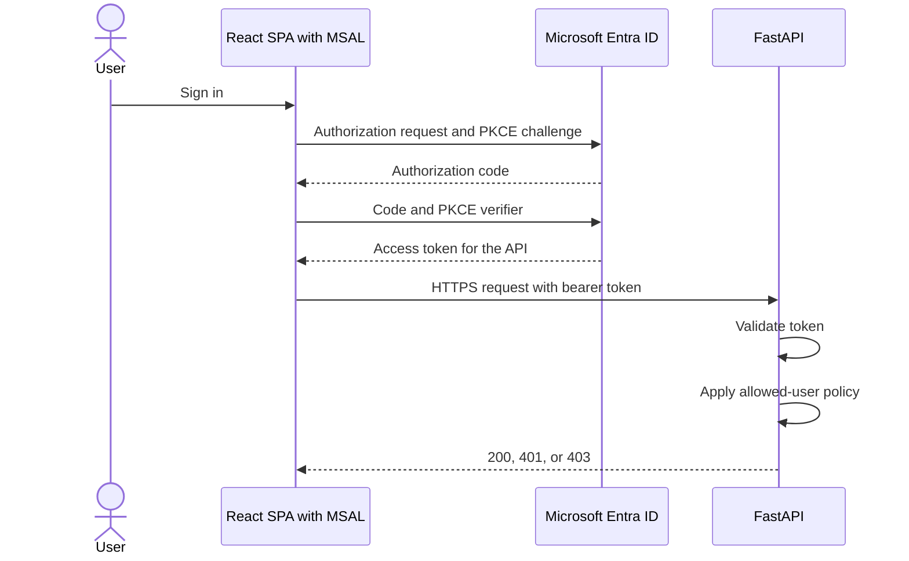
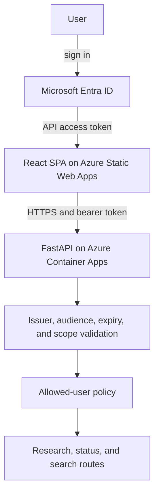

# Chapter 13: User Authentication

Resilience protects work, but it does not protect the public API. Anyone who reaches an unprotected endpoint can submit paid research, read job results, and search stored reports.

The application needs two decisions. Microsoft Entra ID establishes who is calling and whether the token was issued for this API. Application policy then decides whether that authenticated person may use Stock Research Assistant. Combining those decisions makes failures harder to diagnose and can turn a valid identity into unintended product access.

> **Chapter snapshot**
> - **Starting point:** The API and worker tolerate failures, but externally meaningful routes do not yet require a user identity.
> - **Focus in this chapter:** Browser sign-in, bearer-token validation in FastAPI, and a separate application allow-list.
> - **Finished repository:** The current frontend uses MSAL configuration and the API enforces `require_user` on research, status, and search routes.
> - **Coming next:** Chapter 14 gives the backend workloads identities of their own and removes long-lived Azure service credentials where possible.

## What This Chapter Explains

The browser uses authorization code flow with Proof Key for Code Exchange (PKCE) to obtain an access token for the application's delegated API scope. It attaches that token to each protected request. FastAPI validates the token before route logic runs, then applies a small application allow-list.

Those boundaries produce distinct evidence:

| Request | Result | Boundary that decided |
|---|---|---|
| No bearer token | `401` | Token authentication |
| Invalid issuer, audience, signature, expiry, or scope | `401` | Token authentication |
| Valid token for a user outside the allow-list | `403` | Application authorization |
| Valid token for an allowed user | Route runs normally | Both boundaries passed |

## Authentication Lifecycle



A single-page application is a public client because browser code and traffic are inspectable by the user. It must not contain a client secret. PKCE binds the authorization response to the browser instance that started the flow without pretending the browser can keep a permanent credential.

The app registration defines the client ID, tenant audience, redirect URIs, exposed scopes, and token settings. Its service principal is the tenant-local representation where consent and assignment apply. The delegated scope has the shape `api://<client-id>/access_as_user`; it identifies the resource the browser wants to call.

Redirect URIs belong under the Single-page application platform. Registering the same URI as a Web redirect can allow the redirect and still break the browser's cross-origin token exchange. Exact local and deployed origins are required; wildcard redirects weaken that boundary.

## The Browser Carries the Token

Authenticated UI state is useful feedback, not security. A caller can bypass React and invoke FastAPI directly. The browser's security responsibility is to acquire an access token for the API scope and attach it to every protected request, including status polling and semantic search.

The configuration keeps the requested authority and scope explicit:

```javascript
export const loginRequest = {
  scopes: [import.meta.env.VITE_ENTRA_API_SCOPE],
}
```

Client ID, tenant ID, redirect URI, and API scope can appear in compiled frontend code because they are identifiers, not credentials. Registered redirects, PKCE, signed tokens, server-side validation, and authorization policy provide the protection.

Silent acquisition should fall back to interaction only when MSAL reports that interaction is required. An expired session, an API `403`, and a network failure are different conditions and should remain distinguishable in the interface and telemetry.

## The API Validates the Token

The API delegates JSON Web Token validation to `fastapi-azure-auth`. The library uses discovery metadata and signing keys, then checks issuer, audience, expiry, and delegated scope. Reimplementing that protocol in route code would create a larger and less tested security surface.

```python
azure_scheme = SingleTenantAzureAuthorizationCodeBearer(
	app_client_id=CLIENT_ID,
	tenant_id=TENANT_ID,
	scopes={API_SCOPE: "Access alpha-research as the signed-in user"},
	allow_guest_users=True,
)
```

The guest setting is specific to this tenant. The tenant originated from a personal Microsoft account, and the library's guest heuristic classified the owner as a guest because the `idp` and `iss` claims differed. Allowing that library-level case does not become the product authorization rule; the application allow-list remains the second boundary.

Every externally meaningful route needs the dependency. Protecting only research creation would still expose job results or stored-report search.

> **Production Lens:** Delegating sign-in to Entra, using PKCE, and validating bearer tokens at the API are production-shaped choices. The shared SPA/API registration and email allow-list are deliberate simplifications for a private application; a larger system should use immutable object IDs, groups, app roles, managed configuration, and audited entitlement changes.

## Authorization Is a Separate Decision

A valid token means Entra issued this token for this subject and this API. It does not mean the application's owner permits that subject to use the product.

```python
async def require_user(user: User = Depends(azure_scheme)) -> User:
	username = (user.preferred_username or user.email or "").lower()
	if username not in ALLOWED_USERS:
		raise HTTPException(
			status_code=403,
			detail="Not authorized to use this application.",
		)
	return user
```

An email allow-list is understandable for a small private deployment, but aliases can change. Display names are even weaker authorization keys. Immutable object IDs, groups, app roles, or an external policy store scale better and make revocation easier to audit.

## Incident: The Audience Changed Shape Twice

The first live request returned `403`, and a diagnostic inside `require_user` never ran. That located the rejection inside library validation, where the tenant-owner account was treated as a guest. After addressing that tenant-specific condition, the response became `401` because the audience did not match.

The access token was decoded locally. A version 1 token used the App ID URI, `api://<client-id>`, as `aud`. After the registration requested version 2 access tokens, a fresh token reported `ver: "2.0"` but used the bare client-ID GUID as its audience in this same-client-and-resource setup. The backend was changed to validate the claim the real token contained.

The lesson is not to memorize one audience format. Inspect the registration's requested token version, the requested resource, and the token's `ver`, `aud`, `iss`, `tid`, and scope claims. Do not disable signature validation in production code or send bearer tokens to third-party decoder sites.

## Azure Resources for This Stage

Chapter 13 activates Microsoft Entra ID for human sign-in. Existing hosting remains unchanged.

| Active resource | Responsibility |
|---|---|
| Microsoft Entra ID app registration and service principal | Defines sign-in, SPA redirects, delegated API scope, and tenant-local consent |
| Azure Static Web Apps | Hosts the React public client that starts PKCE and carries the token |
| Azure Container Apps | Hosts FastAPI, where token validation and authorization run |

The chapter does not add network isolation. Cross-Origin Resource Sharing (CORS) limits browser origins; it does not stop a direct HTTP client and is not a substitute for token validation.

## Azure Architecture



## Known Limitations

- App-registration creation and consent are not represented as infrastructure as code.
- The allow-list uses mutable email-like claims rather than object IDs or roles.
- There are no automated browser authentication tests.
- Tenant-specific guest handling must not be copied without understanding the local identity model.
- Authentication does not provide network isolation or workload identity.

## Read the Chapter Code

No curated Chapter 13 tag exists. These current workspace paths show the completed boundary:

| File | What to inspect |
|---|---|
| `frontend/src/authConfig.js` | MSAL authority, client identifier, redirect, and API scope configuration |
| `frontend/src/main.jsx` | MSAL provider wiring for the React application |
| `frontend/src/App.jsx` | Token acquisition and authenticated API requests |
| `backend/api/auth.py` | Entra token validation and the separate allow-list |
| `backend/api/main.py` | Routes protected by `Depends(require_user)` |

## Run This Stage

The repository has since gained a `chapter-13-complete` tag, which matches this chapter's authentication boundary even though the "no curated tag" line above predates it.

- **Repository tag:** `chapter-13-complete`.
- **Azure resources:** a Microsoft Entra ID app registration and service principal, on top of the Chapter 9 stack. Register your own Entra ID app first, then set `ENTRA_CLIENT_ID`, `ENTRA_TENANT_ID`, `ALLOWED_USERS`, and `ALLOWED_ORIGIN` in `infra/.local-config` (see [Azure Setup and Deployment](azure-setup.md)) and provision with `./infra/deploy.sh infra/params/chapter-13.json`.
- **Run it offline:** the API's auth tests exercise token validation without a live Entra tenant:

  ```bash
  git switch --detach chapter-13-complete
  cd backend/api && uv sync && uv run python -m unittest discover -s tests -v
  cd ../worker && uv sync && uv run python -m unittest discover -s tests -v
  ```

- **Run it end to end:** register your own Entra ID app for sign-in and API access, set `ENTRA_CLIENT_ID`, `ENTRA_TENANT_ID`, and `ALLOWED_USERS` for the API, and add the frontend's MSAL configuration (`frontend/src/authConfig.js`). Then run the API, worker, and frontend as before; the browser now signs in and carries a token on each request.

## Next

The user now proves who they are, but the API and workers still need identities when they call Service Bus, PostgreSQL, Redis, and Key Vault. Chapter 14 removes long-lived Azure service credentials where identity is supported and contains the third-party secret where it is not.
