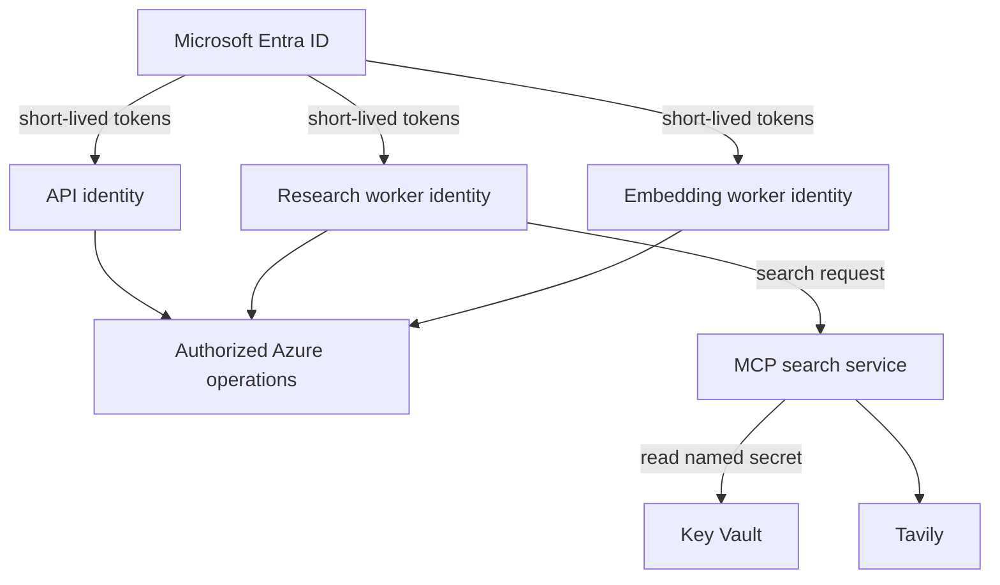
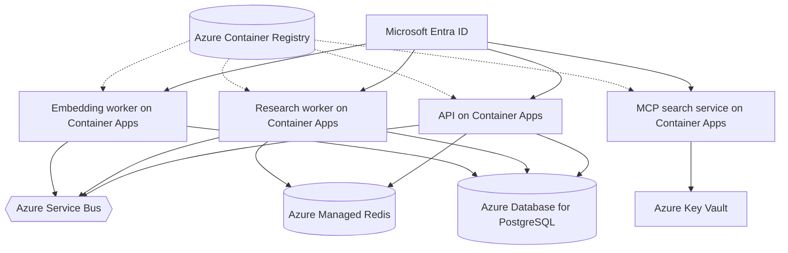

# Chapter 14: Workload Identity and Secrets

User authentication protects the public door. It does not remove the passwords, shared access signatures, and API keys used after a request crosses that door. Each backend workload needs a machine identity, and each downstream resource needs a policy that limits what that identity may do.

Azure Managed Identity removes secret custody for Azure-native connections. It does not remove authorization design. The unavoidable third-party Tavily key still exists, so the component that calls Tavily retrieves it from Key Vault. Container images also need inspection because a vault cannot protect a credential already copied into an artifact.

> **Chapter snapshot**
> - **Starting point:** Human callers authenticate to the API, while backend services still need machine-to-machine credential boundaries.
> - **Focus in this chapter:** Separate workload identities, least-privilege access, token lifetime behavior, third-party secret ownership, and image hygiene.
> - **Finished repository:** The API and both workers use `DefaultAzureCredential` for supported Azure services; the MCP search service owns Tavily secret retrieval.
> - **Coming next:** Chapter 15 distinguishes service identity from the capabilities of agents that share a worker process.

## What This Chapter Explains

The API, research worker, and embedding worker have different responsibilities, so they should not share one principal. Each Container App receives its own identity. Service Bus roles, PostgreSQL grants, Redis access, and Key Vault permissions are then attached to the workload that uses them.



Managed Identity changes how a workload proves its identity. Resource-based access control (RBAC), database grants, and service configuration still decide what that identity can do.

## Responsibility by Workload

| Workload | Service Bus | PostgreSQL | Redis | Key Vault |
|---|---|---|---|---|
| API | Send research jobs | Create and read jobs; read reports | Read cache | None |
| Research worker | Receive research; send embedding | Update jobs, usage, profiles, checkpoints | Write cache and progress | No Tavily access in the parent worker |
| Embedding worker | Receive embedding | Insert report vectors and read returned columns | None | None |
| MCP search service | None | None | None | Read the named Tavily secret |

Queue-scoped roles preserve the distinction between send and receive. KEDA is another caller even when it scales the same Container App. A later review found a scale rule still referenced deleted Service Bus shared-access secrets. Minimum replicas and recent traffic hid the problem, so application processing worked while scale-from-zero did not. Controller identities belong in the same inventory as application identities.

The code uses the same credential abstraction for local development identity and deployed workload identity:

```python
credential = DefaultAzureCredential()
client = ServiceBusClient(
	fully_qualified_namespace=SERVICEBUS_FQDN,
	credential=credential,
)
```

Removing a connection string proves little unless every hop still works: API send, worker receive, worker embedding send, embed-worker receive, and scale-from-zero polling.

## PostgreSQL Token Connections

Azure Database for PostgreSQL accepts an Entra token as the connection password after an administrator and database principals are configured. Local Docker PostgreSQL cannot validate that token, so the repository keeps two honest paths:

- When `DATABASE_HOST` is set, obtain an Entra token and require TLS.
- Otherwise, use the local password-based `DATABASE_URL`.

```python
def _get_pg_connection():
	token = _pg_credential.get_token(PG_TOKEN_SCOPE).token
	return psycopg.connect(
		host=DATABASE_HOST,
		dbname=DATABASE_NAME,
		user=DATABASE_USER,
		password=token,
		sslmode="require",
	)
```

Fetching a token for each new physical pooled connection matters because tokens expire. The current checkpoint saver holds one connection for its lifetime, so it builds its connection information from a startup token.

Two incidents exposed authorization details that a successful login would not reveal. `pgaadauth_create_principal` existed in the `postgres` maintenance database, not the application database where it was first called; the resulting `UndefinedFunction` was a scope error, not a platform outage. Later, `AsyncPostgresSaver.setup()` required schema `CREATE` even with `CREATE TABLE IF NOT EXISTS`, and the embed worker's `INSERT ... RETURNING` needed `SELECT` on returned columns as well as `INSERT`.

Least privilege therefore needs positive and negative evidence: each workload must complete its required operations and fail an operation outside its responsibility.

## Redis Lifetime and Routing

Redis keeps long-lived connections, so a token supplied once at startup can work initially and fail after expiry. The asynchronous client needs a credential provider that renews and resends tokens over the connection lifetime.

Authentication success is separate from cluster routing. Azure Managed Redis used OSS Cluster routing, and a naive `RedisCluster` change discovered shards by IP address. TLS certificates were valid for the public hostname, not those IPs, so discovery produced certificate failures. The valid fixes involve the correct proxy policy or private networking and DNS. Disabling certificate validation would hide the boundary rather than repair it.

A successful `PING` proves only the initial connection. The useful evidence is a real cache operation with keys disabled, a connection that survives token renewal, and discovery endpoints whose names match their certificates. The repository does not yet automate that long-duration test.

## Third-Party Secret Ownership

Tavily cannot accept an Azure Managed Identity token. Its API key needs one authoritative home and one intended reader. In the current architecture, the MCP search service retrieves the named secret from Key Vault; the research worker calls the service and receives search results, not the key.

The service caches secret retrieval rather than adding a vault round trip to every search. Key Vault limits who can retrieve the key, but after retrieval the process can still log or misuse it. Process boundaries, narrow environment variables, and telemetry redaction remain necessary.

> **Production Lens:** Separate workload identities, queue-scoped roles, token-based database access, and artifact inspection are production-shaped. The application still has public network access on Azure data services and retains an API Management subscription key on the caller path; production should add reproducible identity configuration, secret scanning, expiry monitoring, private networking where justified, and tested rotation runbooks.

## Incident: Secret Retrieval Increased Message Time

The first Key Vault design fetched Tavily inside a fresh MCP subprocess for every search. The subprocess did not reliably inherit arbitrary parent environment variables, and repeated vault calls increased latency. A real multi-search job completed its research and database write, then failed acknowledgment with `MessageLockLostError` because the Service Bus lock had expired.

The historical fix resolved the key once in the owning process and passed only the required environment to the subprocess. The worker also learned to catch acknowledgment failure and skip already-completed jobs on redelivery. The current dedicated MCP service removes the per-call subprocess lifecycle.

The general lesson is that secretless authentication can still create reliability failures when token or secret acquisition sits on a hot path without measured latency and lifetime.

## Container Images Are a Secret Boundary

The worker Dockerfiles used `COPY . .`, and their build contexts did not exclude `.env.local`. Inspection of published images found the file and real credential material under `/app`. The response was driven by evidence: identify affected image tags, rotate exposed credentials, delete obsolete Service Bus authorization rules, regenerate shared API Management and Tavily keys, add environment files to `.dockerignore`, rebuild with a unique tag, and inspect the artifact again.

```text
.env
.env.*
!.env.example
```

The exception is safe only when the example file is guaranteed sanitized. A Dockerfile diff is not evidence that an existing or newly published image is clean. Artifact inspection should search for filenames, variable names, and a harmless canary value without printing real secrets.

One historical response rotated a PostgreSQL administrator password before confirming it appeared in the leaked artifact. The precaution was harmless, but later inspection showed it was outside the actual leak. Incident scope should follow evidence even when broader rotation is prudent.

## Azure Resources for This Stage

| Active resource | Responsibility in this chapter |
|---|---|
| Microsoft Entra ID Managed Identity | Gives each Container App its machine principal |
| Azure Service Bus | Authorizes send, receive, and scaler polling separately |
| Azure Database for PostgreSQL | Accepts Entra tokens and enforces database grants |
| Azure Managed Redis | Accepts identity-based authentication while retaining routing constraints |
| Azure Key Vault | Stores the third-party Tavily key for the search service |
| Azure Container Registry | Stores images that must be checked for copied secret files |

## Azure Architecture



This is an identity and authorization view, not a private-network diagram. Reachable endpoints remain reachable until network controls say otherwise.

## Known Limitations

- Identity-based access does not make public endpoints private.
- Redis cluster routing and TLS naming require infrastructure-specific validation.
- The API Management caller path still uses a static subscription key.
- Key Vault cannot prevent misuse after a process retrieves a secret.
- Identity, RBAC, database grants, and secret resources are not reproducible from repository infrastructure as code.
- Long-duration token renewal lacks automated coverage.

## Read the Chapter Code

No curated Chapter 14 tag exists. These current workspace paths show the credential boundaries:

| File | What to inspect |
|---|---|
| `backend/api/main.py` | API identity paths for Service Bus, PostgreSQL, and Redis |
| `backend/worker/worker.py` | Worker identity paths, token-backed PostgreSQL connections, and queue clients |
| `backend/embed-worker/embed_worker.py` | Embedding worker queue and database identity |
| `backend/worker/redis_client.py` | Local password and Azure identity Redis paths |
| `backend/worker/mcp_server/search_server.py` | Key Vault ownership of the Tavily secret |
| `backend/api/Dockerfile`, `backend/worker/Dockerfile`, and `backend/embed-worker/Dockerfile` | Image build boundaries that depend on matching `.dockerignore` files |

## Run This Stage

The repository has since gained a `chapter-14-complete` tag, which matches this chapter's identity work even though the "no curated tag" line above predates it.

- **Repository tag:** `chapter-14-complete`.
- **Azure resources:** Managed Identity on each Container App, Azure Key Vault for the Tavily secret, and RBAC/database-grant changes on Service Bus, PostgreSQL, and Redis. Provision with `./infra/deploy.sh infra/params/chapter-14.json` (see the Chapter 14 row in [Azure Setup and Deployment](azure-setup.md)).
- **Run it offline:**

  ```bash
  git switch --detach chapter-14-complete
  cd backend/api && uv sync && uv run python -m unittest discover -s tests -v
  cd ../worker && uv sync && uv run python -m unittest discover -s tests -v
  ```

- **Run it end to end:** this stage is meant to run deployed, with each Container App using its own Managed Identity — the code paths that read `KEY_VAULT_URI`, token-backed `DATABASE_HOST`/`DATABASE_USER`, and `SERVICEBUS_FQDN` assume that identity context. Local development still works with connection-string variables from earlier chapters; the identity paths only activate when deployed to Azure with Managed Identity configured.

## Next

The services now have identities, but the agents inside the worker do not. Chapter 15 distinguishes service identity from agent capability, maps the real process and tool boundaries, and states where isolation is absent.
