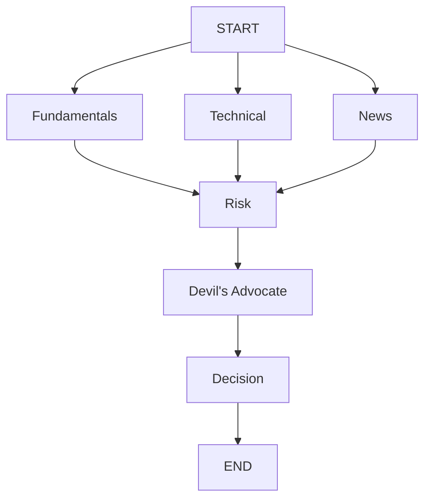
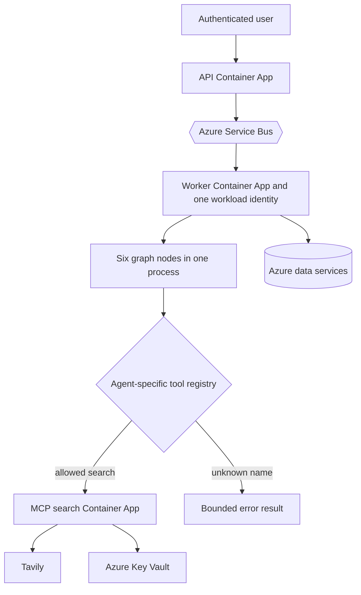

# Chapter 15: Agent Trust Boundaries

Managed Identity answers which service is calling a resource. It does not create an identity for every model-driven agent inside that service. Fundamentals, News, Risk, and the other graph nodes are Python functions in one worker process. They share its filesystem, network reachability, environment, and workload identity.

The application therefore constrains agents primarily through capability: which tool schemas a model sees, which callables the harness registers, how many turns can run, and which data reaches model context. These controls are useful enforcement points, but they are not an operating-system sandbox or a separate resource identity.

> **Chapter snapshot**
> - **Starting point:** Backend services use workload identities, while graph nodes still share one worker process.
> - **Focus in this chapter:** Trust-boundary inventory, direct calls versus model-selected tools, dispatch enforcement, consequence limits, and proportional isolation.
> - **Finished repository:** The current graph has six nodes, the shared harness dispatches through per-agent registries, and web search crosses an HTTP MCP service boundary.
> - **Coming next:** Chapter 16 scans untrusted web content before it returns to a model and scrubs accidental personal data from free-text search.

## What This Chapter Explains

A trust boundary is a place where authority or untrusted data crosses from one responsibility to another. Component names do not prove boundaries. Code and deployed configuration must show which identity, process, network path, registry, or data policy applies.

| Boundary | What crosses it | Current control | What it does not prove |
|---|---|---|---|
| Browser to API | User request and bearer token | TLS, token validation, allow-list | The caller's device is trustworthy |
| Container App to Azure resource | Resource operation | Managed Identity, RBAC, database grants | The resource is unreachable publicly |
| Orchestrator to graph node | Python state and function call | Typed state and node code | Separate process, memory, or identity |
| Model to tool dispatcher | Function name and arguments | Agent-specific registry | A registered tool is harmless |
| Worker to MCP search service | Query and returned web text | HTTP service contract | The content is safe instruction data |
| MCP service to Tavily | Search request | Key Vault-held API key | Third-party results are trustworthy |

Identity authorization and network isolation answer different questions. A token controls who may use a reachable endpoint. A private endpoint controls who can reach it. The current repository proves several identity controls but does not prove private networking for its data services.

## Capability Before Isolation

A **tool** is callable because the model may select it. A **direct call** is invoked deterministically by application code. The distinction determines how much authority the model receives.

Stock-data collection, arithmetic checks, and valuation calculations do not need model choice. Ordinary code gathers or computes that evidence before synthesis. The model reasons over the result instead of receiving a broad database or Service Bus client.

The current graph has six nodes:



Most nodes synthesize prepared input. Agents that genuinely need search receive a narrow search capability rather than every function imported by the worker. Adding a schema merely because a function exists would increase authority without creating useful model choice.

The checkpoint and resilience experiments in Chapters 11 and 12 used an earlier five-node graph ending in Synthesizer. The current six-node topology preserves those mechanisms while replacing that final stage with Devil's Advocate and Decision.

## Dispatch Is the Enforcement Point

A prompt can ask a model to stay in scope. It cannot prevent a hallucinated or injected function name from reaching code. Enforcement belongs where the requested name becomes a callable.

```python
async def _call_tool(function_name: str, function_args: dict, tool_registry: dict):
	if function_name not in tool_registry:
		return {"error": f"unknown tool: {function_name}"}

	tool_function = tool_registry[function_name]
	if inspect.iscoroutinefunction(tool_function):
		return await tool_function(**function_args)
	return tool_function(**function_args)
```

The schema sent to the model improves behavior. The dictionary lookup enforces capability. A global registry would allow a prompt mistake in one specialist to reach every tool in the process, so registries remain agent-specific.

Unknown names return an error; there is no dynamic import, attribute lookup, or fallback namespace. A useful focused test requests an invented `delete_database` function from a registry containing only `search_web` and proves that the registered fake is never called.

The dispatcher still trusts a registered function's argument shape and implementation. Python errors on mismatched arguments, but that is failure handling, not authorization. Higher-risk tools need structured validation, query limits, and resource authorization inside or behind the tool.

> **Production Lens:** Per-agent registries, deterministic direct calls, finite turns, and read-oriented tools are strong low-cost controls. They are not a sandbox. Any future code-execution or consequential action tool should run behind separate compute or a policy broker with narrower identity, egress control, parameter validation, approval, idempotency, and tamper-resistant audit events.

## Bound Execution and Consequence

Capability answers what can be called. Execution limits answer how much an allowed capability can be exercised.

`DEFAULT_MAX_TURNS = 5` bounds model and tool round trips. Chapter 12 established that this is not an exception retry. The application records token usage but does not enforce per-agent token, cost, or wall-clock ceilings. One slow call, one expensive call, oversized tool output, and many concurrent runs can all exceed operational limits without exhausting five turns.

The strongest consequence control is product scope. Current tools gather and analyze information. They do not place trades, send messages, transfer money, or mutate external systems. A future action tool changes the threat model even if its registry entry is narrow.

| Limit | Present? | Remaining exposure |
|---|---|---|
| Selectable function names | Yes, per-agent registry | Registered implementations share process authority |
| Model and tool turns | Yes, finite cap | Slow or expensive individual calls |
| Token and cost accounting | Recorded | No enforced ceiling |
| Wall-clock deadline | No explicit job budget | Queue lock expiry and resource occupation |
| Consequential actions | Absent by product design | Future action tools need stronger controls |

## Isolation Must Match Capability

Isolation determines what buggy or compromised tool code can reach:

| Boundary | Isolation gained | Important limitation |
|---|---|---|
| Same process | No additional operating-system boundary | Shared memory, environment, network, and identity |
| Separate process | Separate address space | Authority remains broad if environment and handles are copied |
| Separate container | Separate image and possible identity/network policy | Deployed policy must prove the separation |
| MicroVM or VM | Separate kernel boundary | Higher operational cost |
| Ephemeral compute | State removed after a task | Does not define network or identity by itself |
| Broker or gateway | Central authorization, rate limits, and audit | Becomes a critical policy service |

The historical web-search MCP server ran as a subprocess with a narrow environment. The current `web_search.py` client uses streamable HTTP to a dedicated MCP search service intended to run as an internal Container App. That source code proves a protocol and URL boundary. It does not prove internal ingress, separate identity, or RBAC; only deployment evidence can establish those properties.

Managed Identity attaches to compute, not a Python function. Giving one tool a genuinely narrower Azure identity normally requires separate compute or a broker that obtains credentials on its behalf.

## Data Is Part of the Boundary

Isolation does not prevent a legitimate tool from exposing too much data. Read-only roles, views, row filters, snapshots, and references to stored payloads can narrow data before it becomes model context.

The application already computes deterministic risk flags and hard stops in code, then supplies them as authoritative fields rather than asking a model to invent them. Agent results also use an envelope that separates answer, error, status, and usage. A `TypedDict` helps development-time structure, but it does not validate every model-produced narrative at runtime.

The system has no row-level agent isolation, dedicated read replica, or schema validation for every narrative. Search results contain untrusted web evidence; Chapter 16 adds a content boundary before that text reaches a model.

## Incident: The Boundary Inventory Found Broken Scaling Auth

Writing the trust-boundary table forced every authentication edge to be checked. That review found KEDA scale rules still referenced Service Bus shared-access secrets deleted after application code moved to Managed Identity. The worker's minimum replica and recent traffic hid the failure, so application tests stayed green while scale-from-zero was broken.

The repair required identity-aware scale configuration, the bare Service Bus namespace expected by the scaler, and the documented role for metric polling. The incident changed the review rule: infrastructure controllers are independent callers. Their credentials and permissions belong in the identity inventory even when they operate for an application.

The same review found that the frontend mapped expired sessions, API rejection, and network failure to one generic connectivity message. Trust boundaries need diagnosable failures or operators investigate the wrong layer.

## Azure Resources for This Stage

Chapter 15 adds no Azure resource. It clarifies how existing resources bound authority:

| Active resource | Boundary represented |
|---|---|
| Azure Container Apps | Compute and workload-identity boundary for API, workers, and MCP service |
| Microsoft Entra ID | Human and workload authentication, not per-agent identity |
| Azure Service Bus | Broker boundary for asynchronous work and embedding events |
| Azure data services | Resource authorization through RBAC or database grants, without implied network privacy |
| Azure Key Vault | Secret-read boundary for the Tavily-owning search service |

## Azure Architecture



The registry limits model-selected calls. It cannot stop ordinary worker code or a compromised registered function from using the worker's broader identity. The separate MCP service creates an opportunity for narrower deployment policy, which remains a claim to verify in deployed configuration.

## Known Limitations

- Agents inside one worker have no separate identities or memory isolation.
- A registered function executes with the hosting process's authority unless it calls an isolated service.
- Prompt instructions are behavioral guidance, not enforcement.
- Data services can remain publicly reachable unless private networking is added.
- There is no centralized tool-policy broker, human approval workflow, or tamper-resistant audit log.
- Deployment files needed to prove current MCP ingress and RBAC are absent from the repository.

## Read the Chapter Code

No curated Chapter 15 tag exists. These current workspace paths expose the implemented boundaries:

| File | What to inspect |
|---|---|
| `backend/worker/agent_harness.py` | Per-agent registry dispatch, unknown-tool rejection, and turn limits |
| `backend/worker/agents/graph.py` | Six nodes that share one worker process and identity |
| `backend/worker/agents/fundamentals_agent.py` | A specialist's direct calls and registered capabilities |
| `backend/worker/agents/news_agent.py` | A search-capable specialist boundary |
| `backend/worker/tools/web_search.py` | The HTTP MCP client boundary |
| `backend/worker/mcp_server/search_server.py` | The separate search service and Tavily ownership |

## Run This Stage

The repository has since gained a `chapter-15-complete` tag, which matches this chapter's boundary review even though the "no curated tag" line above predates it. This chapter adds no new resource or code path to run — it is a review of trust boundaries in the system as already deployed through Chapter 14.

- **Repository tag:** `chapter-15-complete`.
- **Azure resources:** none new; see the Chapter 14 stack. Redeploy with `./infra/deploy.sh infra/params/chapter-15.json` to update the worker image (see [Azure Setup and Deployment](azure-setup.md)).
- **Run it offline:**

  ```bash
  git switch --detach chapter-15-complete
  cd backend/api && uv sync && uv run python -m unittest discover -s tests -v
  cd ../worker && uv sync && uv run python -m unittest discover -s tests -v
  ```

## Next

The registry prevents an injected instruction from inventing a new tool, but allowed search results still become model context. Chapter 16 scans that untrusted boundary with Prompt Shields and separately scrubs accidental personal data from the API's free-text search input.
