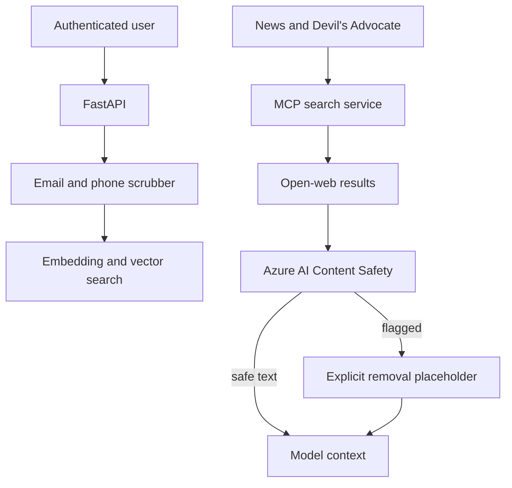
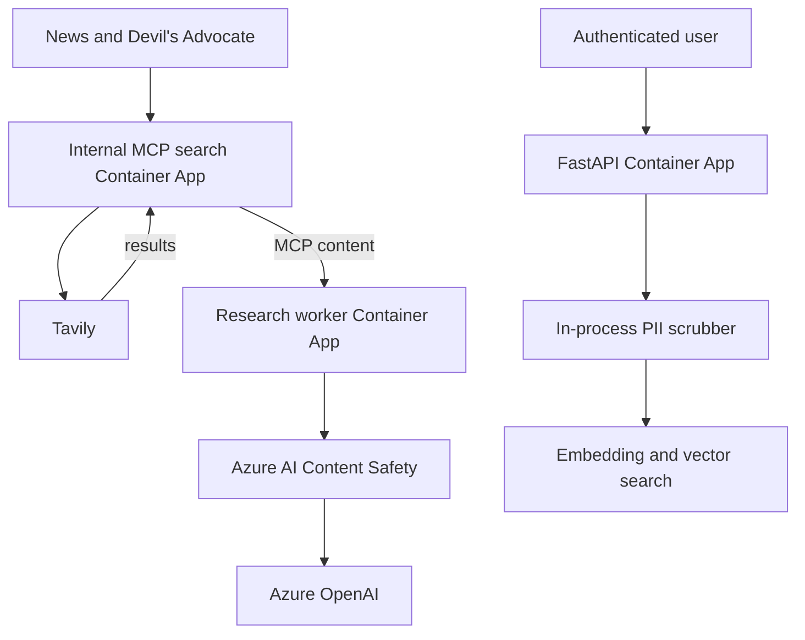

# Chapter 16: Guardrails at the Content Boundary

Authentication answers who may call the system. Authorization answers what that caller may do. Neither tells us whether text crossing an authorized boundary is safe to place in model context.

Stock Research Assistant has two important paths for untrusted text. Open-web search results return through the internal Model Context Protocol (MCP) search service and become tool messages for News and Devil's Advocate. The API also accepts a free-text semantic-search query that can accidentally contain personal data.

The risks differ, so the controls differ. Prompt Shields for Documents checks retrieved web text for indirect prompt attacks. A deterministic scrubber removes two narrow forms of personally identifiable information (PII) before a search query is embedded. Neither control attempts to make content true, and neither replaces capability restrictions.

> **Chapter snapshot**
> - **Starting point:** Identity controls protect the application boundary, but authorized paths can still carry hostile or sensitive text.
> - **Focus in this chapter:** Classify open-web documents before model context and redact narrow PII shapes before embedding.
> - **Finished repository:** The current worker and API contain both controls. Content Safety infrastructure, a versioned adversarial corpus, and dedicated guardrail telemetry are not represented as reproducible repository assets.
> - **Coming next:** Chapter 17 adds correlated telemetry without recording the content these controls remove.

## What This Chapter Explains

Guardrails belong where a specific kind of untrusted data enters. In this application, there are three content paths:

| Path | Risk | Control owner |
|---|---|---|
| User message sent to a model | Direct prompt injection | Configured model-endpoint filtering |
| Open-web text returned by a tool | Indirect prompt injection | Worker search client calling Prompt Shields |
| Free-text semantic-search query | Accidental email or phone disclosure | API scrubber before embedding |

This separation is deliberate. Deterministic valuation, technical indicators, and risk arithmetic return application-controlled structures rather than third-party prose. Scanning every tool would add latency and another failure dependency without addressing the same threat.

The chapter therefore makes a narrower claim: known high-risk text ingress points have explicit controls. It does not claim that all unsafe, false, private, or malicious content can be detected.

## Guardrail Lifecycle

The architecture is easiest to understand as a top-down flow from caller to protected sink.



For retrieved documents, the worker receives text from MCP, submits the documents to Content Safety in the same order, and converts each verdict into a Boolean. Safe text continues unchanged. Flagged text is replaced with a fixed message before an agent sees it.

For semantic search, the API transforms the query before the embedding call. Email and phone patterns become stable placeholders. The original values are unnecessary for stock research and should not enter the vector representation.

## Direct and Indirect Injection

Prompt injection is not one event.

**Direct injection** is instruction-like text supplied by the user as the model’s user message. Azure OpenAI’s configured content filtering can evaluate that request path.

**Indirect injection** is instruction-like text embedded in content the application asks the model to read: a web page, retrieved document, email, or database field. In Stock Research Assistant, Tavily search results return through a tool message. A safe evaluation sends the same jailbreak-like test string in two roles. As user content it can be rejected with an HTTP `400` and jailbreak detection. As tool-role content it can reach the model with HTTP `200` and no equivalent jailbreak field.

This experiment establishes the behavior of the tested deployment, not a permanent platform guarantee. Content-filter products and defaults evolve. The durable lesson is to test each content role through the deployed path and place a document control where external text enters.

## Identity and Endpoint Requirements

Keyword matching is a poor fit for indirect injection. Attack phrasing is open-ended, context-dependent, and easy to paraphrase. The application uses Prompt Shields for Documents through Azure AI Content Safety.

The REST request sends an empty user prompt and a list of documents. The response supplies one `attackDetected` verdict per document. The application converts those verdicts into booleans where `True` means safe to continue.

Getting identity authentication working revealed two independent requirements. First, the calling principal needed a Cognitive Services role on the resource. Second, the resource needed a custom subdomain before bearer-token authentication worked. Waiting for role propagation did not fix the missing subdomain; the same generic permission error represented two different causes.

A direct call with one benign synthetic document and one crafted test document should return two verdicts in input order. If it returns `PermissionDenied`, both role assignment and custom-subdomain support are relevant evidence. A valid role assignment alone does not prove the endpoint supports the chosen authentication path.

## Scanning at Untrusted Ingress

The application scans in `search_via_mcp`, immediately after results return from the search service and before the caller receives them.

```python
is_safe = await scan_documents(texts)
return [
    text if safe
    else "[Result removed: flagged as a potential prompt injection attempt]"
    for text, safe in zip(texts, is_safe)
]
```

The code is intentionally not in the shared harness dispatcher. Deterministic valuation, technical indicators, and risk arithmetic do not accept third-party prose. Scanning every tool would add latency and dependency failure to paths without this risk. The correct insertion point is where untrusted open-web text enters.

Replacing a flagged result rather than silently dropping it preserves evidence for downstream reasoning: the agent knows information was withheld and can disclose incomplete evidence. The placeholder must not reproduce the hostile content.

```python
if not CONTENT_SAFETY_ENDPOINT or not documents:
    return [True] * len(documents)
```

This supports local development, but it is a fail-open policy. Production configuration should treat a missing endpoint as startup failure, and teams must choose deliberately whether a shield timeout blocks, degrades, or quarantines the search result. The application currently lets an exception propagate into the node’s Chapter 12 retry/degradation behavior; it does not have a separate quarantine queue.

A decisive behavior test supplies fake MCP text and scanner verdicts of `[False, True]`. The first output must be exactly the placeholder, the second must remain byte-for-byte unchanged, and the scanner must receive documents in MCP order. With the endpoint unset, the honest result is **unscanned pass-through**, not classifier approval.

## Authenticating Without Another Key

The worker obtains a Cognitive Services access token using `DefaultAzureCredential` and sends it as a bearer token to the shield endpoint.

```python
token = _credential.get_token(
    "https://cognitiveservices.azure.com/.default"
).token
response = await client.post(
    url,
    headers={"Authorization": f"Bearer {token}"},
    json={"userPrompt": "", "documents": documents},
    timeout=15,
)
response.raise_for_status()
```

This reuses the workload-identity pattern from Chapter 14. It does not give the agent a separate identity; the worker calls Content Safety under its own identity. The current credential call is synchronous inside an async function, a small implementation tradeoff worth measuring under load. The HTTP call itself uses `httpx.AsyncClient`.

Runtime evidence must come from the deployed worker identity rather than an administrator account: a crafted document returns unsafe, a benign document returns safe, the role belongs to the runtime principal, and no static Content Safety key appears in the application environment.

## Redacting Before Embedding

The application’s semantic-search `q` parameter is the only genuinely open-ended user input. Ticker and market values have constrained shapes. Before the query is embedded, the API passes it through `scrub_pii`.

```python
def scrub_pii(text: str) -> str:
    text = _EMAIL_RE.sub("[redacted-email]", text)
    text = _PHONE_RE.sub("[redacted-phone]", text)
    return text
```

This is not a general PII detector. It does not find names, addresses, account identifiers, national IDs, or contextual secrets. It is a safety net for two common accidental shapes in a field where neither should be necessary.

The broad phone expression favors redaction over recall precision and may redact long numeric strings that are not phone numbers. That is acceptable for this search box only after product review; the same pattern should not be copied into financial data processing without evaluating false positives.

Behavior evidence uses synthetic values. A query containing `test.user@example.com` and `+1 555-123-4567` must reach the embedding client with both placeholders and neither original value. The decisive property is ordering: scrub first, then embed. Logging the raw query before scrubbing would recreate the exposure even if the vector path were clean.

## Security Signals Without Sensitive Content

Flagged-content events are operationally valuable: they reveal attack volume, false positives, and which tool boundary is targeted. Logging the entire rejected document would recreate the problem by storing hostile or sensitive content in telemetry.

A production event should record a generated event ID, job and agent identifiers, classifier/version metadata, verdict, latency, and a non-reversible bounded fingerprint when policy permits. It should not record bearer tokens, Key Vault values, full user queries, or full rejected documents.

The application currently replaces content but does not emit a distinct structured guardrail event. Chapter 17’s tracing can observe HTTP dependencies, but that is not the same as a security audit event. This remains an honest missing asset.

A successful Content Safety HTTP span can show that scanning was attempted, but it cannot establish which verdict was applied. The absence of a dedicated verdict event is a gap, not evidence to infer from dependency telemetry.

## Behavior Evidence

| Situation | Observable result | What it demonstrates |
|---|---|---|
| Benign and crafted documents are scanned together | Two verdicts return in input order | The document boundary is active |
| Scanner returns `[False, True]` in a fake search test | First text becomes the fixed placeholder; second is unchanged | Verdict mapping and replacement are deterministic |
| Endpoint is absent | Documents pass through and the mode is labeled unscanned | Fail-open behavior is visible rather than mistaken for safety |
| Synthetic email and phone enter semantic search | Embedding receives only redacted placeholders | PII transformation precedes the sensitive sink |
| A document is flagged | Operational evidence excludes raw rejected text and tokens | Investigation does not recreate the content risk |

## Incident: Correct Source, Stale Image

The first historical deployment reported successful image builds and Container App updates, yet the running worker could not import `tools.prompt_shields`. Inspecting the container showed old `web_search.py` content and no new module. The relevant files were untracked or uncommitted, and the build process used a context that omitted them.

After the source was included correctly, updating a Container App to the same `:latest` image reference still did not create a new revision. The platform saw no template change and retained the old replica even though the registry tag’s digest had moved.

The durable operating rules are concrete: inspect the exact build context, use immutable image references, confirm that a new revision exists and old replicas deprovision, and exercise the guardrail inside the running container.

This incident matters because a security control present only in the working tree provides no protection.

> **Production Lens:** Scanning at untrusted ingress and redacting before embedding are production-shaped placements. The current policies remain simplified: local Prompt Shields is fail-open, PII coverage is narrow, verdict telemetry is absent, and classifier outage behavior inherits generic node degradation. Production needs explicit outage policy, adversarial evaluation, minimized telemetry, and alerts for configuration drift.

## Azure Resources for This Stage

Chapter 16 activates one additional runtime dependency while continuing to use resources introduced earlier.

| Resource | Responsibility in this chapter |
|---|---|
| Azure AI Content Safety | Classify retrieved documents for indirect prompt attacks |
| Azure Container Apps research worker | Invoke the classifier before agents receive search text |
| Managed Identity | Authenticate the worker to Content Safety without a stored key |
| Internal MCP search Container App | Return open-web text at the boundary being protected |
| Azure OpenAI | Apply the model deployment's configured request filtering |

The PII scrubber is in-process API code and requires no Azure resource. The repository does not contain reproducible Content Safety provisioning or role-assignment infrastructure.

## Azure Architecture



Content Safety is the Azure resource added in this chapter. The PII scrubber is in-process. The diagram shows data flow, not a claim that Content Safety or the data stores are privately networked.

## Known Limitations

- Missing `CONTENT_SAFETY_ENDPOINT` passes documents without scanning.
- Regex PII coverage is intentionally limited to email and phone shapes.
- There is no dedicated quarantine path or structured guardrail audit event.
- Classifier quality and behavior can change and need a versioned evaluation set.
- A shield cannot make a broadly privileged tool safe; capability and identity controls still apply.
- Content Safety provisioning and role assignments are absent from repository IaC.

## Read the Chapter Code

These current workspace paths contain the complete implementation:

| File | What to inspect |
|---|---|
| `backend/worker/tools/web_search.py` | The ingress point where MCP results are scanned and replaced |
| `backend/worker/tools/prompt_shields.py` | Identity authentication, request shape, verdict mapping, and fail-open behavior |
| `backend/api/pii_scrub.py` | The deliberately narrow email and phone transformations |
| `backend/api/main.py` | The semantic-search path that scrubs before embedding |

## Next

Guardrails now change what content reaches the model, but operators still need proof of when they ran, how long dependencies took, which agent consumed tokens, and where a failed request stopped. Chapter 17 adds correlated observability without logging the sensitive content these controls remove.