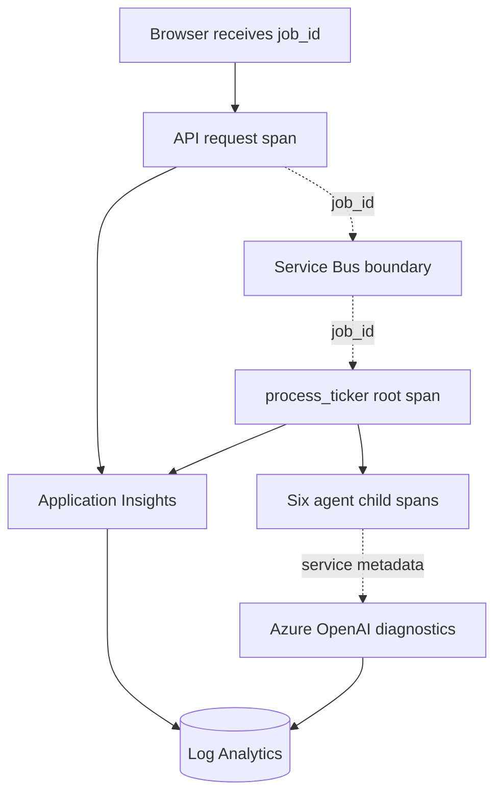
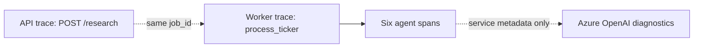
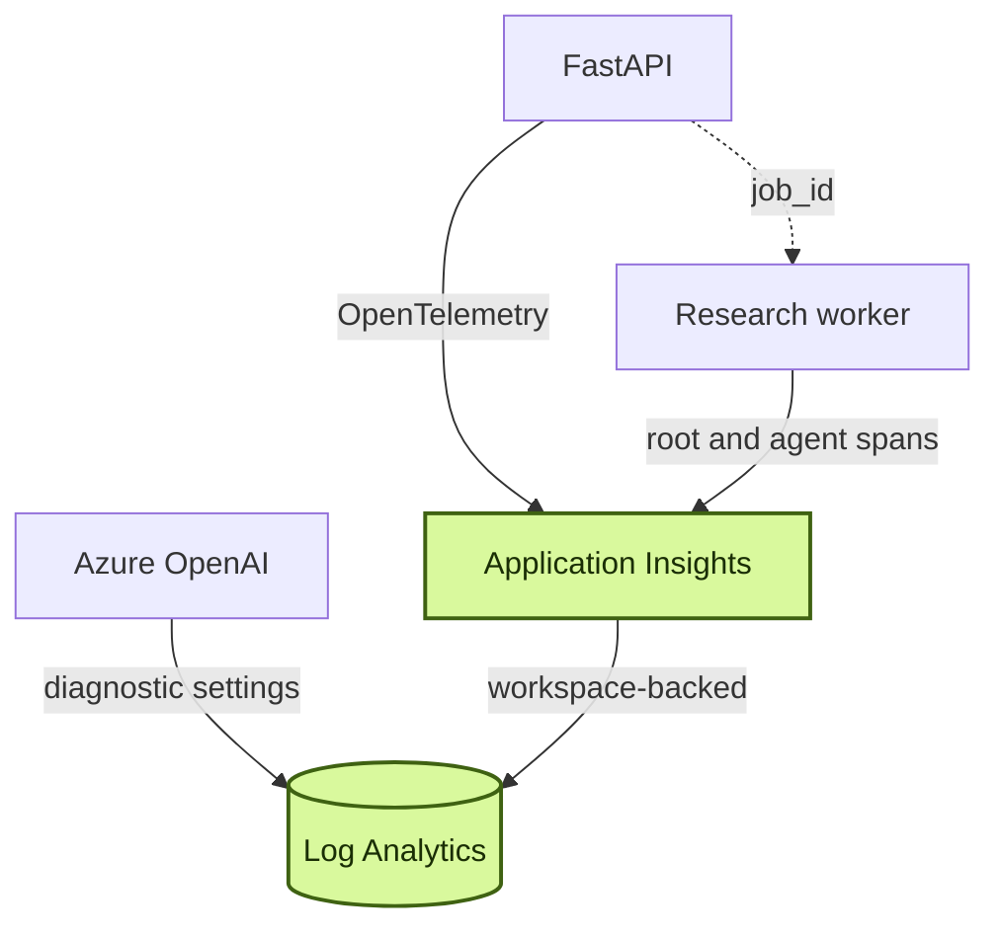

# Chapter 17: Observability That Changes the System

Logs can tell you that a worker started and a job finished. They are much less useful when the question is why one ticker took twice as long as another, which agent consumed the tokens, or whether time disappeared in a queue, a model call, or synchronous code running inside an asynchronous graph.

The application now reaches that limit. Operators can reconstruct incidents from container output, but only by joining timestamps mentally. This chapter adds telemetry with a stricter goal than producing a dashboard:

> The instrumentation must reveal a problem, support a change, and prove the result.

That goal matters because observability has a cost. It adds libraries, telemetry volume, correlation rules, and another system to operate. The return should be better decisions, not merely more data.

> **Chapter snapshot**
> - **Starting point:** Guardrails, workload identity, and the multi-agent workflow are in place, but diagnosis still depends on manually correlating logs.
> - **Focus in this chapter:** Connect Azure OpenAI diagnostics, API and worker tracing, per-agent spans, and `job_id`-based correlation.
> - **Finished repository:** The tracing setup, queue-wait attributes, and `asyncio.to_thread()` performance fix remain in source. Live Azure diagnostic settings and historical trace rows are runtime evidence, not repository artifacts.
> - **Coming next:** Chapter 18 validates scaling under burst load, and Chapter 19 brings correlation into the user-facing product.

## What This Chapter Explains

The application needs three complementary views:

- Azure OpenAI resource diagnostics for request metadata, tokens, model information, and duration.
- Application traces for the API request, worker execution, and six graph nodes.
- A stable `job_id` that correlates separate operations when automatic trace propagation stops at the queue.

Together, these signals reveal blocking I/O in the graph and support a measured reduction in per-ticker processing time from **98.9 seconds to 41.4 seconds**. The result is not merely a dashboard. Telemetry changes an implementation choice and then tests the effect of that change.

## Observability Lifecycle

One research job occupies three observability regions rather than one uninterrupted distributed trace.



The API and worker use different telemetry operation IDs because the Service Bus path does not propagate trace context in this implementation. `job_id` joins those regions manually. Parent-child relationships organize work inside the worker, while Azure OpenAI diagnostics remain a separate service-performance and usage view.

Local execution is intentionally quiet when `APPLICATIONINSIGHTS_CONNECTION_STRING` is absent. Correlation ID, ticker, market, duration, status, and token totals answer the chapter's questions without putting secrets, tokens, or unnecessary user content into spans.

## Separate Signals for Separate Questions

Before adding code, state which questions each signal should answer.

| Signal | Question | Application source |
|---|---|---|
| Request diagnostics | How many tokens did the model endpoint process, and how long did it take? | Azure OpenAI diagnostic settings |
| API request span | Did the create-job request succeed, and which `job_id` did it create? | FastAPI instrumentation plus a custom attribute |
| Worker root span | How long did one ticker wait and run? | `process_ticker` span |
| Agent child span | Which graph node consumed time and tokens? | Six spans in the graph |
| Application state | What did the product finally return? | PostgreSQL job/result records |

This prevents a common mistake: asking one telemetry source to be the whole truth. Azure OpenAI knows about model requests but not the application's job semantics. The worker knows the job and graph node but does not automatically own the API's trace. PostgreSQL knows the result but is not a timing system.

A completed job should expose its queue wait, slowest agent, token use, and the boundary between API and worker operation IDs. If answering those questions still requires manually sorting unordered log lines, the observability model has not closed the gap.

## Model Resource Diagnostics

Use Azure OpenAI diagnostic categories and send them to the existing Log Analytics workspace. This captures service-side metadata without changing every model caller.

This setup reveals two useful boundaries.

First, a command can report success while the resource still misses the expected destination mode. If `logAnalyticsDestinationType` is unset instead of `Dedicated`, you can see a successful operation but no expected table shape. The general rule is simple: validate the resulting resource, then validate a real emitted record.

Second, the category name includes “RequestResponse,” but the payload does **not** include prompt or completion text. A unique marker sent in a test request does not appear in logged properties. Token counts, byte lengths, timing, model metadata, and response status are present. That is enough for performance and usage analysis and reduces telemetry privacy exposure.

Behavior evidence requires a real emitted row with token and duration metadata in the intended table shape. A unique synthetic marker from the prompt should be absent. A successful configuration operation without a resulting record proves only that configuration was accepted.

> **Production Lens:** Diagnostic settings are production-shaped because they observe every caller at the resource boundary. Production retention, workspace access, and export policies should be chosen deliberately: metadata can still reveal usage patterns and customer activity even when prompt text is absent.

## API Correlation

The API configures Azure Monitor only when its connection string exists, then instruments the FastAPI application. It adds one custom field when creating a job.

**Current excerpt - [`backend/api/main.py`](../backend/api/main.py):**

```python
if os.environ.get("APPLICATIONINSIGHTS_CONNECTION_STRING"):
    configure_azure_monitor()

app = FastAPI(lifespan=lifespan)
FastAPIInstrumentor.instrument_app(app)

@app.post("/research", dependencies=[Depends(require_user)])
async def create_research(request: ResearchRequest):
    job_id = str(uuid.uuid4())
    trace.get_current_span().set_attribute("job_id", job_id)
```

Automatic instrumentation captures route, method, status, and duration. The custom `job_id` connects platform telemetry to the identifier stored in the application's database and returned to the browser.

This field is not redundant with the telemetry operation ID. The operation ID describes one trace. `job_id` describes one piece of product work, which can cross processes, queues, retries, and traces.

For one research request, the returned `job_id` should locate a `POST /research` span with the same value in custom properties. Requests without that property indicate that instrumentation order or current-span ownership is wrong.

## Worker and Agent Spans

The worker opens a root span for each ticker. It records product identity and computes queue wait from the timestamp already attached to the Service Bus message.

**Current excerpt - [`backend/worker/worker.py`](../backend/worker/worker.py):**

```python
with tracer.start_as_current_span("process_ticker") as span:
    span.set_attribute("job_id", job_id)
    span.set_attribute("ticker", ticker)
    span.set_attribute("market", market)
    if queue_wait_seconds is not None:
        span.set_attribute("queue_wait_seconds", queue_wait_seconds)
    await _process_ticker(job_id, ticker, market, embed_sender, checkpointer)
```

Each graph node opens a child span and records its token total after a successful call.

**Illustrative excerpt - current failure handling omitted:**

```python
async def technical_node(state: ResearchState) -> dict:
    with tracer.start_as_current_span("agent:technical") as span:
        span.set_attribute("job_id", state["job_id"])
        span.set_attribute("ticker", state["ticker"])
        result = await technical_agent.run(state["ticker"], state["market"])
        span.set_attribute("total_tokens", result.get("usage", {}).get("total_tokens", 0))
```

The full current implementation also catches node failures and writes degraded results. The excerpt is shortened to keep the tracing mechanism visible.

The worker span tree is:

```text
process_ticker
|-- agent:fundamentals
|-- agent:technical
|-- agent:news
|-- agent:risk
|-- agent:devil_advocate
`-- agent:decision
```

All six node spans are siblings beneath `process_ticker`. Graph edges establish execution order, not telemetry parentage: Fundamentals, Technical, and News overlap in one fan-out, then Risk, Devil's Advocate, and Decision run sequentially.

One uncached ticker should produce one `process_ticker` span with `job_id`, ticker, market, and queue wait; six named agent spans; overlapping ranges for the three fan-out nodes; and token attributes on successful nodes. If the graph finishes with a node span missing, its exception path is part of the tracing defect. A span should still close and record failure when an exception leaves its context.

## How Correlation Actually Works

The application does not produce one uninterrupted distributed trace. The measured job story occupies three observability regions:



In this deployment, the API and worker use different telemetry operation IDs for the same job because the Service Bus path does not propagate trace context. OpenAI diagnostic records use Azure service correlation rather than the application's `job_id`. Therefore:

- `job_id` joins API and worker telemetry manually.
- Parent-child span relationships organize work inside the worker.
- Azure OpenAI diagnostics remain a separate usage and service-performance view.

A useful workspace query for the first two regions is:

```kusto
let jobid = "PASTE_JOB_ID_HERE";
union AppRequests, AppDependencies
| where Properties has jobid
| project TimeGenerated, Type, Name, DurationMs, Success, Properties
| order by TimeGenerated asc
```

In this environment, this query works against the underlying Log Analytics workspace even when the Application Insights Logs blade cannot resolve the same tables. The operating rule is: know the physical workspace behind workspace-based Application Insights and test queries there when the resource-scoped blade behaves differently.

This query can also expose a short second `process_ticker` row for one completed job. Service Bus may redeliver a message, and the worker's idempotency check can skip it in milliseconds. Observability does not only explain latency; it also revalidates resilience controls under real delivery behavior.

## Incident: The Parallel Graph Was Blocking

The first complete AAPL trace showed an odd pattern:

| Span | Before |
|---|---:|
| `agent:fundamentals` | 73.8s |
| `agent:technical` | 68.5s |
| `agent:news` | 71.3s |
| `process_ticker` | 98.9s |

Three agents doing different work had similarly long durations. The graph edges were correct, so the next question was whether code inside those asynchronous nodes blocked the event loop.

It did. Market-data helpers used synchronous `yfinance` I/O and were called directly from async agent functions. While one helper waited on network I/O, the event-loop thread could not advance the other branches. The orchestrator had scheduled concurrent tasks, but their implementation defeated concurrency.

The fix offloaded each blocking helper to a worker thread.

**Current excerpt - [`backend/worker/agents/fundamentals_agent.py`](../backend/worker/agents/fundamentals_agent.py):**

```python
data = await asyncio.to_thread(fetch_stock_data, ticker, market)
```

The same pattern remains in the technical and decision agents. A real before-and-after run produced:

| Span | Before | After |
|---|---:|---:|
| `agent:fundamentals` | 73.8s | 8.9s |
| `agent:technical` | 68.5s | 6.3s |
| `agent:news` | 71.3s | 12.4s |
| `process_ticker` | **98.9s** | **41.4s** |

This is approximately a 58% reduction in wall-clock time. The exact figures belong to that workload and environment; they are not a universal benchmark. The reusable result is the method: observe suspicious span overlap, identify a blocking boundary, change the call sites, and repeat the same measurement.

The comparison is valid only when ticker, market, cache state, and deployed model path remain the same. Comparing a cache hit with a miss, or two materially different workloads, would not support the latency claim.

## Known Limitations

### Known Trace Gaps

The worker enabled HTTPX auto-instrumentation. An isolated Azure OpenAI call produced a correctly nested dependency span after telemetry was force-flushed. The actual graph run did not reliably show those nested HTTPX dependency spans. Version compatibility, import order, and overlapping revisions were investigated without finding a root cause.

That gap remains evidence, not an invitation to rewrite history. Per-agent duration and token attributes worked and were sufficient to find the blocking bug. The missing dependency spans still limit hop-level diagnosis and should be tracked separately.

Other deliberate gaps are equally important:

- No automatic Service Bus trace-context propagation is established.
- Azure OpenAI diagnostics cannot be joined directly on `job_id`.
- No alert rules or operational dashboards are built in this chapter version.
- Token totals are recorded, but financial cost depends on current model pricing and other Azure resources.

> **Production Lens:** Production observability needs service-level objectives, alerts tied to user impact, sampling rules, retention limits, and access controls. The application has production-shaped correlation and spans, but it still relies on an operator running queries after a symptom appears.

## Azure Resources for This Stage

No new compute service enters the request path. This chapter activates telemetry capabilities on resources already running:

| Resource | Responsibility in this chapter |
|---|---|
| Application Insights | Receive API, worker, and agent OpenTelemetry spans |
| Log Analytics | Store and query workspace-backed application telemetry and model diagnostics |
| Azure OpenAI diagnostic settings | Export request metadata, token totals, duration, and status without prompt text |
| Azure Container Apps API and worker | Create the spans and correlation attributes |

Application Insights is workspace-backed in this deployment, so the physical Log Analytics workspace remains the reliable query boundary when a resource-scoped logs view cannot resolve the expected tables.

## Azure Architecture



## Read the Chapter Code

These current workspace paths expose the instrumentation and the change it motivated:

| File | What to inspect |
|---|---|
| `backend/api/main.py` | Conditional Azure Monitor setup and the API's `job_id` span attribute |
| `backend/worker/worker.py` | The `process_ticker` root span and queue-wait attribute |
| `backend/worker/agents/graph.py` | Per-agent spans, token attributes, and fan-out/fan-in execution |
| `backend/worker/agents/fundamentals_agent.py` | The `asyncio.to_thread()` boundary for synchronous market-data I/O |

## Run This Stage

- **Repository tag:** `chapter-17-complete`.
- **Azure resources:** Application Insights and its Log Analytics workspace, plus Azure OpenAI diagnostic settings, on top of the Chapter 16 stack. Provision with `./infra/deploy.sh infra/params/chapter-17.json` (see the Chapter 17 row in [Azure Setup and Deployment](azure-setup.md)).
- **Run it offline:**

  ```bash
  git switch --detach chapter-17-complete
  cd backend/api && uv sync && uv run python -m unittest discover -s tests -v
  cd ../worker && uv sync && uv run python -m unittest discover -s tests -v
  ```

- **Run it end to end:** set `APPLICATIONINSIGHTS_CONNECTION_STRING` for the API and worker in addition to the earlier variables — Azure Monitor setup is conditional on that variable being present, so the app still runs locally without it, just without exported spans.

## Next

The traces reveal what one ticker costs in time. They do not prove that the system responds correctly when many tickers arrive together. Chapter 18 turns queue depth and replica count into measured scaling evidence and moves the MCP search process behind its own independently operated boundary.