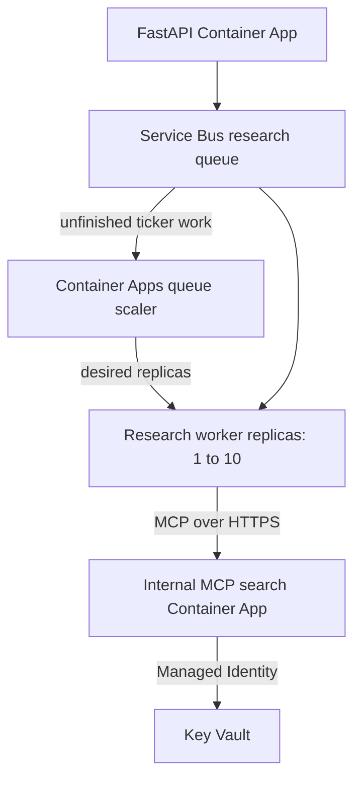
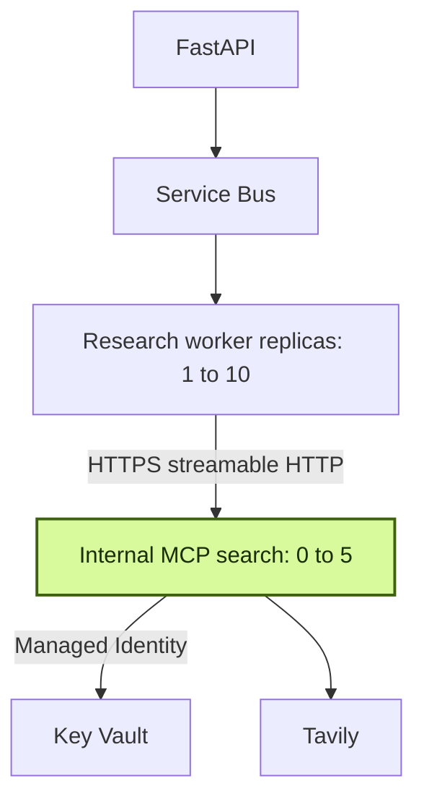

# Chapter 18: Scaling the Real Workload

An autoscaling rule is a hypothesis. It says that a signal should cause replicas to appear, useful work to drain, and excess capacity to disappear. Until that sequence is observed, the system has configuration, not scaling evidence.

We test two related ideas in Stock Research Assistant. First, the research worker should scale from Service Bus queue depth because one ticker occupies a worker for tens of seconds. Second, the MCP search server should run as a separate service instead of a subprocess hidden inside every worker. This gives search its own identity, deployment, and scaling boundary.

These changes produce different kinds of evidence. The worker test must show a complete scale-out and scale-in cycle. The search-service test proves protocol and deployment behavior, but it does not prove scaling unless traffic causes a second replica to appear. Keeping those conclusions separate is the main discipline of this chapter.

> **Chapter snapshot**
> - **Starting point:** Tracing now shows where ticker processing time goes, but scaling behavior is still an untested hypothesis.
> - **Focus in this chapter:** Validate worker autoscaling with a bounded queue burst and examine MCP search as a standalone internal service.
> - **Finished repository:** The standalone MCP project, streamable HTTP server, HTTPS client path, and service-owned Key Vault access remain in source. Live Container App scale rules and replica timelines remain runtime evidence.
> - **Coming next:** Chapter 19 restores the worker queue threshold to a normal value and verifies scaler identity after that update.

## Scaling Lifecycle

The chapter follows one queue-driven scaling cycle and one service-boundary change:



The observable worker outcome is not merely “KEDA is configured.” It is a timeline connecting queue depth, replica count, work completion, cooldown, and return to the replica floor. The MCP outcome is different: the service works across a network boundary, but the recorded load does not prove multi-replica scaling.

## What This Chapter Explains

The research worker spends tens of seconds on one ticker. Queue depth therefore represents work that users are waiting for more directly than CPU utilization does. The MCP search server handles shorter HTTP requests and needs an independently operated identity, deployment, and scaling boundary.

The captured test uses fresh tickers that miss the daily cache. Cache hits bypass the queue and cannot exercise worker scaling. It also uses an intentionally aggressive target of approximately one queued message per replica; Chapter 19 restores a less aggressive threshold. A test threshold is evidence-gathering configuration, not permanent capacity policy.

## Choosing the Pressure Signal

The API validates input, writes job rows, sends messages, and returns an identifier. Measurements put this path around hundreds of milliseconds. The worker performs market-data I/O, multiple model interactions, web searches when selected, deterministic tools, checkpointing, and persistence. Even after Chapter 17's fix, one ticker takes about 41.4 seconds in the measured comparison.

That difference determines the first scaling target:

| Component | Unit of work | Useful pressure signal |
|---|---|---|
| API | Short HTTP request | Concurrent HTTP requests |
| Research worker | One queued ticker | Queue depth |
| MCP search | Short search requests | Concurrent HTTP requests |
| Embed worker | Queued report embedding | Embedding queue depth |

CPU would be a poor first signal for the research worker. Much of its time is spent awaiting remote services, so queue depth can rise while CPU remains modest. Queue depth directly represents work users are waiting for.

Every useful scale signal completes the sentence “one unit of this signal means ...” For the research worker, one queued message means one uncached ticker waiting for execution. If a signal cannot be tied to demand or unfinished work, its scale rule is difficult to defend.

> **Production Lens:** Queue depth is a production-shaped scaling signal for pull-based workers, but target depth is a capacity decision. It should be informed by arrival rate, processing-time distribution, downstream quotas, and acceptable wait time rather than copied from a demonstration.

## Baseline Configuration

The worker configuration in this chapter uses:

- A minimum of 1 replica, avoiding a worker cold start.
- A maximum of 10 replicas, bounding spend and downstream concurrency.
- A Service Bus queue-depth rule using the Container App's system-assigned identity.
- A 300-second cooldown before scale-in.

The identity detail matters. The scaler must read queue metadata even though application code receives messages through its own SDK client. A correctly authorized application does not imply a correctly authorized scaling controller.

The captured baseline includes:

- Active revision and image.
- Minimum and maximum replicas.
- Rule type, queue name, target message count, and identity.
- Poll interval and cooldown.
- Current replica count and queue depth.

The baseline is valid when one ready worker exists, the queue is empty, and the scale rule still contains its identity reference. A missing identity would turn the exercise into a test of a broken scaler rather than workload behavior.

## Bounded Burst Evidence

The test submits eight fresh tickers in one research request. The API fans that request into eight Service Bus messages. Replica count and queue depth are sampled throughout the run.

The project notes record this timeline. The raw export is not retained in the workspace, so treat it as historical runtime evidence rather than an independently reproducible artifact:

| Time | Worker replicas | Queue depth | Interpretation |
|---|---:|---:|---|
| 09:05:08 | 1 | 8 | Burst is queued |
| 09:05:37 | **8** | 7 | Scale-out occurred within one polling interval |
| 09:07:02 | 8 | **0** | Queue drained in under two minutes |
| 09:10:49 | 7 | 0 | Cooldown is ending |
| 09:11:18 | **1** | 0 | System returned to its floor |

This test proves several distinct claims:

1. Queue depth was visible to the scaler.
2. The scaler created additional replicas.
3. Replicas consumed real messages rather than merely starting.
4. The queue drained.
5. Scale-in respected a cooldown and returned to the configured minimum.

It does **not** prove that eight replicas are always optimal, that downstream services tolerate ten indefinitely, or that the same result holds under a sustained arrival rate. It is one bounded validation of mechanism and configuration.

Raw observations need timestamp, queue depth, desired replicas, ready replicas, and completed ticker count. A screenshot at peak replica count cannot prove that the queue drained or that scale-in worked.

## Scaling Evidence and Non-Evidence

The API was not load-tested with the same rigor. It relied on the platform's HTTP scaling and performed relatively short requests, but no captured test demonstrated its concurrency threshold or a full scale cycle. Therefore the chapter can say the API was configured to autoscale; it cannot claim equivalent measured proof.

The MCP service also remained at one replica during a burst of four fresh tickers. Search calls were short and intermittent, so concurrent requests did not cross the default HTTP threshold. This result is not a scaling failure. One replica was sufficient for that workload.

Use precise labels:

| Claim | Evidence status |
|---|---|
| Worker scaled from 1 to 8 and back to 1 | Reported by the historical live timeline; raw observations are not retained here |
| Worker drained eight queued ticker jobs | Reported by historical queue observations; raw observations are not retained here |
| API can scale under HTTP pressure | Configured, not rigorously load-tested here |
| MCP service works as a separate network service | Proven by isolated and end-to-end calls |
| MCP service scales beyond one replica | Not proven; recorded load never required it |
| Maximum worker setting protects every downstream dependency | Not proven; requires quota and saturation testing |

This distinction prevents a familiar reporting error: treating “the platform supports autoscaling” as evidence that this workload crossed a threshold and benefited from it.

## MCP as a Standalone Service

Before this chapter version, the worker spawned the search server over stdio. That is useful for learning the protocol without adding another deployment. It also couples search process startup, secret retrieval, failure, and resource use to each worker call.

The revised server runs streamable HTTP and obtains its own Tavily key. Locally it reads an environment variable; in Azure it uses its own Managed Identity to read Key Vault.

**Current excerpt - [`backend/worker/mcp_server/search_server.py`](../backend/worker/mcp_server/search_server.py):**

```python
port = int(os.environ.get("PORT", 8811))
mcp.run(
    transport="streamable-http",
    host="0.0.0.0",
    port=port,
    stateless_http=True,
    json_response=True,
)
```

The client now knows only the service URL and MCP protocol. It no longer creates a subprocess or reads the Tavily secret.

**Current excerpt - [`backend/worker/tools/web_search.py`](../backend/worker/tools/web_search.py):**

```python
MCP_SEARCH_URL = os.environ.get(
    "MCP_SEARCH_URL",
    "http://127.0.0.1:8811/mcp",
)

async with streamable_http_client(MCP_SEARCH_URL) as (read, write):
    async with ClientSession(read, write) as session:
        await session.initialize()
        result = await session.call_tool(
            "search",
            {"query": query, "max_results": max_results},
        )
```

Local HTTP is appropriate for the loopback default. The deployed Container Apps URL must use HTTPS directly, as the incident below demonstrates.

The move changes ownership:

| Concern | Subprocess model | Standalone service |
|---|---|---|
| Process lifecycle | Worker | Container Apps |
| Search secret | Worker passes it | Search service retrieves it |
| Identity | Worker's identity | Search service's identity |
| Failure boundary | Inside worker process tree | Network/service boundary |
| Scaling | Coupled to workers | Independent HTTP scaling |
| Deployment | Worker image | Separate project and image |

Protocol evidence has two layers. An isolated client initializes a session, lists tools, and performs a bounded search. An end-to-end ticker job then proves that News or Devil's Advocate can choose the search tool through the deployed worker-to-service path.

## Incident: A Successful Deploy Ran Old Worker Code

The search image was built and deployed, but the worker was not rebuilt with the new HTTP client. Removing the worker's old Key Vault setting then broke the old subprocess path still running in production.

The distinguishing evidence was the deployed worker image tag: it predated the client change. The fix was to build and deploy both sides of the contract, then verify the active revisions.

The operating rule is simple: a new server deployment does not update its callers. For a protocol migration, list every independently deployable participant and verify each active artifact.

## Incident: Identity Arrived Before Authorization

The new search service received a system-assigned identity and the Key Vault Secrets User role. Its first cold start attempted secret retrieval before the assignment had propagated and failed. A fresh attempt several minutes later succeeded without a configuration change.

This is why deployment scripts should distinguish eventual authorization propagation from invalid configuration. Retry bounded startup dependencies, inspect the exact identity and scope, and avoid repeatedly changing correct settings while propagation catches up.

## Incident: The POST Became a GET

The hardest failure happened after deployment and basic connectivity both appeared healthy. A plain request reached the internal service, yet the MCP client hung during `session.initialize()`.

Raw HTTP logging exposed the exchange:

```text
POST http://stock-research-mcp-search.../mcp  -> 301 Moved Permanently
GET  https://stock-research-mcp-search.../mcp -> 200 text/event-stream
```

Container Apps internal ingress redirected HTTP to HTTPS. Following a 301 changed the POST into a GET under the client's redirect behavior, discarding the JSON-RPC initialization body. The server opened the stream appropriate to the GET it received, while the client waited for a response to a POST that never arrived.

The fix was not another timeout. `MCP_SEARCH_URL` was changed to the final `https://` URL so no redirect occurred.

This incident generalizes beyond MCP. Any POST-based internal protocol can fail when a redirect changes method or body. Test the exact method, URL, and payload through the deployed ingress, not only DNS and a health GET.

The decisive network evidence is one initialization exchange that sends POST directly to HTTPS and receives the expected MCP response without a redirect. A successful GET health check does not test the protocol.

## How It Works

The worker and MCP service scale on different demand representations. Queue-driven scaling can add replicas while messages wait, even when no HTTP connection is active. HTTP scaling reacts to concurrent requests already reaching the service. Separating the services allows each policy to match its workload.

There is also a backpressure question. Scaling workers increases simultaneous calls to model, market-data, search, database, and cache services. A maximum replica count is therefore both a cost limit and a downstream concurrency limit. Raising it can reduce queue wait while increasing throttling elsewhere.

One useful capacity approximation is:

$$
\text{throughput} \approx \frac{\text{ready replicas}}{\text{mean processing time per ticker}}
$$

This estimate ignores retries, cache hits, variance, quotas, and failed work, so it is a planning prompt rather than a guarantee. Chapter 17's latency distribution and this chapter's arrival-rate observations are both needed for a responsible target.

> **Production Lens:** A production scaling test should include sustained load, downstream quota monitoring, failure rate, queue-age percentiles, cold-start behavior, and cost. The application proves the worker mechanism with a bounded burst; it does not establish a complete capacity envelope.

## Azure Resources for This Stage

This chapter changes the operating responsibilities of existing services and activates the standalone search service boundary:

| Resource | Responsibility in this chapter |
|---|---|
| Azure Service Bus | Expose queued ticker work as the worker pressure signal |
| Azure Container Apps research worker | Scale between the configured floor and ceiling from queue depth |
| Azure Container Apps MCP search service | Own the search process, internal HTTPS ingress, and HTTP scaling boundary |
| Managed Identity | Authenticate the scaler to Service Bus and the search service to Key Vault |
| Azure Key Vault | Supply the Tavily secret to the service that owns search |

Azure OpenAI, PostgreSQL, Redis, Content Safety, and telemetry remain downstream dependencies, but this chapter does not activate new responsibilities for them. Worker scale-out can increase pressure on all of them.

## Azure Architecture



## Known Limitations

The repository does not contain the deployed Container App scale configuration as infrastructure as code. The MCP service's move is visible in source, but its live ingress, identity, role assignment, and limits must be inspected in Azure. The test did not measure saturation, cost per burst, API scale-out, MCP multi-replica scale-out, or failure under downstream throttling.

## Read the Chapter Code

These current workspace paths show the network boundary and its caller:

| File | What to inspect |
|---|---|
| `backend/worker/mcp_server/search_server.py` | Streamable HTTP transport, stateless server mode, host, and port |
| `backend/worker/tools/web_search.py` | Direct MCP client connection to the configured service URL |
| `backend/worker/worker.py` | One-ticker worker processing that gives queue depth its meaning |

## Run This Stage

- **Repository tag:** `chapter-18-complete`.
- **Azure resources:** a standalone MCP search Container App with internal HTTPS ingress and its own HTTP-based scale rule, on top of the Chapter 17 stack. Queue-depth scaling on the research worker is a configuration change to existing Container Apps, not a new resource. Provision with `./infra/deploy.sh infra/params/chapter-18.json` (`REGISTRY_LOGIN_SERVER` in `infra/.local-config` covers the new `mcpSearchImage` reference too — see [Azure Setup and Deployment](azure-setup.md)).
- **Run it offline:**

  ```bash
  git switch --detach chapter-18-complete
  cd backend/api && uv sync && uv run python -m unittest discover -s tests -v
  cd ../worker && uv sync && uv run python -m unittest discover -s tests -v
  cd ../mcp-search && uv sync && uv run python -m unittest discover -s tests -v
  ```

- **Run it end to end:** search now runs as its own service instead of a worker-owned subprocess. Start it separately and point the worker at it:

  ```bash
  cd backend/mcp-search
  TAVILY_API_KEY=... uv run python search_server.py

  cd backend/worker
  uv run python worker.py
  ```

  The worker's default `MCP_SEARCH_URL` already points at `http://127.0.0.1:8811/mcp`, so no override is needed when both run on the same machine.

  Scaling behavior itself (queue-depth and HTTP-concurrency rules) is only observable once both services are deployed to Container Apps with their scale rules configured, as described above.

## Next

The distributed system now runs, explains its latency, and responds to a real burst. It still asks users to interpret flat output, loses operational context in support conversations, and hides partial failure. Chapter 19 turns those engineering capabilities into a coherent product surface and catches one last infrastructure regression while restoring the test scaling threshold.