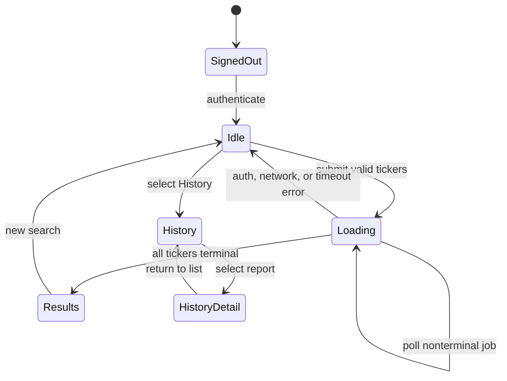
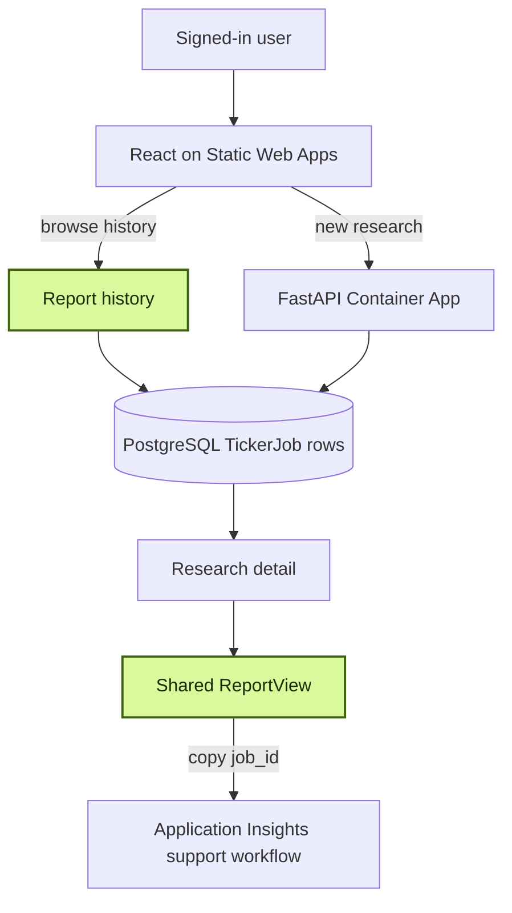

# Chapter 19: Product Polish Is Operational Design

Polish is often treated as color, spacing, and animation applied after the important engineering is finished. In a distributed application, the most valuable polish is usually semantic: a user can tell which ticker failed, an operator can ask for a job ID, history can be retrieved without a database query, and authentication errors no longer masquerade as outages.

The application's final product pass includes visual redesign, but its deeper work is aligning the interface with truths the backend already knows. A multi-ticker job does not have one indivisible outcome. A completed report contains structured decisions, not just a paragraph. PostgreSQL already holds prior jobs. Application Insights already uses `job_id` for correlation. Product polish makes those facts visible.

> **Chapter snapshot**
> - **Starting point:** Observability and scaling behavior are in place, but the user experience still hides operational context and mixed ticker outcomes.
> - **Focus in this chapter:** Align per-ticker status, structured reports, history, `job_id` correlation, and error states with the backend's existing truths.
> - **Finished repository:** The API fields, report components, React tabs, and CSS updates remain in source. Live deployment state and ARM scale-rule verification remain runtime checks.
> - **Coming next:** Chapter 20 assesses the complete system and defines what still separates this learning build from production readiness.

## Product Behavior

The interface exposes two coherent user workflows:

- Submit one or more tickers, wait, inspect structured results, and copy the job ID.
- Browse prior completed reports, filter by ticker, and reopen one in the same report view.

The browser lifecycle remains polling-based because durable job state already supports reconnectable reads and bounded complexity:



Streaming could improve progressive feedback, but it would add reconnect, authorization, and deployment behavior. It is an extension rather than a prerequisite for an honest completed system.

## What This Chapter Explains

Product polish is operational design when the interface reflects domain state rather than inferring it from generated prose. A multi-ticker job has per-ticker outcomes. PostgreSQL already contains report history. Application Insights already correlates on `job_id`. The product becomes clearer by exposing those facts, not by adding a parallel data model.

The frontend uses React, Vite, and Microsoft Authentication Library (MSAL). The API uses FastAPI and reads `TickerJob` records from PostgreSQL. New research can invoke paid services, and history remains behind the authentication boundary established earlier. The records are not associated with individual users in the current schema: every allow-listed user can list completed reports and retrieve a known job ID.

## Per-Ticker Terminal State

The API originally returned top-level `status: done` when every ticker had reached a terminal state. That was correct for polling but incomplete for display. One ticker could succeed while another permanently failed. The frontend had no structured way to tell which outcome belonged to which ticker.

The brittle fallback was to inspect summary text for an error phrase. That conflated two cases:

- A genuinely failed ticker with an exception encoded in its summary.
- An older cached result created before structured Decision data existed.

The API now returns a `ticker_status` map beside summaries and decisions.

**Current excerpt - [`backend/api/main.py`](../backend/api/main.py):**

```python
ticker_status = {}
for task in tasks:
    tickers.append(task.ticker)
    ticker_status[task.ticker] = task.status
    parsed = json.loads(task.result)
    summary.extend(parsed["summary"])
    decisions.update(parsed.get("decisions", {}))

return {
    "status": "done",
    "result": {
        "tickers": tickers,
        "summary": summary,
        "decisions": decisions,
        "ticker_status": ticker_status,
    },
}
```

The endpoint's top-level state answers “may polling stop?” The map answers “what happened to each unit of work?” Those are related but different questions.

The report renderer consumes the explicit field before looking for Decision data.

**Current excerpt - [`frontend/src/ReportView.jsx`](../frontend/src/ReportView.jsx):**

```jsx
if (report.ticker_status?.[ticker] === 'failed') {
  const message = lines[0]?.replace(`${ticker}:`, '').trim()
  return <FailedReport key={ticker} ticker={ticker} message={message} />
}
```

The message is still displayed, but text no longer decides whether failure occurred.

A decisive response fixture contains two tickers: one `done` and one `failed`. The successful ticker must render its structured report, while the failed ticker gets a distinct failure card. Removing `ticker_status` from an old decision-less result must select the plain-summary fallback rather than mislabeling it as failed.

> **Production Lens:** A production contract could model job and ticker states with enums and typed error codes. The application's string map is small and effective, but raw exception messages should eventually be replaced with user-safe descriptions plus an internal diagnostic reference.

## Decision Data as Visual Hierarchy

The worker persists a structured `decisions` object keyed by ticker. The view uses it to establish visual hierarchy:

- Recommendation and overall score appear first.
- Current price and intrinsic-value scenarios are grouped.
- Deterministic hard stops receive a distinct warning treatment.
- Devil's Advocate evidence is separated from the final recommendation.
- Older unstructured summaries still render through a fallback path.

This is more than presentation. It prevents the user from searching a long model-generated paragraph for the system's actual decision and caveats.

The current [`frontend/src/ReportView.jsx`](../frontend/src/ReportView.jsx) keeps this logic in a dedicated component rather than expanding the main application component. `TickerReport` renders one ticker, `FailedReport` owns terminal failure, and `ReportView` chooses the correct branch.

Four fixtures define the important rendering branches:

| Fixture | Expected view |
|---|---|
| Full Decision output | Recommendation, score, valuation, counter-thesis |
| Hard stops present | Dedicated hard-stop section |
| Old result without `decisions` | Plain summary fallback |
| Explicit failed status | Failure card, not empty recommendation |

This is cheaper and more reliable than waiting for each state to occur naturally in a live model run.

## Job ID as a Support Feature

Chapter 17 established `job_id` as the manual correlation key between API and worker traces. That mechanism was useless in a support conversation if only developers could find the value in network tools.

The completed report now shows the identifier and offers one-click copy.

**Current excerpt - [`frontend/src/App.jsx`](../frontend/src/App.jsx):**

```jsx
{jobId && (
  <p className="job-id-line">
    Job ID: <code>{jobId}</code>{' '}
    <button className="copy-btn" onClick={handleCopyJobId}>
      {copied ? 'Copied' : 'Copy'}
    </button>
  </p>
)}
```

This changes the support workflow from “describe what looked wrong” to “provide the exact run identifier.” The same ID can locate job rows and telemetry without exposing database keys or trace internals to the user.

The value copied from a completed report must locate API and worker records for the same run in the Chapter 17 telemetry query. That connection is the behavior that makes the visible identifier useful.

## History Without New Storage

`TickerJob` already persisted ticker, market, status, result, and creation time. The missing capability was a read path across jobs. The new `GET /reports` endpoint queries completed rows, optionally narrows by ticker, market, or date, orders newest first, and applies a limit.

**Current excerpt - [`backend/api/main.py`](../backend/api/main.py):**

```python
query = select(TickerJob).where(TickerJob.status == "done")
if ticker:
    query = query.where(TickerJob.ticker == ticker.strip().upper())
if market:
    query = query.where(TickerJob.market == market)
query = query.order_by(TickerJob.created_at.desc()).limit(limit)
```

The endpoint returns list metadata rather than every full report. Selecting a row reuses `GET /research/{job_id}`, then narrows a possibly multi-ticker result to the selected ticker before passing it to the existing `ReportView`.

This avoids three sources of duplication:

- No new history table.
- No second full-report endpoint.
- No second report renderer.

This feature was verified against accumulated multi-day records. A lowercase `aapl` filter matches uppercase AAPL rows, and date bounds return the expected interval. After UI review, visible date-range controls are removed. The product retains the simpler ticker filter and loads all recent reports by default in a table with Ticker, Market, Recommendation, and Date.

The API still accepts date parameters. This is a useful reminder that backend capability and interface scope do not have to be identical.

History behavior is visible without creating new work: records load without an initial search, lowercase ticker input normalizes correctly, and selecting one row from a multi-ticker job shows only that ticker in the reused report view.

## User-Recoverable Error States

The earlier frontend mapped too many failures to “could not reach the server.” An expired session, an authorization denial, an HTTP 500, and a network exception require different user actions.

The current application separates them:

- Token acquisition failure: sign in again.
- HTTP 401 or 403: session expired or identity is not authorized.
- Other non-success HTTP status: server error with status code.
- Fetch exception: connection problem.
- Poll timeout: work took longer than the client's waiting policy.

**Current excerpt - [`frontend/src/App.jsx`](../frontend/src/App.jsx):**

```jsx
function describeResponseError(response) {
  if (response.status === 401 || response.status === 403) {
    return 'Your session has expired or you are not authorized. Please sign in again.'
  }
  return `Server error (${response.status}). Please try again in a moment.`
}
```

The wording is restrained. It tells the user what happened at the level they can act on without displaying stack traces or inventing certainty.

Mocked responses or browser request interception can establish the 401, 403, 500, network-failure, and polling-timeout branches without causing failures in a deployed environment. Each case must produce its intended state transition and message.

## A Quieter Visual Language

The old CSS still carried Vite starter styles and unused selectors from a splash page. The redesign removed dead rules and adopted a quieter research-tool composition:

- A `Stock Research` wordmark.
- A single search control combining market, ticker input, and Analyze.
- Two clear tabs: New Research and History.
- Consistent primary and subtle button treatments.
- Generous whitespace around the focal task.
- A plain, scan-friendly history table.
- Purposeful report colors for recommendation, valuation, hard stops, and counter-evidence.

The work was reviewed through a faithful static preview using the real CSS tokens and class names. Feedback simplified the History screen before deployment. After shipping, the deployed CSS was fetched and checked for the new class names rather than trusting the deployment command alone.

This review loop matters. A design is not validated because its stylesheet compiles. It is validated when the intended workflow is understandable at the actual viewport and deployment URL.

Visual evidence covers idle, loading, completed, partial-failure, history-list, and history-detail states at desktop and mobile widths. Long errors, job IDs, table overflow, keyboard focus, and missing optional recommendation fields are the boundary cases that reveal whether the design remains usable.

> **Production Lens:** The current visual system is coherent but not a complete design system. Production work would add automated accessibility checks, browser coverage, responsive visual regression tests, and explicit empty/loading skeleton patterns.

## Incident: Cleanup Removed the Scaler Identity

Chapter 18 temporarily used an aggressive queue target to make scaling observable. Product completion was the right time to restore the worker's target to five queued messages per replica.

The update command reported success. Reading the deployed rule afterward showed that `identity: system` had vanished. Without it, KEDA could not authenticate to Service Bus, so a routine threshold change had quietly disabled the mechanism previously proven live.

An attempted YAML round-trip made the resource worse by blanking scale metadata through an older API version. Direct testing established that the default API version rejected the identity field. The final fix used a direct ARM PATCH against a newer API version and then re-read the resource. The verified state contained both `messageCount: "5"` and `identity: "system"`.

The reusable lesson is not “always use REST.” It is:

1. Treat configuration updates as whole-object transformations unless proven otherwise.
2. Inspect the post-change resource, including fields you did not intend to modify.
3. Use an API version that supports the feature already present on the resource.
4. Re-run a behavior check when a critical authentication field changes.

After any scale-rule update, the relevant evidence is the complete persisted rule: rule type, metadata, identity, minimum, maximum, and cooldown, followed by a scale response. Command success alone cannot establish that an omitted field survived the update.

## Azure Resources for This Stage

No new Azure resource is introduced. Product behavior exposes and refines responsibilities already present:

| Resource | Responsibility visible in this chapter |
|---|---|
| Azure Static Web Apps | Host the React interface and its research/history states |
| Microsoft Entra ID | Maintain the authenticated browser-to-API session |
| Azure Container Apps API | Return per-ticker status, report history, and detail responses |
| Azure Database for PostgreSQL | Supply existing `TickerJob` rows for history and report detail |
| Application Insights and Log Analytics | Resolve the visible `job_id` during support and diagnosis |

The worker's scale-rule correction changes live Container Apps configuration but adds no resource.

## Azure Architecture

No new Azure resource is introduced. The new paths expose and refine existing state:



## Known Limitations

The naturally occurring failed-ticker UI is not captured live in this evidence set; the path is validated through code review and shared response behavior. History has a fixed default limit and no pagination. Reports are authenticated but not owner-scoped, so every allow-listed user shares the same history and can retrieve any known job ID. Polling waits up to two minutes and does not resume after a page refresh. Raw failure summaries can still reveal internal wording. The repository does not contain automated frontend tests for all states or infrastructure as code for the corrected scale rule.

## Read the Chapter Code

These current workspace paths show the product contract and its rendering:

| File | What to inspect |
|---|---|
| `backend/api/main.py` | Per-ticker terminal state, history filtering, and report detail responses |
| `frontend/src/ReportView.jsx` | Structured decisions, failed-ticker rendering, and legacy summary fallback |
| `frontend/src/App.jsx` | Authentication states, polling, history navigation, errors, and copyable `job_id` |
| `frontend/src/App.css` | The visual hierarchy for research, history, failure, and decision states |

## Next

Stock Research Assistant now has a coherent user journey and a supportable operational identity. The final chapter stops adding components. It walks the entire system, scores readiness with evidence, names residual risks and cost categories, and defines what production-ready requires beyond this learning deployment.