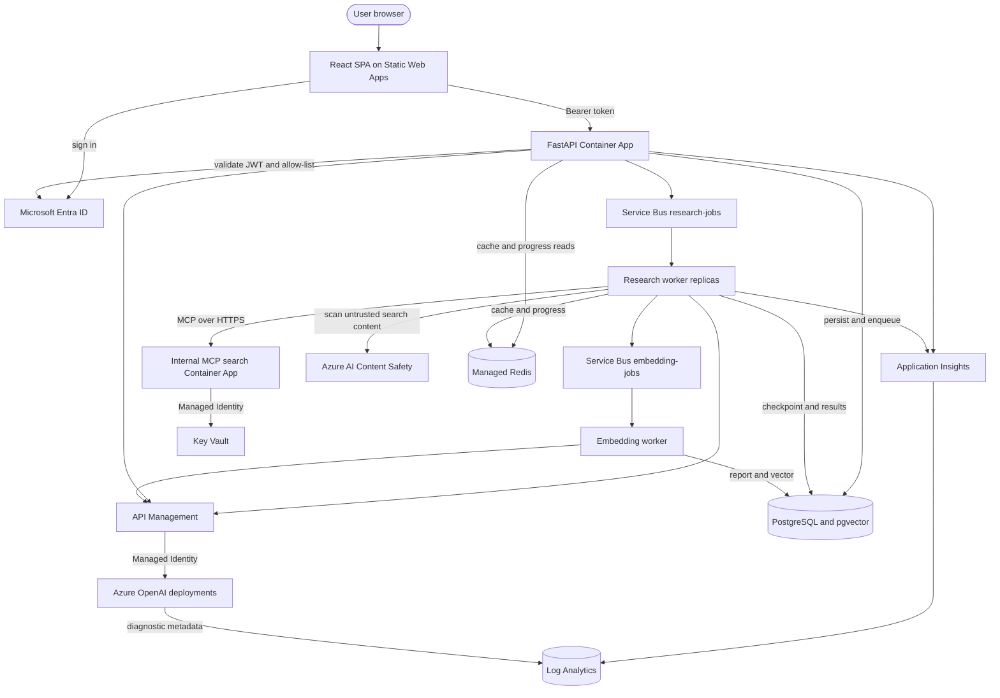

# Chapter 20: What Production-Ready Means

Stock Research Assistant ends as a working, production-shaped system. Those words are intentionally not “production-ready.” It has durable jobs, independently scaled workers, identities instead of most secrets, deterministic controls around model judgment, traceable execution, and a coherent user interface. It also lacks versioned infrastructure, complete automated tests, service-level objectives, disaster-recovery evidence, and a measured capacity envelope.

The difference is not modesty. It is an engineering definition:

> Production readiness is an evidence-backed claim about a system operating under expected load, failure, security, cost, and recovery conditions.

This chapter makes that claim testable. It walks one request through every boundary, scores the resulting system, names the remaining risks, and turns the project's incidents into operating principles. It adds no new service. The work is to understand the system that now exists.

> **Chapter snapshot**
> - **Starting point:** The reader now has a working end-to-end system with durable jobs, multi-agent execution, guardrails, observability, scaling evidence, and a coherent UI.
> - **Focus in this chapter:** Assess the whole system with evidence, score readiness, and define the remaining gates to production.
> - **Finished repository:** Application source is present under `frontend/` and `backend/`. Full reproducible cloud infrastructure, database migrations, sanitized environment templates, and curated tags for these later chapters are still missing.
> - **Coming next:** The book concludes here. Further work begins from the readiness gaps and optional extension points, not from another prescribed chapter.

## What This Chapter Concludes

The final chapter adds no component. It makes a readiness argument from four views of the system:

- A complete request walkthrough with responsibility at every hop.
- A scorecard whose ratings cite observable evidence and missing evidence.
- A risk register ordered by user and operational impact.
- A cost model based on categories and usage drivers, not fabricated prices.
- Evidence gates that distinguish this learning deployment from a production launch.

The conclusion is intentionally mixed. Core behavior is demonstrated, several boundaries are production-shaped, and major operating guarantees remain partial or unproven. A single readiness percentage would hide that asymmetry.

## Evidence Model

The assessment separates three forms of evidence:

- **Repository evidence:** current code or configuration in version control.
- **Runtime evidence:** a captured behavior from a deployed environment.
- **Missing evidence:** a claim that still needs a test or artifact.

This assessment is time-sensitive. Role assignments, model deployments, package versions, prices, quotas, and service behavior change. Re-run checks for the environment you intend to release.

Stock Research Assistant remains an educational stock-research system. It must not place trades, promise returns, or present generated output as financial advice.

## Azure Resources in the Final System

Chapter 20 activates no new resource. It brings the responsibilities accumulated across the book into one operating view:

| Responsibility | Active Azure resource |
|---|---|
| Host the browser application | Azure Static Web Apps |
| Authenticate users and workloads | Microsoft Entra ID and Managed Identity |
| Host API, research workers, embedding worker, and MCP search | Azure Container Apps |
| Buffer research and embedding work | Azure Service Bus |
| Store durable jobs, checkpoints, reports, and vectors | Azure Database for PostgreSQL with pgvector |
| Store short-lived cache and progress state | Azure Managed Redis |
| Mediate model access | Azure API Management and Azure OpenAI |
| Scan retrieved documents | Azure AI Content Safety |
| Store the search-provider secret | Azure Key Vault |
| Collect application and service telemetry | Application Insights and Log Analytics |

## The Final Architecture

The canonical final topology separates user interaction, durable orchestration, agent execution, capability services, state, model access, safety, and telemetry:



No diagram can show every control. The browser's job ID, queue idempotency, graph retry policy, prompt-shield boundary, and scaler identity are behavioral properties that require tests and inspection.

## Lifecycle of One Multi-Ticker Request

### Authentication and Input

The browser signs the user in with Microsoft Entra ID. Before each API call, MSAL attempts silent token acquisition and falls back to an interactive flow only when required. The user selects US or India, enters comma-separated tickers, and receives immediate shape validation.

The browser check is a usability boundary, not an authorization or market-data guarantee. The API independently requires a valid bearer token and applies its allow-list policy.

### Durable Job Creation

`POST /research` creates one `job_id` for the user action and one `TickerJob` row per ticker. It stamps the ID on the current API span. For each ticker, the API checks the daily Redis cache. A hit is persisted as done immediately; a miss is persisted as queued and sent to Service Bus.

This ordering gives the system a durable record before asynchronous work starts. The API returns quickly rather than holding an HTTP connection across a graph run.

### Queue Delivery and Scaling

Service Bus buffers each uncached ticker independently. The research worker scales on queue depth using a system-assigned identity. Historical project notes report a 1-to-8-to-1 cycle, including cooldown. The raw observations are not retained in this workspace, and the result does not prove the full capacity envelope.

When a worker receives a message, it derives queue-wait time from the enqueue timestamp and opens a `process_ticker` span. It checks the database before processing so a redelivered message for an already completed ticker does not repeat expensive work.

### Checkpointed Agent Execution

The worker invokes the six-node LangGraph pipeline:

```text
Fundamentals -----\
Technical ---------> Risk -> Devil's Advocate -> Decision
News -------------/
```

Fundamentals, Technical, and News form the parallel fan-out. Risk waits at fan-in. Devil's Advocate develops counter-evidence. Decision combines the evidence, deterministic valuation, and hard-stop results into a recommendation and structured report.

Each node has an attached retry policy and a local degradation path. The current broad node catches turn agent exceptions into degraded state before the graph policy can retry them, so retry-before-degradation remains an implementation gap. PostgreSQL checkpoints use a thread ID composed from job and ticker, allowing a restarted worker to resume from a completed graph super-step. Redis progress keys expose partial node output while a job runs.

The market-data helpers remain synchronous libraries, but async nodes call them through `asyncio.to_thread()`. That boundary produced the measured 98.9-second to 41.4-second improvement in Chapter 17.

### Tools, Search, and Guardrails

Deterministic market-data and valuation tools return structured values. The model harness controls tool calls and limits. Web search crosses a separate MCP service reached through internal HTTPS. That service owns the Tavily secret and retrieves it from Key Vault using its Managed Identity.

Search results are untrusted third-party content. Prompt Shields scans them at the ingestion boundary before the text reaches an agent. This control does not make arbitrary web content true; it targets indirect prompt injection. Source quality, freshness, and factual consistency remain research-quality concerns.

### Model Access and Usage

Model and embedding requests pass through API Management to Azure OpenAI. API Management authenticates upstream with Managed Identity. The application records per-job token usage and an estimated model cost field, while Azure diagnostics provide service-side request metadata.

The estimate must be interpreted against the pricing assumptions in code and current provider prices. It is not a substitute for billing data.

### Persistence and Semantic Memory

The research worker writes the structured result and terminal status to PostgreSQL and caches the daily result in Redis. It sends report text to a separate embedding queue. The embedding worker creates a vector and persists a `ResearchReport` for semantic search.

Separating embedding keeps report completion from waiting on a secondary indexing concern. It also means a completed user report and an available semantic-memory entry are not necessarily simultaneous.

### Polling, Results, and Support

The frontend polls `GET /research/{job_id}`. Polling continues while any ticker is nonterminal. Once all are done or failed, the response includes summaries, structured decisions, and `ticker_status`.

The UI renders recommendation, valuation scenarios, hard stops, and Devil's Advocate output. A failed ticker receives its own card rather than poisoning the entire multi-ticker result. The visible, copyable job ID connects the user's report to telemetry and database state.

The History tab queries completed `TickerJob` rows through `GET /reports` and reuses the same detail endpoint and report renderer.

The strongest end-to-end evidence is one uncached two-ticker request with artifacts at every boundary:

- Authenticated API request and returned job ID.
- Two durable job rows.
- Queue messages and worker receipt.
- Agent spans and checkpoint thread IDs.
- Tool/search safety path when search is selected.
- Terminal per-ticker results.
- Embedding record or a documented indexing delay/failure.
- Browser report and a telemetry query using the copied ID.

If one boundary cannot be evidenced, it remains a readiness gap rather than an assumption.

## Readiness Scorecard

Ratings use four states: **Demonstrated**, **Partial**, **Unproven**, and **Not implemented**.

| Area | Rating | Evidence | What blocks a stronger rating |
|---|---|---|---|
| Core user journey | Partial | Authenticated submit, polling, structured results, history | Per-user report ownership and an automated end-to-end regression suite |
| Durable asynchronous work | Demonstrated | Database rows, Service Bus, idempotent completed-message check | Broader poison-message and dead-letter operations |
| Agent orchestration | Partial | Six-node graph, fan-out/fan-in, and degradation | Agent failures currently bypass attached retry policies; systematic output-quality evaluation |
| Checkpoint recovery | Partial | Persisted checkpointer and reported mid-job experiment | Retained recovery artifact and repeated testing under deployments and schema changes |
| Identity and secrets | Partial | Managed Identity for Azure services; Key Vault for Tavily | Complete reproducible role definitions and network isolation |
| Guardrails | Partial | Prompt Shields at web ingress; PII scrub on semantic search | Broader data classification, egress policy, adversarial evaluation |
| Observability | Partial | Correlated API/worker spans, per-agent timing/tokens, model diagnostics | Alerts, SLOs, queue trace propagation, unresolved HTTPX span gap |
| Worker autoscaling | Partial | Historical notes report a 1-to-8-to-1 queue-depth cycle | Retained raw observations plus sustained-load, quota, saturation, and cost tests |
| API and MCP autoscaling | Unproven | Platform rules configured; MCP worked at one replica | Captured multi-replica load tests |
| Data lifecycle | Partial | PostgreSQL, Redis TTLs, history, vectors | Formal retention, deletion, backup, restore, and migration policies |
| Deployment repeatability | Unproven | Container projects and app source exist | Infrastructure as code, pinned environment templates, release automation |
| Test coverage | Partial | Focused experiment scripts and manual live checks | Cohesive unit, integration, contract, UI, and load suites |
| Accessibility and UX | Partial | Explicit states, differentiated errors, restrained UI | Automated accessibility and responsive visual regression evidence |
| Disaster recovery | Not implemented | No demonstrated regional recovery path | RPO/RTO, backups, restore drills, regional design |
| Financial safety | Partial | Research-only positioning and deterministic hard stops | Formal disclosures, suitability boundaries, model-risk governance |

The scorecard is not averaged into a percentage. A polished percentage would hide blockers with unequal severity. Disaster recovery and deployment repeatability cannot be offset by a strong UI.

## Principal Risks

### Reproducibility Risk

The largest engineering gap is not an agent feature. The repository lacks parameterized infrastructure as code, versioned database migrations, sanitized environment templates, and chapter tags. A new team cannot recreate the verified environment from source with confidence.

### Model and Data Quality Risk

Market data can be delayed, missing, or structurally inconsistent. Search content can be stale or misleading even when it is not a prompt injection. Model output can be confident and wrong. Deterministic tools and dissent improve the decision process but do not certify correctness.

### Operational Risk

No alert automatically watches queue age, terminal failure rate, trace absence, model throttling, or embedding backlog. The system is diagnosable after someone notices a problem; it is not yet proactively operated.

### Security and Privacy Risk

Identity-based access protects the routes, but object-level authorization is missing: `TickerJob` has no owner field, every allow-listed user can enumerate completed reports, and any known job ID can be retrieved. This chapter version also lacks full network isolation. Ownership checks, role scope, telemetry access, secret retrieval, failure summaries, and telemetry attributes all require explicit policy and verification.

### Capacity and Dependency Risk

Worker scale-out increases pressure on model quotas, Tavily budget, market-data sources, PostgreSQL connections, Redis, Content Safety, and API Management. The maximum replica count limits the blast radius but does not prove every dependency remains healthy at that limit.

### Recovery Risk

Checkpointing recovers a graph execution; it is not database disaster recovery. There is no demonstrated restore of PostgreSQL, Redis-independent recovery procedure, regional failover, or complete rehydration of semantic memory.

## Cost Categories

Exact prices are deliberately omitted. They vary by region, date, tier, reservation, and usage. A responsible estimate should retrieve current prices and combine them with measured demand.

| Category | Primary driver | Control lever |
|---|---|---|
| Azure OpenAI inference | Prompt and completion tokens by model | Shorter context, model routing, cache hits, tool discipline |
| Embeddings | Reports indexed and text length | Batch policy, deduplication, selective indexing |
| API Management | Requests and selected tier | Caching, tier choice, direct-vs-gateway tradeoff |
| Container Apps | Replica CPU/memory time and minimum replicas | Scale floor, limits, processing latency, cooldown |
| Service Bus | Operations and selected messaging tier | Batching, message size, retry policy |
| PostgreSQL | Compute tier, storage, backup, connections | Right-sizing, pooling, retention, indexing |
| Managed Redis | Cache tier and capacity | TTLs, eviction policy, value size |
| Content Safety | Documents or requests scanned | Scan at the correct trust boundary, batch where supported |
| Search provider | Search calls and result volume | Model-selected calls, caching, query budgets |
| Application Insights and Log Analytics | Telemetry ingestion and retention | Sampling, attribute discipline, retention |
| Static hosting and data transfer | Builds, requests, outbound traffic | Asset optimization and cache headers |
| Engineering operations | On-call, maintenance, incident response | Automation, runbooks, tests, simpler topology |

A useful unit model is cost per completed ticker, split into cache hits and misses. Include failed attempts and retries; excluding them makes reliability problems disappear from the financial model.

## Lessons From the Build

### Verify Behavior, Not Command Success

Diagnostic settings reported success without producing the intended destination. A scale-rule update reported success while dropping its identity. A deployment completed while an older worker image still ran. Every one of these incidents was found by inspecting resulting state or behavior.

### Draw Boundaries Honestly

The queue separated API availability from long work. The MCP service separated search ownership from worker lifecycle. The embedding queue separated completion from indexing. Observability then revealed where automatic trace continuity stopped. Architecture improved when boundaries were named rather than hidden.

### Concurrency Requires Nonblocking Implementations

Parallel graph edges did not guarantee parallel progress. Synchronous market-data calls froze the event loop until `asyncio.to_thread()` moved them across an execution boundary. Measure overlap; do not infer it from a diagram.

### Durable State and Idempotency Belong Together

Queues redeliver. Checkpoints resume. Workers restart. Durable status without idempotent checks can repeat costly model and search calls. Idempotency without durable state cannot know what already succeeded.

### Agent Judgment Needs Deterministic Counterweights

Valuation and hard-stop tools make important computations inspectable. Devil's Advocate makes dissent structurally unavoidable. Neither eliminates model risk, but both create evidence a reviewer can challenge.

### Product Design Includes Operations

A copyable job ID, explicit per-ticker failure, and differentiated auth errors are user features and operational controls at the same time. The best polish reduced ambiguity.

## Evidence Required for Production

A future Stock Research Assistant release should not be called production-ready without evidence for these conditions:

1. Reproducible infrastructure and database migrations from an empty subscription.
2. Automated unit, contract, integration, UI, recovery, and bounded load tests.
3. Defined SLOs for job success, queue wait, and completion latency with alerts.
4. Backup and restore drills with stated RPO and RTO.
5. Per-user report ownership, object-level authorization tests, threat modeling, least-privilege review, network design, and data-retention policy.
6. Model-quality evaluation using representative US and Indian ticker sets.
7. Capacity tests that include downstream quotas and connection pools.
8. Current cost estimate and budget alerts based on measured usage.
9. User-safe error taxonomy and incident runbooks keyed by job ID.
10. Formal product language that prevents research output from being mistaken for advice or automated trading.

## Extensions

The system now has several clean extension points:

- **Progress delivery:** Add Server-Sent Events or WebSockets while retaining durable polling as a recovery path.
- **Evaluation:** Build a versioned dataset of research cases and grade factuality, citation support, recommendation stability, and tool use.
- **Portfolio context:** Add holdings and exposure analysis as a separate domain service, not hidden prompt context.
- **Source provenance:** Attach citations and retrieval timestamps to claims in the final report.
- **Human review:** Route high-risk or hard-stop cases to an approval queue.
- **Model routing:** Use smaller models for classification and extraction, reserving stronger models for synthesis.
- **Operational automation:** Generate dashboards, alerts, and runbooks from the same job and node dimensions already captured.
- **Infrastructure:** Encode Azure resources, identities, role scopes, and scale rules in reviewed infrastructure as code.
- **Recovery:** Add backup policy, restore tests, and an explicit semantic-index rebuild procedure.
- **Regional support:** Make market calendars, identifiers, currencies, and data sources pluggable rather than adding symbol exceptions.

Each extension should begin with an observable user or operator outcome. More agents are not automatically a better system.

> **Production Lens:** The system is production-shaped because its responsibilities, identities, durable state, safety controls, and operational signals have explicit boundaries. It is not production-ready because repeatable infrastructure, migrations, comprehensive tests, service-level objectives, capacity evidence, and recovery drills are still missing. Those gaps are release conditions, not optional polish.

## Read the Chapter Code

The final system is larger than one chapter excerpt. These current workspace paths reveal its main runtime boundaries:

| File | What to inspect |
|---|---|
| `frontend/src/App.jsx` | Authentication, submission, polling, history, and visible correlation |
| `backend/api/main.py` | Authorization, durable job creation, queue publication, status, and history |
| `backend/worker/worker.py` | Queue consumption, idempotency, graph execution, tracing, and result persistence |
| `backend/worker/agents/graph.py` | Six-node orchestration, retries, degradation, and decision flow |
| `backend/worker/tools/web_search.py` | MCP search and the untrusted-document guardrail boundary |
| `backend/embed-worker/embed_worker.py` | Asynchronous report embedding and semantic-memory persistence |

## Run This Stage

This is the finished system. Getting it running for real means provisioning every resource in the table above; `chapter-20-complete` is the tag that exercises all of them.

- **Repository tag:** `chapter-20-complete`.
- **Azure resources:** everything in the table above. `infra/params/chapter-20.json` turns on all of it in one deployment; see the stage-by-stage reference in [Azure Setup and Deployment](azure-setup.md) for what each part needs from you (your own registry images, Entra ID app, and Tavily key at minimum):

  ```bash
  git switch --detach chapter-20-complete
  ./infra/deploy.sh infra/params/chapter-20.json
  ```
- **Check it offline first**, with no Azure resource provisioned, to confirm the code itself is sound before spending anything:

  ```bash
  git switch --detach chapter-20-complete
  cd backend/api && uv sync && uv run python -m unittest discover -s tests -v
  cd ../worker && uv sync && uv run python -m unittest discover -s tests -v
  cd ../embed-worker && uv sync && uv run python -m unittest discover -s tests -v
  cd ../mcp-search && uv sync && uv run python -m unittest discover -s tests -v
  cd ../../frontend && npm install
  ```

- **Run the actual site**, once the resources above exist, in five terminals from `chapter-20-complete`:

  ```bash
  # terminal 1 — search service
  cd backend/mcp-search
  TAVILY_API_KEY=... uv run python search_server.py

  # terminal 2 — API
  cd backend/api
  DATABASE_URL=... SERVICEBUS_CONNECTION_STRING=... ALLOWED_ORIGIN=http://localhost:5173 \
  ENTRA_CLIENT_ID=... ENTRA_TENANT_ID=... ALLOWED_USERS=... \
  REDIS_URL=... APPLICATIONINSIGHTS_CONNECTION_STRING=... \
  uv run uvicorn main:app --reload

  # terminal 3 — research worker
  cd backend/worker
  DATABASE_URL=... SERVICEBUS_CONNECTION_STRING=... TAVILY_API_KEY=... \
  APIM_BASE_URL=... APIM_SUBSCRIPTION_KEY=... APIM_API_VERSION=... \
  REDIS_URL=... CONTENT_SAFETY_ENDPOINT=... APPLICATIONINSIGHTS_CONNECTION_STRING=... \
  uv run python worker.py

  # terminal 4 — embedding worker
  cd backend/embed-worker
  DATABASE_URL=... SERVICEBUS_CONNECTION_STRING=... uv run python embed_worker.py

  # terminal 5 — frontend
  cd frontend
  VITE_API_URL=http://localhost:8000 VITE_ENTRA_CLIENT_ID=... VITE_ENTRA_TENANT_ID=... VITE_ENTRA_API_SCOPE=... \
  npm run dev
  ```

  Sign in, submit a ticker, and watch the full path: the API queues the job, the worker runs the six-node graph and search guardrails, the embed-worker indexes the finished report, and the frontend polls through to a structured decision with history.

  This is deliberately more assembly than any single chapter needed — it is the sum of every stage's resources and variables, which is also this chapter's point about what "production-ready" actually costs to stand up.

## Conclusion

Stock Research Assistant begins with a text field and a fake delay. It ends with a distributed research application whose long work is durable, whose agents have explicit roles, whose failures can degrade rather than erase all value, whose identities are scoped, whose untrusted search content crosses a guardrail, whose latency can be explained, and whose reports can be traced back to a job.

The most important result is not the number of Azure services or agents. It is the habit repeated across the build: state a boundary, create the smallest evidence that could disprove the design, preserve the failure when it teaches something, and revise the system based on what actually happened.

That habit is what makes Stock Research Assistant production-shaped. Applying it to the unresolved gates is what would make a future release production-ready.