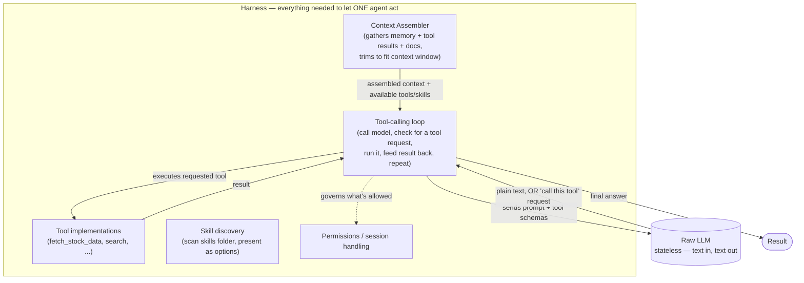
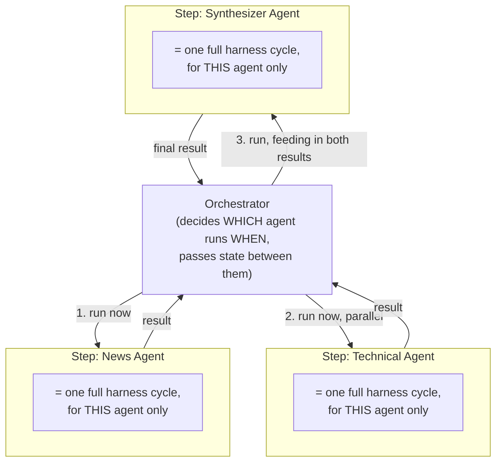
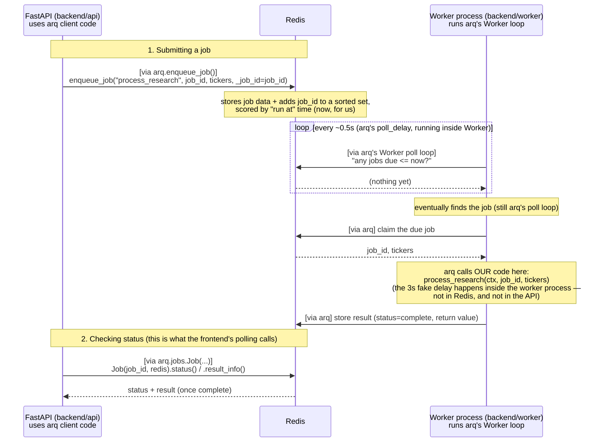
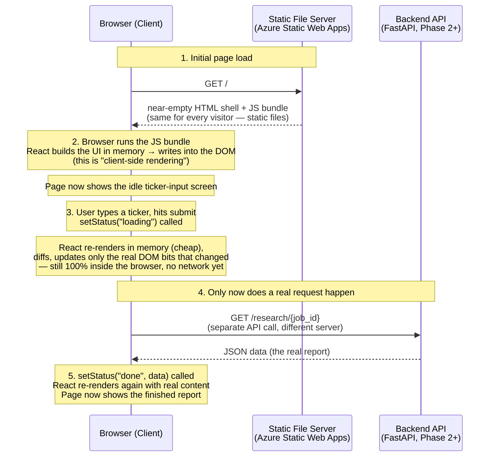

# Concepts Learned — Running Notes

Personal glossary of concepts explained during tutoring sessions, in plain language. Updated as new ground is covered — read `progress.md` for phase/status, this file for "what does X actually mean and why."

---

## Phase 4 — First agent (prep — build not started yet)

### Harness vs. Orchestrator — related, not the same
- **Harness** = the whole surrounding application that lets a raw model (stateless — text in, text out, remembers nothing on its own) actually act: the tool-calling loop, tool implementations, the Context Assembler, Skill discovery, permissions, session/UI handling. Claude Code (this very tool) is itself a harness around the raw Claude model.
- **Orchestrator** = a narrower piece responsible only for sequencing *multiple* steps/agents — deciding what runs when, in what order, parallel or sequential, and how outputs feed forward (`buynobuy`'s LangGraph `StateGraph` is a real example). One agent needs zero orchestration (nothing to sequence) — orchestration only becomes relevant once there's more than one thing to coordinate.
- **The key relationship, not obvious at first**: the orchestrator does not reimplement context assembly / tool-calling / skill discovery itself. For each agent it decides to invoke, it calls into the *same* harness machinery a single-agent setup would use — the orchestrator's only real job is *which* agent runs *when*, and what state to pass between them. Kitchen analogy: the harness is the kitchen (oven, prep counters, recipe cards); the orchestrator is the head chef deciding which dish gets made in what order — the chef doesn't personally chop vegetables, the kitchen's equipment does that for each step the chef calls for.
- Mapped onto our own roadmap: Phase 4 = one agent, full harness (loop, tools, Context Assembler, Skills), no orchestrator needed. Phase 5 = an orchestrator added *on top*, calling that same harness cycle once per agent in its graph.





Each "harness cycle" box in the second diagram is literally the whole first diagram, run once per agent — the orchestrator never bypasses it or reimplements it.

### Harness ≠ raw model API, and "Skills" is a harness-level feature, not a model-level one
- Skills-loading (auto-discovering a `SKILL.md`-style folder, presenting it to the model) lives in **Anthropic's own harness products** (Claude Code, Claude Desktop, the Agent SDK) — not in the raw Claude model or its plain API. Calling the raw Messages API directly gives you no such mechanism; you'd build it yourself.
- Consequence for us: whatever model we deploy via Azure AI Foundry won't come with Skills-loading "for free," regardless of which model it is — **we are the harness** for our own worker, so we build our own (smaller) version of that same idea: a markdown file with instructions, our own code that reads it and presents it as an available option in whatever tool-calling format that model's API expects.
- OpenAI (and most providers) share the same *foundational* mechanism — function/tool calling — but not a feature specifically named "Skills" with the same auto-discovery convention, as far as confidently known; product features evolve, worth verifying current state rather than assuming.

---

## Phase 3 — MCP tools + real data

### Direct API call design — yfinance, explicit market selection
- `fetch_stock_data(ticker, market)` is a genuine "direct API call": our own code always calls it deterministically, no LLM/MCP involved — appropriate because there's no real judgment call about *whether* to fetch price data, only *which* market to check.
- Explicit `market` parameter (US/India), not auto-detection/fallback across regions — a deliberate choice over an initial fallback-chain design: avoids ambiguity (a symbol could coincidentally exist in both markets with different meanings) and fails clearly on a mismatch (`"RELIANCE not found on US markets"`) instead of silently guessing wrong data.
- `yfinance` reliability note: free, but unofficial (reverse-engineers Yahoo's own site) — no SLA, no documented rate limits, real risk of breaking or being throttled at scale, especially from a shared cloud IP. Accepted as a starting choice; revisit for real in Phase 7 if it becomes a practical problem.

### Fan-out / fan-in + cache-aside — per-ticker caching design
- **The insight**: "one job = one queue message = process the whole ticker list sequentially in one function call" means scaling worker replicas wouldn't actually speed up a single multi-ticker request — everything still happens in one place. Splitting into "one message per ticker" lets independent worker replicas genuinely process tickers in parallel — this is a real, standard distributed-systems pattern: **fan-out** (one request → many independent units of work) then **fan-in** (many results → one aggregated response).
- **Data model shift**: from one row per job to one row per `(job_id, ticker)` pair — the `job_id` the frontend polls is now a *group key*, not a single row's identity. `GET /research/{job_id}` aggregates: not `"done"` until every child row is `"done"`.
- **Cache-aside pattern**: check the cache before doing expensive work; on a miss, do the work then populate the cache for next time. Checking happens in the API (skip the queue entirely on a hit — bigger payoff than only skipping computation), writing happens in the worker (it's the one that has the fresh result). Both sides must agree on the exact same cache key format — same "shared contract" idea as the Service Bus message shape.
- **TTL choice**: expiring at midnight (not "24 hours from now") matters when the requirement is literally "today" — a request at 11:59pm and another at 12:01am should not share a cache entry despite <24h passing. Small extra code (compute seconds-until-midnight) worth it when it's what was actually asked for.
- 🏭 Real-world nuance, not just theory: after building this, we found actual delivery-latency inconsistency between two independently-sent Service Bus messages sent moments apart (one processes in seconds, the other sometimes 30-45s+, despite an actively-listening worker). Tried the obvious fix (reuse one persistent sender instead of one-per-message) — didn't resolve it; root cause still open. Not blocking in practice, because the frontend's polling design already tolerates arbitrary delay gracefully — a good example of how a system can be "resilient by accident" from earlier design choices, and a real motivating case for Phase 7 (Resilience) if it needs deeper investigation later.

### TLS — basics (deep dive on handshakes/PKI deferred, see progress.md open questions)
- Protects data *in transit*, not at rest — encrypts while traveling over the network, not once stored.
- Not "an SDK encrypts your data" — the SDK (redis client, psycopg, browser `fetch`) just requests a TLS connection; the actual encryption is done transparently by a lower-level network/TLS library (OS/language's TLS stack, e.g. OpenSSL), invisible to application code on both ends.
- Handshake happens first: client + server briefly use public-key crypto to agree on a temporary shared secret, without ever transmitting that secret somewhere an eavesdropper could grab it. After that, every byte is encrypted at the sender's network stack right before transmission, decrypted at the receiver's right after arrival — app code only ever sees plain data.
- Public-key verification confirmed correct, refined: standard TLS is **one-way** — it verifies the *server's* identity (via its certificate + CA signature + hostname match + proof it holds the matching private key). It does **not** verify the client's identity — that's a separate step (our Redis access key, sent after the TLS tunnel is already up). Mutual TLS (both sides present certificates) exists but isn't what we're using.

### MCP mechanics — registration, handshake, and the LLM's real relationship to it
- **"Registration" is two different things**: inside the server, `@mcp.tool()` just appends a function into that `MCPServer` instance's own in-memory registry — nothing external contacted. The *client* finding out what's there is a separate step, `list_tools()`, over the actual connection. There's no global MCP directory servers auto-publish into — a client has to be explicitly told how to reach a given server (our `StdioServerParameters` *is* that explicit wiring).
- **Two transport patterns, matched to different scenarios**: **stdio** — the client *starts* the server as a subprocess, right when needed; standard for local, ephemeral, same-machine tools (what we built, Option A). **HTTP** — the server is already running independently, like any normal web service; the client just connects, nothing to launch (this is Option B, deferred to Phase 11, and matches how most people picture "a server" intuitively).
- **The handshake** (`initialize()`): client sends its protocol version + capabilities + identity; server responds with its own (negotiating a mutually compatible version); client sends `initialized` to confirm. Same negotiate-capabilities-first shape as the TLS handshake covered earlier.
- **The LLM never speaks MCP directly** — this is the most commonly misunderstood part. MCP is a protocol between *application code* and a tool-providing server; the LLM is not a party to it. Real flow: app calls `list_tools()` → app *translates* those schemas into the LLM provider's own tool-calling format (Anthropic's/OpenAI's, different shapes) → app includes that translated list in the same API call as the prompt → LLM's response can include a structured "call tool X" block → app intercepts that and *only then* calls the real `call_tool()` → app feeds the result back to the LLM as a new message. MCP standardizes discovery + execution; it does not change how the LLM itself is invoked — that translation is always the app's job. This whole flow is Phase 4's "LLM tool-calling loop"; Phase 3 only proved the plumbing (steps 1 and the execution mechanism), with no LLM in the loop yet.
- **Client capabilities (sampling/elicitation/roots) are NOT dynamically discovered like tools are** — they're a small, fixed, spec-defined vocabulary every MCP implementation already knows (e.g. `elicitation/create` is a fixed method name, not something a server "figures out"). The capability exchange during handshake is a yes/no checklist ("do you support elicitation?"), not a listing of custom function names. A **dispatcher** (SDK-internal) routes an incoming fixed-name request to whichever **callback** (a function handed over in advance, to be run later by someone else — like leaving your number with a restaurant host) the application registered for that category. No LLM or dynamic mapping involved in the routing itself.
- **Tools vs. direct API call vs. Skill, precise definitions** (recap): a "tool"/"function call" means an LLM decides at runtime to invoke it. A "direct API call" (`fetch_stock_data`) is called deterministically by our own code — appropriate when there's no real judgment call about *whether* to fetch. A "Skill" is a reusable capability module loadable by any agent — a third, distinct concept from both.

### `flag_risk_factors` Skill — line by line
- `flags = []` — classic accumulator pattern: build a result by appending as issues are found, same shape as the summary-list building done with `.map()` earlier on the frontend, just imperative instead of functional here.
- `.get("price")`, not `["price"]` — returns `None` on a missing key instead of crashing; defensive, since `fetch_stock_data`'s output isn't guaranteed to have every field for every ticker (some stocks genuinely lack P/E data on Yahoo).
- 52-week-low check: `(price - low) / (high - low)` computes *where in the yearly range the current price sits*, as a fraction from 0 (exactly at the low) to 1 (exactly at the high). Below `0.1` (bottom 10% of the range) is flagged as "near its low." The `high > low` guard exists purely to avoid a divide-by-zero.
- P/E check: a *negative* P/E is flagged separately (the company is currently losing money). A *very high positive* P/E (threshold `40`, a reasonable but somewhat arbitrary cutoff) is flagged as "richly valued" — priced in expectation of a lot of future growth, riskier if that growth doesn't show up.
- **Why this counts as a "Skill" despite being invoked exactly like a direct call**: the invocation mechanism (our code calls it deterministically) is identical to `fetch_stock_data`'s. What makes it a *Skill* specifically is being a self-contained, *named, reusable* unit of capability logic that a different agent could load later, independent of how it's invoked. The tool/direct-call/Skill distinction is about invocation; Skill-*ness* is about being packaged as a standalone reusable module.
- **Important caveat the user surfaced**: this is the "plain reusable module" meaning of Skill (matching `project-structure.md`'s own definition) — not the fuller "Claude Skills" meaning (an LLM discovers and *chooses* to apply packaged, judgment-requiring knowledge), which is the actual reason Skills became a notable concept in the first place. This one has no genuine ambiguity for an LLM to add value on — fixed numeric thresholds, always run, never optional. A true LLM-discoverable Skill (something with real interpretive judgment) is a committed Phase 4 build, not retrofitted onto this one.

---

## Phase 2 — Backend

### FastAPI + Uvicorn + uv — who does what
- **FastAPI**: a Python library for *defining* API endpoints (routes, request/response shapes). It does not run a server itself.
- **Uvicorn**: the actual server process that runs your FastAPI code and listens for real HTTP requests — same relationship as React needing a browser to execute it. FastAPI = the "what," Uvicorn = "what runs it."
- **uv**: a fast, modern all-in-one tool for Python projects — `uv init` scaffolds `pyproject.toml` (Python's `package.json` equivalent), `uv add <pkg>` installs + records a dependency (and creates an isolated `.venv` so packages don't clash with the rest of the machine), `uv run <cmd>` runs a command inside that isolated environment without manually "activating" it.
- `@app.get("/")` is a decorator — "when a GET request hits `/`, run this function and return its result."
- `/docs` — FastAPI auto-generates an interactive API documentation page (OpenAPI spec) from your code, for free.
- 🏭 Production lens: `/docs`/OpenAPI isn't a toy — real teams use it directly, often to auto-generate client SDKs or feed API gateways. Not a simplification.

### Redis + arq — what a "queue" physically is, and how the worker finds new jobs
- Redis is just a very fast in-memory data store — it doesn't know what "a job" is on its own. `arq` is the Python convention/library that uses Redis specifically as a job queue: it defines how "run function X with these arguments" gets stored as data, and provides the enqueue/dequeue logic so neither side has to hand-roll it.
- **The actual mechanism is polling, not a push notification** — worth being precise here since it's easy to assume otherwise. `enqueue_job` stores the job at a key and adds its ID into a Redis **sorted set**, scored by the time it should run (usually "now," but this scoring is also what enables arq's delayed/cron job support). The worker loop asks Redis "give me everything due ≤ now," and if there's nothing, waits a short fixed interval (~0.5s) before asking again.
- Redis does have true push-capable primitives (`BLPOP`, Pub/Sub) but they only give strict FIFO delivery, which can't express "only what's due now" — the sorted-set + fast-poll design trades a true instant push for that scheduling flexibility. In practice sub-second polling feels instant for anything but very fast tasks.
- **`WorkerSettings.functions = [process_research]` is an allow-list**, and it's read *externally*, not called from within `worker.py` itself. Running `arq worker.WorkerSettings` on the command line makes arq's CLI import the `worker` module and `getattr(module, "WorkerSettings")` — a plain lookup-by-name, not a function call. Internally it then reads `.functions` (what it's allowed to run) and `.redis_settings` (which Redis to connect to) off that class. If a job requests a function name not in that list, the worker rejects it.
- `_job_id=job_id` when enqueueing forces arq to use *our* generated ID instead of a random one it would otherwise assign — needed so the ID we return to the API caller is the same one we look up later via `Job(job_id, redis)`.
- `job.status()` (queued/running/complete/not_found) and `job.result_info()` (non-blocking — returns immediately, `None` if not finished) are how `GET /research/{job_id}` checks in on a job without ever blocking the request while waiting.

### Block diagram — API, Redis, and Worker interaction

**Important precision before reading this diagram:** arq is not a separate running process — it doesn't get its own lane. It's a Python library loaded *inside* both the API process and the Worker process; it's the code doing the actual Redis-talking on each side. Every `arq.___` label below marks code from that library running inside whichever process it's attached to, not a fourth independent actor.



- arq appears in **both** lanes because it's imported and used by both processes — as a client (enqueue + status-check) in the API, and as the actual worker/poll-loop engine in the Worker process. Same library, two different roles depending on which process is using it.
- The one thing that's genuinely *ours*, not arq's: `process_research` itself — arq's job is purely to get that function called with the right arguments at the right time; what happens inside it is entirely our own code.
- The API and the worker never talk to each other directly — every arrow touches Redis, never crosses API↔Worker. That's the decoupling benefit from earlier: neither process needs to know the other exists, when it started, or where it's running.
- The `loop` box is the polling mechanism from above, made visual — most iterations find nothing, which is normal and cheap.

### CORS — why the browser blocks cross-origin API calls by default
- The concrete risk: cookies are attached by the browser based on *which domain* is being called, not *which page* initiated the call. So if you're logged into a real site and a malicious page is open in another tab, that malicious page's JS can call the real site's API and the browser will still attach your real session cookie — making it look like a legitimate request from you.
- CORS's specific job: even though the request may still reach the server, the browser blocks the malicious page's JS from **reading the response** unless the server's `Access-Control-Allow-Origin` header explicitly names that origin. (Precision note: CORS mainly protects response confidentiality — preventing the request's *side effects* from happening at all is a different, complementary defense, CSRF tokens, not CORS's job.)
- Diagram — genuine origin (allowed) vs. malicious origin (blocked), same API, same valid cookie in both cases; the only difference is which origin sent the request:

```
mybank.com (Genuine JS)          Browser (CORS Enforcer)              mybank.com API
     |                               |                                      |
     |-- 1. fetch(mybank/balance) -->|                                      |
     |                               |-- 2. Request + Cookie -------------->|
     |                               |                                      | (Cookie valid)
     |                               |                                      | (Fetches balance)
     |                               |<- 3. Data: $500 ---------------------|
     |                               |      Headers:                        |
     |                               |      Allow-Origin: mybank.com        |
     |                               |                                      |
     |                               | [CORS Check: Initiator=mybank.com]   |
     |                               | [         Allow-Origin=mybank.com]   |
     |                               | [MATCH: PASS]                        |
     |                               |                                      |
     |<-- 4. Response ($500) --------|                                      |
     |                               |                                      |
 (Balance is displayed)


------------------------------------------------------------------------------------------


evil.com (Malicious JS)          Browser (CORS Enforcer)              mybank.com API
     |                               |                                      |
     |-- 1. fetch(mybank/balance) -->|                                      |
     |                               |-- 2. Request + Cookie -------------->|
     |                               |                                      | (Cookie valid)
     |                               |                                      | (Fetches balance)
     |                               |<- 3. Data: $500 ---------------------|
     |                               |      Headers:                        |
     |                               |      Allow-Origin: mybank.com        |
     |                               |                                      |
     |                               | [CORS Check: Initiator=evil.com  ]   |
     |                               | [         Allow-Origin=mybank.com]   |
     |                               | [MISMATCH: BLOCK RESPONSE]           |
     |                               |                                      |
     |<-- 4. CORS Error -------------|                                      |
     |    (Data discarded)           |                                      |
     |                               |                                      |
  (Cannot read $500)
```

- Where we stand today: no login/sessions exist yet in this project, so there's no real sensitive data at stake right now — but the browser enforces this unconditionally for every site regardless of whether *this specific app* currently has anything sensitive, since it can't know that in advance. `allow_origins=["http://localhost:5173"]` is required just to let our own frontend talk to our own backend; it'll become genuinely load-bearing once Phase 7 adds real auth/sessions.

### arq/Redis → Azure Service Bus — what changed and why
- Not just a config swap — a different SDK, different mental model. arq hid the receive loop and let you register named functions (`WorkerSettings.functions`); Service Bus has no such convenience. We write the receive loop ourselves (`async for msg in receiver:`), and messages are just plain JSON we design ourselves (`{"job_id", "tickers"}`).
- **Explicit acknowledgment is now visible, not hidden**: `receiver.complete_message(msg)` must be called after successfully processing, or Service Bus redelivers the message once its lock (1 minute, set at queue creation) expires. This is the same "at-least-once delivery" idea arq/Redis had, just no longer abstracted away — we now see and control the exact moment a message is considered "done."
- Least-privilege access: created two separate SAS policies on the queue (`send-only` for the API, `listen-only` for the worker) instead of handing both the full-manage root key — same trust-boundary principle as the CORS/VNet discussions earlier, applied to the queue.
- Verified in isolation before wiring into the real app: sent a message via a throwaway script, confirmed it actually landed using `az servicebus queue show`'s message count (not just "no errors") — same "prove the new piece works standalone" discipline as arq/Redis originally.
- 🏭 Real gotcha caught in testing, not just a lesson: Python buffers `print()` output when not attached to a terminal — exactly the situation inside a container. Output still happens, just delayed/batched in logs. Fixed with `ENV PYTHONUNBUFFERED=1` in the worker's Dockerfile — otherwise live container logs would appear to lag behind reality once deployed.

### Frontend ↔ real backend integration
- Replaced the fake `setTimeout` flow with a real `fetch(..., { method: 'POST' })` to `/research`, then a `setInterval`-based `pollStatus` that calls `GET /research/{job_id}` every second until `data.status === 'done'`, then `clearInterval` to stop — same polling concept discussed abstractly earlier ("who changes state to done"), now doing real work.
- Known simplification, flagged for later: the backend URL (`http://localhost:8000`) is hardcoded in the frontend right now. Needs to become a configurable value (env var) before deploying, since production will have a real Container Apps URL, not localhost.

---

## Phase 1 — Frontend

### Why React at all (vs. plain HTML/CSS/JS)
- We still write JSX (HTML-shaped) and CSS ourselves — React doesn't remove that.
- What it removes: **manually creating/removing/updating real DOM elements by hand** as data changes. In vanilla JS, keeping the page in sync with changing state means writing (and maintaining) a pile of "find element → show/hide/update it" code yourself — easy to forget a spot, easy to get out of sync.
- React's model instead: describe *what the UI should look like for the current state*; React figures out what changed and updates only that.
- Picked React specifically because our app's shape is a state machine (`idle → loading → done/error`), which is React's core specialty — not because "SPA = simple," SPA is just an app shape any framework (or vanilla JS) could build.

### The build step (JSX → real JS)
- Browsers never learned to read JSX (`<div>` mixed directly into JS) — it's not valid JavaScript.
- JSX is shorthand for `React.createElement(...)` calls, which *are* valid JS. The build step **transpiles** JSX → plain JS.
- It also **bundles** many source files into few files (browsers loading dozens of files one-by-one is slow/fragile), and **strips dev-only extras** (React's helpful console warnings) that a real visitor doesn't need.
- `npm run dev` = translates on the fly in memory, for local editing with instant reload.
- `npm run build` = writes the final transpiled+bundled+stripped result to a `dist/` folder as plain `.html`/`.js`/`.css` — these are **static files**: pre-made files a server just hands out as-is, no computation per request (like a PDF on a shelf, vs. a server computing a fresh response every time).
- This is not a tutorial simplification — production React apps ship through this exact same build step.

### Block diagram — React across client and server



- **Two different servers, not one**: the static file server only ever hands out the same fixed shell + JS bundle — it doesn't know or care about tickers. The backend API is the only one that ever sees a real ticker or returns real data. This split is why Phase 1 (frontend + fake mocked data) can be built and deployed entirely before Phase 2 (real backend) exists.
- **Steps 2–3 never touch the network** — rendering and re-rendering (idle → loading) happen purely in-browser, in memory. A network call only happens at step 4, and only because our code chose to make one.
- This is why the Phase 1 → Phase 2 swap works cleanly: build/deploy steps 1–3 fully with a fake job_id and fake polling, then later point step 4 at a real API — steps 1–3 don't change at all.

### Client-side rendering (CSR) — what plain React (via Vite) does
1. Server sends back a near-empty HTML shell (`<div id="root"></div>` + a `<script>` tag) — same shell to every visitor, regardless of what data they're after.
2. Browser downloads the JS bundle and **runs it** — that JS is your React code, and it builds the actual visible page into that empty div.
3. For *dynamic* data (e.g. a stock report): the server never bakes it into the shell. Instead, your running React code makes a **separate API call** (e.g. `GET /research/{job_id}`) after the page is already up, and updates the page once that data arrives. Page shell and real data arrive via two independent trips.

### State → UI mapping (no separate "store")
- State is just a plain variable: `const [status, setStatus] = useState("idle")`.
- The "mapping" from state to UI is just ordinary JS conditionals written directly inside the component function (`{status === "loading" && <p>Loading...</p>}`) — no registry or config file involved.
- Your component function **is** the mapping — React calls it again whenever state changes, and it returns what the UI should look like *right now*.

### Why re-running the function isn't slow
- Returning JSX doesn't touch the real page — it builds a small, cheap **in-memory JS object** describing desired UI (e.g. `{ type: "p", props: { children: "Loading..." } }`), same cost as building any plain object like `{ name: "Sam" }`.
- The expensive browser operation is touching the **real DOM** (layout/repaint) — React's diffing step exists to minimize exactly that, only updating what actually changed.
- So: cheap in-memory recompute happens often; expensive real-DOM writes happen only for the actual differences.

### Lists / dynamic data — where React actually saves real complexity
- For a small fixed number of branches (e.g. 4 status states), React's conditionals aren't meaningfully simpler than vanilla JS's — roughly a wash.
- The real win is **lists that grow/shrink** (e.g. a list of tickers). Vanilla JS requires manually clearing old DOM nodes and recreating new ones every time the array changes (forgetting to clear = duplicates piling up). React: `{tickers.map(t => <li key={t}>{t}</li>)}` — no manual node bookkeeping, React reconciles automatically.
- **The trigger is always explicit**: you never watch individual items for changes. You call `setTickers(newArray)` once whenever anything about the array changes, and React cascades the re-render through every component that depends on it (via props) — you don't wire that cascade yourself.
- **Important gotcha:** React only reacts to `setState` calls, not in-place mutation. `tickers.push(x)` → React never finds out, screen stays stale. Must build a *new* array/object (`setTickers([...tickers, x])`) — this is the actual signal React listens for, not smart change-detection.

### Vite vs. React — different layers, no overlap
- **React** runs *in the browser* — owns all runtime behavior (state, re-render, diff, DOM updates) covered elsewhere in this doc.
- **Vite** runs *on your machine* (dev) and *once at deploy* (build) — never runs in the browser, has zero involvement in state/re-render/diffing. Its job ends once code is delivered to the browser in runnable form; React takes over completely from there.
- Concretely: Vite serves/translates `main.jsx` (starts React) and `App.jsx` (your component) — JSX → real JS, file by file while developing, or bundled+minified into `dist/` for shipping.
- Hot Module Replacement (HMR): on save, Vite pushes just the changed piece into the already-open tab — instant update, no full reload, no lost input state. Dev-experience feature only, unrelated to React's own behavior.
- Vite isn't React-specific — also works with Vue, Svelte, plain JS. It doesn't know what "state" or "a component" is; it only transforms/serves files via a small per-framework plugin (e.g. JSX support).

### Does React "listen" for state changes?
- No — the setter from `useState` (e.g. `setStatus`) is not your function, it's **React's own function**, handed to you. Calling it is a direct call straight into React's code, not an outside notification React has to detect/listen for. There's no gap where React could "miss" a change.
- Mental model: not eavesdropping/polling — more like pressing a button that's wired directly into React's machinery.

### Bundle scope — does the browser run "all" the JS?
- The build step decides bundle contents ahead of time, not the browser — by the time it reaches the browser, it's already exactly what's needed, not "many files to pick from."
- Our app is a single page, so the bundle ≈ the whole app — browser runs essentially all of it.
- Larger multi-page apps use **code-splitting** (separate chunks per route, loaded on demand) — not needed for us.
- "Executing the bundle" = running top-level setup once (definitions + one `render(<App />)` call that triggers the first component run) — not invoking every function immediately. Later runs only happen when state changes, as covered above.

### Who resolves state after an async API call (polling)
- Nothing automatic — React has no built-in awareness of network requests. *We* write the code that calls the API and explicitly calls `setStatus(...)` once the response arrives:
  ```jsx
  async function checkStatus(jobId) {
    const response = await fetch(`/research/${jobId}`);
    const data = await response.json();
    setStatus("done");
    setReport(data);
  }
  ```
- `fetch` returns a Promise (JS's "this finishes later" mechanism); `await` pauses *this function* until the response lands, then our own next lines (including `setStatus`) run — same explicit-trigger rule as everywhere else in React.
- Our backend job is queued/async (worker processes it), so the first status check may come back "still running" — real implementation will **poll** (`GET /research/{job_id}` on a repeating timer) until it says done, then stop. Browser isn't notified proactively; it keeps asking.
- 🏭 Production lens: polling is simple and fine at our scale. Higher-scale systems might use WebSockets/Server-Sent Events so the server pushes "done" instead — a deliberate scope choice here, not a shortcut to fix later.

### Controlled components
- Making an `<input>`'s displayed value come *from React state* (`value={tickerInput}`) instead of letting the browser silently track it internally — React always knows the exact current value, which matters once you need to actually use/validate/submit it.
- Pairs with `onChange={(e) => setTickerInput(e.target.value)}` — fires every keystroke; `e.target.value` is the input's current text; passing it to the setter is the same direct-call mechanism covered earlier, just triggered by typing instead of a click.

### Regex for basic format validation
- A regex (e.g. `/^[A-Z]{1,5}$/`) is a pattern-matching rule — this one reads "1 to 5 uppercase letters, nothing else." Used here to catch obviously-malformed ticker input before submit.
- 🏭 Production lens: this only checks *shape*, not whether a ticker is real/tradeable — that requires checking against a real data source (Phase 3). Catching malformed input early client-side is still exactly what production apps do; it's just not the whole validation story.
- Error display reuses the same `{condition && <element>}` conditional-rendering pattern from the state→UI mapping section above — one more concrete use of it.

### Routing
- Multi-page apps: each navigation = new request = new full-page reload from the server.
- SPA routing: JS intercepts the "navigation," swaps which components are shown, no reload. React doesn't include this by default — a separate small library is added if needed.
- Our app is one screen — no routing needed.

### React vs. Angular vs. Next.js
- **React**: small library, UI-only. You add routing/forms/HTTP separately as needed.
- **Angular**: all-in-one opinionated framework (routing, forms, HTTP, DI, testing built in). Best for large teams/enterprise apps needing one enforced "right way." Uses its own template syntax, not JSX (e.g. `*ngIf`).
  - **Correction to remember: Angular is client-side rendered by default, same as plain React.** SSR is only available via an optional add-on (Angular Universal) — it is *not* automatic. Don't conflate Angular with SSR/SEO benefits.
- **Next.js**: not a peer of React — it's React *plus* extra machinery. The bigger feature is **server-side rendering / static generation** (not just routing, though it adds that too).

### Client-side vs. server-side rendering, and search engine crawlers
- CSR: server always sends the same near-blank shell; real content appears only after JS runs in the browser.
- Two separate reasons this matters for crawlers:
  1. **Capability limit (the bigger one):** most bots (Bing, DuckDuckGo, social link-preview bots like Slack/Twitter) **never execute JavaScript at all**, ever — a CSR page is permanently empty to them, not a timing issue.
  2. **Timing risk (Google specifically):** Googlebot *does* run JS, but as a delayed second pass (fetch HTML first, come back later — sometimes much later — to render JS and snapshot the result). If real content depends on a slow/flaky API call, Google's snapshot may capture a still-loading state.
- SSR sidesteps both: full real content is in the very first HTTP response, before any crawler-specific JS execution or timing behavior is relevant.
- **Not relevant to our project** — our tool isn't meant to be search-indexed, just documenting the mechanism since it came up.